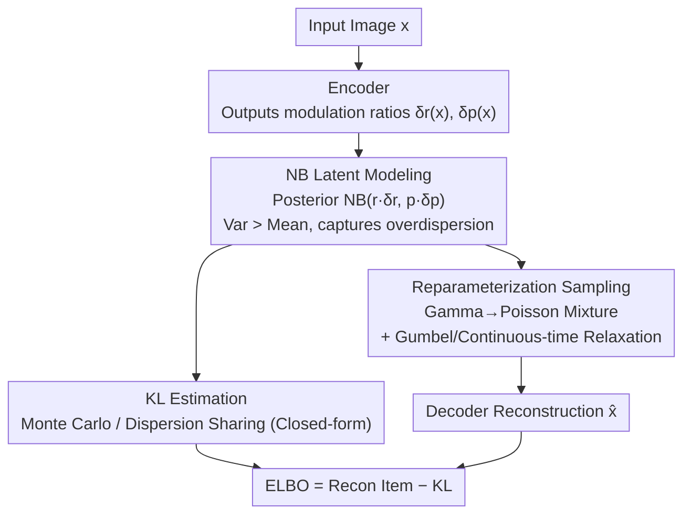

# Negative Binomial Variational Autoencoders for Overdispersed Latent Modeling

**Conference**: CVPR 2026  
**Paper**: [CVF Open Access](https://openaccess.thecvf.com/content/CVPR2026/html/Zhang_Negative_Binomial_Variational_Autoencoders_for_Overdispersed_Latent_Modeling_CVPR_2026_paper.html)  
**Code**: https://github.com/co234/NegBio-VAE  
**Area**: Probabilistic Generative Modeling / VAE  
**Keywords**: Negative Binomial Distribution, Discrete Latent Variables, Overdispersion, VAE, Reparameterization Sampling

## TL;DR
The Poisson distribution of discrete latent spike variables in VAE is replaced with a Negative Binomial distribution. By introducing a dispersion parameter, the model allows the variance to exceed the mean, capturing the "overdispersion" of real neural spikes. The framework includes a trainable KL estimation and reparameterization sampling, achieving reconstruction and generation quality superior to single-layer VAE baselines across four datasets.

## Background & Motivation

**Background**: Artificial neural networks are often described as "brain-inspired," yet most models utilize continuous activations, whereas real neurons communicate via discrete action potentials (spikes). To bridge this gap, recent works have replaced VAE latent variables with discrete ones. Among them, Poisson VAE (P-VAE) uses the Poisson distribution to encode data into "spike counts," offering both biological interpretability and count-structure modeling.

**Limitations of Prior Work**: The Poisson distribution carries a hard-coded assumption: the **mean must equal the variance**. However, neural spikes recorded in real cortex are typically "overdispersed," where the variance is significantly greater than the mean due to factors like inter-trial gain fluctuations and network-level variations. By locking the mean and variance together, Poisson models effectively assume these fluctuations do not exist, resulting in underestimated uncertainty and limited expressiveness in the latent space.

**Key Challenge**: A single-parameter Poisson distribution lacks degrees of freedom between "count modeling" and "flexible dispersion characterization." Once the mean is defined, the variance is fixed. Retaining discrete count representations while allowing the variance to scale independently of the mean requires a counting distribution with an additional degree of freedom.

**Goal**: To allow latent variables to express overdispersion while retaining the discrete spike representation and interpretability of P-VAE, and to ensure this more flexible model can be trained stably.

**Key Insight**: The Negative Binomial (NB) distribution is a two-parameter generalization of the Poisson distribution. Its additional dispersion parameter allows the variance to exceed the mean, and it converges back to a Poisson distribution as dispersion approaches infinity. NB has been validated in spiking neuron modeling, RNA sequencing, and language modeling as suitable for overdispersed counts, making it a natural candidate to replace Poisson.

**Core Idea**: The Poisson distribution in P-VAE is replaced with a Negative Binomial distribution to model overdispersed latent spike counts (NegBio-VAE). Two primary training obstacles are addressed: the lack of a closed-form KL divergence between NB distributions and the non-reparameterizable nature of discrete NB sampling.

## Method

### Overall Architecture
The skeleton of NegBio-VAE follows the standard VAE: an encoder maps image $x$ to the posterior distribution of latent spike counts $z \in \mathbb{Z}_{\ge 0}^K$, and a decoder reconstructs the image from $z$. The training objective is to maximize the ELBO. The critical change is that both prior and posterior use the **Negative Binomial** distribution. The prior is $p(z) = \mathrm{NB}(z; r, p)$, and the posterior is $q(z \mid x) = \mathrm{NB}(z; r \odot \delta_r(x), p \odot \delta_p(x))$, where $\delta_r(x)$ and $\delta_p(x)$ are encoder outputs representing modulation ratios of the posterior parameters relative to the prior (similar to the P-VAE design). The distributions are fully factorized across $K$ neurons.

This shift introduces training difficulties: the KL divergence and reconstruction expectation terms in the ELBO, which are straightforward under Poisson, fail under NB. There is no closed-form solution for KL between two NB distributions, nor a standard reparameterization for discrete NB sampling. The methodology focuses on overcoming these numerical barriers.

### Key Designs

**1. Negative Binomial Latent Spike Modeling: Decoupling Mean and Variance**

Addressing the "mean = variance" limitation of Poisson, the latent distribution is switched to NB. As a two-parameter generalization, NB has a mean of $r(1-p)/p$ and a variance of $r(1-p)/p^2$. Since the variance involves an extra $1/p$ factor where $p \in (0,1)$, the **variance is naturally greater than the mean**, matching the overdispersion of neural spikes. The posterior follows the P-VAE "modulation ratio" approach: the encoder outputs scaling factors $\delta_r(x)$ and $\delta_p(x)$ relative to the prior parameters $r$ and $p$. This provides a dispersion degree of freedom for each neuron to match its specific fluctuation intensity while retaining discrete count explainability. Notably, even if the posterior and prior share the same $r$, different $p$ values allow for different means and variances; "dispersion sharing" does not sacrifice the ability to characterize distinct distributions.

**2. Dual KL Estimation: Choosing Between "Unbiased but High Variance" and "Biased but Stable"**

Since no closed-form solution exists for KL between NBs, two paths are proposed. The first is **Monte Carlo (MC) estimation**: $D_{KL}[q\|p] = \mathbb{E}_q[\log q(z) - \log p(z)]$, where sampling from the posterior and averaging the log-density difference allows optimization as long as sampling is possible. This makes no assumptions about the posterior but has higher gradient variance. The second is **Dispersion Sharing (DS)**: It is observed that when two NB distributions share a dispersion parameter (i.e., $\delta_r(x) = 1$, so both prior and posterior use $r$), the KL has a closed-form solution:

$$D_{KL}\big[\mathrm{NB}(z;r,p\odot\delta_p)\,\|\,\mathrm{NB}(z;r,p)\big]=\sum_{i=1}^{K}r_i\,g(p_i,\delta_{p_i}),\quad g(a,b)=\log b+\frac{1-ab}{ab}\log\!\frac{1-ab}{1-a}.$$

This analytical summation eliminates sampling noise. MC is assumption-free but noisy; DS constrains $r$ to be equal but yields smoother optimization and higher training stability. Both are provided as switchable configurations (MC and DS series in experiments).

**3. NB Reparameterization via Gamma–Poisson Mixture**

The second hurdle is that the reconstruction term requires sampling from the NB distribution with backpropagation, but discrete distributions are not directly reparameterizable. This work leverages a key property: **NB is a continuous mixture of Poisson distributions where the mixture weights follow a Gamma distribution**:

$$\mathrm{NB}(z;r,p)=\int_0^\infty \mathrm{Poi}(z\mid\lambda)\,\mathrm{Gamma}\!\Big(\lambda;r,\tfrac{p}{1-p}\Big)\,d\lambda.$$

Sampling from NB is split into two steps: first, $\lambda \sim \mathrm{Gamma}(r, \frac{p}{1-p})$, then $z \sim \mathrm{Poi}(\lambda)$. For the first step, implicit reparameterization gradients are used (e.g., PyTorch's `Gamma.rsample()`). For the second step, the Poisson sampling is relaxed to "soft counts": one approach uses **Gumbel-Softmax relaxation**, treating Poisson as a categorical distribution over a truncated support $\{0, \dots, Z_{\max}\}$, while the other uses **continuous-time simulation**, modeling events via Inter-Arrival Times of a Poisson process. Both are effective; continuous-time relaxation typically yields smoother counts, while Gumbel-Softmax is sharper, forming the G and C branches in the experiments.

### Loss & Training
The final objective is the NB-ELBO: the reconstruction expectation $\mathbb{E}_{q}[\log p_\omega(x\mid z)]$ minus the NB-KL term, calculated via either MC or DS. The decoder uses a Gaussian likelihood $p_\omega(x\mid z) = \mathcal{N}(x; f_\omega(z), \sigma^2 I)$, making the reconstruction term equivalent to MSE with a coefficient $\beta = 2\sigma^2$. This $\beta$ also serves as the weight for the KL term to balance reconstruction and regularization. Latent dimensionality is fixed at 256, and convolutional networks are generally used for encoders/decoders. Combining the KL estimators (MC/DS) and reparameterizations (G/C) yields four variants: MC-G, MC-C, DS-G, and DS-C.

## Key Experimental Results

### Main Results
Evaluations on four datasets (MNIST, Fashion-MNIST, CIFAR 16x16, CelebA-64) compare reconstruction (MSE↓, SSIM↑) and generation (FID↓, KID↓). NegBio-VAE is compared against single-layer VAE baselines: G-VAE, L-VAE, C-VAE, and P-VAE (excluding hierarchical models like NVAE for fairness).

| Dataset | Indicator | Best NegBio Variant | P-VAE (Strongest Baseline) | Description |
| :--- | :--- | :--- | :--- | :--- |
| MNIST | FID@10k↓ | 78.4 (MC-G) | 104.1 | Large lead in generation quality |
| MNIST | MSE↓ | 0.0123 (MC-C) | 0.0125 | Reconstruction slightly better |
| Fashion-MNIST | FID@10k↓ | 125.9 (MC-G) | 146.0 | Significantly better generation |
| CIFAR 16x16 | FID@10k↓ | 39.8 (MC-G) | 59.1 | FID dropped to 39.8; largest gain |
| CIFAR 16x16 | SSIM↑ | 0.809 (DS-C) | 0.679 | Large boost in structural fidelity |
| CelebA-64 | FID@10k↓ | 83.6 (DS-G) | 87.8 | Lowest even on complex data |

General trends: The MC-G variant is best for generation (FID/KID) across almost all datasets, while MC-C / DS-C tend to be stronger for reconstruction (MSE/SSIM). On CelebA-64, reconstruction error is slightly higher than P-VAE, attributed to stronger regularization from the bio-inspired prior, though it yields more structured latents.

### Latent Representation Evaluation

| Task | Configuration | NegBio-VAE | Strongest Baseline | Description |
| :--- | :--- | :--- | :--- | :--- |
| Shattering Prediction | MNIST, N=200 | 0.811 | 0.798 (L-VAE) | More robust to label noise |
| Shattering Prediction | Shattering Dim. | 0.898 | 0.892 (L-VAE) | Stronger latent separability |
| Few-shot (LR) | MNIST 20-shot | 0.865 | 0.838 (P-VAE) | Gap grows with supervision |
| Few-shot (LR) | CIFAR 20-shot | 0.266 | 0.261 (P-VAE) | Still leads across datasets |

### Ablation Study

| Configuration | Conclusion | Description |
| :--- | :--- | :--- |
| Decoder Architecture | MLP decoder optimal for MSE/SSIM; Conv optimal for FID/KID | Decoder capacity is key for both |
| $\beta$ Scaling | Small $\beta$ (0.2–0.4) favors recon; $\beta \approx 1.0$ best for FID | 0.6–1.0 is the best compromise |
| MC Samples 5→25 | Indicators remain stable | Robust to sampling variance; low cost |

### Key Findings
- **Combination of KL and Reparameterization defines bias**: MC-G favors generation; MC-C / DS-C favor reconstruction—no single variant dominates both, representing a significant trade-off.
- **Overdispersion directly impacts diversity**: The drop in FID on CIFAR suggests that flexible variance allows the latent space to capture richer generative modes.
- **Few MC samples are needed**: Increasing from 5 to 25 yields negligible gains, indicating that reparameterization sampling variance is well-controlled.
- **$\beta$ Inverse Regulation**: Similar to $\beta$-VAE, small $\beta$ benefits reconstruction while large $\beta$ benefits generation, observed here in a discrete NB latent space.

## Highlights & Insights
- **Turning a simple idea into a solvable problem**: Replacing Poisson with NB is a simple concept, but the lack of closed-form KL and non-reparameterizable sampling are major hurdles. The value lies in the implementation of MC/DS-KL and Gamma-Poisson sampling.
- **Dispersion Sharing is a clever stabilizer**: Discovering that sharing $r$ leads to an analytical KL while $p$ still captures overdispersion provides a nearly "free" stabilization technique.
- **Gamma–Poisson Mixture is a transferable pattern**: Splitting a difficult discrete distribution into a reparameterizable continuous one plus a relaxable discrete one is a strategy applicable to other discrete latent models.
- **Biologically inspired and engineering performance align**: Unlike many biologically inspired changes that degrade performance, adopting NB (more consistent with neural statistics) improves both FID and SSIM.

## Limitations & Future Work
- **Validated only on single-layer, low-res datasets**: Four datasets are relatively simple (MNIST/CIFAR/CelebA-64); comparisons were restricted to single-layer models. Scalability to high-res or complex distributions is unknown.
- **Theoretical gaps**: There is no deep characterization of how KL estimation or reparameterization choices affect training; choices currently rely on empirical task preferences.
- **Variant trade-offs require manual selection**: No variant is optimal for everything. Users must choose between MC-G and DS-C based on the task; adaptive reparameterization is a future goal.
- **Boundary of overdispersion**: NB only models variance $\ge$ mean. Neurons with refractory periods can be "underdispersed" (variance < mean), which this framework does not cover.

## Related Work & Insights
- **vs Poisson VAE (P-VAE)**: The direct predecessor. P-VAE is restricted by mean=variance; this work uncouples them using NB at the cost of addressing numerical KL and sampling issues.
- **vs Categorical / Bernoulli VAE**: These use discrete latents for speech or image synthesis but are not designed for count modeling or overdispersion.
- **vs NB for discrete data modeling**: Prior works use NB for counting actual **data** (like text), but use continuous latents; this work moves NB into the **latent variables**.
- **vs Hierarchical VAE (NVAE / Very Deep VAE)**: This is a single-layer model. Extending this to NVAE-style hierarchical structures is an orthogonal improvement for the future.

## Rating
- Novelty: ⭐⭐⭐⭐ Replacing Poisson with NB is straightforward, but the supporting DS-KL and Gamma-Poisson reparameterization are substantial technical contributions.
- Experimental Thoroughness: ⭐⭐⭐⭐ Comprehensive across four datasets and multiple metrics, though limited to single-layer settings and simple datasets.
- Writing Quality: ⭐⭐⭐⭐ Clear chain of motivation-challenge-solution; technical barriers and formulas are well-documented.
- Value: ⭐⭐⭐⭐ Provides a plug-and-play, stabilized overdispersion modeling solution for discrete latent VAEs with a transferable sampling strategy.

<!-- RELATED:START -->

## Related Papers

- [\[CVPR 2026\] BrepVGAE: Variational Graph Autoencoder with Unified Latent Representation for B-rep](brepvgae_variational_graph_autoencoder_with_unified_latent_representation_for_b-.md)
- [\[CVPR 2026\] Modeling the Visual Ambiguity of Human Sketches](modeling_the_visual_ambiguity_of_human_sketches.md)
- [\[CVPR 2026\] Advancing Image Classification with Discrete Diffusion Classification Modeling](advancing_image_classification_with_discrete_diffusion_classification_modeling.md)
- [\[ICLR 2026\] Disentangling Shared and Private Neural Dynamics with SPIRE: A Latent Modeling Framework for Deep Brain Stimulation](../../ICLR2026/others/disentangling_shared_and_private_neural_dynamics_with_spire_a_latent_modeling_fr.md)
- [\[CVPR 2026\] MSPT: Efficient Large-Scale Physical Modeling via Parallelized Multi-Scale Attention](mspt_efficient_large-scale_physical_modeling_via_parallelized_multi-scale_attent.md)

<!-- RELATED:END -->
