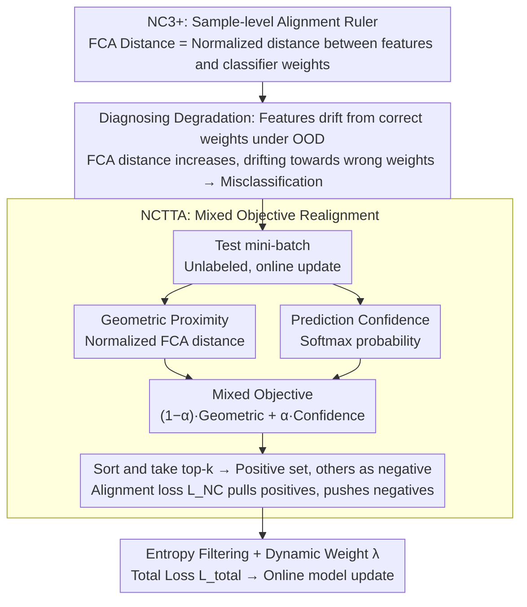

# Neural Collapse in Test-Time Adaptation

**Conference**: CVPR 2026  
**arXiv**: [2512.10421](https://arxiv.org/abs/2512.10421)  
**Code**: [https://github.com/Cevaaa/NCTTA](https://github.com/Cevaaa/NCTTA)  
**Area**: Others  
**Keywords**: Neural Collapse, Test-Time Adaptation, Out-of-Distribution Robustness, Feature-Classifier Alignment, Mixed Objective

## TL;DR
The authors extend Neural Collapse (NC) theory from the class level to the sample level, discovering the NC3+ phenomenon (alignment between sample feature embeddings and corresponding classifier weights). Based on this, they reveal that performance degradation under distribution shift is fundamentally caused by sample-level feature-classifier misalignment. They propose the NCTTA method, which uses a mixed objective of geometric proximity and prediction confidence to guide feature realignment, achieving a 14.52% improvement over Tent on ImageNet-C.

## Background & Motivation

1. **Background**: Test-Time Adaptation (TTA) has become a practical solution for addressing distribution shifts. Major methods include: prototype-based methods (SHOT, T3A), consistency regularization methods (MEMO, CoTTA), normalization layer methods (NOTE, SAR), and entropy minimization methods (Tent, EATA, DeYO).

2. **Limitations of Prior Work**: Although these methods achieve good results through algorithmic optimization during inference, they generally lack a theoretical understanding of the fundamental causes of model degradation under distribution shift.

3. **Key Challenge**: Neural Collapse (NC) theory reveals the elegant geometric structure of DNNs after training (class mean $\leftrightarrow$ classifier weight alignment). However, its analysis depends on class labels and the full training set to calculate class means—which is unfeasible in TTA scenarios (where only unlabeled mini-batch test data is available).

4. **Goal**
    - Extend NC theory to the sample level for TTA scenarios.
    - Explain performance degradation under distribution shift from an NC perspective.
    - Propose a theory-driven TTA method.

5. **Key Insight**: Since NC3 states that "class means align with classifier weights," and intra-class variance approaches zero (NC1) in the late stages of Terminal Phase of Training (TPT), it implies that each sample's feature should also align with the corresponding classifier weight—this is defined as NC3+.

6. **Core Idea**: Performance degradation = sample features deviating from the correct classifier weights. Therefore, the core task of TTA is realignment. Since pseudo-labels are unreliable, they should be replaced with a mixed objective of geometric proximity and prediction confidence.

## Method

### Overall Architecture
This paper first uses Neural Collapse theory to explain "why models degenerate under distribution shift" and then designs a TTA method accordingly. The logic revolves around a single quantity—the degree of alignment between sample features and classifier weights. First, NC theory is extended from class-level (relying on large-scale labels) to sample-level (NC3+), providing an "alignment ruler" measurable on unlabeled test batches. Measuring OOD data with this ruler reveals that misclassification is essentially features drifting away from correct weights. Finally, the model is guided to actively pull features back during test time. For a test mini-batch: first calculate the FCA distance from each sample feature to all classifier weights, then fuse this geometric distance with prediction confidence into a mixed objective. Based on this, select top-k classes as positive samples and others as negative samples, using an alignment loss to pull positive samples closer and push negative samples away.

### Key Designs

**1. NC3+: Extending "Alignment" from Class Level to Sample Level**

Classical NC3 states "class means align with classifier weights," but calculating class means requires labels and traversing the training set, which is unusable in TTA. The breakthrough is: when intra-class variance approaches zero (NC1) late in training, each sample feature nearly equals its class mean. Thus, "class mean alignment" tightens into "individual sample feature alignment"—defined as NC3+. For computation, the FCA distance is defined as $d_{ij} = \|\frac{\mathbf{h}_i}{\|\mathbf{h}_i\|_2} - \frac{w_j}{\|w_j\|_2}\|_2$, representing the normalized Euclidean distance between feature $\mathbf{h}_i$ and the $j$-th classifier weight $w_j$. The paper further proves that under cross-entropy loss, the ground-truth FCA distance $d_{iy_i}$ monotonically decreases toward zero during training. This metric only requires single-sample features and classifier weights, naturally fitting TTA constraints.

**2. Explaining "Degradation" as "Feature Drift" via FCA Distance**

With the sample-level alignment ruler, one can quantitatively answer "why OOD data is misclassified." Observing corrupted data grouped by correctness reveals a clear trade-off: for correctly classified samples, the ground-truth FCA distance $d_{iy_i}^{\text{correct}}$ remains small, with features staying near the correct weight. For misclassified samples, $d_{iy_i}^{\text{wrong}}$ increases significantly (drifting from the correct weight), while the P-FCA distance to the predicted class weight $d_{i\hat{y}_i}^{\text{wrong}}$ decreases (drifting toward the wrong weight). The root cause of degradation is pinpointed as sample-level feature-classifier misalignment.

**3. NCTTA: Mixed Objective as a Reliable Guide**

To perform realignment, the most direct idea is using pseudo-labels $\hat{y}_i$. However, pseudo-labels are most unreliable under severe shift. NCTTA constructs a mixed objective $\widetilde{\mathbf{y}}_i = (1-\alpha)\hat{d}_i + \alpha p_i$, where $\hat{d}_i$ is the geometric proximity obtained from softmax-normalized FCA distances, $p_i$ is the prediction confidence, and $\alpha$ balances them. The top-k classes are selected as the positive set $\mathcal{T}_i$. The NC-guided alignment loss $\mathcal{L}_{\text{NC}}$ pulls positives and pushes negatives. A dynamic weight $\lambda_i$ is assigned to each sample based on entropy and P-FCA distance to determine its contribution to the total loss.

### Loss & Training
The final loss is $\mathcal{L}_{\text{total}}(x_i) = \lambda_i \cdot \mathbb{I}_{x_i \in S_{\text{ENT}}} \cdot (\mathcal{L}_{\text{ENT}}(x_i) + \mathcal{L}_{\text{NC}}(x_i))$, where $S_{\text{ENT}}$ is the set of samples retained after entropy filtering, and $\mathcal{L}_{\text{NC}}$ can be instantiated as InfoNCE, L2, or Triplet (InfoNCE performs best).

## Key Experimental Results

### Main Results

| Method | CIFAR-10-C Avg (ResNet50) | ImageNet-C Avg (ViT-B/16) |
|------|--------------------------|--------------------------|
| no_adapt | 57.39 | 38.88 |
| Tent | 75.19 | 51.87 |
| EATA | 74.04 | 63.91 |
| SAR | 74.67 | 53.97 |
| NOTE | 71.03 | 39.15 |
| MEMO | 68.85 | 45.38 |
| DeYO | 76.65 | 63.49 |
| **Ours (NCTTA)** | **78.16** | **66.46** |

NCTTA improves by 14.59% over Tent and 2.97% over DeYO on ImageNet-C.

### Ablation Study

| $\mathcal{L}_{\text{NC}}$ Style | ImageNet-C Contrast (Sev-5) |
|------|------|
| InfoNCE-style | **Best** |
| L2-style | Slightly lower |
| Triplet-style | Lowest |

| $\alpha$ | $k=1$ | $k=3$ | $k=5$ | Description |
|------|-------|-------|-------|------|
| 0.0 (Pure Geometry) | Lower | Medium | Medium | Pure FCA distance is insufficient |
| 0.5 (Mixed) | Medium | **Best** | Medium | Balancing geometry and confidence |
| 1.0 (Pure Confidence) | Lowest | Low | Low | Pure pseudo-labels are unreliable |

### Key Findings
- NCTTA achieves the best or second-best performance across almost all corruption types.
- InfoNCE-style loss is most effective, likely due to more informative gradients from contrastive learning.
- $\alpha=0.5, k=3$ is the optimal configuration, highlighting the importance of balancing geometry/confidence and providing error tolerance in labels.
- On the Waterbirds dataset, the worst-group accuracy improved from 70.87% (no_adapt) to 76.56%, showing effectiveness against subgroup shift.

## Highlights & Insights
- **Natural Bridge between NC and TTA**: NC3+ is a natural inference of NC3 under NC1 conditions. This sample-level perspective perfectly fits the constraints of TTA.
- **Mixed Objective Design**: Using geometric proximity to "correct" unreliable pseudo-labels is a strong intuition. Geometric relations remain somewhat reliable even when pseudo-labels fail.
- **Complete Theoretical Pipeline**: The logical chain from NC3+ discovery $\rightarrow$ degradation explanation $\rightarrow$ method design $\rightarrow$ experimental validation is highly complete.

## Limitations & Future Work
- The proof for NC3+ assumes cross-entropy loss and standard TPT conditions; applicability to other losses (e.g., contrastive pre-training) is not discussed.
- Calculating FCA distances for all $K$ classes may incur high computational overhead for tasks with extremely large label spaces (e.g., ImageNet-21K).
- In continual TTA, where classifier weights also change, it remains to be seen if NC3+ assumptions hold.
- Open-set TTA scenarios were not considered.

## Related Work & Insights
- **vs Tent**: Tent only performs entropy minimization without utilizing geometric structure. NCTTA outperforms Tent by 14.59% on ImageNet-C.
- **vs DeYO**: DeYO uses refined sample selection but lacks an alignment mechanism. NCTTA improves upon it by 2.97%.
- **vs EATA**: EATA lacks NC-guided alignment. NCTTA outperforms EATA by 4.12% on CIFAR-10-C.

## Rating
- Novelty: ⭐⭐⭐⭐⭐ Elegant bridging of NC3+ to TTA.
- Experimental Thoroughness: ⭐⭐⭐⭐⭐ Validated across multiple datasets and backbones.
- Writing Quality: ⭐⭐⭐⭐⭐ Rigorous derivation and intuitive visualization.
- Value: ⭐⭐⭐⭐ Provides a new theoretical perspective and practical method for the TTA field.

<!-- RELATED:START -->

## Related Papers

- [\[CVPR 2026\] Back to Source: Open-Set Continual Test-Time Adaptation via Domain Compensation](back_to_source_open-set_continual_test-time_adaptation_via_domain_compensation.md)
- [\[CVPR 2026\] Curvature-Aware Zeroth-Order Optimization for Memory-Efficient Test-Time Adaptation](curvature-aware_zeroth-order_optimization_for_memory-efficient_test-time_adaptat.md)
- [\[CVPR 2026\] WiTTA-Bench: Benchmarking Test-Time Adaptation for WiFi Sensing](witta-bench_benchmarking_test-time_adaptation_for_wifi_sensing.md)
- [\[CVPR 2026\] Towards Stable Federated Continual Test-Time Adaptation in Wild World](towards_stable_federated_continual_test-time_adaptation_in_wild_world.md)
- [\[NeurIPS 2025\] Test-Time Adaptation by Causal Trimming](../../NeurIPS2025/others/test-time_adaptation_by_causal_trimming.md)

<!-- RELATED:END -->
