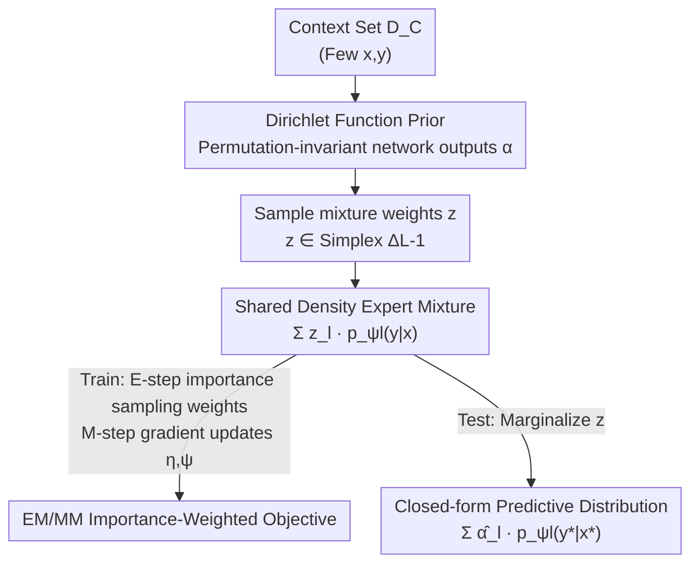

# Neural Mixture Density Processes

**Conference**: CVPR 2026  
**Paper**: [CVF Open Access](https://openaccess.thecvf.com/content/CVPR2026/html/Ding_Neural_Mixture_Density_Processes_CVPR_2026_paper.html)  
**Area**: Probabilistic Meta-Learning / Neural Processes  
**Keywords**: Neural Processes, Mixture Density, Dirichlet Prior, Importance Sampling, EM/MM Optimization

## TL;DR
Addressing the limitation where classical Neural Processes (NPs) only output unimodal predictive distributions due to Gaussian likelihood assumptions, this paper proposes Neural Mixture Density Processes (NMDP). By using a Dirichlet latent variable on a simplex to linearly weight a set of task-shared density experts and training with an importance-weighted EM/MM proxy objective, NMDP achieves competitive predictive accuracy, superior uncertainty calibration, and interpretable task representations on heterogeneous, multi-modal function families.

## Background & Motivation
**Background**: Probabilistic meta-learning has emerged as an attractive paradigm, learning to rapidly adapt to new tasks from past experiences while providing predictive uncertainty. The Neural Process (NP) family is a representative approach—encoding a context dataset $D_\tau^C$ into a global latent variable $z$ to approximate a "function prior." This serves as a scalable alternative to Gaussian Processes (GPs) with significantly lower computational overhead.

**Limitations of Prior Work**: Existing NP variants (CNP, ANP, etc.) almost exclusively assume a **Gaussian likelihood**, locking the predictive distribution into a **unimodal** form. However, function behaviors in real-world tasks are often naturally multi-modal; given the same context set, the output may have several plausible forms. Under such conditions, a unimodal assumption fails to capture the true uncertainty structure and cannot express diverse potential outputs.

**Key Challenge**: The bottleneck in NP expressivity lies not in network capacity but in the **design of the latent variable structure and conditioning mechanism**—an area that has been under-researched. Most subsequent works (attention in ANP, translation equivariance in ConvCNP, bi-Lipschitz constraints in DNP) focus on injecting **structural inductive biases** into NPs rather than revamping the NP modules from the perspective of "approximating more complex stochastic processes."

**Goal**: (1) Design an NP variant capable of approximating arbitrarily complex function distributions; (2) Develop a tractable and stable optimization strategy; (3) Ensure that the learned task representations are interpretable (reflecting the clustering structure of tasks).

**Key Insight**: The authors draw inspiration from classical **Mixture Density Networks (MDN)** and **Dirichlet Process Mixtures**. Since a single Gaussian is insufficient, a **mixture** of density experts can approximate any distribution, with the mixture weights represented by a latent variable defined on the simplex $\Delta^{L-1}$. Thus, the "multi-modality of the function distribution" is naturally encoded into the "mixture weights of experts."

**Core Idea**: Replace the "single global Gaussian latent" in NPs with an explicit mixture distribution consisting of a "Dirichlet simplex latent $\times$ a set of shared density experts." The model parameters are decoupled into **task-agnostic shared experts** and a **task-specific Dirichlet prior**, trained via an importance-weighted EM/MM objective.

## Method

### Overall Architecture
NMDP decomposes the generative process of meta-learning into two synergistic neural modules: a **prior inference network** that encodes context $D_\tau^C$ into a Dirichlet function prior $p(z|D_\tau^C;\eta)=\mathrm{Dir}_\eta(z;\alpha)$ (outputting mixture weights $z$ on the simplex), and a **generative network** holding $L$ task-shared density experts $\{p_{\psi_l}(\cdot|\cdot)\}_{l=1}^L$. These experts are linearly weighted by $z$ into a mixture predictive distribution. The meta-training goal is to discover a set of shared experts $\psi$ that best explain all tasks and reveal their clustering structure, alongside a prior network $\eta$ that accurately infers mixture weights from sparse contexts.

The pipeline is: Context points $\to$ Prior inference network yields Dirichlet prior $\to$ Sample/infer mixture weights $z \to$ Weight $L$ density experts using $z \to$ Mixture predictive distribution. Training involves alternating between the E-step (importance sampling weight estimation) and the M-step (gradient updates for $\eta,\psi$). During testing, the context is fed into the prior network, and the predictive distribution has a closed-form solution.

### Key Designs

**1. Simplex Latent $\times$ Shared Density Experts: Encoding Multi-modality into Mixture Weights**

The generative formulation of classical NPs (Eq. 1) is $\rho(y_{1:n})=\int p(z)\prod_i \mathcal{N}(y_i;\mu_\theta([x_i,z]),\Sigma_\theta([x_i,z]))\,dz$, where $z$ enters the Gaussian parameters, but the likelihood remains unimodal. NMDP changes this to Eq. 3:

$$\rho_{x_{1:n}}(y_{1:n}\mid\psi)=\int \mathsf{Dir}(z;\alpha)\prod_{i=1}^{n}\Big[\sum_{l=1}^{L} z_l\, p_{\psi_l}(y_i|x_i)\Big]\,dz$$

There are two key changes: first, the latent $z$ no longer enters individual distribution parameters but is constrained to the $(L-1)$-dimensional simplex $\Delta^{L-1}$ to act as **mixture weights** modulating $L$ density experts $p_{\psi_l}$. Second, the expert set $\{\psi_l\}$ is **shared across all tasks**, with only $z$ varying per task. For Gaussian experts (Example 1), the single-point predictive density is $p(y|x,z)=\sum_l z_l\,\mathcal{N}(y;\mu_{\psi_l}(x),\Sigma_{\psi_l}(x))$, a true Gaussian mixture. The authors argue from the perspective of Dirichlet Process Mixtures (Remark 1): when $L$ is sufficiently large, NMDP can theoretically approximate any function distribution—it is essentially a **finite mixture analogue** of the Dirichlet Process Mixture.

**2. Task-Agnostic / Task-Dependent Parameter Decoupling: Compact Latent Inference for Adaptation**

NMDP explicitly splits parameters into two parts: task-agnostic density experts $\psi=\{\psi_1,\dots,\psi_L\}$ (learned during meta-training and fixed for all tasks) and task-dependent prior network parameters $\eta$ (used to infer a Dirichlet concentration vector $\alpha$ for each new task). This decoupling addresses the cost of test-time adaptation—NMDP **does not require re-optimizing expert parameters** for new tasks. It only requires a forward pass through the prior network to infer a low-dimensional, compact simplex latent $z$. This contrasts with methods like MAML that require gradient updates (inner-loop optimization). Moreover, because the task representation is a probability vector on the simplex, it is inherently interpretable, with each dimension corresponding to the extent an expert is utilized by that task.

**3. Importance-Weighted EM/MM Proxy Objective: Bypassing the ELBO Gap**

The posterior $p(z|D_\tau^T,D_\tau^C)$ (Eq. 6) in NMDP involves a non-analytic integral and is intractable for direct Monte Carlo sampling. While a variational distribution and ELBO are standard, they introduce a **posterior approximation gap**. This paper takes a different path, drawing on the Re-weighted Wake-Sleep (RWS) algorithm to formulate an EM/MM proxy objective (Eq. 7):

$$\max_{\eta,\psi}\mathcal{L}=\mathbb{E}_{p(z|D_\tau^T,D_\tau^C;\Theta_t)}\Big[\ln \underbrace{p(D_\tau^T|z;\psi)}_{\text{Mixture Likelihood}}+\ln \underbrace{p(z|D_\tau^C;\eta)}_{\text{Dirichlet Prior}}\Big]$$

This consists of a "generative mixture likelihood term + Dirichlet prior term," where the distribution in the expectation is treated as fixed while optimizing the inner terms. Since the true posterior cannot be sampled, the authors use **self-normalized importance sampling**: using the prior from the previous iteration $p(z|D_\tau^C;\eta_t)$ as a proposal distribution to draw $B$ particles $z^{(b)}$, with importance weights proportional to the target likelihood $\omega_t^{(b)}=p(D_\tau^T|z^{(b)};\psi_t)$, then self-normalized as $\hat\omega_t^{(b)}=\omega_t^{(b)}/\sum_{b'}\omega_t^{(b')}$ (Eq. 9). This yields the differentiable importance-weighted objective $\mathcal{L}_{\mathsf{IW\text{-}MC}}$ (Eq. 8). Deviating from the original RWS, NMDP learns a **permutation-invariant, context-conditioned** Dirichlet prior and **reuses the current prior as the proposal**, eliminating the extra inference network required for the sleep phase. Remark 2 provides theoretical guarantees: under ideal exact inference and maximization, this EM/MM process recovers standard **monotonic improvement** properties.

### Loss & Training
Training follows the outer/inner loop iteration in Algorithm 1. For each outer iteration $t$ on a batch of tasks $\mathcal{T}$: the **E-step** samples $B$ particles from the current prior $p(z|D_\tau^C;\eta_t)$ and calculates self-normalized importance weights per Eq. 9; the **M-step** uses these weights for accumulated gradients $\nabla_\eta\mathcal{L}\mathrel{+}=\sum_b\hat\omega^{(b)}\nabla_\eta\ln p(z^{(b)}|D_\tau^C;\eta)$ and $\nabla_\psi\mathcal{L}\mathrel{+}=\sum_b\hat\omega^{(b)}\nabla_\psi\ln p(D_\tau^T|z^{(b)};\psi)$, followed by gradient ascent updates for $\eta,\psi$. At test time, context $D_\tau^C$ is fed into the prior network to obtain $\mathrm{Dir}_\eta(z;\alpha)$. The predictive distribution for a new point $(x_*,y_*)$ marginalizing over $z$ has a **closed-form solution** (Eq. 10): $p(y_*|x_*,D_\tau^C)=\sum_l \hat\alpha_l\,p_{\psi_l}(y_*|x_*)$, where $\hat\alpha_l=\alpha_l/\sum_{l'}\alpha_{l'}$ is the mean parameter of the Dirichlet distribution. Thus, prediction weights the experts by the **expected mixture weight** of the prior, requiring no sampling.

## Key Experimental Results

Baselines include context-based methods (CNP, ANP, ConvCNP, TNP, DNP) and gradient-based methods (MAML, CAVIA), all unified with Gaussian likelihoods and identical normalization for comparability.

### Main Results

**1D Synthetic GP Regression** (Average Log-Likelihood over 1000 test tasks on heterogeneous data mixed from RBF / Weakly Periodic / Matérn-5/2 kernels; higher is better):

| Model | RBF | Weakly Periodic | Matérn-5/2 |
|------|------|--------|-----------|
| MAML | 0.08 | 0.89 | -0.12 |
| CAVIA | 0.21 | 0.96 | 0.07 |
| CNP | 0.15 | 1.08 | -0.14 |
| ANP | 0.42 | 1.11 | 0.18 |
| ConvCNP | 1.05 | 0.80 | 0.71 |
| TNP | 1.23 | 1.13 | 1.06 |
| DNP | 0.95 | 1.06 | 0.78 |
| **NMDP (Ours)** | **1.26** | **1.19** | **1.15** |

NMDP outperforms all others across the three kernels and shows the most stable performance across kernel types, indicating better generalization to heterogeneous function families (answering RQ-1: Dirichlet function priors + task-level mixture density modeling are indeed more expressive).

**Image Completion** (Images viewed as continuous functions $f:[-1,1]^2\to[0,1]^c$; log-likelihood of target pixels, averaged over 10 runs; higher is better):

| Model | CIFAR10-target | SVHN-target | MNIST-target | EMNIST-target |
|------|------|------|------|------|
| CNP | 2.51 | 2.62 | 1.01 | 0.86 |
| ANP | 3.76 | 3.05 | 1.03 | 0.92 |
| ConvCNP | 3.88 | 3.08 | 1.17 | 1.12 |
| TNP | 4.03 | 3.23 | 1.38 | 1.13 |
| DNP | 3.81 | 3.10 | 1.09 | 0.95 |
| **NMDP (Ours)** | **4.19** | **3.29** | **1.42** | **1.17** |

NMDP leads significantly on 3-channel RGB tasks (CIFAR-10, SVHN): a target log-likelihood of 4.19 on CIFAR-10, roughly a 3.9% improvement over the strongest baseline TNP (4.03). It also remains optimal on simpler single-channel grayscale (MNIST, EMNIST). This suggests NMDP's additional modeling capacity is most beneficial for **complex natural images with multi-channel correlations**.

**Multi-I/O Regression** (SARCOS / WQ / SCM20D, MSE; lower is better): NMDP achieves 0.82 / 0.67 / 0.75, respectively, outperforming all baselines (best baselines were 0.84 / 0.69 / 0.82).

### Ablation Study

A five-stage progressive ablation (on synthetic GP benchmarks, each variant adding an element to the previous):

| Variant | Configuration | Description |
|------|------|------|
| A1 | Single Expert ($L=1$) | Minimal baseline, no mixture |
| A2 | Uniform Mixture ($L>1$, $z$ fixed) | Introduces decoder diversity without adaptation |
| A3 | Deterministic Gating | Context encoder generates learnable deterministic weights |
| A4 | Stochastic Gating + ELBO | Introduces Dirichlet latent $z$, optimized via standard ELBO |
| A5 | Full NMDP | Refines posterior inference of $z$ via importance weighting |

### Key Findings
- **Log-likelihood increases monotonically from A1 to A5**: Mixture capacity (A2) provides small gains, adaptive gating (A3) further enhances expressivity, while the largest jumps come from the core innovations in A4 and A5.
- **A4 (Stochastic Gating) is particularly useful under sparse context**: When context is limited and task identity is ambiguous, probabilistic reasoning of task identity via Dirichlet latents is more robust than deterministic gating.
- **Value of A5 (Importance-Weighted Objective)**: Compared to ELBO in A4, it provides higher asymptotic performance and **significantly lower training variance** with faster convergence. The tighter variational bound avoids the approximation gap of ELBO, leading to more faithful optimization and stable meta-learning.
- **Interpretable Task Representations** (RQ-2): Projecting inferred Dirichlet concentration vectors via CLR transform + UMAP, NMDP clusters RBF, Weakly Periodic, and Matérn tasks clearly (NMI=0.42, ARI=0.44, Linear probe accuracy 84.4% vs random ≈33%), proving kernel information is reliably encoded.

## Highlights & Insights
- **Shifting "Multi-modality" from Likelihood Form to Mixture Weights**: Classical NPs require modifying the likelihood distribution itself to express multi-modality, which is cumbersome. NMDP uses simple Gaussian experts but **mixes** them with a simplex latent variable. Multi-modality is expressed by "which experts the weights lean toward," maintaining analytical experts while achieving universal approximation.
- **Prior Reuse for Proposal Distribution**: While RWS typically requires an extra sleep-phase inference network, NMDP uses the context-conditioned prior from the previous iteration as the proposal distribution for importance sampling, which is more efficient and self-consistent.
- **Natural Simplex Task Representations**: Because the latent variables are mixture weights (probability vectors), they serve as interpretable, clusterable task embeddings without needing auxiliary probes.

## Limitations & Future Work
- **OOD and Ambiguity**: When test tasks are far from the training distribution or context is insufficient, the inferred Dirichlet prior becomes high-entropy (near uniform), causing expert averaging and increased uncertainty. However, the Dirichlet entropy can serve as a "ambiguity indicator."
- **Finite Expert Assumption**: NMDP assumes task variations can be covered by a finite set of shared experts. If task diversity exceeds the span of $L$ experts, approximation is limited. The choice of $L$ is a hyperparameter trade-off not fully explored.
- **Importance Sampling Overhead**: Multiple particles introduce extra computation. While parallelizable on modern GPUs, the impact of particle count $B$ and potential weight collapse in high-dimensional tasks requires further analysis.
- **Future Directions**: Extending finite mixtures to non-parametric versions (e.g., stick-breaking) to adaptively select the number of experts; or using Dirichlet entropy for active learning/context selection.

## Related Work & Insights
- **vs. Classical NP / CNP / ANP**: These use a single global Gaussian latent and unimodal likelihood. NMDP uses a simplex latent + mixture density experts to handle multi-modality and decouples parameters for fast adaptation.
- **vs. ConvCNP / TNP / DNP**: These focus on structural inductive biases (translation equivariance, attention). NMDP revamps the NP modules themselves for complex stochastic process approximation, proving more robust on heterogeneous multi-modal tasks.
- **vs. MAML / CAVIA**: These rely on inner-loop gradient updates. NMDP compresses adaptation into a single forward Dirichlet prior inference pass, making test-time adaptation significantly lighter.

## Rating
- Novelty: ⭐⭐⭐⭐ Systematically integrates mixture density + simplex Dirichlet latents + RWS-style importance weighting into the NP framework.
- Experimental Thoroughness: ⭐⭐⭐⭐ Covers various benchmarks with progressive ablations and clustering analysis; lacks sensitivity analysis for $B$ and $L$.
- Writing Quality: ⭐⭐⭐⭐ Clear logical flow from motivation to theoretical guarantees; dense formulas may pose a barrier to some readers.
- Value: ⭐⭐⭐⭐ Provides a clean paradigm for probabilistic meta-learning requiring multi-modal expressivity, closed-form prediction, and fast adaptation.

<!-- RELATED:START -->

## Related Papers

- [\[ICLR 2026\] Internal Evaluation of Density-Based Clusterings with Noise](../../ICLR2026/others/internal_evaluation_of_density-based_clusterings_with_noise.md)
- [\[NeurIPS 2025\] Addressing Mark Imbalance in Integration-free Neural Marked Temporal Point Processes](../../NeurIPS2025/others/addressing_mark_imbalance_in_integrationfree_neural_marked_t.md)
- [\[CVPR 2026\] Progressive Neural Architecture Generation](progressive_neural_architecture_generation.md)
- [\[ICLR 2026\] a representer theorem for hawkes processes via penalized least squares minimizat](../../ICLR2026/others/a_representer_theorem_for_hawkes_processes_via_penalized_least_squares_minimizat.md)
- [\[ACL 2025\] Entropy-UID: A Method for Optimizing Information Density](../../ACL2025/others/entropy-uid_a_method_for_optimizing_information_density.md)

<!-- RELATED:END -->
