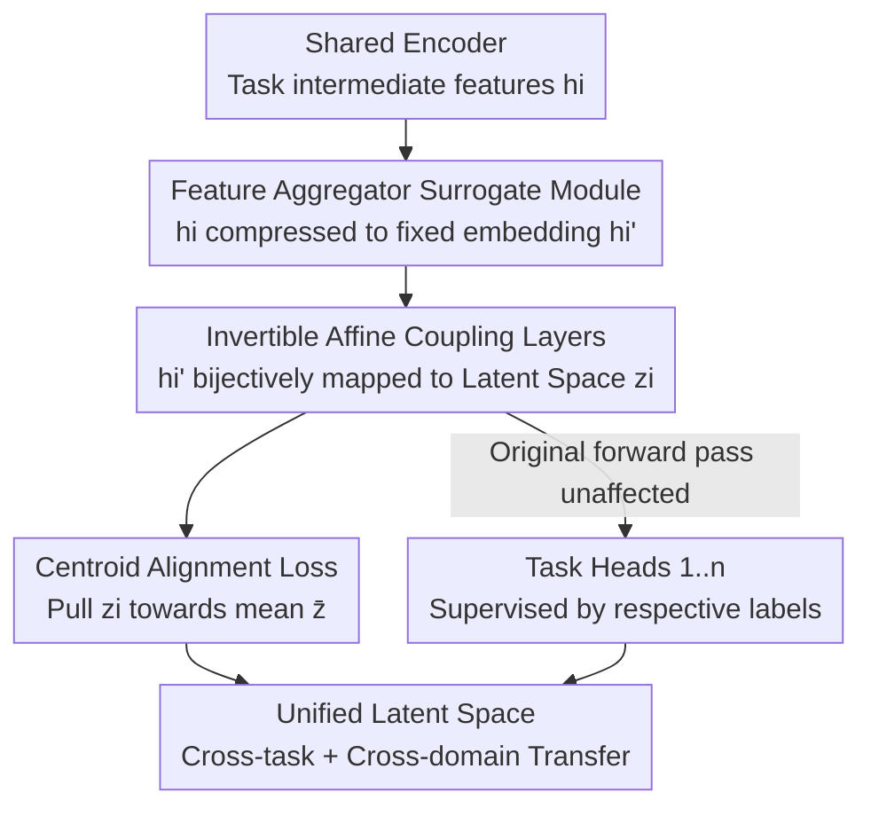

# NexusFlow: Unifying Disparate Tasks under Partial Supervision via Invertible Flow Networks

**Conference**: CVPR 2026  
**Paper**: [CVF Open Access](https://openaccess.thecvf.com/content/CVPR2026/html/Lin_NexusFlow_Unifying_Disparate_Tasks_under_Partial_Supervision_via_Invertible_Flow_CVPR_2026_paper.html)  
**Code**: https://github.com/ark1234/NexusFlow  
**Area**: Multi-Task Learning / Partial Supervision  
**Keywords**: Partially Supervised Multi-task Learning, Invertible Flow Networks, Affine Coupling Layer, Latent Space Alignment, Autonomous Driving Perception

## TL;DR
NexusFlow utilizes a set of "surrogate networks" with invertible affine coupling layers to map intermediate features of structurally disparate tasks (e.g., sparse object tracking vs. dense map reconstruction) into a unified standard latent space with aligned distributions. In extreme partial supervision scenarios where labels are partitioned by geographic domain (e.g., tasks labeled only in different cities), it achieves performance nearly approaching full supervision as a plug-and-play module without altering the original model architecture.

## Background & Motivation

**Background**: Multi-task learning (MTL) enables shared representations and improved efficiency, provided every sample is labeled for every task. However, high annotation costs lead to Partially Supervised Multi-Task Learning (PS-MTL), where each sample is labeled only for a subset of tasks. Existing PS-MTL progress is largely concentrated on "homogeneous dense prediction tasks" (e.g., semantic segmentation, depth, surface normals) because these tasks are naturally coupled with consistent output structures, allowing the use of consistency regularization, pseudo-labeling, or adversarial discriminators.

**Limitations of Prior Work**: Real-world tasks are often structurally disparate. For instance, in autonomous driving, map reconstruction uses dense grid semantics, while multi-object tracking involves sparse sets of instances (bounding boxes + IDs per frame). Existing homogeneous methods cannot accommodate these heterogeneous structures. Furthermore, current literature simulates label deficiency via randomized masking, which is an idealized setting. In reality, annotations for different tasks often originate from disjoint domains (different cities or scenarios), where task types are strongly coupled with specific data domains.

**Key Challenge**: The difficulty escalates when structural heterogeneity overlaps with domain-split supervision. A representative scenario on nuScenes involves map tasks labeled only in Boston and tracking tasks labeled only in Singapore. For any given sample, the supervision mask is hard-coded and perfectly correlated with the geographic domain. This requires the model to bridge both the gap between task output structures and the gap between data domains. To the authors' knowledge, no prior work systematically addresses this realistic and critical setting.

**Goal**: Design a mechanism to align the latent feature distributions of heterogeneous tasks without modifying the original architecture or task heads, enabling knowledge transfer between tasks that are labeled only in disparate domains.

**Key Insight**: Directly aligning features in the original space using CNN-like modules can lead to "representational collapse," where modules discard task-specific details to force distribution alignment. Inspired by normalizing flows, the authors propose that if the alignment transformation is **bijective**, features can be mapped to a shared space while ensuring no information loss and preserving expressive power.

**Core Idea**: Insert a "dimensionality reduction + invertible affine coupling layer" surrogate network for each task. These map task features to a shared standard latent space, where an alignment loss pulls latent variables together. Invertibility ensures that alignment does not come at the cost of representational capacity.

## Method

### Overall Architecture

NexusFlow treats a standard "shared encoder + $n$ task-specific branches" baseline as a backbone, leaving its forward pass untouched. For each task $t_i$, a lightweight surrogate module $S_{\text{surro}_i}(\cdot)$ is attached after the intermediate feature $h_i$. First, a feature aggregator $g_i(\cdot)$ compresses $h_i$ into a fixed-length embedding $h_i'$. Then, a series of invertible affine coupling layers $c_i(\cdot)$ transforms $h_i'$ into the shared standard latent space, yielding $z_i = c_i(h_i')$. An alignment loss constrains $z_i$ across all tasks to converge toward their mean, "brokering" a cross-task consistent representation in the latent space. During training, this alignment loss serves as an auxiliary term; task heads are supervised by their respective labeled samples. At inference, surrogate modules can be removed, incurring zero deployment overhead.

A critical detail is gradient control: given a batch (e.g., only Task 1 is labeled), all $N$ task heads produce features $h_i$ and encoded variables $z_i$. Only the supervised branch contributes to the task loss, while the alignment loss pulls all $z_i$ toward the mean, allowing geometric structures learned by the "labeled task" to propagate to the "unlabeled task" features via the shared latent space.

### Key Designs

**1. Plug-and-Play Surrogate Modules: Alignment via an Auxiliary Path**

Existing alignment methods often require invasive changes to task heads or coupled architectures. NexusFlow instead attaches a side-car surrogate module $S_{\text{surro}_i}(\cdot)$ to each task $t_i$, consisting of a feature aggregator $g_i$ (MLP or Deformable Attention) and an invertible transform $c_i$. The baseline's forward path remains completely unaffected. The surrogate module only contributes alignment gradients during training, making it compatible with complex frameworks like UniAD or standard multi-task attention networks.

**2. Invertible Affine Coupling Layers: Bijection to Prevent Representational Collapse**

Standard CNN alignment modules often collapse dimensions and discard details when pulling distributions together, which is fatal for structurally diverse tasks (sparse instances vs. dense geometric fields). NexusFlow adopts affine coupling transforms from RealNVP: an embedding $h_i'$ is split into $(h_i'^{1}, h_i'^{2})$, where one half is scaled and shifted while the other remains unchanged:

$$c(h_i') = \big(h_i'^{1},\ h_i'^{2} \odot \exp(s(h_i'^{1})) + t(h_i'^{1})\big),$$

where $s(\cdot)$ and $t(\cdot)$ are small MLPs. This transformation is bijective; the inverse has a closed-form solution and reuses the forward $s$ and $t$ functions. Bijectivity implies a one-to-one mapping between $h_i'$ and $z_i$, ensuring no information is lost. Empirical PCA scree plots show that while baselines suffer from rapid eigenvalue decay (information loss), NexusFlow maintains slower decay, proving that the alignment process fosters a rich feature space capable of serving disparate tasks.

**3. Center-based Alignment Loss: Reducing Complexity from $O(n^2)$ to $O(n)$**

Pairwise matching $\mathcal{L}_{\text{align(pair)}} = \sum_{i<j} \|z^i - z^j\|_2^2$ requires $O(n^2)$ comparisons, which is inefficient as tasks increase. NexusFlow uses center-based matching: it computes a latent center $\bar{z} = \frac{1}{n}\sum_{i=1}^{n} z_i$ and aligns each $z_i$ to it: $\mathcal{L}_{\text{align(center)}} = \sum_{i=1}^{n} \|z^i - \bar{z}\|^2_2$. This results in $O(n)$ complexity and simpler gradient structures. The weighted loss is $\mathcal{L}_{\text{all}} = \sum_{i=1}^{n} \mathcal{L}_{t_i} + \lambda\,\mathcal{L}_{\text{align}}$.

**4. Theoretical Guarantee: Latent Alignment Propagates to Feature Space**

To address whether aligning $z_i$ ensures alignment of the original features, a lemma is provided. Assuming the inverse transforms $c_1^{-1}$ and $c_2^{-1}$ are $L$-Lipschitz continuous, the L2 distance between original features is bounded by the alignment loss:

$$\|h_1' - h_2'\|_2 \le L \cdot \sqrt{\mathcal{L}_{\text{align}}} + \delta,$$

where $\delta$ represents the maximum structural difference between the inverse networks over the domain. Minimizing the latent alignment loss effectively reduces the distance between original task feature distributions within a controllable error margin, providing "provable cross-task feature consistency."

### Loss & Training
The total loss is $\mathcal{L}_{\text{all}} = \sum_i \mathcal{L}_{t_i} + \lambda \mathcal{L}_{\text{align}}$. It supports one-stage (continuous alignment) and two-stage fine-tuning (alignment in the second stage), with two-stage slightly performing better on nuScenes. Surrogate modules are inserted between the shared BEV encoder and task decoders. Note: While section 4.1 mentions $N=4$ coupling layers, the ablation study (Table 3) concludes that 6 layers are optimal.

## Key Experimental Results

### Main Results (nuScenes: Tracking + Online Mapping, Domain-split Supervision)
The backbone is UniAD. Protocol: Map labels only in Boston, Tracking labels only in Singapore. Evaluation is performed on the combined validation set.

| Method | Tracking AMOTA↑ | Tracking IDS↓ | Map Lanes IoU↑ | Map Crossing IoU↑ |
|------|------------|----------|----------------|-------------------|
| Full-supervision (Upper Bound) | 0.323 | 696 | 31.4 | 21.3 |
| Baseline (UniAD) | 0.289 | 1025 | 27.1 | 14.1 |
| MTPSL | 0.255 | 1089 | 27.0 | 11.5 |
| JTR | 0.197 | 774 | 25.1 | 12.1 |
| **Ours (Two-stage)** | **0.329** | **690** | **37.1** | **22.8** |

Observations: NexusFlow's AMOTA is +7.4% higher than MTPSL and +4.0% higher than the baseline, achieving the lowest ID switches. Map Lanes IoU is over +10% higher than the baseline/MTPSL, indicating successful knowledge transfer from the tracking domain (Singapore) to the mapping task. Notably, MTPSL and JTR, designed for homogeneous tasks, performed worse than the baseline in this heterogeneous + domain-split setting.

### Distribution Alignment Metrics (MMD, lower is better)

| Dataset | Baseline | MTPSL | JTR | Ours (w/o inv) | Ours |
|--------|----------|-------|-----|----------------|------|
| nuScenes | 2.97 | 2.81 | 2.77 | 2.54 | **1.56** |
| NYU-V2 | 4.48 | 3.76 | — | — | **3.02** |

### Ablation Study (nuScenes, Coupling Layer Depth)

| Configuration | Tracking AMOTA↑ | Map Lanes IoU↑ | Description |
|------|------------|----------------|------|
| Baseline | 0.289 | 27.1 | No NexusFlow |
| Ours (w/o inv) | 0.214 | 32.3 | No invertible layers; Tracking drops below baseline |
| Ours (4 Layer) | 0.292 | 35.3 | — |
| **Ours (6 Layer)** | **0.329** | **37.1** | Optimal depth |
| Ours (8 Layer) | 0.247 | 33.1 | Degradation due to depth |

### Key Findings
- **Invertibility is critical**: Removing it (w/o inv) caused Tracking AMOTA to drop from 0.329 to 0.214 (below baseline), proving that bijection is essential to prevent information collapse.
- **Optimal depth exists**: Performance peaks at 6 layers and declines at 8, suggesting coupling capacity must match task complexity.
- **PS-MTL methods failure**: MTPSL and JTR fail in heterogeneous and domain-split settings, proving that "random mask" assumptions do not hold in realistic scenarios.
- **Efficiency**: NexusFlow training time matches full supervision (~8 hours) with significantly lower VRAM usage (4554 MiB) compared to MTPSL (8900 MiB).

## Highlights & Insights
- Adopting normalizing flows for multi-task alignment ensures "alignment without collapse." The use of Lipschitz bounds to prove latent alignment propagates to feature space provides a strong theoretical-empirical loop.
- It formalizes a realistic but neglected setting: structural heterogeneity combined with domain-split partial supervision.
- Plug-and-play with zero inference overhead. Centric alignment reduces complexity to $O(n)$, making it scalable.
- The "w/o inv" ablation clearly separates "alignment utility" from "invertibility utility," highlighting that for heterogeneous features, bijective mapping is superior to dimensionality reduction.

## Limitations & Future Work
- A gap remains compared to full supervision on NYU-V2 (Seg IoU 31.70 vs 35.84), indicating the domain/heterogeneity gap is narrowed but not closed.
- Scalability to 3+ structurally distinct tasks needs further validation.
- Future work could explore adaptive weighting for the center $\bar{z}$ based on task confidence or preserving multi-modal task distributions during alignment.

## Related Work & Insights
- **vs MTPSL**: MTPSL is $O(n^2)$ and designed for homogeneous tasks; it underperforms here. NexusFlow is $O(n)$ and more memory-efficient.
- **vs JTR**: JTR predicts in a unified space but assumes task homogeneity. It degrades significantly in this paper's setting.
- **vs UniAD/VAD**: These frameworks assume full supervision. NexusFlow acts as a plugin to enable their training in single-task/disjoint-labeled scenarios.

## Rating
- Novelty: ⭐⭐⭐⭐⭐ 
- Experimental Thoroughness: ⭐⭐⭐⭐ 
- Writing Quality: ⭐⭐⭐⭐ 
- Value: ⭐⭐⭐⭐ 

<!-- RELATED:START -->

## Related Papers

- [\[CVPR 2026\] Revisiting Sparsity Constraint Under High-Rank Property in Partial Multi-Label Learning](revisiting_sparsity_constraint_under_high-rank_property_in_partial_multi-label_l.md)
- [\[CVPR 2026\] Drainage: A Unifying Framework for Addressing Class Uncertainty](drainage_a_unifying_framework_for_addressing_class_uncertainty.md)
- [\[CVPR 2026\] Evidential Deep Partial Label Learning to Quantify Disambiguation Uncertainty](evidential_deep_partial_label_learning_to_quantify_disambiguation_uncertainty.md)
- [\[CVPR 2026\] Learning What Helps: Task-Aligned Context Selection for Vision Tasks](learning_what_helps_task-aligned_context_selection_for_vision_tasks.md)
- [\[CVPR 2026\] Mitigating Instance Entanglement in Instance-Dependent Partial Label Learning](mitigating_instance_entanglement_in_instance-dependent_partial_label_learning.md)

<!-- RELATED:END -->
