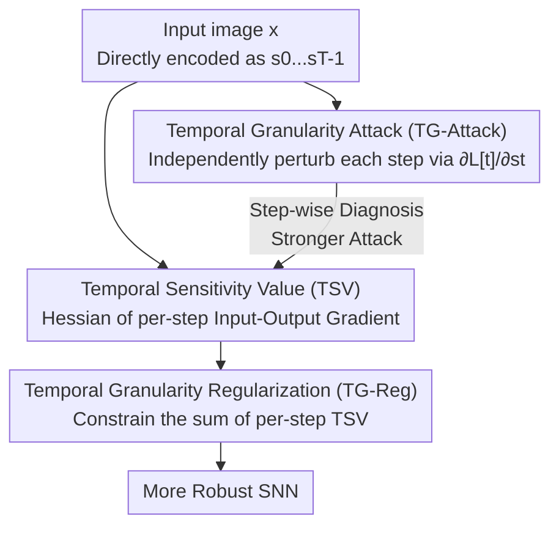

# On the Role of Temporal Granularity in the Robustness of Spiking Neural Networks

**Conference**: CVPR 2026  
**Paper**: [CVF Open Access](https://openaccess.thecvf.com/content/CVPR2026/html/Xu_On_the_Role_of_Temporal_Granularity_in_the_Robustness_of_CVPR_2026_paper.html)  
**Code**: https://github.com/zjubmi-lab/TG-SNN-code  
**Area**: Spiking Neural Networks / Adversarial Robustness  
**Keywords**: Spiking Neural Networks, Temporal Granularity, Adversarial Attack, Robustness Analysis, Hessian Regularization

## TL;DR
This paper revisits the robustness of Spiking Neural Networks (SNNs) from the perspective of "temporal granularity" (individual time steps) rather than "temporal averaging." It proposes TG-Attack, which constructs perturbations step-by-step (stronger attack), and defines the Temporal Sensitivity Value (TSV) using the Hessian of the per-step input-output gradient to estimate robustness without generating adversarial samples. Based on this, it designs a regularization term TG-Reg to constrain the TSV at each time step, consistently surpassing existing SOTA defenses across multiple datasets and networks.

## Background & Motivation

**Background**: As the "third generation of neural networks," SNNs rely on LIF (Leaky Integrate-and-Fire) neurons to accumulate membrane potentials and fire spikes over time, naturally possessing temporal dynamics. Current studies on SNN robustness typically treat them as a "network expanded over $T$ time steps," applying perturbations along the loss gradient direction via FGSM/PGD during attacks.

**Limitations of Prior Work**: Almost all existing attacks and defenses are built on **temporal averaged gradients**—averaging the gradients of each time step $\frac{\partial L}{\partial s_t}$ into $\frac{1}{T}\sum_t \frac{\partial L}{\partial s_t}$ before adding them to the original image (see Eq. 5). This averaging can **offset or suppress** directions that are originally strong at certain time steps, resulting in insufficiently strong attacks and defenses that fail to "see" the true weaknesses.

**Key Challenge**: Prior research has long discovered that the temporal learning capacity and gradients of SNNs are **step-wise distinct**, yet robustness research still only considers "global temporal behavior," averaging out these step-wise differences. In other words, the granularity of analysis (temporal average) does not match the granularity at which the phenomenon occurs (single time step).

**Goal**: To decompose the problem into three sub-questions: (1) Can a stronger attack be constructed at the **single time step** granularity to expose step-wise robustness differences? (2) Can the fragility of each time step be quantified **without generating adversarial samples**? (3) Can a training regularizer be designed to directly improve step-wise robustness?

**Key Insight**: The authors focus on the most mainstream SNN setting—"direct encoding + surrogate gradient direct training"—which has been noted to be more fragile than rate-encoding. They advocate for examining gradients **independently at each time step**.

**Core Idea**: Shifts robustness analysis from "temporal average" down to "temporal granularity"—through step-wise attacks, quantifying sensitivity via per-step Hessian, and then performing step-wise regularization.

## Method

### Overall Architecture

The work follows a logical chain: **first using a stronger step-wise attack to prove the significance of the temporal granularity perspective, then theoretically attributing step-wise robustness to the Hessian (TSV) of each time step, and finally turning the TSV into a training regularization term to suppress it**. The three components advance sequentially—the attack is the "diagnostic tool," TSV is the "attack-free checkup metric," and TG-Reg is the "prescription" based on those metrics.

The basic dynamics of SNNs involve LIF neurons: membrane potential $u^l_t = \tau(u^l_{t-1} - V_{th}s^l_{t-1}) + W^l s^l_{t-1}$, and firing $s^l_t = H(u^l_t - V_{th})$ (where $H$ is the step function, which is non-differentiable and approximated by surrogate gradients during training/attack). An input image $x$ is replicated into a time series $s = \langle s_0, \dots, s_{T-1}\rangle$ via direct encoding before being fed into the network.

### Key Designs

**1. TG-Attack: Decomposing Perturbations from "Temporal Average" to "Per-Step Independent Construction"**

Traditional attacks (Eq. 4+5) average the gradients of all steps and add them to the unencoded original image $x$, causing strong directions to be homogenized. TG-Attack reverses this—**for each frame $s_t$ of the encoded sequence, it constructs perturbations using only the gradient of that specific time step**:

$$\hat{s}_t = s_t + \epsilon\,\mathrm{sign}\big(\nabla_{s_t} L(f(s_t), y_{true})\big), \quad \nabla_{s_t} L = \frac{\partial L[t]}{\partial s_t}$$

The final adversarial sample is reconstructed by concatenating the perturbed frames as $\hat{x} = \langle \hat{s}_0, \dots, \hat{s}_{T-1}\rangle$ (Eq. 7-9). Two key points: First, the loss $L[t]$ is calculated using $f(s_t)$, where $f(s_t)$ is the output layer spikes **accumulated up to step $t$**—because the current output of a LIF neuron depends on all previous info, "current step output" must include historical accumulation. Second, each step selects its own optimal perturbation direction and retains these "time-specific directions," making it stronger than averaged gradients. This acts as both a harsher attack and an explicit exposure of the "different step-wise robustness" phenomenon.

**2. Temporal Sensitivity (TS/TSV): Quantifying "Step-wise Robustness" via per-step Hessian as a Computationally Friendly, Attack-free Metric**

With the "step-wise" perspective, the authors seek a metric to measure how fragile a specific time step is **without actually generating adversarial samples**. The idea is: inject a micro-perturbation $\epsilon$ at step $t$ and measure the change in output distribution via KL divergence $KL(f_w(y_t|s_t)\,\|\,f_w(y_t|s_t+\epsilon))$. After a second-order Taylor expansion of $\log f_w(y_t|s_t+\epsilon)$, the first-order term vanishes under expectation, yielding Theorem 1:

$$KL\big(f_w(y_t|s_t)\,\|\,f_w(y_t|s_t+\epsilon)\big) \approx \tfrac{1}{2}\,\epsilon^\top\, \mathbb{E}_{f_w(y_t|s_t)}\big[-H_{s_t}\log f_w(y_t|s_t)\big]\,\epsilon$$

This indicates that **robustness at step $t$ is determined by the Hessian of the input-output log-probability at that step**. The authors define this expected Hessian as the Temporal Sensitivity Matrix (TSM, Eq. 14), and the sum of its elements as the Temporal Sensitivity Value $TSV(s_t) = \sum_{i,j}\mathbb{E}[-H_{s_t}\log f_w(y_t|s_t)]_{i,j}$ (Eq. 15). A larger TSV implies a larger KL divergence and higher vulnerability to perturbations. Experiments (Fig. 2) show that the trend of TSV across time steps aligns with the accuracy drop under FGSM, validating it as an attack-free robustness "checkup tool."

**3. TG-Reg: Implementing "Suppressing per-step TSV" as a Trainable First-order Regularizer**

Since high TSV indicates fragility, the natural defense is to suppress the sum of TSVs across all steps during training: $L_{TG} = \sum_{t=0}^{T} TSV(s_t)$ (Eq. 16), with the total loss $L = L_{CE} + \lambda L_{TG}$ (Eq. 17). To avoid the slow computation of second-order Hessians (Eq. 15), the authors expand the Hessian of $\log f$ into $\frac{H_{s_t}f}{f} - \frac{\nabla_{s_t}f\,\nabla_{s_t}f^\top}{f^2}$ (Eq. 19). By approximating the second-order term to zero under expectation, they derive a **first-order gradient only** form:

$$TSV(s_t) \approx \sum_{i,j}\mathbb{E}_{f_w(y_t|s_t)}\big[\nabla_{s_t}\log f_w(y_t|s_t)\,\nabla_{s_t}\log f_w(y_t|s_t)^\top\big]_{i,j}$$

(Eq. 21, which is the outer product of the log-likelihood gradient at each step, similar to Fisher Information. ⚠️ Specific conditions for second-order term cancellation are in the original appendix). This allows the regularizer to be inserted into training without second-order backpropagation. The authors specifically compare this with SR [25]: while SR uses the gradient of the true label output probability relative to the **temporally averaged** original image $x$ via finite difference approximation, TG-Reg calculates the gradient magnitude for **each encoded frame $s_t$ independently**—these differences (gradient granularity / perturbation target / implementation) align with the core stance of "temporal granularity vs. temporal average."

### Loss & Training
Total loss $L = L_{CE} + \lambda L_{TG}$, default $\lambda = 100$; time steps $T=8$, 200 epochs, SGD (initial lr=0.1, cosine annealing), surrogate gradient using a triangle-like function, BatchNorm to mitigate gradient vanishing/explosion. Adversarial training baseline uses PGD ($\epsilon=2/255$, $k=2$) samples.

## Key Experimental Results

Datasets: CIFAR-10 / CIFAR-100 / Tiny-ImageNet / DVS-CIFAR10; Networks: VGG11 / WideResNet16 / ResNet19 / ResNet34. Attack default $\epsilon=8/255$, $k=7$, $\alpha=0.01$.

### Main Results: TG-Attack is Stronger (Lower residual accuracy on the same model = stronger attack)

| Setting (CIFAR10, VGG11, T=4) | FGSM | TG-FGSM | PGD | TG-PGD | BIM | TG-BIM |
|------|------|---------|-----|--------|-----|--------|
| Vanilla (Residual accuracy % after attack) | 12.71 | **9.72** | 0.38 | **0.21** | 0.23 | **0.18** |

Step-wise attacks consistently press residual accuracy lower across all base attacks (e.g., FGSM 12.71% → TG-FGSM 9.72%), proving that "constructing perturbations step-by-step" is indeed more effective than averaged gradients.

### Defense Comparison (Adversarial training setting, higher residual accuracy % is better)

| Setting (CIFAR10, VGG11, T=4) | Clean | FGSM | PGD | BIM | AutoAttack |
|------|-------|------|-----|-----|------------|
| AT [27] | 90.56 | 37.88 | 20.01 | 18.88 | 6.25 |
| RAT [8] | 90.52 | 40.78 | 22.35 | 20.88 | 7.04 |
| SR [25] | 90.96 | 36.87 | 13.11 | 11.43 | 6.33 |
| **TG-Reg (Ours)** | 89.45 | **48.64** | **31.12** | **29.40** | **8.76** |

Under the strongest AutoAttack, TG-Reg improves robust accuracy from RAT's 7.04% to 8.76%, with even larger leads in PGD/BIM (approx. +9 percentage points), while Clean accuracy only drops slightly (90.56 → 89.45). This performance lead is also consistent on CIFAR-100/VGG11 (AutoAttack 4.72% vs. RAT 2.32%).

### Key Findings
- The step-wise curve of TSV matches the accuracy decline trend under attack (Fig. 2), confirming Theorem 1—**robustness is determined by per-step Hessian**, and TSV serves as an attack-free estimator.
- TG-Reg improves robustness in both vanilla training and adversarial training paradigms, indicating it is an **orthogonal gain** rather than a replacement for adversarial training.
- The significant lead over SR (e.g., CIFAR10 PGD 31.12% vs. 13.11%) suggests that "calculating gradients per-step" is more effective at addressing SNN vulnerabilities than "temporally averaged gradients + finite differences."

## Highlights & Insights
- **Robustness precisely localized to Hessian**: KL second-order expansion rigorously derives "step-wise robustness ∝ per-step Hessian," and then approximates a second-order quantity with first-order gradient outer products. This bridge from "theoretical metric → trainable regularizer" is clean and transferable to other robustness measurement scenarios.
- **Temporal granularity as the core contribution**: The SNN community has long defaulted to "temporal averaging." This paper uses a stronger attack to prove this default loses information, representing an insightful "discovery of new weaknesses through different granularity" type of work.
- **TSV as a zero-cost metric**: Evaluating robustness usually requires expensive multi-step attacks; TSV provides step-wise scores with just one forward/backward pass.

## Limitations & Future Work
- Limited to "direct encoding + surrogate gradient training"; whether it generalizes to rate-encoding or other paradigms remains partially unverified (authors explicitly focused on this setting).
- TSV uses the sum of all Hessian elements as a scalar; ⚠️ whether this "element-wise summation" is optimal or loses info regarding anisotropic sensitivity is not deeply discussed.
- Scale is limited to Tiny-ImageNet, lacking large-scale dataset results; $\lambda=100$ is relatively high, and sensitivity is only given in the appendix.
- The disappearance of the second-order term under expectation (Eq. 19 → 21) relies on approximation conditions; ⚠️ validity range depends on the original appendix's proofs.

## Related Work & Insights
- **vs AT / RAT [8,27] (Adversarial Training)**: These train directly on adversarial samples without explicitly modeling temporal structures. TG-Reg is an attack-free regularizer that suppresses per-step TSV and can be stacked with adversarial training for higher robust accuracy.
- **vs SR [25] (Sparse Regularization)**: SR uses temporally averaged gradients on the original image with finite differences. TG-Reg independently calculates gradient outer products for each encoded frame, highlighting the "temporal granularity vs. temporal average" distinction, significantly outperforming SR in experiments.
- **vs FEEL-SNN [40] / RSC-SNN [36] (Temporal Encoding)**: These modify encoding (frequency/random smoothing) for robustness, focusing on global temporal dynamics. This work keeps the encoding unchanged and approaches the problem from per-step second-order geometry (Hessian). The routes are orthogonal and could potentially be combined.

## Rating
- Novelty: ⭐⭐⭐⭐⭐ "Temporal granularity" perspective + Hessian theory + attack-free metric provides a clear, underexplored path.
- Experimental Thoroughness: ⭐⭐⭐⭐ 4 datasets, 4 networks, two-way verification (attack/defense) is solid, though limited to Tiny-ImageNet scale.
- Writing Quality: ⭐⭐⭐⭐ Logical chain (attack → metric → regularizer) is smooth; part of the second-order approximation details are relegated to the appendix.
- Value: ⭐⭐⭐⭐ Provides a transferable "attack-free robustness metric + regularization" paradigm with methodological significance for SNN research.

<!-- RELATED:START -->

## Related Papers

- [\[CVPR 2026\] Robust Spiking Neural Networks by Temporal Mutual Information](robust_spiking_neural_networks_by_temporal_mutual_information.md)
- [\[CVPR 2026\] Temporal Interaction in Spiking Transformers with Multi-Delay Mixer](temporal_interaction_in_spiking_transformers_with_multi-delay_mixer.md)
- [\[CVPR 2026\] Temporal Representation Enhancement (TRE): Learning to Forget Dominant Patterns for Enhanced Temporal Spiking Features](temporal_representation_enhancement_tre_learning_to_forget_dominant_patterns_for.md)
- [\[ICML 2026\] Bullet Trains: Parallelizing Training of Temporally Precise Spiking Neural Networks](../../ICML2026/others/bullet_trains_parallelizing_training_of_temporally_precise_spiking_neural_networ.md)
- [\[AAAI 2026\] TDSNNs: Competitive Topographic Deep Spiking Neural Networks for Visual Cortex Modeling](../../AAAI2026/others/tdsnns_competitive_topographic_deep_spiking_neural_networks_for_visual_cortex_mo.md)

<!-- RELATED:END -->
