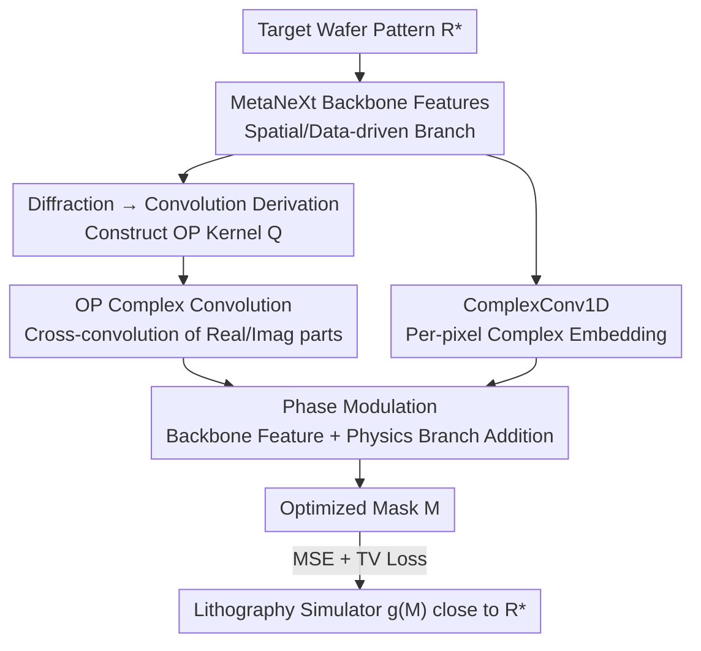

# Optical Diffraction-based Convolution for Semiconductor Lithography

**Conference**: CVPR 2026  
**Paper**: [CVF Open Access](https://openaccess.thecvf.com/content/CVPR2026/html/Son_Optical_Diffraction-based_Convolution_for_Semiconductor_Lithography_CVPR_2026_paper.html)  
**Code**: None  
**Area**: Optical Computing / Computational Lithography / Physics-Informed Networks  
**Keywords**: Semiconductor Lithography, Mask Optimization, Optical Diffraction, Complex Convolution, Phase Modulation

## TL;DR
OptiCo derives the Rayleigh-Sommerfeld diffraction integral into a "complex convolution," constructing **Optical Phase (OP) kernels** that encode light wave phase variations. These kernels are directly embedded into a CNN, allowing the network to explicitly adhere to diffraction physics during lithography mask optimization. This approach reduces the Edge Placement Error (EPE) from double-digit levels seen in peer models to near zero on the OOD subset of LithoBench.

## Background & Motivation
**Background**: Lithography is the most critical and expensive step in semiconductor manufacturing (approximately 30% of total costs). Its core task is **mask optimization**—given a target pattern $R^*$ to be printed on the wafer, the goal is to find a mask $M$ such that the pattern resulting from optical projection and photoresist development is as close as possible to $R^*$. Since running actual lithography lines is extremely expensive and analytical modeling is overly complex, the industry has turned to "simulation + deep learning" for computational lithography. Early GAN-OPC models used GANs to directly learn the mapping from "target wafer image to mask"; DAMO introduced UNet++ for higher resolution; later, DOINN and CFNO utilized Fourier Neural Operators (FNO) to implicitly model diffraction in the frequency domain.

**Limitations of Prior Work**: These methods are either purely data-driven (UNet++/CGAN) or only **implicitly** encounter diffraction in the **frequency domain** (FNO). None explicitly incorporate the physical principles of optical diffraction into the network architecture. Consequently, when mask patterns deviate from the training distribution (Out-of-Distribution, or OOD, which occurs daily in actual production), model generalization collapses. Diffraction effects are particularly severe at short wavelengths (e.g., EUV), causing patterns projected onto the wafer to deviate significantly from the design intent, a phenomenon purely statistical models fail to capture.

**Key Challenge**: Traditional convolutional kernels only consider **spatial features**, whereas the essence of lithography involves **phase changes** occurring at the boundaries of transparent/opaque regions of the mask followed by propagation and imaging. Standard convolutions in the spatial domain lack the "phase" degree of freedom, thus leaving the physics outside the network.

**Goal**: To explicitly embed diffraction physics (especially **phase factors**) into the convolution operation itself, rather than treating it as an external regularization or a frequency-domain trick.

**Key Insight**: The authors noted a mathematical fact: the **Rayleigh-Sommerfeld (RS) diffraction integral**, which describes light propagation from the aperture plane to the target plane, takes the form of a **convolution** (the integrand is the convolution of the input light field with a propagation kernel). Since diffraction = convolution, this "propagation kernel" can be used directly as a convolutional kernel in a CNN.

**Core Idea**: Replace or augment standard convolutional kernels with **Optical Phase kernels** derived from the diffraction integral, performing convolutions in the **complex domain** to carry phase information. This ensures that every convolution step within the network inherently represents the physical propagation of light.

## Method

### Overall Architecture
OptiCo (Optical diffraction-based Convolutional neural network) takes a target wafer pattern as input and outputs an optimized mask $M$. The overall structure remains an encoder-decoder CNN, but key layers in the backbone are replaced with **OptiCo Blocks**. Inside an OptiCo Block, two parallel branches are summed: one is the standard **MetaNeXt backbone features** (responsible for spatial/data-driven features), and the other is the **physical phase branch**. The backbone features are first embedded into the complex domain using a per-pixel complex projection (ComplexConv1D), then modulated by the output of an **OP complex convolution** via Hadamard multiplication. After multiplying by a diffraction constant, the result is added back to the backbone features. The entire model is trained using MSE + TV loss, where the TV loss specifically suppresses granular noise on the mask to improve manufacturability.

The pipeline stages are as follows:

### Key Designs

**1. Rewriting the Diffraction Integral as Convolution to Construct Optical Phase (OP) Kernels**

This step serves as the physical foundation of the work, addressing the lack of phase degrees of freedom in standard convolutions. The RS diffraction integral (using the Fresnel form as an example) for a light field $U$ propagating a distance $z$ from the aperture plane $(x,y)$ to the target plane $(x',y')$ is:

$$U(x',y') = \frac{e^{jkz}}{j\lambda z}\iint_{-\infty}^{\infty} U(x,y)\, e^{ \frac{jk}{2z}[(x'-x)^2+(y'-y)^2] }\,dx\,dy,$$

where $\lambda$ is the wavelength and $k=2\pi/\lambda$ is the wavenumber. Isolating the quadratic dependence on $(x'-x)$ and $(y'-y)$, the authors identified this as the definition of a convolution $(f * h)(x',y')=\iint f(x,y)h(x'-x,y'-y)\,dx\,dy$. Thus, the diffraction integral can be written as $U(x',y')=\frac{e^{jkz}}{j\lambda z}[U * h]$. Here, $h$ is the **OP kernel**, carrying the phase modulation of diffraction. Different RS formulations yield different kernels: Fresnel form $h(x,y)=\exp\!\big(\frac{jk}{2z}(x^2+y^2)\big)$, Helmholtz–Kirchhoff, Green's, etc. Implementation-wise, for a kernel of size $(N,N)$, complex exponentials $Q(x,y)=\exp\!\big(\frac{jk}{2z}(x^2+y^2)\big)$ are calculated relative to the kernel center. The framework is formulation-flexible—while using Fresnel by default, it can accommodate Helmholtz/Green's or industry-standard Hopkins TCC kernels.

**2. OP Complex Convolution: Enabling Active Phase Computation**

Light fields are inherently complex, with phase information hidden in the imaginary part; thus, a real-valued kernel alone cannot express phase modulation. The authors combine the OP kernel $Q$ with a learnable complex weight $W$ to form an **effective kernel** $W_{\text{eff}}=Q\odot W$ (element-wise multiplication), or a stricter scalar-scaled variant $W_{\text{eff}}=\lambda_\alpha\cdot Q$ (scaling a pure physical kernel with a single learnable scalar for higher physical fidelity). Both the input and effective kernel are split into real and imaginary parts $U=U_r+jU_i$ and $W_{\text{eff}}=W_r+jW_i$. The complex convolution is expanded according to complex multiplication:

$$\text{OPconv}(U)=\big(U_r * W_r - U_i * W_i\big) + j\big(U_r * W_i + U_i * W_r\big).$$

Every convolution thus incorporates physical light propagation. Unlike standard convolutions that only learn statistical correlations in the real spatial domain, the cross-convolution of real and imaginary parts explicitly calculates the phase shift. Ablations (Table 5) show that even just adding complex domain modeling reduces the OOD EPE from 22.6 to single digits, proving that "phase representation in the complex domain" is a critical source of performance.

**3. OptiCo Block: Fusion of Physics and Data Branches**

To combine physical priors with powerful data-driven backbones, the authors designed a dual-branch additive block. The backbone uses MetaNeXt-style residual blocks

$$Y_{\text{backbone}}(U)=\big(\text{DWConv}(\text{Norm}(U_r)W_1)\odot\sigma(\text{Norm}(U_r)W_2)\big)W_3 + U_r,$$

for spatial features. Since OP convolution is a complex operation, a per-pixel **ComplexConv1D** is first used to project backbone features $x_{pq}\in\mathbb{R}^C$ into the complex domain: $\text{CConv1D}(x_{pq})=(x_{pq,r}V_r-x_{pq,i}V_i)+j(x_{pq,r}V_i+x_{pq,i}V_r)$, where $V_r,V_i$ are learnable projection matrices. This provides a complex embedding for each pixel's channel vector, allowing interaction with the OP kernel. Phase modulation is then performed via a Hadamard product, multiplied by the diffraction constant $\frac{e^{jkz}}{j\lambda z}$, and added back to the backbone features:

$$Y_{\text{phase}}(U)=\frac{e^{jkz}}{j\lambda z}\big[\text{CConv1D}(Y_{\text{backbone}}(U))\odot \text{OPconv}(U)\big],\quad Y_{\text{OptiCo}}=Y_{\text{backbone}}(U)+Y_{\text{phase}}(U).$$

Ablations reveal that the seemingly minor diffraction constant $\frac{e^{jkz}}{j\lambda z}$ (referred to as Multiply Constants, MC) is essential for maintaining the integrity of the diffraction formula; removing it significantly degrades performance.

### Loss & Training
The primary loss is the Mean Squared Error (MSE) between the target and the resist image obtained by passing the optimized mask through the lithography simulator $g(\cdot)$: $L_{\text{mse}}(M)=\|g(M)-R^*\|^2$. To improve mask manufacturability and suppress granular high-frequency noise, an additional 2D Total Variation (TV) regularization is added:

$$L_{\text{tv}}(M)=\sum_{p,q}\big|M_{p+1,q}-M_{p,q}\big|+\big|M_{p,q+1}-M_{p,q}\big|,$$

which penalizes abrupt changes between adjacent pixels. The final objective is $L_{\text{final}}(M)=L_{\text{mse}}(M)+\lambda_{\text{tv}}L_{\text{tv}}(M)$, where $\lambda_{\text{tv}}$ controls the regularization strength.

## Key Experimental Results

The dataset used is LithoBench (100k+ layout tiles, $2048\times2048$ resolution, $1\text{nm}^2$ per pixel), including two synthetic sets (MetalSet/ViaSet) and two real-world OOD sets (StdMetal/StdContact). Mask optimization is evaluated using MSE, EPE (Edge Placement Error violations), and PVB (Process Variation Band area), all of which are better when lower.

### Main Results (Mask Optimization, Average Column, lower is better)

| Method | MSE | PVB | EPE |
|------|-----|-----|-----|
| DAMO | 26056 | 27651 | 8.1 |
| DOINN | 34691 | 23370 | 16.9 |
| CFNO | 38578 | 25196 | 18.0 |
| ILILT (Prev. SOTA) | 22143 | 31064 | 2.6 |
| **OptiCo** | **14535** | 29373 | **0.4** |

The results on the OOD subsets are most telling: on StdContact, most methods' EPE surges to 26–56, while OptiCo achieves only **0.1**. On StdMetal, OptiCo's EPE is **0.0**, with an average EPE (0.4) significantly lower than the previous strongest method, ILILT (2.6). OptiCo also leads across MSE and IoU in lithography simulation tasks (Table 2).

### Ablation Study

| Configuration | StdMetal EPE | StdContact EPE | Description |
|------|------|------|------|
| w/o kernel | 2.819 | 22.612 | Degenerates to pure backbone |
| ComplexConv1D (CC) only | 0.657 | 7.491 | Complex embedding alone helps significantly |
| OP Complex Conv (OP) only | 1.561 | 6.321 | Physical kernel alone is effective |
| OP + MC (Diffraction Const) | 0.188 | 1.273 | Completes the diffraction formula terms |
| **OP + MC + CC (Complete)** | **0.044** | **0.079** | Full OptiCo Block |

Additional ablations on OP kernel formula selection (Table 3, standard $W_{\text{eff}}=Q\odot W$): Compared to w/o kernel (StdContact EPE 22.6), lightweight formulas like Fresnel (0.079) and Green's (0.188) perform best, suggesting simpler formulas merge more easily with the network. In the strict variant $W_{\text{eff}}=\lambda_\alpha Q$ (Table 4), the industry-standard Hopkins TCC kernel is optimal (StdContact 0.212), confirming high alignment with high-fidelity physical models.

### Key Findings
- **Complex Domain + Diffraction Constants are Vital**: From the baseline (w/o kernel) to the full block, StdContact EPE dropped from 22.6 to 0.079. Completing the diffraction constant (MC) and complex embedding (CC) each provided order-of-magnitude improvements, indicating that transferring the physical formula **faithfully and completely** into the network is more important than partial inclusion.
- **Physics Priors = OOD Generalization**: While nearly all methods achieve near-zero EPE for In-Distribution data (ViaSet), the gap widens significantly on OOD tasks. Explicit diffraction modeling essentially injects physical guidance that is independent of the training distribution.
- **Formula Selection Matters**: The standard variant favors lightweight Fresnel/Green's (easier to train), while the strict scalar variant favors high-fidelity Hopkins. Kernels that are too small lack the receptive field to cover diffraction, while kernels that are too large have quadratic phase terms $(x^2+y^2)$ that change too steeply, hindering training. ⚠️ An optimal kernel size exists (documented in Appendix B.5).

## Highlights & Insights
- **Elegant Equivalence of "Diffraction = Convolution"**: Instead of inventing a new operator, the authors found that the RS diffraction integral is naturally a convolution, allowing physical kernels to be used as CNN kernels. This insight can be applied to any imaging problem governed by propagation integrals (acoustics, ultrasound, light-field imaging).
- **Two-Tier Physics Fidelity Design**: The choice between $W_{\text{eff}}=Q\odot W$ (flexible/learnable) and $W_{\text{eff}}=\lambda_\alpha Q$ (strict/pure physical scaling) provides a "knob" for the trade-off between data-driven and physics-constrained learning.
- **Complex Convolution for Phase Representation**: The methodology of cross-convolution of real/imaginary parts alongside per-pixel complex embedding serves as a standard paradigm for translating complex physical quantities into computationally manageable neural network forms.

## Limitations & Future Work
- The method is tightly coupled with the LithoBench setup (fixed resolution, specific photoresist models). Its transferability to real EUV lines with complex scenarios like multi-exposure or 3D masks has not been fully verified.
- The setting or learning process for physical parameters in the OP kernel, such as distance $z$ and wavelength $\lambda$, is not extensively detailed ⚠️; robustness under parameter mismatch in real-world processes remains an open question.
- The computational overhead and inference speed of complex convolution + dual branches relative to pure FNO have not been quantitatively compared.
- The optimal kernel size is a hyperparameter. Quadratic phase terms make large kernels difficult to train, implying that additional techniques may be needed for diffraction scenarios requiring larger receptive fields.

## Related Work & Insights
- **vs DOINN / CFNO (FNO family)**: These model diffraction **implicitly in the frequency domain**. OptiCo **explicitly incorporates the diffraction kernel in the spatial domain**. Comparison (Fig. 3) demonstrates that explicit physical modeling outperforms implicit frequency modeling.
- **vs ILILT**: ILILT iteratively embeds inverse lithography technology (ILT) into the learning process. While it was the previous SOTA, its physics was introduced indirectly via simulation. OptiCo’s direct inclusion of physical kernels achieves a significantly better average EPE of 0.4 vs 2.6.
- **vs DAMO (Pure Data-Driven UNet++)**: Lacking physical priors, DAMO’s EPE collapses to 8.1+ on OOD data, highlighting that physical priors primarily provide generalization capability.
- **vs Nitho**: Nitho uses a coordinate-based complex MLP inspired by optical kernel regression for simulation. OptiCo is stronger by integrating physics directly into the architecture and kernel operations.

## Rating
- Novelty: ⭐⭐⭐⭐⭐ First to explicitly embed the principles of optical diffraction into convolutional kernel operations; the "diffraction=convolution" rewrite is clean and powerful.
- Experimental Thoroughness: ⭐⭐⭐⭐ Strong performance on LithoBench tasks with detailed ablations, though lacks comparison with real fabrication lines or analysis of computational cost.
- Writing Quality: ⭐⭐⭐⭐ Clear physical derivations and logical progression; some key parameter details are relegated to the appendix.
- Value: ⭐⭐⭐⭐⭐ OOD generalization is a major requirement in computational lithography. Reducing OOD EPE to near zero through physical priors is highly significant for actual manufacturing.

<!-- RELATED:START -->

## Related Papers

- [\[ICCV 2025\] Recover Biological Structure from Sparse-View Diffraction Images with Neural Volumetric Prior](../../ICCV2025/others/recover_biological_structure_from_sparse-view_diffraction_images_with_neural_vol.md)
- [\[CVPR 2025\] SDF-Net: Structure-Aware Disentangled Feature Learning for Optical–SAR Ship Re-Identification](../../CVPR2025/others/sdf-net_structure-aware_disentangled_feature_learning_for_opticall-sar_ship_re-i.md)
- [\[CVPR 2026\] VideoMaMa: Mask-Guided Video Matting via Generative Prior](videomama_mask-guided_video_matting_via_generative_prior.md)
- [\[CVPR 2026\] Inter-Photon-Limited Videography](inter-photon-limited_videography.md)
- [\[CVPR 2026\] DF²-VB: Dual-level Fuzzy Fusion with View-specific Boosting for Multi-view Multi-label Classification](df2-vb_dual-level_fuzzy_fusion_with_view-specific_boosting_for_multi-view_multi-.md)

<!-- RELATED:END -->
