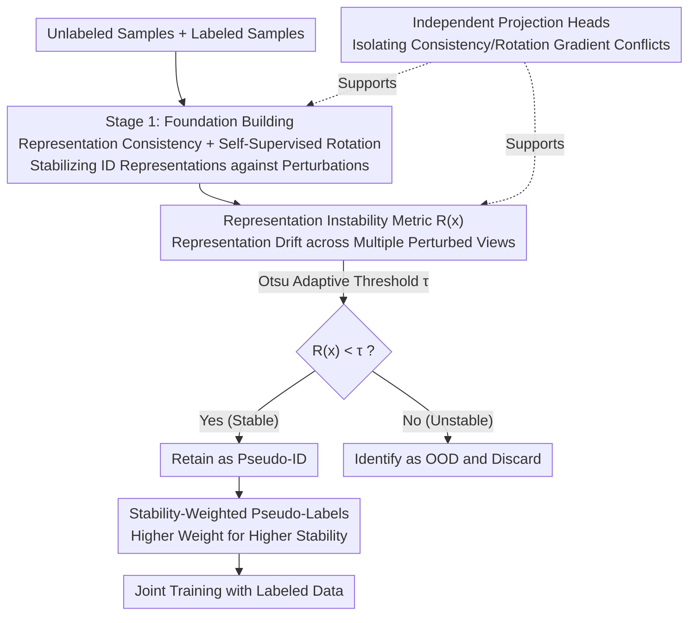

# PAF: Perturbation-Aware Filtering for Open-Set Semi-Supervised Learning

**Conference**: CVPR 2026  
**Paper**: [CVF Open Access](https://openaccess.thecvf.com/content/CVPR2026/html/Han_PAF_Perturbation-Aware_Filtering_for_Open-Set_Semi-Supervised_Learning_CVPR_2026_paper.html)  
**Code**: https://github.com/njustkmg/CVPR26-PAF  
**Area**: Open-Set Semi-Supervised Learning  
**Keywords**: Open-Set Semi-Supervised Learning, OOD Detection, Representation Instability, Perturbation-Aware, Adaptive Threshold

## TL;DR
PAF discovers that the **representation** fluctuations of OOD samples under "semantics-preserving perturbations" are significantly larger than those of ID samples. This representation-level instability is formulated into a dynamic filter using an Otsu adaptive threshold. Combined with a two-stage training strategy that filters unstable samples and weights pseudo-labels by stability, PAF achieves new SOTA performance in both classification accuracy and OOD detection AUC across four open-set semi-supervised benchmarks.

## Background & Motivation

**Background**: Semi-supervised learning (SSL) leverages a small amount of labeled data and a large amount of unlabeled data to approximate fully supervised performance, primarily through consistency regularization and pseudo-labeling. However, traditional SSL assumes that the unlabeled and labeled sets share the same **class distribution**—a premise rarely true in reality, where unlabeled data often contains unseen novel classes, i.e., out-of-distribution (OOD) samples. Open-Set Semi-Supervised Learning (OSSL) aims to both train a classifier for known classes and identify/filter OOD samples from unlabeled data; otherwise, they pollute pseudo-labels and distort decision boundaries.

**Limitations of Prior Work**: Existing OSSL methods for OOD identification generally fall into three categories: consistency regularization with One-vs-All boundaries (OpenMatch), adding an "unknown" class to the label space to absorb OOD samples (IOMatch), or using evidential/Bayesian modeling to classify low-confidence samples as unknown (ANEDL). They share a common blind spot: **they only consider prediction confidence from a single view and fail to exploit the differing sensitivities of ID and OOD samples under perturbations**.

**Key Challenge**: Prior work (confidence mutation) noted that OOD samples exhibit dramatic fluctuations in maximum softmax probability under semantics-preserving perturbations while ID samples remain relatively stable, leading to OOD detection based on "confidence fluctuation." However, **confidence is merely a shallow projection of representation instability**: small representation changes guarantee small confidence changes, but the converse does not hold (stable confidence does not imply stable internal representations). Preliminary experiments (Figure 1) quantify this—the separability of ID/OOD using confidence mutation is only 0.0462, whereas directly using representation instability yields a separability of 0.1386, a nearly threefold improvement.

**Core Idea**: Shift the filtering signal from "confidence fluctuation" down to "**representation-level instability**"—measuring the average drift of the penultimate layer representations under multiple semantics-preserving perturbations. Samples with large drift are filtered as OOD, while stable samples are retained as ID for training. A two-stage framework is then utilized to first stabilize ID representations and subsequently apply PAF to dynamically clean the unlabeled data.

## Method

### Overall Architecture

The goal of PAF is to reliably select the ID subset from the unlabeled set $D_u$ (containing both ID and OOD samples). The process follows a **two-stage** workflow: Stage 1 "lays the foundation"—performing supervised classification on labeled data while using representation consistency regularization to stabilize ID representations against perturbations and a self-supervised rotation prediction task to enrich the backbone's semantic structure. Stage 2 executes the "filtering"—periodically measuring the representation instability of each unlabeled sample with PAF, using an Otsu threshold to adaptively partition the ID subset, and training the classifier using "stability-weighted pseudo-labels" on these pseudo-ID samples alongside labeled data. The backbone uses WideResNet28-2. To prevent gradient conflicts between the consistency objective (pulling views together) and the rotation objective (pushing orientations apart), independent projection heads are assigned to each task.

### Key Designs

**1. Representation Instability Metric + Otsu Adaptive Filtering: Moving the filtering signal to the representation space**

This is the core of PAF, addressing the limitation that confidence is a shallow signal. For an unlabeled sample $\mathbf{x}^u$, semantics-preserving perturbation operators $A$ (weak augmentations like flipping or slight color jitter) are used to generate $K_a$ views. Let $\varphi(\cdot)$ be the backbone representation and $\phi_{\text{con}}(\cdot)$ be the consistency projection head. Representation instability is defined as the average $\ell_2$ squared distance between the original and perturbed views in the projection space:

$$R(\mathbf{x}^u) = \frac{1}{K_a d}\sum_{k=1}^{K_a} \left\| \phi_{\text{con}}\bigl(\varphi(\mathbf{x}^u)\bigr) - \phi_{\text{con}}\bigl(\varphi(\mathbf{x}^u_{(k)})\bigr) \right\|_2^{2}$$

Where $d$ is the representation dimension and $\mathbf{x}^u_{(k)}$ is the $k$-th perturbed view (in practice, $K_a=1$ is sufficient for efficiency). Given the instability distribution of a batch, instead of a fixed threshold, the Otsu criterion (maximizing inter-class variance in image binarization) is used to automatically determine an adaptive threshold $\tau$, partitioning the unlabeled set: $\mathcal{X}_u^{\text{ID}} = \{\mathbf{x}^u \mid R(\mathbf{x}^u) < \tau\}$ and $\mathcal{X}_u^{\text{OOD}} = \{\mathbf{x}^u \mid R(\mathbf{x}^u) \ge \tau\}$. **Mechanism**: The authors prove from a Lipschitz-margin perspective that prediction variance induced by perturbations decays **exponentially** with the decision margin $m(\mathbf{x})$ ($\mathrm{Var}_\delta[s(\mathbf{x}+\delta)] \le \beta^2(K-1)^2 e^{-2m(\mathbf{x})}\sigma^2$). ID samples have larger margins and are naturally stable, while OOD/boundary samples have small margins and are highly sensitive to perturbations. It is also shown that $|s(\mathbf{x})-s(\mathbf{x}')| \le \beta(K-1)e^{-m(\mathbf{x})}\|\varphi(\mathbf{x})-\varphi(\mathbf{x}')\|_2$, meaning "small representation change $\Rightarrow$ small confidence change, but not vice versa," making **representation instability a stricter criterion**.

**2. Two-Stage Framework + Consistency Reg + Self-Supervised Rotation: Stabilizing representations first**

PAF relies on "stability" to distinguish ID/OOD, which requires the backbone representations to be **stable and discriminative** for semantics-preserving perturbations; otherwise, the metric is purely noise. Thus, Stage 1 focuses on stabilizing: representation consistency regularization minimizes the mean squared error between two weakly augmented views $\mathbf{x}', \mathbf{x}''$ in the projection space: $\mathcal{L}_{\text{con}} = \frac{1}{d|\mathcal{D}_l|}\sum_{\mathbf{x}\in\mathcal{D}_l}\|\phi_{\text{con}}(\varphi(\mathbf{x}')) - \phi_{\text{con}}(\varphi(\mathbf{x}''))\|_2^{2}$. Since labeled data is scarce, auxiliary self-supervised rotation prediction is introduced: the model predicts the rotation angle $\{0°, 90°, 180°, 270°\}$ of all samples (labeled + unlabeled), guided by a 4-class cross-entropy loss $\mathcal{L}_{\text{rot}}$. This requires understanding high-level semantic structures, effectively enriching the backbone's semantic depth. Total loss for Stage 1: $\mathcal{L} = \mathcal{L}_{\text{ce}} + \mathcal{L}_{\text{con}} + \mathcal{L}_{\text{rot}}$. This "stabilize then filter" decoupling is more robust than immediate filtering, which might delete good samples when representations are unreliable.

**3. Instability-Weighted Pseudo-Labels: Letting "confident and stable" samples drive decision boundaries**

After PAF extracts the ID subset $\mathcal{X}_u^{\text{ID}}$, how is it utilized? A naive approach (UDA) treats all pseudo-ID samples equally, but stability still varies among them. This work designs an instability-weighted loss where weekly augmented $\mathbf{x}^w$ and strongly augmented $\mathbf{x}^s$ views generate soft predictions $p^w, p^s$. The normalized instability $\hat{\delta}(\mathbf{x}^u)$ (min-max normalized to $[0,1]$) is converted to a weight:

$$\mathcal{L}_{\text{u}} = \frac{1}{|\mathcal{X}_u^{\text{ID}}|}\sum_{\mathbf{x}^u \in \mathcal{X}_u^{\text{ID}}} \bigl(1 - \hat{\delta}(\mathbf{x}^u)\bigr)\,\mathds{1}\bigl[\max(p^w) \ge \alpha\bigr]\,\mathrm{KL}\bigl(p^w \,\|\, p^s\bigr)$$

More stable samples ($\hat{\delta}\to 0$) have weights closer to 1, while less stable samples are down-weighted. The indicator function $\mathds{1}[\max(p^w)\ge\alpha]$ adds a confidence threshold $\alpha$. Thus, **only samples that are both confident and stable drive the decision boundary**, tightly coupling pseudo-label learning with representation consistency. Stage 2 total loss: $\mathcal{L} = \mathcal{L}_{\text{ce}} + \mathcal{L}_{\text{u}} + \mathcal{L}_{\text{con}} + \mathcal{L}_{\text{rot}}$, with PAF re-filtering the ID subset every 20 epochs.

**4. Independent Projection Heads: Isolating consistency and rotation gradient conflicts**

Consistency regularization attempts to **pull** representations of different views closer, while rotation prediction aims to **push** different orientations into distinct subspaces. These objectives are opposing. If they share a projection space, gradients often conflict. PAF assigns dedicated projection heads to the self-supervised and consistency branches. Removing this isolation causes performance to plummet on CIFAR-100 (77.7→61.8), marking it as the most critical ablation—proving that **gradient interference is a significant hidden danger in multi-task self-supervised frameworks**.

## Key Experimental Results

### Main Results

Known class classification accuracy (%) under internal OOD scenarios (OOD from unseen classes of the same dataset), mismatch ratio 0.3/0.6:

| Dataset | mismatch | Ours | BDMatch | SCOMatch | OpenMatch |
|--------|----------|------|---------|----------|-----------|
| MNIST | 0.3 | **99.4** | 99.1 | 99.0 | 97.8 |
| CIFAR-10 | 0.3 | **93.1** | 92.5 | 92.2 | 88.2 |
| CIFAR-100 | 0.3 | **77.7** | 75.9 | 75.3 | 68.7 |
| TinyImageNet | 0.3 | **58.1** | 56.7 | 54.2 | 37.9 |
| TinyImageNet | 0.6 | **54.6** | 52.9 | 52.3 | 37.0 |

OOD identification AUC (%), where the Gain is particularly significant on difficult datasets:

| Dataset | mismatch | Ours | ProSub | OSP |
|--------|----------|------|--------|-----|
| CIFAR-10 | 0.3 | **96.1** | 89.1 | 88.3 |
| CIFAR-100 | 0.3 | **84.5** | 73.2 | 71.8 |
| TinyImageNet | 0.3 | **64.8** | 56.2 | 54.4 |

On CIFAR-100, the AUC increases from 73.2 to 84.5 (+11.3), and TinyImageNet by +8.6, demonstrating that **the harder the task and the more difficult the ID/OOD separation, the more pronounced the advantage of representation-level signals**. PAF also leads in external OOD scenarios (CIFAR-10 + TinyImageNet/LSUN/Noise) and remains robust to synthetic noise. Furthermore, integrating PAF into the CLIP-driven fine-grained OSSL framework CFSG-CLIP improves CUB-200 accuracy from 84.73 to 85.16.

### Ablation Study

CIFAR-100, mismatch 0.3:

| Configuration | Acc | AUC | Description |
|------|-----|-----|------|
| Full PAF | 77.7 | 84.5 | Complete Model |
| w/o PAF (Rep. Filtering) | 71.2 | 74.8 | Core filtering removed, Accuracy -6.5 |
| w/o Independent Heads | 61.8 | 70.2 | **Gradient conflict, Accuracy drops -15.9** |
| w/o Consistency Loss | 75.1 | 81.3 | Representations not stabilized, -2.6 |
| w/o Rotation Loss | 75.6 | 81.2 | Weaker semantic structure, -2.1 |
| Confidence Filtering | 74.5 | 78.2 | Reverting to shallow signal, AUC -6.3 |

### Key Findings

- **Independent Projection Heads contribute most**: Removing them drops accuracy by 15.9 points, far exceeding the impact of removing PAF itself—gradient conflict is an underrated risk in multi-task self-supervised frameworks.
- **Representation filtering outperforms confidence filtering**: Replacing the filtering signal with confidence within the same framework drops AUC from 84.5 to 78.2; ID retention rate leads by +9.9% and OOD filtering rate by +12.2%, aligning with the theory that representation criteria are stricter.
- **$K_a=1$ is sufficient**: Increasing the number of perturbations $K_a$ provides marginal AUC gains while linearly increasing computation; 1 is the optimal trade-off. The Otsu threshold is stable within a scale factor $\gamma\in[0.85, 1.10]$.
- **Efficiency**: PAF trains in 23.1 hours / 5.4GB VRAM, faster than T2T (29.3h) and SCOMatch (28.6h), with the filtering itself incurring nearly zero overhead.

## Highlights & Insights
- **The insight that "confidence is a shallow projection of representation instability" is solid**: The authors go beyond empirical observation to provide a proof via a Lipschitz-margin framework showing "small representation change $\Rightarrow$ small confidence change, but not vice versa," transforming "why use representations" from intuition into a provable criterion.
- **Cleverly adapting the Otsu threshold for deep learning filtering**: This avoids the challenge of manual threshold tuning. Using a classic image binarization principle to adapt to each batch's instability distribution is parameter-free and scale-robust, potentially applicable to any "dynamic binary threshold" scenario (e.g., sample selection in active learning).
- **The discovery of gradient conflicts has universal value**: The inherent opposition between consistency (pulling) and rotation (pushing) means sharing projection heads results in gradient cancelation. This is a vital reminder for "consistency + self-supervision" frameworks; independent heads are a high-return, low-cost patch.
- **Representation instability as a general OOD signal**: Its success when plugged into CFSG-CLIP suggests the signal is decoupled from specific frameworks and can be migrated to broader tasks like open-set recognition and OOD detection.

## Limitations & Future Work
- **Systematic ablation of perturbation operators is lacking**: The method relies on "semantics-preserving perturbations," yet only flip and slight color jitter are used. Quantitative analysis on how different perturbation types/strengths affect instability metrics is missing.
- **Practicality of theoretical assumptions**: The Lipschitz-margin analysis assumes each logit is $\beta$-Lipschitz. While the paper mentions empirical validation in supplementary materials, how $\beta$ evolves during training or its validity in deep networks is not detailed in the main text.
- **Limited verification on large-scale/fine-grained scenarios**: Experiments focus on MNIST/CIFAR/TinyImageNet. The CLIP fine-grained test on CUB-200 shows a small gain (+0.43). The separability of representation instability in ImageNet-scale or semantic-near OOD scenarios remains to be further validated.
- **Filtering frequency**: Filtering every 20 epochs is a hyperparameter. The sensitivity of the filtering frequency (and its trade-off between cost and ID subset lag) is not analyzed.

## Related Work & Insights
- **vs. confidence mutation [48]**: Both utilize the phenomenon that OOD is less stable than ID under perturbations, but the former measures max softmax fluctuations (shallow) while PAF measures penultimate layer drift (deep), with PAF proving to be a stricter criterion (+6.3 AUC gain).
- **vs. OpenMatch [29] / IOMatch [23]**: These rely on One-vs-All boundaries or "unknown" classes, which are static single-view confidence models; PAF is a dynamic, perturbation-sensitive filter, leading OpenMatch by nearly 16 points on CIFAR-100.
- **vs. UDA [39]**: The pseudo-label loss is a weighted extension of UDA—where UDA treats all samples equally, PAF uses $(1-\hat\delta)$ to modulate contributions by stability.
- **vs. Otsu method [27]**: Porting a classic image processing rule to dynamic unlabeled sample binarization is an excellent example of cross-domain reuse—parameter-free and robust.

## Rating
- Novelty: ⭐⭐⭐⭐ Moving the filtering signal to the representation space with Lipschitz-margin support provides a clear and solid motivation, though built on existing confidence mutation observations.
- Experimental Thoroughness: ⭐⭐⭐⭐ Four benchmarks + internal/external OOD + CLIP fine-grained; ablation is comprehensive and reveals critical gradient conflicts, though utility analysis on perturbation types is missing.
- Writing Quality: ⭐⭐⭐⭐ Logic from motivation to theory and method is smooth; Figure 1 comparison is highly persuasive.
- Value: ⭐⭐⭐⭐ Representation instability and Otsu dynamic thresholds are transferable to broader tasks like OOD detection and noise filtering, while being more efficient.

<!-- RELATED:START -->

## Related Papers

- [\[AAAI 2026\] Sampling Control for Imbalanced Calibration in Semi-Supervised Learning](../../AAAI2026/others/sampling_control_for_imbalanced_calibration_in_semi-supervised_learning.md)
- [\[CVPR 2026\] Back to Source: Open-Set Continual Test-Time Adaptation via Domain Compensation](back_to_source_open-set_continual_test-time_adaptation_via_domain_compensation.md)
- [\[ECCV 2024\] Bidirectional Uncertainty-Based Active Learning for Open-Set Annotation](../../ECCV2024/others/bidirectional_uncertainty-based_active_learning_for_open-set_annotation.md)
- [\[CVPR 2026\] Event Stream Filtering via Probability Flux Estimation](event_stream_filtering_via_probability_flux_estimation.md)
- [\[CVPR 2026\] HAD: Heterogeneity-Aware Distillation for Lifelong Heterogeneous Learning](had_heterogeneity-aware_distillation_for_lifelong_heterogeneous_learning.md)

<!-- RELATED:END -->
