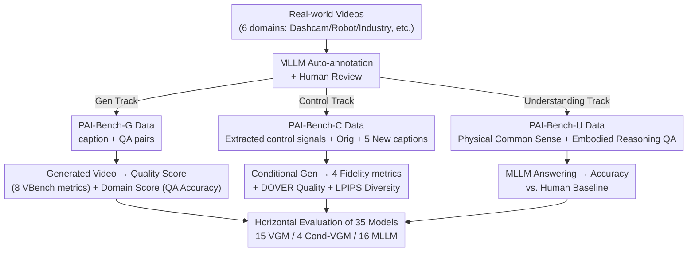

# PAI-Bench: A Comprehensive Benchmark For Physical AI

**Conference**: CVPR 2026  
**Paper**: [CVF Open Access](https://openaccess.thecvf.com/content/CVPR2026/html/Zhou_PAI-Bench_A_Comprehensive_Benchmark_For_Physical_AI_CVPR_2026_paper.html)  
**Code**: https://github.com/SHI-Labs/physical-ai-bench (Available)  
**Area**: Physical AI / Video Generation Evaluation / Multimodal Understanding / Benchmark  
**Keywords**: Physical AI, Video Generation, World Models, Conditional Video Generation, Video Understanding

## TL;DR
PAI-Bench decomposes "Physical AI" into two capability tracks—perception and prediction—and maps them to three tracks: video generation, conditional video generation, and video understanding. Using 2,808 real-world samples paired with task-aligned physical plausibility metrics, the authors systematically evaluate 15 video generation models, 4 controllable generation models, and 16 Multimodal Large Language Models (MLLMs). The findings indicate that while these models produce aesthetically pleasing visuals, they generally fail to learn physical laws, and their understanding capabilities lag significantly behind human performance.

## Background & Motivation

**Background**: The goal of Physical AI is to enable models to "perceive and predict real-world dynamics" and act accordingly. The paper decomposes this goal into two fundamental capabilities: **perception** (understanding what happened in visual signals) and **prediction** (inferring the next physical state based on the current situation). In the current community, MLLMs are expected to handle perception, while Video Generation Models (VGMs) are seen as the most promising route for implicitly learning physical laws to handle prediction.

**Limitations of Prior Work**: Existing evaluations are decoupled from real-world requirements. MLLMs are primarily validated on benchmarks for abstract reasoning (OCR, mathematics) and everyday perception, leaving their performance in specialized Physical AI scenarios unknown. For VGMs, existing benchmarks almost exclusively focus on visual aesthetics and temporal consistency, rarely questioning whether the models "understand the rules of the real world." Worse, these benchmarks are fragmented—testing either prediction or perception—without a unified framework specifically for Physical AI.

**Key Challenge**: Evaluating "whether it looks right" is different from evaluating "whether it is physically correct." A video can have extremely high image quality while violating basic laws of physics. Similarly, a question can be answered correctly based on linguistic priors or static single-frame information without requiring an understanding of temporal dynamics. Existing metrics capture the former but miss the latter, leading to a systematic overestimation of models' physical capabilities.

**Goal**: To build a unified, comprehensive Physical AI benchmark rooted in real-world data that covers both perception and prediction, equipped with task-aligned metrics capable of distinguishing "physical plausibility" from "visual appeal."

**Key Insight**: The authors adhere to a unified design principle: **all evaluations are built upon physically meaningful tasks and real-world data** (videos collected from real sources, such as dashcams), covering multiple sub-domains including autonomous driving, robotics, first-person view, industry, human action, and physical common sense.

**Core Idea**: Map the two capability tracks (perception/prediction) to three tracks: Video Understanding (U), Video Generation (G), and Conditional Video Generation (C). Each track features specifically designed task-aligned physical metrics to decouple "image quality" from "physical plausibility."

## Method

PAI-Bench is an evaluation benchmark; its "method" consists of **how data is constructed** and **the metrics used for each track**. The overall structure is a two-level tree: the top level consists of the perception vs. prediction tracks, while the middle level maps to the G/C/U tracks. each track has its own real-world video data, annotation process, and physical metrics, culminating in a horizontal evaluation of 35 models.

### Overall Architecture

PAI-Bench contains 2,808 real-world samples across three tracks:

- **PAI-Bench-G (Video Generation)**: Evaluates prediction capability. Given a text caption, a VGM generates a video, which is then scored on two dimensions: a Quality Score for visual fidelity and a Domain Score for physical plausibility. The data includes 1,044 video-prompt pairs and 5,636 QA pairs across 6 domains.
- **PAI-Bench-C (Conditional Video Generation)**: Further evaluates prediction but with additional control signals (blur/edge/depth/segmentation), focusing on the **fidelity** of the generated results to these signals. It includes 600 videos, with 200 each sampled from AgiBot, OpenDV, and Ego-Exo-4D.
- **PAI-Bench-U (Video Understanding)**: Evaluates perception capability by requiring MLLMs to answer physical-related video questions. This is divided into "physical common sense reasoning" and "embodied reasoning."

The three tracks share a unified principle: real-world data + physically meaningful tasks. The following pipeline illustrates the process from data collection to model evaluation:

### Key Designs

**1. PAI-Bench-G: Decoupling "Image Quality" and "Physical Plausibility"**

A major pitfall in VGM evaluation is conflating image quality with physical plausibility—as visual fidelity improves, models are default-assumed to "understand physics," but these are not equivalent. PAI-Bench-G scores generated videos on two orthogonal dimensions. The **Quality Score** reuses 8 metrics from VBench/VBench++ (subject consistency, background consistency, motion smoothness, aesthetic quality, imaging quality, overall consistency, and subject/background for image-to-video) to measure visual quality and text alignment. The **Domain Score** is the key innovation for physical plausibility: the authors first use Qwen2.5-VL-72B to generate high-fidelity captions for real videos (manually corrected), then generate QA pairs (candidates from MLLM, refined by humans) based on an ontology. Qwen3-VL-235B-A22B acts as a judge to "interrogate" the generated videos using these QA pairs. The Domain Score is defined as the judge's accuracy on these QA pairs, quantifying whether a video follows the physical/semantic constraints it ought to. Thus, a video with high visual quality but poor physical details will receive a low Domain Score.

**2. PAI-Bench-C: Quantifying "Adherence to Control Signals" via Fidelity and Diversity**

The value of controllable generation lies in constraining the VGM's solution space via control signals, yet fine-grained measures for how faithfully a video follows these signals have been lacking. PAI-Bench-C provides three judging criteria: fidelity to control signals, image quality, and diversity under the same configuration. Fidelity is measured by "projecting back to the modality space for similarity comparison": synthetic videos are projected back to blur, edge, depth, or segmentation spaces using corresponding tools (Blur Kernel, Canny, Video Depth Anything, GroundingDINO+SAM2) and compared with ground-truth signals to produce **Blur SSIM, Edge F1, Depth si-RMSE, and Mask mIoU**. Quality is measured via DOVER, and diversity via LPIPS. To test diversity, for each video, the authors not only use the original caption but also have the MLLM rewrite 5 "consistent but novel" captions (e.g., replacing the dominant object), expecting diverse rather than identical results under the same control signals. Signals include Blur, Edge, Depth, Seg, and All (an equal-weight combination).

**3. PAI-Bench-U: Dual Ontology for "Physical Common Sense + Embodied Reasoning" and Unbiased Design**

Physical perception evaluation for MLLMs can be contaminated by two biases: the model guessing based on linguistic priors (without looking at the visuals) or answering based on single-frame static information (without needing temporal context). PAI-Bench-U defines its scope through a clear ontology: **Physical Common Sense Reasoning** is divided into Space (object relations/spatial feasibility/scene composition), Time (event timestamps/sequence/causality), and Physical World (physical principles/object properties/violations of physics), totaling 604 QA pairs from 426 videos. **Embodied Reasoning** covers "predicting action effects" (task completion/next action prediction) and "obeying physical constraints" (action affordance, i.e., whether an action is feasible/stable/safe), using 601 videos/610 QA pairs from RoboVQA, RoboFail, BridgeData, AgiBot, HoloAssist, and a proprietary AV dataset. The authors actively validate lack of bias by testing with 0-frame, 1-frame, and 32-frame inputs: performance with 0 frames (text only) drops to random guessing, indicating linguistic priors are neutralized; a significant performance jump from 1 to 32 frames proves the tasks require temporal information.

### Loss & Training
Not applicable. PAI-Bench is a pure evaluation benchmark and does not involve model training. All models (VGM/MLLM) are evaluated in a "zero-shot" manner using their default configurations.

## Key Experimental Results

The authors evaluated 15 VGMs, 4 conditional VGMs (under 5 control settings), and 16 MLLMs.

### Main Results

PAI-Bench-G: Image quality (Quality) is generally close to real-world videos, but there is a significant gap in physical plausibility (Domain). The closed-source Veo3 and the strongest open-source models are nearly tied.

| Model | Total Score | Domain Avg | Quality Avg |
|-------|-------------|------------|-------------|
| Source Videos (Upper Bound) | 83.9 | 89.8 | 78.0 |
| Veo3 (Closed) | 82.2 | 86.8 | 77.6 |
| Wan2.2-I2V-A14B (Strongest Open) | 82.3 | 87.1 | 77.5 |
| Cosmos-Predict2.5-2B | 81.4 | 84.9 | 78.0 |
| DynamicCrafter (Lowest) | 68.3 | 63.0 | 73.7 |

PAI-Bench-U: All MLLMs show a massive gap compared to humans (93.2). The strongest model achieves only 64.7, and closed-source models are not necessarily superior to open-source ones.

| Model | Total Score | Physical Common Sense Avg | Embodied Reasoning Avg |
|-------|-------------|----------------------------|------------------------|
| Human | 93.2 | 93.6 | 94.0 |
| Qwen3-VL-235B-A22B (Strongest) | 64.7 | 64.9 | 64.4 |
| GPT-5 (minimal reasoning) | 61.8 | 63.9 | 59.7 |
| GPT-4o | 56.2 | 58.6 | 53.8 |
| Claude-3.5-Sonnet | 46.0 | 47.8 | 44.1 |
| Random Guess | 37.0 | 38.9 | 35.2 |

### Ablation Study

PAI-Bench-C: Taking Cosmos-Transfer2.5-2B as an example, the multi-signal (All) combination yields the highest quality, while segmentation (Seg) as a control signal results in the worst fidelity.

| Control Signal | Edge F1 ↑ | Mask mIoU ↑ | Quality ↑ | Diversity ↑ |
|----------------|-----------|-------------|-----------|-------------|
| Blur | 0.26 | 0.75 | 8.77 | 0.18 |
| Edge | 0.39 | 0.74 | 8.05 | 0.36 |
| Depth | 0.17 | 0.72 | 7.30 | 0.41 |
| Seg | 0.13 | 0.71 | 7.87 | 0.44 |
| All (Equal Weight) | 0.45 | 0.77 | 9.24 | 0.13 |

PAI-Bench-U Reasoning Mode Ablation: Pure text reasoning provides almost no help or even causes performance drops, whereas GPT-5 sees a significant increase after introducing visual reasoning.

| Model | Reasoning Mode | Total Score | Physical Common Sense | Embodied Reasoning |
|-------|----------------|-------------|------------------------|--------------------|
| Qwen3-VL-235B-A22B | Off | 64.7 | 64.9 | 64.4 |
| Qwen3-VL-235B-A22B | On (Text-only) | 63.7 (-1.0) | 66.4 (+1.5) | 61.0 (-3.4) |
| GPT-5 | Off (minimal) | 61.8 | 63.9 | 59.7 |
| GPT-5 | On (medium, w/ visual reasoning) | 69.8 (+8.0) | 71.4 (+7.5) | 68.2 (+8.5) |

### Key Findings
- **Image quality is nearly saturated, while physical plausibility remains a bottleneck**: The Quality Scores of most leading VGMs approach or equal that of real-world videos (78.0), yet Domain Scores remain universally lower than the real-world upper bound. Models have learned to "look alike" but not to "move correctly." Enhancing the physical plausibility of generated videos is the core challenge for Physical AI.
- **Metrics align strongly with human preferences**: ELO scores from arena-style human evaluations correlate strongly with the proposed metrics (Total $r=0.918$, Domain $r=0.857$, Quality $r=0.883$), indicating the scores are well-designed.
- **Segmentation signals are the least faithful**: Mask mIoU is lowest when using Seg as a control. The authors attribute this to segmentation maps being "noisy" supervision—even tools like SAM2 exhibit temporal inconsistency by losing masks across frames, which hinders generation.
- **Closed-source does not always beat open-source → Physical AI is not yet heavily optimized**: In the G track, open-source Wan2.2 (81.4) is close to closed-source Veo3 (82.2). In the U track, open-source Qwen3-VL-235B (64.7) outperforms GPT-5 (61.8) by 2.9 points. The lack of a clear gap and the low absolute scores suggest a community-wide data gap or that models simply haven't learned the specific capabilities required for Physical AI.
- **Visual reasoning is key; pure text reasoning is ineffective**: Enabling pure text thinking in the Qwen3-VL series generally results in drops in embodied reasoning. Conversely, GPT-5's medium reasoning (text + visual thinking) leads to a +8.0 jump. When the visual module fails to capture fine-grained details, subsequent text reasoning lacks grounding and spins in a void, highlighting the necessity of advancing "visual thinking."

## Highlights & Insights
- **Decomposition into "Capability → Track → Metric"**: Mapping perception/prediction to G/C/U tracks with task-aligned metrics provides a clean, replicable framework for evaluating the physical world.
- **Domain Score via "QA Accuracy"**: Quantifying physical correctness through targeted interrogation is more effective than aesthetic/consistency scores at exposing "high quality but physically impossible" samples. It is also inherently interpretable.
- **Unbiased validation (0/1/32 frame scanning)**: Proving that the benchmark neutralizes linguistic priors and depends strongly on temporal context through quantitative curves is a "quality check" that all video understanding benchmarks should adopt.
- **Insight on text vs. visual reasoning**: Challenging the assumption that "adding CoT always improves performance," the authors point out that without visual grounding, text reasoning for fine-grained physical perception is futile.

## Limitations & Future Work
- **Heavy reliance on MLLMs as annotators and judges**: Caption generation, QA candidate selection, and Domain Score evaluation all utilize Qwen models. The physical understanding limits of the judge model bound the benchmark's ceiling and may introduce biases toward similar MLLMs.
- **Domain Score is a QA proxy**: It measures "whether a video can answer a set of QA pairs" rather than physical consistency directly (e.g., dynamic error), potentially missing physical violations not covered by the QA.
- **Finite scale and uneven domain distribution**: 2,808 samples are relatively few for a "comprehensive" benchmark, and the number of QA/videos per domain varies significantly (e.g., 1,990 Common Sense QA vs. 359 Industry QA in PAI-Bench-G).
- **Missing configurations in the C track**: Wan2.2-Fun-5B was excluded under blur/seg conditions due to incoherent generation, and the "All" condition was only evaluated on Cosmos-Transfer, limiting horizontal comparability.

## Related Work & Insights
- **vs. VBench / VBench++**: These focus on image quality, aesthetics, and temporal consistency. PAI-Bench reuses 8 of their metrics as the Quality Score but adds the Domain Score to isolate "physical plausibility," filling the gap of "looking good but being wrong."
- **vs. Physics-IQ / PhyGenBench / IntPhys2**: These either cover only the generation track or are small in scale (160–1070 cases) without covering conditional generation and understanding. PAI-Bench is the first unified framework to bridge G/C/U tracks across multiple domains.
- **vs. EgoSchema / VideoMME / CausalVQA**: These focus on general understanding or causal QA. PAI-Bench-U focuses on physically grounded common sense and embodied reasoning with explicit unbiased design, serving as a complementary rather than redundant tool.

## Rating
- **Novelty**: ⭐⭐⭐⭐ First unified benchmark across generation, conditional generation, and understanding for Physical AI; the two-dimensional capability decomposition and Domain Score design are innovative, though individual metrics often adapt existing tools.
- **Experimental Thoroughness**: ⭐⭐⭐⭐⭐ Evaluates 35 models, performs human baseline alignment, unbiased validation, and reasoning mode ablation; the coverage and depth of analysis are solid.
- **Writing Quality**: ⭐⭐⭐⭐ Clear structure and insightful findings; some metric calculation details are deferred to the appendix, making the main text feel slightly like an overview.
- **Value**: ⭐⭐⭐⭐⭐ Provides a unified yardstick for Physical AI and World Models, quantitatively exposing critical gaps like "saturated image quality but failing physics" and "the lack of visual reasoning," offering direct guidance for future model design and data collection.

<!-- RELATED:START -->

## Related Papers

- [\[NeurIPS 2025\] RDB2G-Bench: A Comprehensive Benchmark for Automatic Graph Modeling of Relational Databases](../../NeurIPS2025/others/rdb2g-bench_a_comprehensive_benchmark_for_automatic_graph_modeling_of_relational.md)
- [\[ICML 2026\] iWorld-Bench: A Benchmark for Interactive World Models with a Unified Action Generation Framework](../../ICML2026/others/iworld-bench_a_benchmark_for_interactive_world_models_with_a_unified_action_gene.md)
- [\[CVPR 2026\] WiTTA-Bench: Benchmarking Test-Time Adaptation for WiFi Sensing](witta-bench_benchmarking_test-time_adaptation_for_wifi_sensing.md)
- [\[CVPR 2026\] MSPT: Efficient Large-Scale Physical Modeling via Parallelized Multi-Scale Attention](mspt_efficient_large-scale_physical_modeling_via_parallelized_multi-scale_attent.md)
- [\[CVPR 2026\] 4DWorldBench: A Comprehensive Evaluation Framework for 3D/4D World Generation Models](4dworldbench_a_comprehensive_evaluation_framework_for_3d4d_world_generation_mode.md)

<!-- RELATED:END -->
