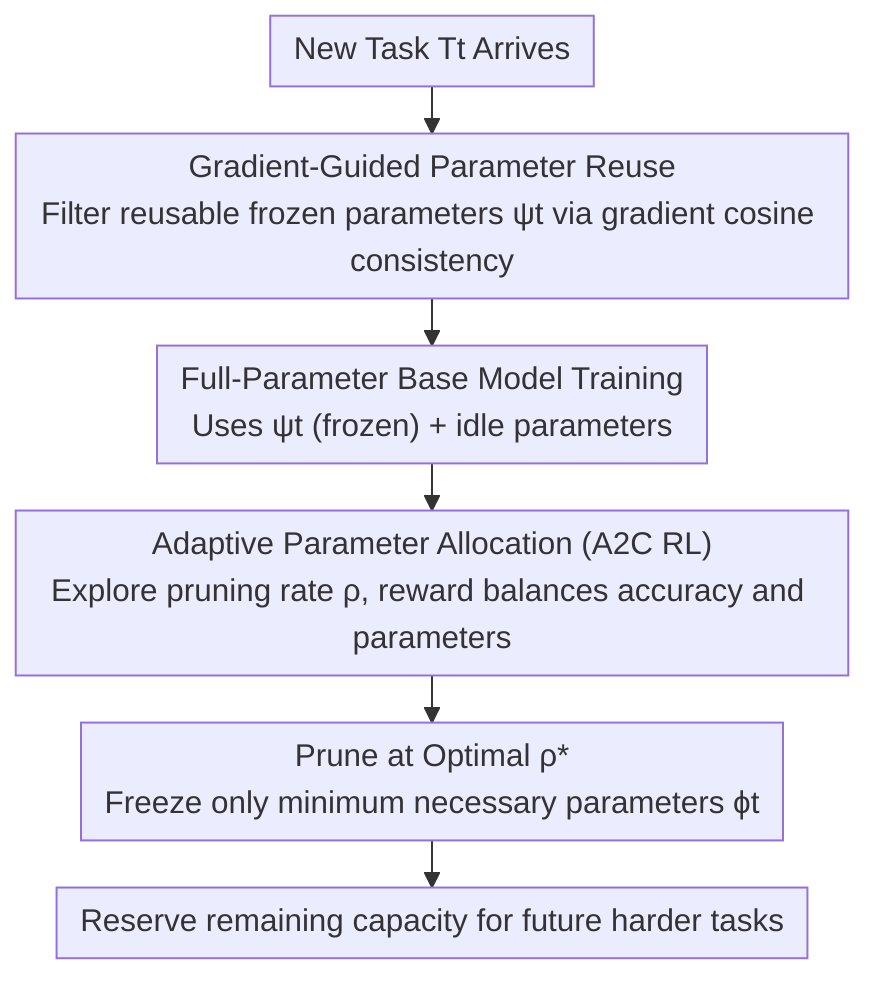

# Parameter-efficient Continual Learning for Enhancing Plasticity without Forgetting under Limited Model Capacity

**Conference**: CVPR 2026  
**Paper**: [CVF Open Access](https://openaccess.thecvf.com/content/CVPR2026/html/Chen_Parameter-efficient_Continual_Learning_for_Enhancing_Plasticity_without_Forgetting_under_Limited_CVPR_2026_paper.html)  
**Code**: To be confirmed  
**Area**: Continual Learning / Parameter Isolation  
**Keywords**: Continual Learning, Parameter Isolation, Catastrophic Forgetting, Gradient Consistency, RL-based Pruning

## TL;DR
GRAPA is a parameter-efficient continual learning method designed for "capacity-limited" scenarios. It first identifies safely reusable frozen parameters from old tasks using gradient direction consistency, and then adaptively determines a "just enough" pruning rate for each new task via A2C reinforcement learning. This significantly enhances plasticity (learning new tasks) without sacrificing stability (no forgetting). On six heterogeneous task sequences, it achieves an average accuracy improvement of up to 7.67%, with gains up to 14.92% on subsequent complex tasks.

## Background & Motivation
**Background**: Continual Learning (CL) aims to prevent forgetting old tasks (stability) while effectively learning new ones (plasticity) as tasks arrive sequentially. Mainstream approaches include replay, regularization, and parameter isolation. Parameter isolation assigns disjoint parameter subsets $\phi_i\cap\phi_j=\emptyset$ to each task and freezes them after training, representing the strongest category for suppressing catastrophic forgetting.

**Limitations of Prior Work**: Although parameter isolation prevents forgetting, it generally neglects plasticity. Common practices include: ① Learning task-specific masks on a shared backbone to activate subsets—relying purely on reusing old parameters, which is insufficient for increasingly difficult task sequences; ② The "train-prune-retrain" paradigm that assigns new parameters to each task using a **fixed pruning rate**—ignoring differences in task complexity. This leads to two issues: under capacity constraints, new parameters may be exhausted before all tasks are learned; as task difficulty increases, early simple tasks may freeze too many parameters, leaving insufficient capacity for later complex tasks.

**Key Challenge**: Stability (freezing to protect old tasks) and plasticity (leaving capacity for new tasks) conflict directly under **limited capacity**. Fixed pruning rates distribute capacity "uniformly or via exponential decay," which mismatches actual task requirements.

**Goal**: For each new task $T_t$, the objective is to **reuse compatible frozen parameters** to reduce new parameter consumption, while **freezing only the minimum necessary new parameters**. Under a parameter budget $B$, the goal is to minimize the loss across all tasks: $\min_{\theta_t}\sum_{t=1}^{N}\mathcal{L}_t(\theta_t)$ s.t. $|\bigcup_t\theta_t|\le B$.

**Key Insight**: Reusing old parameters can cause negative transfer or forgetting if gradient directions conflict with the new task; therefore, "which parameters to reuse" should be judged by **gradient consistency**. Since the optimal "amount of parameters to reserve for a new task" cannot be manually tuned a priori, it should be delegated to **reinforcement learning**, which excels at trial-and-error under unknown states.

**Core Idea**: Gradient-guided parameter reuse + RL-based adaptive parameter allocation. First, reuse "non-conflicting" old parameters, then use A2C to search for a "just enough" pruning rate for each task.

## Method

### Overall Architecture
GRAPA follows a two-stage pipeline for each incoming task $T_t$. **Stage 1** filters a safely reusable subset $\psi_t$ from all previously frozen parameters based on gradient direction consistency (maximizing knowledge transfer without interference). **Stage 2** allocates all remaining idle parameters to train a base model for the current task, then uses an A2C reinforcement learning agent to iteratively explore pruning rates. The reward balances "accuracy preservation" and "parameter savings." Finally, pruning is performed at the optimal rate to freeze only the minimum necessary new parameters $\phi_t$, reserving maximum capacity for subsequent tasks. The active parameters are $\theta_t=\phi_t\cup\psi_t$.

### Key Designs

**1. Gradient-Guided Parameter Reuse: Selecting "Non-conflicting" Old Parameters via Gradient Consistency**

To address the issue where pure reuse of old parameters introduces negative transfer or interference, GRAPA stores the gradients of each previous task on frozen parameters upon convergence (with bounded overhead). During training for task $T_t$, the cosine similarity between the current task gradient $g_t^l$ and a previous task gradient $g_{t'}^l$ is calculated layer-by-layer and epoch-by-epoch:

$$\cos(g_t^l,g_{t'}^l)=\frac{g_t^l\cdot g_{t'}^l}{\|g_t^l\|_2\,\|g_{t'}^l\|_2}.$$

Old parameters are deemed reusable only if the gradients for both tasks are consistent (cosine $>0$) at that layer and remain consistent for **more than half of the training epochs**. The reuse set is defined as:

$$\psi_t=\bigcup_{i=1}^{t-1}\bigcup_l\Big\{\phi_i^l \;\Big|\; \sum_{e=1}^{E}\mathbb{I}\big(\cos(g_{t,e}^l,g_i^l)>0\big)>\tfrac{E}{2}\Big\},$$

where the reuse decision is recorded as a binary mask $M_t$. This ensures only direction-compatible knowledge is transferred, saving parameters while preventing conflicting gradients from damaging old tasks.

**2. RL-based Adaptive Parameter Allocation: Finding the "Just Enough" Pruning Rate via A2C**

To address the limitations of fixed pruning rates, GRAPA first assigns all unfrozen parameters to the current task to train a base model with a pruning rate of 0, recording its accuracy as $acc^{base}_t$. Pruning is then modeled as a "task-adaptive trial-and-error" problem solved via Advantage Actor-Critic (A2C). The state $s_t^k$ contains five features: pruning rate and accuracy from the previous step (two step-dependent variables) + number of classes, sample complexity, and separability (three task descriptors). The actor outputs a pruning rate $\rho_t^k\in(0,1)$ (with $\epsilon=0.2$ uniform exploration). After pruning and short retraining, $acc_t^k$ is obtained, and the reward is:

$$r_t^k=\begin{cases}-1,& \delta_t^k<\eta\\[2pt](\delta_t^k)^{\alpha}\cdot(\rho_t^k)^{\beta},&\text{otherwise}\end{cases},\qquad \delta_t^k=\frac{acc_t^k}{acc^{base}_t},$$

where $\delta_t^k$ is the relative accuracy retention rate after pruning. A threshold $\eta=0.6$ provides a clear penalty if accuracy drops too significantly, discouraging invalid exploration. $\alpha=5$ and $\beta=1.5$ control the weights for "accuracy priority" and "compression priority," respectively. The reward encourages the agent to find the "maximum pruning rate without significant accuracy loss." The agent has only ~7K parameters (negligible compared to ResNet-18's 11.7M) and explores $\le 20$ steps per task. Instead of using the raw policy output, the final pruning rate is selected from historical experiences that satisfy accuracy constraints with the highest reward, ensuring both robustness and low overhead (agent training takes <1.5% of total time).

## Key Experimental Results

### Main Results
Evaluations were conducted on six task sequences composed of 8 datasets (MFKT = MNIST/FashionMNIST/KMNIST/TinyImageNet, QSCF = QMNIST/SVHN/CIFAR-10/Food-101), using light CNN and ResNet-18 backbones. The table below lists the average test accuracy (%) for each sequence:

| Method | MFKT C (CNN) | QSCF C (CNN) | MFKT R1 (R18) | QSCF R1 (R18) | MFKT R2 (R18) | QSCF R2 (R18) |
|------|------|------|------|------|------|------|
| LwF (Regularization) | 34.86 | 41.86 | 73.80 | 68.24 | 58.80 | 60.39 |
| PackNet (Isolation) | 65.39 | 58.95 | 74.90 | 80.64 | 77.88 | 80.78 |
| H2 | 71.78 | 64.81 | 81.34 | 87.64 | 81.22 | 82.72 |
| GrowBrain | 67.78 | 66.49 | 81.74 | 81.98 | 81.78 | 81.79 |
| **GRAPA (Ours)** | **76.54** | **74.16** | **85.89** | **90.25** | **85.26** | **88.03** |
| Independent (Upper) | 76.86 | 77.34 | 88.84 | 94.12 | 88.84 | 94.12 |

GRAPA outperforms all baselines across all sequences and approaches the empirical upper bound of "training independent models per task." Its advantage is particularly evident in later, harder tasks (e.g., TinyImageNet, Food-101): while PackNet/H2 suffer sharp performance declines after capacity exhaustion, GRAPA maintains high accuracy due to reserved capacity.

### Ablation Study
| Configuration | MFKT C | QSCF C | MFKT R1 | MFKT R2 | QSCF R1 | QSCF R2 |
|------|------|------|------|------|------|------|
| GRAPA (w/o GR) (Reuse all old parameters) | 74.55 | 72.86 | 80.30 | 62.79 | 81.29 | 85.57 |
| GRAPA (w/o APA) (Fixed pruning rate) | 73.73 | 70.07 | 73.04 | 75.93 | 71.00 | 78.84 |
| **GRAPA (Full)** | **76.54** | **74.16** | **85.89** | **85.26** | **90.25** | **88.03** |

### Key Findings
- Removing adaptive allocation (w/o APA) results in significant performance drops, especially in long ResNet-18 sequences (e.g., QSCF R1 drops from 90.25 to 71.00). Fixed pruning rates quickly freeze excessive parameters, crushing subsequent complex tasks (TinyImageNet drops to 25.11%, Food-101 to 24.25%).
- Removing gradient-guided reuse (w/o GR)—i.e., blindly reusing all frozen parameters—introduces negative transfer from incompatible tasks, leading to decreased accuracy. This validates the necessity of "gradient consistency filtering."
- RL-based pruning outperforms heuristics: On QSCF R1, linear decay (79.58%) and binary search (83.04%) are inferior to GRAPA's 90.25%. GRAPA is also insensitive to hyperparameters $\alpha, \beta$ on CNNs (performance gap <2%).
- Capacity Preservation: Due to fixed ratio allocation, H2 leaves <1.34% trainable parameters by the TinyImageNet stage. GRAPA freezes only what is necessary, reserving more capacity for late-stage tasks.

## Highlights & Insights
- **Gradient Cosine Consistency as a Reusability Criterion**: It transforms the decision of "which old parameters are safe to reuse" from heuristic masks to a selection grounded in gradient directions. This is simple, physically intuitive, and transferable to any parameter isolation framework as a "safe transfer gate."
- **Delegating Pruning Rate Search to RL**: Fixed pruning rates have been a long-standing weakness in this field. GRAPA uses a lightweight A2C agent (~7K parameters, $\le 20$ steps with early exit) to make this process task-adaptive. The negligible overhead brings stable gains—the concept of "letting the model decide its own capacity requirement" is highly reusable.
- **Reward Function Encoding Accuracy and Compression**: The $r=\delta^{\alpha}\rho^{\beta}$ reward combined with the $\eta$ hard penalty explicitly encodes the dual objectives of "minimizing accuracy loss" and "maximizing pruning." Shifting the preference is as simple as tuning $\alpha$ and $\beta$.

## Limitations & Future Work
- Total tasks are still bounded by the hard limit of model capacity: even with efficient saving, capacity will eventually be exhausted. The authors acknowledge this and suggest exploring "active forgetting" mechanisms to discard obsolete tasks or unimportant parameters.
- Each exploration step requires "pruning + short retraining." Although fast and limited to 20 steps, it still incurs additional training overhead compared to non-exploratory methods (cited as <1.5% of total time, but absolute overhead accumulates with the number of tasks).
- Details for calculating "sample complexity and separability" in the task description state are provided in the supplementary material (⚠️ refer to the original/supplement for details). Their robustness and comparability across datasets were not fully discussed in the main text.
- Evaluation focused on image classification task sequences with lightweight backbones; performance on detection/segmentation or larger models remains unverified.

## Related Work & Insights
- **vs PackNet (Train-Prune-Retrain with Fixed Rate)**: PackNet prunes based on a remaining ratio, causing exponential capacity decay and failure on late-stage tasks. GRAPA uses RL-adaptive pruning + gradient reuse to allocate capacity on demand, performing significantly better in long sequences.
- **vs H2 (PackNet + Fisher Information Selective Reuse)**: H2 uses Fisher information to select unimportant old parameters for reuse but still employs fixed pruning rates. GRAPA uses gradient consistency for reusability and adaptive allocation for new parameters, achieving a better balance of stability and plasticity.
- **vs GrowBrain (Hypernetwork Transformation)**: GrowBrain relies on strong task correlation to generate parameter adjustments, which limits generalization on heterogeneous sequences. GRAPA does not rely on strong correlation and allocates based on per-task requirements, proving more stable on R2 heterogeneous sequences.
- **vs LwF (Regularization/Knowledge Distillation)**: LwF shares the parameter space, offering flexibility for later complex tasks but suffering from severe forgetting of early tasks. GRAPA uses parameter isolation to guarantee no forgetting while addressing the plasticity shortfall via adaptive allocation.

## Rating
- Novelty: ⭐⭐⭐⭐ Combination of "gradient consistency reuse + RL adaptive pruning" effectively addresses the fixed pruning rate pain point with clear logic.
- Experimental Thoroughness: ⭐⭐⭐⭐ Six heterogeneous sequences, two backbones, ablation studies, RL strategy comparisons, capacity analysis, and hyperparameter sensitivity.
- Writing Quality: ⭐⭐⭐⭐ One-to-one correspondence between motivation and design; clear pseudocode.
- Value: ⭐⭐⭐⭐ Strong practical utility for edge-side capacity-constrained continual learning, approaching the independent training upper bound.

<!-- RELATED:START -->

## Related Papers

- [\[CVPR 2026\] Exemplar-Free Continual Learning for State Space Models](exemplar-free_continual_learning_for_state_space_models.md)
- [\[CVPR 2026\] A Faster Path to Continual Learning](a_faster_path_to_continual_learning.md)
- [\[CVPR 2026\] Spectral Mixture-of-Experts for Continual Learning](spectral_mixture-of-experts_for_continual_learning.md)
- [\[CVPR 2026\] Subspace Alignment for CLIP-based Continual Learning via Canonical Correlation Analysis](subspace_alignment_for_clip-based_continual_learning_via_canonical_correlation_a.md)
- [\[CVPR 2026\] FEAT: Federated Geometry-Aware Correction for Exemplar Replay under Continual Dynamic Heterogeneity](feat_federated_geometry_aware_correction_for_exemplar_replay_under_continual_dynamic_heterogeneity.md)

<!-- RELATED:END -->
