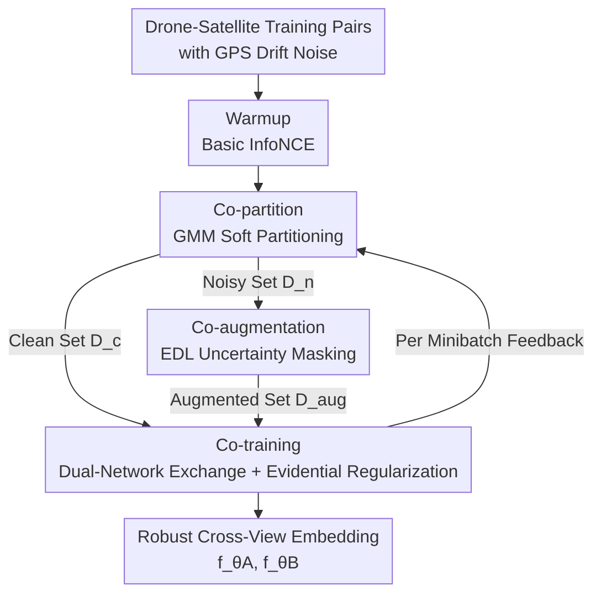

# PAUL: Uncertainty-Guided Partition and Augmentation for Robust Cross-View Geo-Localization under Noisy Correspondence

**Conference**: CVPR 2026  
**Paper**: [CVF Open Access](https://openaccess.thecvf.com/content/CVPR2026/html/Li_PAUL_Uncertainty-Guided_Partition_and_Augmentation_for_Robust_Cross-View_Geo-Localization_under_CVPR_2026_paper.html)  
**Code**: None  
**Area**: Cross-View Geo-Localization / Remote Sensing  
**Keywords**: Noisy Correspondence, Cross-View Geo-Localization, Evidential Deep Learning, Uncertainty, Co-training

## TL;DR
Addressing the "semi-positive" alignment noise caused by GPS drift in UAV-satellite cross-view localization, PAUL utilizes a Gaussian Mixture Model (GMM) to softly partition clean/noisy pairs, employs Evidential Deep Learning (EDL) for uncertainty-guided region mask augmentation, and uses dual-network co-training to absorb effective signals from noisy samples, consistently outperforming existing noisy correspondence methods under various noise ratios.

## Background & Motivation
**Background**: Cross-View Geo-Localization (CVGL) embeds UAV aerial images and satellite tiles into a shared feature space. Using metric learning (typically InfoNCE / Sample4Geo), it minimizes the distance between matching pairs in the feature space, enabling the retrieval of the UAV's geographical location from a satellite base map to support tasks such as navigation, event detection, and aerial surveying.

**Limitations of Prior Work**: Existing methods almost exclusively assume that training pairs are "perfectly aligned"—meaning the satellite tile precisely captures the area photographed by the UAV. However, in real-world data collection, urban canyons, electromagnetic interference, and adverse weather cause GPS drift. Consequently, satellite tiles cropped according to recorded coordinates exhibit **systematic offsets** relative to the true location, resulting in only **partial spatial overlap** between paired images. Experiments show that when the SOTA model Sample4Geo is evaluated on data with a noise ratio increasing from $0 \rightarrow 0.9$, the cross-area R@1 drops from 55.21% to 41.92%.

**Key Challenge**: This noise is fundamentally different from classic "noisy correspondence" (where semantic meanings are completely mismatched in cross-modal retrieval)—it is "misaligned" rather than "mismatched." Offset pairs still retain significant effective information (the overlapping region is a true match), yet existing noisy correspondence methods either discard noisy samples (small-loss filtering) or treat them merely as negative samples/anchors, which is wasteful for these semi-positive samples.

**Goal**: (1) Formally define the noisy correspondence problem in cross-view localization (NC-CVGL) for the first time; (2) Design a robust training framework capable of both identifying and **utilizing** semi-positive noisy samples.

**Key Insight**: Quantify the spatial overlap quality of pairs using IoU to partition training pairs into "well-aligned positive samples" and "partially overlapping semi-positive noisy samples." Since noisy pairs still contain trustworthy local alignment regions, use uncertainty to extract these credible regions rather than discarding the entire pair.

**Core Idea**: Shift from "aggressive noise filtering" to "mining potential signals within noise"—use evidential uncertainty to locate trustworthy local regions in each noisy pair, synthesize pseudo-clean supervision, and allow dual networks to exchange partitioning results for collaborative signal absorption.

## Method

### Overall Architecture
PAUL (Partition and Augmentation by Uncertainty Learning) maintains **two identically structured networks, A and B, initialized independently** (both using ViT-Base as the encoder based on the Sample4Geo framework), following a cyclic three-phase co-training process: First, use the InfoNCE loss distribution for **Co-partitioning** to softly divide each batch into clean and noisy sets via GMM. Next, apply **Co-augmentation** on the noisy set using evidential uncertainty-guided region masking to retain high-confidence local areas for synthesized augmented samples. Finally, **Co-training** allows the two networks to **exchange their partitioning results** for mutual supervision; clean/augmented samples follow standard matching loss, while residual noisy samples follow an evidential regularization term. The process starts with 1 warmup epoch (running basic InfoNCE), followed by per-minibatch GMM fitting, re-partitioning, re-augmentation, and cross-update.

In the problem setting, for each UAV query $q_i$ and satellite image $r_j$, $\mathrm{IoU}(q_i,r_j)$ measures spatial overlap. Thresholds $\tau_m=0.39$ and $\tau_s=0.14$ are used to categorize training pairs into a well-aligned positive set $\mathcal{P}$ ($\mathrm{IoU}>\tau_m$) and a semi-positive noisy set $\mathcal{N}$ ($\tau_s<\mathrm{IoU}\le\tau_m$). Each pair has an observed label $y_{ij}\in\{0,1\}$ and a **latent variable** $z_{ij}$ (indicating if it is an offset but overlapping noisy pair, invisible during training). The objective is to learn an embedding $f_\theta$ that brings matching pairs closer while remaining robust to the alignment noise caused by $z_{ij}$.

### Key Designs

**1. Co-partition: Soft Partitioning via GMM on InfoNCE Loss Distribution**

Using IoU directly as supervision is unfeasible since the model does not know which pairs are noisy during training ($z_{ij}$ is invisible). The authors observe that under the Sample4Geo framework, the InfoNCE loss $\ell_{\mathrm{InfoNCE}}=-\log\frac{\exp(S(q_i,r_j)/\tau)}{\sum_k\exp(S(q_i,r_k)/\tau)}$ (where $S$ is feature similarity and $\tau$ is temperature) naturally clusters: clean pairs (high IoU) gather at low values, while noisy pairs cluster at high values, forming a bimodal distribution. Thus, a two-component Gaussian Mixture Model (GMM) is fitted to the loss values:

$$p(\ell\mid\theta)=\beta\cdot\mathcal{N}(\ell;\mu_c,\sigma_c^2)+(1-\beta)\cdot\mathcal{N}(\ell;\mu_n,\sigma_n^2)$$

The first component models clean samples and the second models noisy samples, where $\beta$ is the mixing weight estimated via EM. Each sample receives a posterior probability $w_i=\frac{\beta\,\mathcal{N}(\ell_i;\mu_c,\sigma_c^2)}{\beta\,\mathcal{N}(\ell_i;\mu_c,\sigma_c^2)+(1-\beta)\,\mathcal{N}(\ell_i;\mu_n,\sigma_n^2)}$ of being clean. This **soft, probabilistic** partitioning avoids hard thresholds, allowing semi-positive noisy samples to be naturally identified for subsequent utilization rather than being discarded.

**2. Co-augmentation: EDL-Driven Uncertainty Region Masking to Distill Trustworthy Local Info**

Noisy pairs are offset, but their overlapping regions contain true signals. Without ground-truth labels, identifying these credible regions is difficult. The authors treat the matching within a batch (size $K$) as a $K$-way classification. For sample $i$, similarity logits $s_i\in\mathbb{R}^K$ (the $i$-th row of the similarity matrix) are converted into evidence vectors $\mathbf{e}_i=\exp(\tanh(s_i/\tau))$. The evidence parameterizes a Dirichlet distribution with $\alpha_i=\mathbf{e}_i+1$ and strength $A_i=\sum_k\alpha_{ik}$. The mean and variance of the pseudo-class probabilities are $\mathbb{E}[p_{ik}]=\frac{\alpha_{ik}}{A_i}$ and $\mathrm{Var}(p_{ik})=\frac{\alpha_{ik}(A_i-\alpha_{ik})}{A_i^2(A_i+1)}$, with total sample uncertainty $u_i=K/\sum_k\alpha_{ik}$. The evidential loss consists of an MSE term and a KL regularization term pulling the Dirichlet toward a uniform prior:

$$\ell_{\mathrm{EDL}}=\sum_{i=1}^{K}\sum_{k=1}^{K}\Big[(y_{ik}-\tfrac{\alpha_{ik}}{A_i})^2+\tfrac{\alpha_{ik}(A_i-\alpha_{ik})}{A_i^2(A_i+1)}\Big]+\lambda\,\mathrm{KL}\big(\mathrm{Dir}(\alpha_i)\,\|\,\mathrm{Dir}(\mathbf{1})\big)$$

Using the evidential loss, **gradient saliency maps** are generated to locate key regions: $G_x=\big|\frac{\partial\mathcal{L}_{\mathrm{EDL}}}{\partial x}\big|$, which is channel-mean pooled and normalized to obtain $H_x$. It is binarized as $\tilde M_x=\mathbb{I}[H_x>\eta]$ to filter out low-response background. Finally, $M_x=\mathcal{C}_{\max}(\tilde M_x)$ extracts the largest connected component, removing fragments to retain the primary region of interest. Masked "pseudo-clean" samples enter the augmented set $\mathcal{D}_{aug}$. The ingenuity lies in using EDL uncertainty as a compass to identify trustworthy regions and extract them from noisy pairs for supervision.

**3. Co-training: Partition Exchange + Evidential Regularization to Mitigate Confirmation Bias**

Even after purification, standard contrastive learning can still be misled by residual noise (confirmation bias, where the model trusts its own incorrect partitioning). PAUL adopts the co-training paradigm, where two independent networks A and B **exchange their sample partitioning** (clean/augmented/noisy) at each iteration to supervise each other—A uses B's partitioning to construct $\mathcal{D}^A=\mathcal{D}_c^B\cup\mathcal{D}_{aug}^B\cup\mathcal{D}_{n}^B$. The optimization objective for A is split: reliable data (clean + augmented) uses standard matching loss, while residual noise follows the evidential term:

$$\mathcal{L}_{\mathrm{total}}^A=\underbrace{\sum_{(q_i,r_j)\in\mathcal{D}_c^B\cup\mathcal{D}_{aug}^B}\ell_{\mathrm{InfoNCE}}}_{\mathcal{L}_{match}}+\lambda_{\mathrm{EDL}}\underbrace{\sum_{(q_i,r_j)\in\mathcal{D}_n^B}\ell_{\mathrm{EDL}}}_{\mathcal{L}_{\mathrm{EDL}}}$$

The evidential term serves as a **reliability-aware regularizer**: by penalizing high-uncertainty predictions, it suppresses the impact of unreliable samples while allowing the model to continue learning discriminative features from augmented signals. Cross-feeding partitions prevents a single network from self-reinforcing errors, which is critical for robustness under high noise.

### Loss & Training
The warmup phase uses only InfoNCE (Eq. 4) for 1 epoch. Subsequently, for each minibatch: compute InfoNCE loss $\rightarrow$ fit GMM for partitioning $\rightarrow$ compute evidential loss for noisy set and generate saliency masks for augmentation $\rightarrow$ exchange partitions between A and B $\rightarrow$ joint update via $\mathcal{L}_{\mathrm{total}}$ (Eq. 13). Hyperparameter $\lambda$ balances the internal KL regularization of EDL, and $\lambda_{\mathrm{EDL}}$ balances the matching and evidential terms. Using ViT-Base encoders with $384\times384$ input, Adam optimizer (initial LR 1e−4, cosine scheduler), 5 epochs, batch size 64, on a single RTX 3090.

## Key Experimental Results

### Main Results
Two datasets were used: the synthetic large-scale GTA-UAV (33,763 UAV images with positive/semi-positive samples, currently the only public NC-CVGL dataset containing both) and a real-world dataset based on UAV-VisLoc (6,742 pairs across 11 regions in China). Metrics include Recall@K, AP, SDM@K, and top-1 localization error Dis@1 (lower is better).

GTA-UAV cross-area R@1 (%) under different noise ratios:

| Noise Ratio | InfoNCE | CREAM | GSC | RCL | PAUL (Ours) |
|-------------|---------|-------|-----|-----|-------------|
| 0%          | 55.21   | 59.72 | 59.36 | 60.16 | **61.21**   |
| 30%         | 46.27   | 54.02 | 54.41 | 53.37 | **58.70**   |
| 60%         | 42.15   | 52.38 | 51.20 | 46.43 | **52.61**   |

UAV-VisLoc (Real-world) R@1 (%):

| Noise Ratio | InfoNCE | CRCL  | GSC   | PAUL (Ours) |
|-------------|---------|-------|-------|-------------|
| 0%          | 33.24   | 33.18 | 33.72 | **36.12**   |
| 30%         | 24.57   | 23.77 | 21.09 | **26.64**   |

Ours (PAUL) achieved the highest R@1 in all configurations. The relative Gain increases as the noise ratio grows (e.g., ~4.3 points higher than the second-best in cross-area R@1 at 30% noise), validating that "utilizing noise" is more effective than "filtering noise" in high-noise scenarios.

### Ablation Study
GTA-UAV cross-area, 30% noise ratio (R@1 / AP, %):

| Configuration | R@1 ↑ | AP ↑ | Notes |
|---------------|-------|------|-------|
| None (Pure InfoNCE) | 46.27 | 57.14 | baseline |
| $\mathcal{L}_{match}$ only | 55.72 | 66.04 | Matching term only |
| $\mathcal{L}_{\mathrm{EDL}}$ only | 54.36 | 64.96 | Evidential term only |
| Full PAUL | **58.70** | **68.74** | Synergistic terms |

### Key Findings
- Both $\mathcal{L}_{match}$ and $\mathcal{L}_{\mathrm{EDL}}$ individually improve R@1 from 46.27% to 54–56%, but their synergy reaches 58.70%—clean supervision stabilizes the feature space, while uncertainty-driven learning extracts further information from hard samples.
- Increasing hyperparameter $\lambda$ (KL term in EDL) from 0.001 to 0.005 improves performance, though it saturates or slightly drops thereafter, suggesting this balance requires careful tuning.
- The higher the noise ratio, the larger the lead PAUL holds over baselines, proving its advantage stems from effective utilization of semi-positive samples rather than purely a stronger backbone.

## Highlights & Insights
- **Redefining "Noisy Correspondence" as "Alignment Offset" rather than "Semantic Mismatch"**: This is a major conceptual contribution—pointing out that semi-positive samples from GPS drift still contain true signals, making their total discard wasteful. This shifts the field away from the "aggressive filtering" default.
- **EDL + Gradient Saliency for Region Masking**: Using EDL uncertainty as a probe for "trustworthiness" and then using the gradient of the evidential loss to crop the main connected component identifies "where to learn" at a pixel/region level rather than just the pair level. This logic is transferable to any retrieval task with local noise.
- **Dual-Network Exchange for Confirmation Bias**: Swapping clean/noisy partitions between two networks prevents the self-reinforcement of errors, a classic but highly effective usage of co-training in noisy environments.

## Limitations & Future Work
- Noise partitioning relies on a clear bimodal distribution in InfoNCE loss. If the noise distribution is more complex or overlaps heavily with the clean distribution, GMM reliability may decrease.
- IoU thresholds $\tau_m=0.39$ and $\tau_s=0.14$ are fixed; whether they require adjustment across different platforms/datasets or how sensitive results are to them was not fully analyzed.
- Evaluation still relies heavily on synthetic GTA-UAV data; the absolute R@1 on real UAV-VisLoc remains low (26.64% at 30% noise), indicating room for improvement in real-world robustness.
- Training requires dual networks, per-minibatch GMM fitting, and evidential gradient saliency generation, leading to higher overhead than single-network baselines (training time comparisons were not provided).

## Related Work & Insights
- **vs. Traditional Small-loss Noisy Correspondence (NCR / BiCro)**: These methods discard or de-emphasize noisy pairs based on small-loss, which works for "complete mismatches." In NC-CVGL, noise is offset-based; discarding the whole pair wastes real signals in the overlap, causing these baselines to underperform compared to PAUL.
- **vs. Soft Correspondence Methods (ESC / GSC)**: These reuse noise by treating it as negative samples or feature anchors. PAUL extracts trustworthy local regions for positive supervision, which is more granular. At 30% noise, PAUL leads GSC by ~4 points in R@1.
- **vs. CVGL Methods for Inference Robustness**: Previous works mostly handle view/structure issues at test-time while still relying on clean training pairs; PAUL directly addresses systematic alignment noise during **training**, filling an unexplored gap.
- **vs. Standard EDL Usage**: EDL is typically used for uncertainty quantification in classification. This work applies it to similarity logits in cross-view matching and further uses its gradient for spatial masking, representing a new application for EDL in retrieval tasks.

## Rating
- **Novelty**: ⭐⭐⭐⭐⭐ First to formalize NC-CVGL and treat noise as "utilizable signals"; EDL region masking is innovative.
- **Experimental Thoroughness**: ⭐⭐⭐⭐ Multiple noise ratios across two datasets + 8 baselines + component/hyperparameter ablation, but lacks training overhead and threshold sensitivity analysis.
- **Writing Quality**: ⭐⭐⭐⭐ Problem definition is clear and the three-stage narrative is comprehensive.
- **Value**: ⭐⭐⭐⭐ GPS drift is ubiquitous in real-drone localization; the method offers clear practical value for noisy training data.

<!-- RELATED:START -->

## Related Papers

- [\[CVPR 2026\] Bootstrapping Multi-view Learning for Test-time Noisy Correspondence](bootstrapping_multi-view_learning_for_test-time_noisy_correspondence.md)
- [\[CVPR 2026\] Multi-view Crowd Tracking Transformer with View-Ground Interactions Under Large Real-World Scenes](multi-view_crowd_tracking_transformer_with_view-ground_interactions_under_large_.md)
- [\[CVPR 2026\] Evidential Deep Partial Label Learning to Quantify Disambiguation Uncertainty](evidential_deep_partial_label_learning_to_quantify_disambiguation_uncertainty.md)
- [\[CVPR 2026\] Region-Wise Correspondence Prediction between Manga Line Art Images](region-wise_correspondence_prediction_between_manga_line_art_images.md)
- [\[CVPR 2026\] Debiased Sample Selection for Learning with Noisy Labels](debiased_sample_selection_for_learning_with_noisy_labels.md)

<!-- RELATED:END -->
