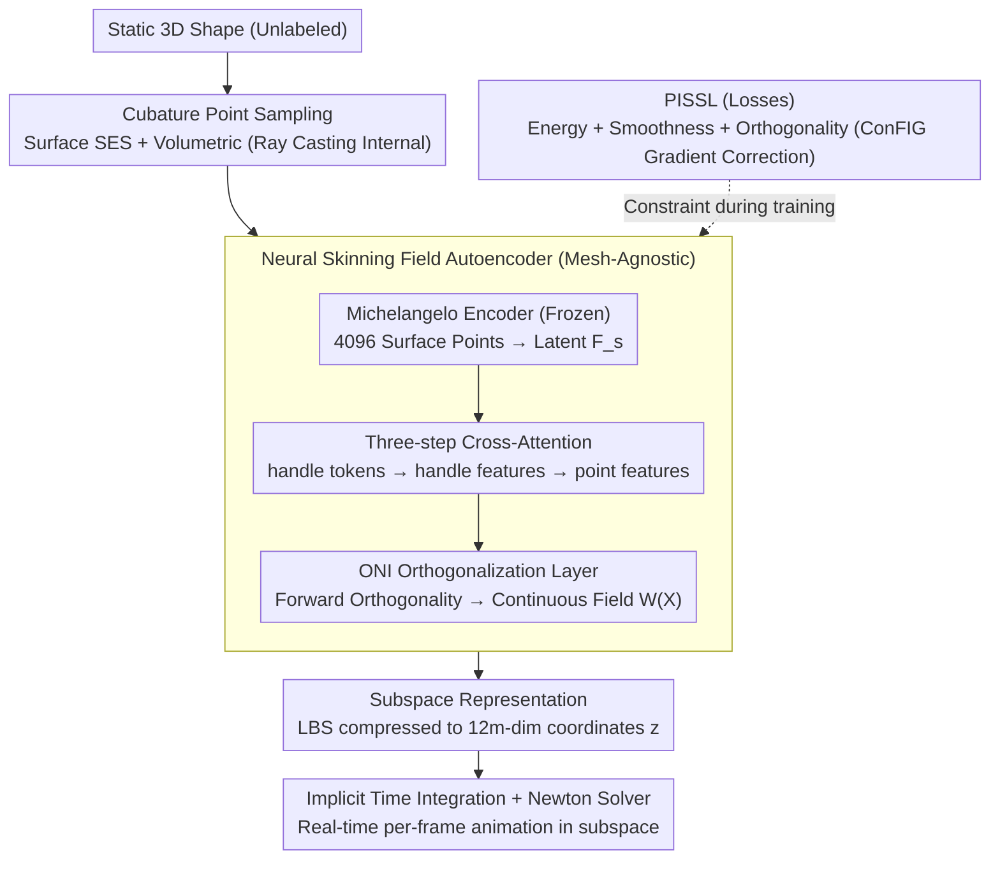

# PhysSkin: Real-Time and Generalizable Physics-Based Skin Simulation

**Conference**: CVPR 2026  
**arXiv**: [2603.23194](https://arxiv.org/abs/2603.23194)  
**Code**: [Project Page](https://zju3dv.github.io/PhysSkin/)  
**Area**: Physics Simulation / 3D Animation  
**Keywords**: Physics Animation, Neural Skinning Field, Self-supervised Learning, Subspace Physics, Linear Blend Skinning

## TL;DR

Ours proposes PhysSkin, a generalized physics-informed framework that directly learns continuous skinning weight fields from static 3D geometries via a neural skinning field autoencoder. Using physics-informed self-supervised learning strategies (energy minimization + smoothness + orthogonality constraints), it achieves real-time physics-based animation across shapes and discretizations without any labeled data or simulation trajectories.

## Background & Motivation

Real-time physics-based animation is a long-standing goal in computer vision and graphics, vital for VR/AR, character animation, and interactive digital content creation. Current methods face significant hurdles:

**Classical Subspace Methods** (e.g., full-space FEM/MPM): Solving large-scale non-linear optimizations in high-dimensional full space is computationally expensive. Even with subspace reduction, the mapping matrices must be optimized for specific mesh topologies, preventing generalization.

**Neural Subspace Methods** (e.g., CROM, Simplicits): These utilize neural networks to learn subspace mappings, but typically require separate training for each individual object, lacking cross-shape generalization.

**Supervised Skinning Methods** (e.g., RigNet, Anymate): These learn skeletons and skinning weights from expert-labeled data. However, data labeling is costly, physical constraints are often absent, and they frequently rely on category-specific priors (e.g., human/animal skeleton templates).

**Core Problem**: How to learn a **physics-consistent, cross-shape generalizable, and discretization-agnostic** deformation subspace mapping without relying on any labeled data?

## Method

### Overall Architecture

PhysSkin addresses specific limitations: physics-based animation is either slow (full-space solvers), non-generalizable (neural subspace methods), or dependent on expensive labels (supervised skinning). The mechanism returns to Linear Blend Skinning (LBS)—representing complex full-space deformations as weighted combinations of a few handle transformations—but utilizes a neural network to learn the "weights" (continuous skinning fields) via self-supervision.

The pipeline operates as follows: First, surface points and volume cubature points are sampled from a static 3D shape. Surface points are fed into a Transformer encoder to obtain a latent shape representation. This representation is passed through a cross-attention decoder to output a continuous skinning weight field for any point in space. During training, no ground-truth is used; the field is constrained by physics-informed self-supervised losses (energy minimization + smoothness + orthogonality). At inference, given a new shape, the skinning field is obtained in a single forward pass, and the dynamics equations are solved in the low-dimensional subspace for real-time animation. The key is that the subspace dimension $12m$ ($m$ handles with 12 affine parameters each) is much smaller than the full space $3n$, allowing Newton's method to converge rapidly.

### Key Designs

**1. Skinning Field Subspace Representation: Compressing Deformations via LBS**

Solving non-linear dynamics in the full space $\mathbb{R}^{3n}$ is incompatible with real-time requirements. PhysSkin adopts the LBS approach to express full-space displacement as a weighted sum of $m$ affine transformations:

$$\phi(\mathbf{X}, \mathbf{z}) = \mathbf{X} + \sum_{i=1}^m W_i(\mathbf{X}) \mathbf{Z}_i \begin{bmatrix}\mathbf{X}\\1\end{bmatrix}$$

Here $W_i(\mathbf{X})$ represents the skinning weight of handle $i$ at point $\mathbf{X}$, and $\mathbf{Z}_i \in \mathbb{R}^{3\times 4}$ is its affine transformation. All handle transformations are concatenated into subspace coordinates $\mathbf{z} \in \mathbb{R}^{12m}$, where $m \ll n$. Dynamics are solved using implicit time integration:

$$\mathbf{z}_{t+1} = \arg\min_{\mathbf{z}} \frac{1}{2h^2}\|\mathbf{z} - 2\mathbf{z}_t + \mathbf{z}_{t-1}\|_\mathbf{M}^2 + E_{pot}(\phi(\mathbf{X}, \mathbf{z}))$$

By reducing optimization variables from $3n$ to $12m$, Newton's method achieves real-time speeds. The skinning field $W_i$ functions as the "basis functions" for the subspace mapping.

**2. Neural Skinning Field Autoencoder: Mesh-Agnostic Decoding via 3-step Cross-Attention**

The skinning weight field $W_i(\mathbf{X})$ cannot be tied to a fixed mesh topology. PhysSkin uses an encoder-decoder to create a continuous field queryable at any spatial point. The Michelangelo Transformer point cloud encoder extracts shape representation $\mathbf{F}_s \in \mathbb{R}^{256 \times 768}$ from 4096 surface points. This encoder is pre-trained on ShapeNet for SDF reconstruction and is frozen during PhysSkin training.

The decoder uses a three-step cross-attention hierarchy: First, $m$ learnable handle tokens $\mathbf{Q}_h$ extract handle latent representations $\mathbf{F}_h$ from $\mathbf{F}_s$. Second, query points $\mathbf{X}$ extract point-wise skinning features $\mathbf{F}_p$ from $\mathbf{F}_h$. Third, a ResNet-style MLP decodes features into skinning weights $W(\mathbf{X}) \in \mathbb{R}^m$. This "Shape → handles → points" pipeline is naturally mesh-agnostic.

**3. Cubature Point Sampling: Replacing Fixed Topologies with Point Sets**

To achieve discretization independence, PhysSkin samples two types of points: surface points via Sharp Edge Sampling (SES) for geometric details, and volumetric points via ray tracing internal points of voxelized watertight meshes. In each training batch, 1000 points are randomly sampled. Volumetric points are essential to constrain internal deformations (e.g., physical volume preservation) that cannot be captured by surface points alone.

**4. ONI Orthogonalization Layer: Driving Orthogonality in the Forward Pass**

Skinning modes should be orthogonal to prevent redundancy and ill-conditioned subspace bases. PhysSkin inserts an Orthogonalization by Newton's Iteration (ONI) module at the final MLP layer to push the output towards orthogonality during inference. This is paired with ELU activation to allow signed weights, providing greater expressive power. Structural orthogonality reduces the optimization pressure on the loss functions.

### Loss & Training

The network is trained via Physics-Informed Self-Supervised Learning (PISSL). **Potential energy minimization** $\mathcal{L}_{pot}$ samples subspace coordinates $\mathbf{z}$ from a Gaussian distribution to minimize expected potential energy, encouraging the skinning field to encode low-energy deformation modes. **Spatial smoothness** $\mathcal{L}_{smooth}$ penalizes gradients of the skinning weights to avoid artifacts. **Orthogonality constraint** $\mathcal{L}_{orth}$ enforces an orthogonal basis using squared sums of dot products between modes, paired with on-the-fly $\ell_2$ column normalization to prevent numerical drift.

To handle conflicting gradients between these losses, Ours introduces **ConFIG** to correct destructive interference, aligning the gradients toward a balanced descent direction. The total loss is $\mathcal{L} = \mathcal{L}_{smooth} + \lambda_{pot}\mathcal{L}_{pot} + \lambda_{orth}\mathcal{L}_{orth}$.

## Key Experimental Results

### Main Results

**Evaluation on RigNet Dataset (Skinning Quality)**

| Method | Orthogonality $\Omega_{orth} \downarrow$ | Cond. Number $\kappa_{log} \downarrow$ | Spec. Entropy $H_{spec} \uparrow$ |
|------|------|------|------|
| RigNet | 0.5324 | 2.7997 | 0.9762 |
| M-I-A | 1.4098 | 27.7357 | 0.7224 |
| Anymate | 1.5737 | 2.6093 | 0.9682 |
| Puppeteer | 0.5615 | 5.5605 | 0.9798 |
| **PhysSkin (Ours)** | **0.0033** | **1.0453** | **0.9999** |

**Real-Time Animation Efficiency**

| 3D Shape | Vertices | FEM per step (ms) | MPM per step (ms) | **PhysSkin (Ours) (ms)** |
|---------|--------|--------------|-------------|---------------------|
| Airplane | 10K | 79.83 | 141.83 | **12.26** |
| Bag | 121K | 3012.47 | 233.79 | **13.39** |
| Camera | 80K | 2121.02 | 203.38 | **12.52** |
| Pillow | 127K | 3170.93 | 251.81 | **13.74** |

Ours is 6.5-230x faster than FEM and 11.5-18.3x faster than MPM, with performance being nearly independent of vertex count.

### Ablation Study

| Config | $\Omega_{orth} \times 10^{-2} \downarrow$ | $\kappa_{log} \downarrow$ | $H_{spec} \uparrow$ |
|------|------|------|------|
| w/o Weight Normalization | 6.5533 | 8.5492 | 0.8113 |
| w/o ONI Layer | 0.0081 | 1.0844 | 0.9997 |
| w/o ConFIG | 8.9247 | 11.8595 | 0.7594 |
| **Full Model** | **0.0033** | **1.0453** | **0.9999** |

### Key Findings

1. **ConFIG is critical**: Removing it degrades orthogonality by ~2700x, proving gradient conflict is a core optimization challenge.
2. **Efficiency is decoupled from vertex count**: Scaling from 10K to 127K vertices only increases per-step time from 12.26ms to 13.74ms.
3. **Single model generalization**: A single PhysSkin model generalizes across various categories, whereas Simplicits requires per-object training.

## Highlights & Insights

1. **Label-free Physics Skinning**: No simulation trajectories or expert labels are required, significantly lowering the barrier for 3D animation.
2. **Balanced Optimization**: The combination of on-the-fly normalization and ConFIG gradient correction addresses fundamental conflicts in multi-constraint physical learning.
3. **Continuous Fields**: Being discretization-agnostic, the model can be applied to different resolutions or even 3D Gaussian Splatting models.

## Limitations & Future Work

1. **Lack of Semantic Priors**: Weights are driven purely by physics; incorporating semantic information (e.g., joint locations) might improve complex cases.
2. **Fixed Handle Count**: The number of handles $m$ limits expressivity; adaptive selection remains an open question.
3. **Simplified Materials**: Current support is limited to hyperelastic materials (Neo-Hookean), excluding plasticity or fracture.

## Related Work & Insights

- **Vs. Simplicits**: Ours improves upon the subspace field concept by adding generalization (single model) and training stability (ConFIG).
- **Vs. Anymate**: Anymate relies on supervised learning from labels, whereas Ours is entirely self-supervised and outputs a continuous field rather than discrete weights.

## Rating

- **Novelty**: ⭐⭐⭐⭐⭐
- **Experimental Thoroughness**: ⭐⭐⭐⭐
- **Writing Quality**: ⭐⭐⭐⭐
- **Value**: ⭐⭐⭐⭐⭐

<!-- RELATED:START -->

## Related Papers

- [\[CVPR 2026\] Continuous Exposure-Time Modeling for Realistic Atmospheric Turbulence Synthesis](continuous_exposure-time_modeling_for_realistic_atmospheric_turbulence_synthesis.md)
- [\[ICLR 2026\] Sublinear Time Quantum Algorithm for Attention Approximation](../../ICLR2026/physics/sublinear_time_quantum_algorithm_for_attention_approximation.md)
- [\[NeurIPS 2025\] Simulation-Based Inference for Neutrino Interaction Model Parameter Tuning](../../NeurIPS2025/physics/simulation-based_inference_for_neutrino_interaction_model_parameter_tuning.md)
- [\[CVPR 2026\] AeroAgent: A Vision-Physics-Decision Framework for Aerodynamic Vehicle Design](aeroagent_a_vision-physics-decision_framework_for_aerodynamic_vehicle_design.md)
- [\[CVPR 2026\] AviaSafe: A Physics-Informed Data-Driven Model for Aviation Safety-Critical Cloud Forecasts](aviasafe_a_physics-informed_data-driven_model_for_aviation_safety-critical_cloud.md)

<!-- RELATED:END -->
