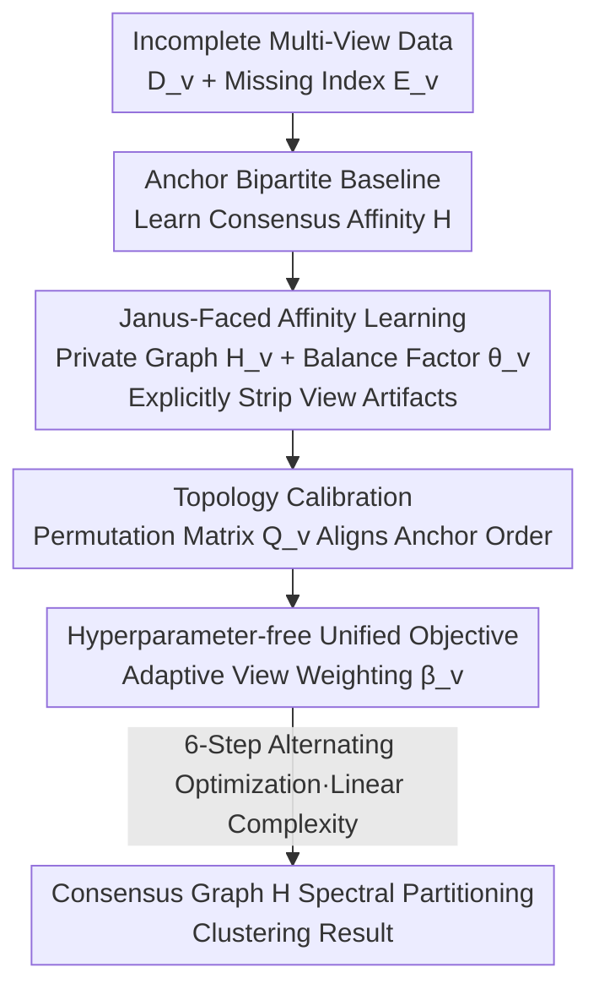

# Plug-and-Play Incomplete Multi-View Clustering via Janus-Faced Affinity Learning with Topology Harmonization

**Conference**: CVPR 2026  
**Paper**: [CVF Open Access](https://openaccess.thecvf.com/content/CVPR2026/html/Yu_Plug-and-Play_Incomplete_Multi-View_Clustering_via_Janus-Faced_Affinity_Learning_with_Topology_CVPR_2026_paper.html)  
**Code**: None  
**Area**: Incomplete Multi-View Clustering  
**Keywords**: Incomplete Multi-View Clustering, Anchor Graph, Janus-Faced Affinity Learning, Topology Calibration, Hyperparameter-free  

## TL;DR
PJFTH proposes a **hyperparameter-free** plug-and-play framework for incomplete multi-view clustering. It utilizes "Janus-faced affinity learning" to explicitly strip view-exclusive artifacts before fusing the consensus graph and "topology calibration" to align disordered anchor sequences across views. The objective is optimized via a six-step alternating process with linear complexity $n$ relative to the sample size, achieving competitive performance on six datasets with varying missing rates.

## Background & Motivation
**Background**: Multi-view data (multi-modal/multi-source) is ubiquitous in reality, but sensor failures, transmission errors, and collection omissions lead to missing samples in certain views, giving rise to **Incomplete Multi-View Clustering (IMVC)**. Recent mainstream approaches utilize "anchor-sample" bipartite affinity graphs instead of $n \times n$ self-representation matrices to learn a consensus affinity graph $H$, followed by spectral partitioning for clustering.

**Limitations of Prior Work**: The authors identify three common shortcomings in existing IMVC methods. First, they **ignore the interference of view-exclusive artifacts** during consensus representation learning—each view contains biases unrelated to consensus semantics (e.g., missing-induced bias, view-specific noise), which pollute similarity measures when fused directly. Second, the **anchor order is inconsistent** across views: due to unsupervised sampling, the arrangement of anchors in different views is misaligned, disrupting semantic correspondence in the graph structure and harming performance. Third, most methods rely on **meticulously tuned regularization hyperparameters** $\eta$, which leads to high deployment costs and poor practicality.

**Key Challenge**: Achieving true separation between "fusing multi-view information" and "suppressing negative effects of missing/private artifacts" to prevent impurities from entering the consensus graph, while overcoming the **permutation freedom** of anchor representations that undermines the foundation of cross-view fusion.

**Goal**: To simultaneously address in a unified framework: (a) explicit modeling and stripping of view-exclusive artifacts; (b) synchronization of cross-view anchor sequences; and (c) elimination of all regularization hyperparameters to achieve plug-and-play functionality.

**Key Insight**: The authors observe that artifact interference stems from "private information mixing into consensus learning." Consequently, they **learn a private graph $H_v$ separately for each view**, using a balance factor $\theta_v$ to determine the contribution of the consensus graph $H$ versus the private graph $H_v$—much like the Janus character, facing consensus on one side and private info on the other—thereby explicitly "absorbing" the artifacts.

**Core Idea**: Use Janus-faced decomposition of "consensus graph + view-exclusive artifact graph" to explicitly exclude interference, employ "permutation matrices with unary encoding constraints" to align anchor topology, and maintain a hyperparameter-free objective optimized in six alternating steps to ensure linear complexity.

## Method

### Overall Architecture
The input to PJFTH consists of multi-view datasets with missing samples $\{D_v\in\mathbb{R}^{d_v\times n}\}_{v=1}^V$ and missing-indicator vectors $\{m_v\}$. The output is the clustering result obtained by spectral partitioning of the consensus affinity graph $H$. The pipeline introduces two layers of enhancements over the anchor bipartite graph framework: first stripping view-specific artifacts via $H_v$ (Janus-faced learning), then aligning anchor sequences via permutation matrices $Q_v$ (topology calibration). Finally, a **hyperparameter-free** unified objective incorporates view weights $\beta_v$, solved through six-step alternating iterations until convergence.

The IMVC baseline using full-scale self-representation $\min_{W_v,W}\sum_v\|D_vE_v-D_vE_vW_v\|_F^2+\eta\psi(W,\cdot)$ entails at least cubic complexity and structural distortion during fusion. Thus, **anchor consensus learning** is adopted: using anchors $C_v\in\mathbb{R}^{d_v\times m}$ ($m \ll n$) to represent the data and learning consensus affinity $H\in\mathbb{R}^{m\times n}$:

$$\min_{H}\ \sum_{v=1}^V \|D_vE_v - C_vHE_v\|_F^2 + \eta\phi(H),\quad \text{s.t. } H^\top\mathbf{1}_m=\mathbf{1}_n,\ H\ge 0$$

Here $E_v\in\mathbb{R}^{n\times n_v}$ is an indicator matrix mapping observed samples back to full scale. While bipartite graphs reduce costs and distortion, they **fail to handle artifact interference** or **align anchor sequences**—the two gaps PJFTH bridges.

### Key Designs

**1. Janus-Faced Affinity Learning: Stripping interference via private artifact graphs**

To address "artifact pollution in consensus graphs," the authors learn an additional **view-exclusive artifact matrix** $H_v\in\mathbb{R}^{m\times n}$ for each view to capture specific interference (missing-induced bias, signals unrelated to consensus). A **balance factor** $\theta_v\in[0,1]$ allocates contributions between consensus and private components:

$$\min_{H,H_v,\theta_v}\ \sum_{v=1}^V \big\|D_vE_v - \theta_v C_v H E_v + (\theta_v-1)C_v H_v E_v\big\|_F^2$$

Subject to $0\le\theta_v\le1$, $H^\top\mathbf{1}_m=\mathbf{1}_n$, $H\ge0$, $H_v^\top\mathbf{1}_m=\mathbf{1}_n$, $H_v\ge0$. The intuition is: when reconstructing $D_vE_v$, part explained by consensus is handled by $\theta_v C_v H$, while the remaining private artifacts are absorbed by $(\theta_v-1)C_v H_v$. A $\theta_v$ closer to 1 indicates a "cleaner" view aligned with consensus. This dual modeling ensures $H$ learns a purified, robust similarity—unlike prior methods where artifacts are implicitly mixed.

**2. Topology Calibration: Aligning cross-view anchor order with 0/1 permutation matrices**

To resolve "disordered anchor sequences," the authors insert a **permutation transformation matrix** $Q_v\in\{0,1\}^{m\times m}$ between anchors and the consensus graph to align the topology of the $v$-th view to a unified order:

$$\min_{H,Q_v}\ \sum_{v=1}^V \big\|D_vE_v - C_v Q_v H E_v\big\|_F^2,\quad \text{s.t. } Q_v^\top\mathbf{1}_m=\mathbf{1}_m,\ Q_v\mathbf{1}_m=\mathbf{1}_m,\ Q_v\in\{0,1\}$$

The **unary encoding constraint** (doubly stochastic + binary) ensures $Q_v$ is exactly a permutation matrix: it only **reorders anchors without changing their values**. This step precedes similarity integration, restoring semantic correspondence across views and eliminating permutation ambiguity from unsupervised sampling.

**3. Hyperparameter-free Unified Objective: Self-adaptive view weighting**

To eliminate dependence on $\eta$, Janus-faced learning and topology calibration are merged into a unified objective with **weight coefficients** $\beta_v$:

$$\min_{\Omega}\ \sum_{v=1}^V \beta_v^2 \big\|D_vE_v - \theta_v C_v Q_v H E_v + (\theta_v-1)C_v H_v E_v\big\|_F^2$$

Subject to $\beta\ge0, \beta^\top\mathbf{1}=1, 0\le\theta_v\le1, C_v^\top C_v=I_m$, and respective normalization/permutation constraints for $H, H_v, Q_v$, where $\Omega=\{C_v,Q_v,H,H_v,\theta_v,\beta_v\}$. This objective contains **no $\eta$-type regularization hyperparameters**—artifact suppression ($\theta_v$) and view importance ($\beta_v$) are learned adaptively from the data. $\beta_v$ has a closed-form solution $\beta_v = \frac{1/q_v}{\sum_{v}1/q_v}$ ($q_v$ is the reconstruction residual), naturally assigning higher weights to more reliable views.

**4. 6-Step Alternating Optimization: Achieving linear complexity via diagonalization**

The objective is solved by alternating minimization: $C_v \to Q_v \to H \to H_v \to \theta_v \to \beta_v$. In naive implementations, intermediate terms like $D_vE_v(\cdot)^\top$ approach $O(n^2)$. The authors utilize the observation that **$E_vE_v^\top$ is a diagonal matrix**, allowing $D_vE_vE_v^\top$ to be written as the Hadamard product $D_v \odot B_v$. With this trick, every sub-problem reaches linear cost: $C_v$ via SVD is $O(m^2n)$, $Q_v$ via vectorized binary programming is $O(n)$, and $H, H_v, \theta_v, \beta_v$ all have closed-form solutions or $O(n)$ optimization. The overall **time and space complexity is linear with respect to $n$**, enabling the model to handle 100k samples (YOUBESEL) where competitors OOM.

### Loss & Training
The framework utilizes only the unified objective in Eq. (5) without auxiliary terms. Optimization follows Algorithm 1 until convergence, after which spectral clustering is performed on $H$. $C_v$ is constrained by $C_v^\top C_v=I_m$ to enhance anchor discriminability.

## Key Experimental Results

### Main Results
On 6 datasets (230 to 101,499 samples) across missing rates of 30%/60%/80%, PJFTH was compared with 12 IMVC methods. PJFTH requires **0** hyperparameters (NH). Representative results at 60% missing rate:

| Dataset (60% Miss) | Metric | PJFTH (Ours) | Runner-up | Gain |
|--------|------|------|----------|------|
| ORLR | ACC | **52.31** | IVCBG 43.70 | +8.6 |
| ORLR | FSC | **35.84** | IVCBG 34.67 | +1.2 |
| WASHING | FSC | **49.31** | HCLGL 47.11 | +2.2 |
| NUJECTEN | FSC | **23.66** | USETL 18.76 | +4.9 |
| YOUBESEL | FSC | **14.53** | OSIMC 10.59 | +3.9 |

PJFTH achieved the best performance in most scenarios and was the **only method capable of producing results on all 6 datasets**—competitors like HCMSC, LSIVC, and USETL failed (indicated by "-") on large datasets like NUSWDBJ and YOUBESEL, validating the scalability of the linear complexity.

### Ablation Study
OVAL (w/o Janus learning) and OTH (w/o topology calibration) tested at 60% missing rate:

| Config | ORLR ACC | NUJECTEN ACC | YOUBESEL ACC | Note |
|------|---------|--------------|--------------|------|
| OVAL (w/o Janus) | 51.45 | 23.22 | 17.96 | Artifacts not stripped |
| OTH (w/o Topology) | 51.59 | 23.68 | 18.21 | Anchors not aligned |
| Ours (Full) | **52.31** | **24.33** | **18.67** | Both included |

### Key Findings
- **Both modules are effective**: Removing either VAL or TH results in performance drops, indicating they are complementary repairs.
- **Scalability is a major advantage**: PJFTH requires less time and memory, enabling it to process large-scale datasets where others OOM.
- **Sub-optimal performance attribution**: In rare cases where it is not the top performer, the authors attribute this to the two-stage "spectral embedding then clustering" pipeline rather than direct discrete label learning.

## Highlights & Insights
- **Janus Decomposition as Core Innovation**: Using $\theta_v$ to split "consensus" and "exclusive artifacts" provides a dedicated container $H_v$ for noise, preventing implicit pollution of the consensus graph.
- **True Plug-and-Play**: By deriving $\theta_v$ and $\beta_v$ adaptively from data, the model eliminates the tedious hyperparameter tuning of $\eta$, allowing immediate application to new datasets.
- **Reusable Diagonalization Acceleration**: Re-writing matrix products as Hadamard products ($D_v \odot B_v$) to reduce sub-problems from $O(n^2)$ to $O(n)$ is a versatile trick for processing indicator-based multi-view matrices.

## Limitations & Future Work
- **Side effects of orthogonal anchor constraints**: While $C_v^\top C_v=I_m$ improves discriminability, it may cause anchors to deviate from the original data distribution.
- **Two-stage clustering variance**: The pipeline may amplify clustering variance; direct generation of cluster indicators from raw data is a future direction.
- **Personal Observation**: Ablations only tested removing whole modules; the gain of unary constraints on $Q_v$ versus soft alignment was not evaluated, and the interpretability of $\theta_v$ values across clean/noisy views could be further explored.

## Related Work & Insights
- **vs. Subspace/Kernel Methods**: These suffer from high complexity; PJFTH uses anchor bipartite graphs to maintain linear complexity.
- **vs. Standard Anchor Consensus**: Standard methods do not explicitly handle view artifacts or align anchor orders; PJFTH provides these two critical additions while being hyperparameter-free.
- **vs. Completion/Contrastive Methods**: Unlike methods that focus on imputation or generating positive/negative pairs, PJFTH avoids structural distortion by purifying consensus representations and aligning anchor topology.

## Rating
- Novelty: ⭐⭐⭐⭐ (Janus separation + permutation alignment + hyperparameter-free combo is a clear increment)
- Experimental Thoroughness: ⭐⭐⭐⭐ (6 datasets, 12 competitors, scales to 100k samples)
- Writing Quality: ⭐⭐⭐⭐ (Rigorous derivations, though symbol-heavy)
- Value: ⭐⭐⭐⭐ (High practicality for large-scale IMVC deployment)

<!-- RELATED:START -->

## Related Papers

- [\[AAAI 2026\] Deep Incomplete Multi-View Clustering via Hierarchical Imputation and Alignment](../../AAAI2026/others/deep_incomplete_multi-view_clustering_via_hierarchical_imputation_and_alignment.md)
- [\[ICLR 2026\] Aligning Collaborative View Recovery and Tensorial Subspace Learning via Latent Representation for Incomplete Multi-View Clustering](../../ICLR2026/others/aligning_collaborative_view_recovery_and_tensorial_subspace_learning_via_latent_.md)
- [\[CVPR 2026\] EXOTIC: External Vision-driven Incomplete Multi-view Classification](exotic_external_vision-driven_incomplete_multi-view_classification.md)
- [\[CVPR 2026\] Scalable Multi-View Subspace Clustering with Tensorized Anchor Guidance](scalable_multi-view_subspace_clustering_with_tensorized_anchor_guidance.md)
- [\[NeurIPS 2025\] Incomplete Multi-view Clustering via Hierarchical Semantic Alignment and Cooperative Completion](../../NeurIPS2025/others/incomplete_multi-view_clustering_via_hierarchical_semantic_alignment_and_coopera.md)

<!-- RELATED:END -->
