# Progressive Neural Architecture Generation

**Conference**: CVPR 2026  
**Paper**: [CVF Open Access](https://openaccess.thecvf.com/content/CVPR2026/html/Yu_Progressive_Neural_Architecture_Generation_CVPR_2026_paper.html)  
**Code**: None  
**Area**: Neural Architecture Search / AutoML  
**Keywords**: Neural Architecture Generation, Autoregressive Generation, Vector Quantization, Coarse-to-fine, Stepwise Constraints

## TL;DR
PNAG remodels neural architecture "generation" as a coarse-to-fine autoregressive process—each step decodes a **fully functional sub-architecture** using vector quantization, gradually increasing in scale until the target architecture is reached. By applying consistency constraints at every step to ensure validity, it compresses single-generation time by 1300× compared to diffusion-based methods while achieving higher architectural accuracy.

## Background & Motivation

**Background**: Neural Architecture Search (NAS) automates network design using search strategies (reinforcement learning, evolutionary algorithms, Bayesian optimization), but these strategies embed stochastic "exploration" steps, such as random initialization in evolutionary algorithms or random acquisition in Bayesian optimization. Neural Architecture Generation (NAG) aims to use a generative model to **directly produce** high-quality candidate architectures, replacing these uncontrollable random steps. Current mainstream NAG follows two paths: Graph VAE-based methods (reconstructing architectures with complex decoders after latent space sampling) and Graph Diffusion-based methods (denoising iteratively in latent space).

**Limitations of Prior Work**: Both paths suffer from two major flaws. First is **low generation efficiency**—whether it is VAE decoders or multi-step diffusion denoising, both require repeated "network inference" in high-dimensional latent space, incurring massive computational overhead (e.g., 8 seconds to generate one NB201 architecture via diffusion). Second is **poor architectural validity**—existing methods only apply validity constraints at the **final output** step, lacking supervision over the intermediate generation process. Even if diffusion methods refine step-by-step, they only constrain the latent space; without intermediate supervision at the architectural level, errors accumulate, leading to "invalid architectures" that fail to train or run.

**Key Challenge**: The generation process occurs in a **continuous latent space**, but the architecture itself is a **discrete structure**. Using continuous space inference to approximate a discrete object is both slow and fails to guarantee that every step is "legal."

**Goal**: (1) Significantly improve generation efficiency by eliminating expensive network inference; (2) Ensure every intermediate step generates a legal sub-architecture to fundamentally guarantee final validity.

**Key Insight**: The authors observe that the "coarse-to-fine, token-by-token generation" paradigm of Autoregressive (AR) models naturally fits the discreteness of architectures—as long as the "next token" is replaced with the "next **more complex sub-architecture**," generation becomes a clear discrete evolutionary path.

**Core Idea**: Use **discrete autoregression** instead of continuous latent space inference for architecture generation—each AR unit is a complete, trainable sub-architecture, scaled up via vector quantization decoding (rather than network inference), with stepwise consistency constraints to anchor validity.

## Method

### Overall Architecture

PNAG decomposes "generating a target architecture" into $T$ autoregressive steps: step $t$ produces a **complete sub-architecture** $g_t$ containing $n$ operations. As $t$ increases, $n$ grows from a minimum of 3 (input, output + 1 functional op) to a predefined limit $N$, allowing the sub-architecture to evolve from coarse to fine. The entire pipeline follows a VAE "encoding-decoding" skeleton but utilizes autoregressive decoding: a graph encoder first encodes the original architecture $Arc$ into a feature map $e$. At each step, two tasks are performed—**Multi-scale Sub-architecture Quantization (MSQ)** decodes the sub-architecture at the current scale from $e$, and **Stepwise Consistency Constraints (SCC)** penalize deviations from the original architecture. Features from all steps are accumulated to decode the reconstructed architecture $\hat{Arc}$. Crucially, MSQ's codebook lookup and mapping are linear operations and **do not involve network inference**, making it extremely fast. After training this generator, a surrogate model is attached for conditional/transferable generation (stage 2/3) to guide generation toward "high accuracy/low latency" and directly predict quality on unseen tasks.

```mermaid
%%{init: {'flowchart': {'rankSpacing': 24, 'nodeSpacing': 28, 'padding': 6, 'wrappingWidth': 400}}}%%
flowchart TD
    A["Original Architecture Arc"] --> B["Graph Encoder<br/>Feature Map e"]
    B --> C["Multi-scale Sub-architecture Quantization MSQ<br/>Codebook Quantization Decodes Sub-arch g_t<br/>Scale n: 3 → N Gradually Increases"]
    C --> D["Stepwise Consistency Constraints SCC<br/>Penalizes Deviation at Each Step"]
    D -->|Step < T| C
    D -->|Accumulated Feature Decoding| E["Reconstructed Architecture Arc&#770;"]
    E --> F["Conditional / Transferable Generation<br/>Surrogate Model Guided by Target<br/>Predicts Unseen Task Quality"]
    F --> G["Target Architecture"]
```

### Key Designs

**1. Multi-scale Sub-architecture Quantization (MSQ): Replacing Network Inference with Codebook Lookup**

This design directly addresses efficiency: instead of repeated high-dimensional latent space inference, MSQ reframes AR as "predicting the next **scale** of sub-architecture." The process involves two steps. First, **Regional Average Aggregation** scales the encoded feature map $e \in \mathbb{R}^{C\times N\times N}$ to the current scale $e' \in \mathbb{R}^{C\times n\times n}$ ($n < N$), where each new position takes the mean of the corresponding region: $e'_{c,i,j} = \frac{1}{|R_{i,j}|}\sum_{(h,w)\in R_{i,j}} e_{c,h,w}$. Second, **Vector Quantization** is applied: using a learnable codebook $Z \in \mathbb{R}^{V\times C}$ (where $V$ is the number of predefined structural elements) shared across all steps, each vector in $e'$ finds the nearest codeword via Euclidean distance to obtain a code index, which is then decoded into structural elements:

$$o = \Big(\arg\min_{v\in[V]} \lVert \text{lookup}(Z,v) - e' \rVert_2\Big), \qquad g_t = \sum_{i=1}^{n} f(o_i)$$

where $f$ is a linear decoding function mapping indices back to structures. During generation, $n$ increases by 1 per step. Sub-architecture features are linearly interpolated back to $N \times N$, accumulated into $\hat e$, and restored by decoder $D$. Since codebook lookups and mappings are simple linear operations avoiding **any network forward pass**, generation time is reduced from 8s to 0.006s.

**2. Stepwise Consistency Constraints (SCC): Supervising Every Intermediate Sub-architecture**

This addresses validity. Existing methods (including diffusion) only calculate reconstruction loss $L = \lVert Arc - \hat{Arc}\rVert_2 + \lVert e - \hat e\rVert_2$ at the last step, leaving intermediate steps unmonitored and allowing errors to accumulate. SCC introduces a regularization term at **every intermediate step** $t$: it bilinearly interpolates the sub-architecture feature $e'_t$ back to the original size and penalizes its deviation from the original encoding $e$:

$$R_{SCC} = \lambda \sum_{t=1}^{T} \lVert e - \text{interpolate}(e'_t, (N,N)) \rVert_2$$

The final training objective combines the final-step and stepwise constraints: $L = \lVert Arc - \hat{Arc}\rVert_2 + \lVert e - \hat e\rVert_2 + R_{SCC}$. The authors provide theoretical support via **Lyapunov Stability**: treating "deviation energy" $V(e'_t)=\lVert e - e'_t\rVert_2^2$ as a Lyapunov function, as long as the learning rate satisfies $\alpha < -\,2(e-e'_t)^\top \nabla_{e'_t}L(e'_t)\,/\,\lVert \nabla_{e'_t}L(e'_t)\rVert_2^2$, then $\Delta V(e'_t)<0$. This ensures the deviation energy decreases monotonically, making the generation trajectory converge asymptotically to a legal target.

**3. Conditional / Transferable Generation: Meta-Learning for Architecture Evaluation**

Basic NAG is unconditional and lacks precision. PNAG attaches a **surrogate model** trained as a meta-learning task—rather than learning a fixed mapping $P(y\mid D,\hat{Arc})$ for a single task $D$, it learns "how to evaluate architecture quality" as transferable meta-knowledge across multiple tasks, enabling direct quality prediction for unseen tasks $\tilde D$. The transferable objective is $p\big(g_1,\dots,g_T \mid P(y\mid\tilde D,\hat{Arc})\big)=\prod_{t=1}^{T} p\big(g_t\mid g_{1:t-1}, P(y\mid\tilde D,\hat{Arc})\big)$. The benefit is that only the surrogate model needs to be replaced when switching tasks, **without retraining the generator**.

### Loss & Training
Two-stage training: Stage 1 trains the VAE (simple graph encoder + two-layer linear decoder), where the autoregressive process introduces no extra models. Stage 2 trains the decoder-only transformer for conditional generation. Optimization uses AdamW with learning rates of 0.0001 / 0.001, weight decay 0.0001, batch size 256, over 300 epochs.

## Key Experimental Results

### Main Results
Evaluated on NB201, MBV3, and DARTS search spaces across four downstream datasets. On NB201, PNAG achieves state-of-the-art accuracy on CIFAR-10/100 using only 1 architecture; on harder datasets like Aircraft and Oxford-IIIT Pets, it shows an average Gain of **+8.43% / +5.07%** over transferable baselines.

| Space / Dataset | Measure | Ours | Prev. SOTA | Note |
|--------|------|------|----------|------|
| NB201 / Aircraft | Acc(%) | **66.99** | 59.15 (TNAS) | Only 1 arch trained |
| NB201 / Oxford Pets | Acc(%) | **45.35** | 41.80 (DiffusionNAG) | Only 2 archs trained |
| MBV3 / Aircraft | Acc(%) | **84.55** | 82.31 (TNAS) | +2.24% Gain |
| DARTS / CIFAR-10 | Acc(%) | **97.93** | 97.58 (OStr-DARTS) | 0.03 GPU·Day cost |
| DARTS / ImageNet | Top-5(%) | **93.0** | 93.0 (OStr-DARTS) | Lowest cost |
| AutoFormer / Tiny | Acc(%) | **76.6** | 76.4 (AZ-NAS) | 6.03M params (ViT) |

### Efficiency & Validity
Single generation takes 0.006s, a **1300× speedup** over DiffusionNAG (8s). On CIFAR-10, full generation takes 8s vs DiffusionNAG (150s) or VAE (20s). Reliability metrics for 1000 generated architectures are shown below.

| Metrics (1k archs) | Space | PNAG | DiffusionNAG | POMONAG |
|------|------|------|------|------|
| Validity(%) ↑ | NB201 | **100.0** | 98.97 | 99.97 |
| Uniqueness(%) ↑ | NB201 | **99.70** | 98.70 | 34.14 |
| Novelty(%) ↑ | NB201 | **59.34** | 49.20 | 37.41 |
| Validity(%) ↑ | MBV3 | **100.0** | 99.09 | 72.58 |

### Ablation Study
| Config | Key Metric | Description |
|------|---------|------|
| SCC step = 0 | Lowest Validity / Acc | No stepwise constraints, poorest validity |
| SCC step = t | Validity / Acc rise with t | More constrained steps improve stability |
| Full SCC | Validity 100% | Stepwise consistency ensures 100% validity |

### Key Findings
- **SCC is the key to validity**: Restricting constraints to the final step results in poor performance; intermediate supervision is essential to prevent error accumulation.
- **Efficiency gain from "Zero-Inference"**: MSQ uses codebook lookups instead of latent space inference, which is the root cause of the 1300× speedup.
- **Strong Transferability**: Switching tasks only require changing the surrogate model; targets like Clean/APGD/Blur perform best when guided by their respective agents.
- **ViT Scalability**: PNAG generates ViTs in the AutoFormer space, with the Tiny setting achieving 76.6%, surpassing all baselines.

## Highlights & Insights
- **Reframing NAG as "next-scale prediction"**: Each AR unit is a complete sub-architecture that grows from coarse to fine. This aligns discrete autoregression with architectural discreteness more elegantly than continuous approximations.
- **"Network-Agnostic" Generation**: The 1300× speedup is structural, achieved by removing network inference from the generation loop. This technique is applicable to any scenario producing discrete structures via generative models.
- **Lyapunov Theory for Stability**: Formalizing "intermediate sub-architectures approaching the input" as monotonic energy decay provides theoretical grounding for stepwise constraints.

## Limitations & Future Work
- SCC penalizes deviation from the **original input architecture**—while logical for reconstructing known good architectures, this might limit exploration diversity when generating novel structures outside the training set.
- Some data organization in the adaptation tables (e.g., Table 5) appears slightly fragmented; specific protocols should refer to the original text.
- The linear growth of sub-architecture scale is a preset strategy; whether this is optimal across all spaces or if adaptive steps could be used remains an open question.

## Related Work & Insights
- **vs. Graph VAE (e.g., Hemmi)**: VAEs reconstruct architectures in one go after sampling in continuous space; PNAG uses discrete AR to generate scale-by-scale, avoiding heavy high-dim inference.
- **vs. Diffusion (DiffusionNAG)**: Diffusion relies on multi-step latent denoising with final-step constraints; PNAG uses linear MSQ generation and architectural-level SCC, yielding much higher validity and speed.
- **vs. Visual Autoregressive (VAR)**: PNAG adopts the "next-scale prediction" paradigm ([43]) but adapts it from image tokens to complete sub-architectures with task-specific SCC.

## Rating
- Novelty: ⭐⭐⭐⭐⭐ "Next-scale" prediction + VQ in NAG is an innovative approach to discreteness.
- Experimental Thoroughness: ⭐⭐⭐⭐ Coverage of multiple spaces and ViT is solid; some table organizations are complex.
- Writing Quality: ⭐⭐⭐⭐ Clear logic from motivation to theory; Lyapunov proof is a highlight.
- Value: ⭐⭐⭐⭐⭐ 1300× speedup and 100% validity offer immediate practical value for replacing random search components in NAS.

## Related Papers

- [\[CVPR 2026\] AutoRegressive Generation with B-rep Holistic Token Sequence Representation](autoregressive_generation_with_b-rep_holistic_token_sequence_representation.md)
- [\[ICCV 2025\] Loss Functions for Predictor-based Neural Architecture Search](../../ICCV2025/others/loss_functions_for_predictor-based_neural_architecture_search.md)
- [\[CVPR 2025\] Subnet-Aware Dynamic Supernet Training for Neural Architecture Search](../../CVPR2025/others/subnet-aware_dynamic_supernet_training_for_neural_architecture_search.md)
- [\[CVPR 2026\] Adapting In-context Generation for Enhanced Composed Image Retrieval](adapting_in-context_generation_for_enhanced_composed_image_retrieval.md)
- [\[CVPR 2026\] Bidirectional Query-Driven Generation of Parametric CAD Sketch](bidirectional_query-driven_generation_of_parametric_cad_sketch.md)

<!-- RELATED:END -->

<!-- RELATED:START -->

## Related Papers

- [\[CVPR 2026\] Adapting In-context Generation for Enhanced Composed Image Retrieval](adapting_in-context_generation_for_enhanced_composed_image_retrieval.md)
- [\[CVPR 2026\] Bidirectional Query-Driven Generation of Parametric CAD Sketch](bidirectional_query-driven_generation_of_parametric_cad_sketch.md)
- [\[CVPR 2026\] CAD-Refiner: A Unified Framework for CAD Generation and Iterative Editing](cad-refiner_a_unified_framework_for_cad_generation_and_iterative_editing.md)
- [\[CVPR 2026\] Neural Mixture Density Processes](neural_mixture_density_processes.md)
- [\[CVPR 2026\] Neural Collapse in Test-Time Adaptation](neural_collapse_in_test-time_adaptation.md)

<!-- RELATED:END -->
