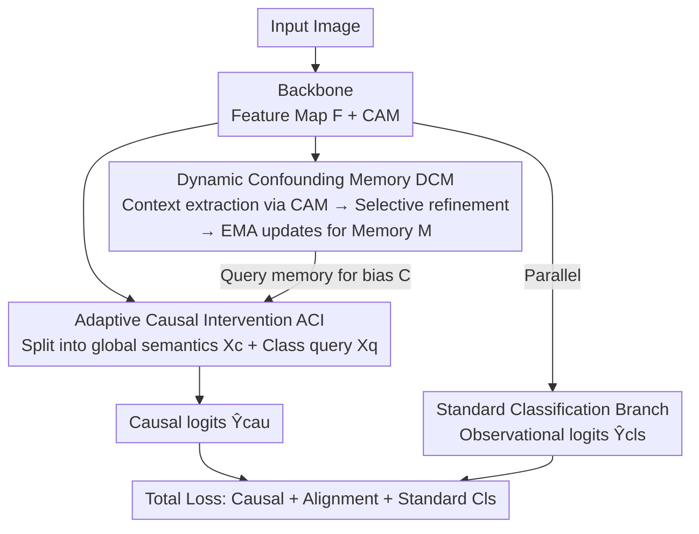

# Prototype-based Causal Intervention for Multi-Label Image Classification

**Conference**: CVPR 2026  
**Paper**: [CVF Open Access](https://openaccess.thecvf.com/content/CVPR2026/html/Li_Prototype-based_Causal_Intervention_for_Multi-Label_Image_Classification_CVPR_2026_paper.html)  
**Code**: https://github.com/JustinLiam/ProCI  
**Area**: Multi-Label Image Classification / Causal Intervention  
**Keywords**: Backdoor Adjustment, Confounder, Learnable Prototypes, Multi-Label Classification, De-biasing

## TL;DR
ProCI models the "confounding context" in multi-label classification as a set of **learnable category-level prototypes**, storing them in a dynamic memory and using an adaptive module to approximate Pearl's backdoor adjustment in the feature space. Relying **only on image-level labels**, it eliminates reliance on spurious co-occurrences, improving F2CIW by +5.44 points on the heavily confounded industrial dataset Sewer-ML.

## Background & Motivation
**Background**: Modern Multi-Label Image Classification (MLC) achieves high mAP on standard benchmarks like MS-COCO and VOC. However, models often exploit **spurious correlations**—for instance, if "sofa" and "TV" frequently co-occur in the training set, the model learns to predict "TV" whenever it sees a sofa. When deployed in real-world scenarios with different distributions, these "shortcuts" fail, leading to performance collapse.

**Limitations of Prior Work**: Using causal inference for de-confounding is a principled approach, but existing methods face two deployment hurdles. First, many interventions **depend on instance-level bounding boxes** to isolate confounding features, whereas large-scale industrial data often only provides image-level labels. Second, dominant approaches approximate confounders as a **static dictionary** calculated once before training (e.g., averaged box features). This dictionary overfits to the statistical bias of the construction set and cannot adapt to feature space shifts during training or represent complex, unforeseen biases.

**Key Challenge**: Backdoor adjustment $P(Y|do(X)) = \sum_z P(Y|X,z)P(z)$ requires summing over all confounders $Z$. Since $Z$ is unobserved and high-dimensional, direct marginalization is intractable. Consequently, researchers either resort to box supervision or static dictionaries—both of which conflict with the reality of "image-level labels only + dynamic bias."

**Goal**: Design a framework that dynamically learns confounder representations and performs backdoor adjustment in the feature space using **only image-level labels**.

**Key Insight**: The authors adapt the "prototype" concept from few-shot learning but apply it in reverse. While traditional prototypes represent the **discriminative essence** of a class, ProCI uses prototypes to represent the **co-occurring context bias** of a class. The key observation is that under co-occurrence bias, Class Activation Maps (CAMs) are "polluted" signals that inevitably mix target features with contextual cues. Therefore, context prototypes can be distilled from CAMs.

**Core Idea**: Construct confounders as **learnable category-level context prototypes** stored in a memory that updates dynamically throughout training. These are used to generate sample-specific bias vectors for feature correction, replacing "static dictionaries + box supervision" with "dynamic learnable prototypes."

## Method

### Overall Architecture
ProCI addresses how to approximate the intractable $P(Y|do(X))$ when only image-level labels are available. The framework consists of two collaborative causal modules and an auxiliary classification branch. The **Dynamic Confounding Memory (DCM)** handles "confounder modeling" by extracting context features via CAMs and updating a confounding memory $M$ through a selective refiner. The **Adaptive Causal Intervention (ACI)** performs "de-confounding" by decoupling image representations into global semantic features and category queries, retrieving sample-specific confounding representations from memory, and fusing them to produce causal logits. Concurrently, a **standard classification branch** learns the observational probability $P(Y|X)$ to stabilize training.

### Key Designs

**1. Dynamic Confounding Memory DCM: Replacing Static Dictionaries with Learnable Prototypes**

This design directly addresses the "static dictionary" limitation. ProCI maintains a learnable memory $M \in \mathbb{R}^{K\times D}$ ($K$ classes, each with a $D$-dimensional context prototype). Instead of explicitly modeling unobserved $Z$, it approximates its **observable effect**—the context patterns that stably co-occur with a class. First, context features are extracted using CAM-weighted pooling: $Z_{b,k}=\sum_{h,w}\frac{\mathrm{ReLU}(A[b,k,h,w])}{\sum_{h',w'}\mathrm{ReLU}(A[b,k,h',w'])}\cdot F_b[:,h,w]$. This captures dominant patterns co-occurring with class $k$.

To handle noisy CAM features, a **Selective Prototype Refiner** is employed. "Intra-batch selectivity" uses a lightweight class-specific vector $w_k$ to score samples $s_{b,k}=w_k^\top Z_{b,k}$, normalizing them into attention weights $a_{b,k}$ to produce a refined batch prototype $\hat m_k=\sum_{b\in B_k}a_{b,k}Z_{b,k}$. This prioritizes high-quality samples. "Inter-batch stability" uses Exponential Moving Average (EMA) with momentum $\alpha$ to update memory: $M_k \leftarrow \alpha M_{k-1}+(1-\alpha)\hat m_k$, followed by L2 normalization. 

DCM also includes a lightweight **alignment loss** to constrain the feature space: using L2-normalized features $\tilde Z_{b,k}$ and prototypes $\tilde M_j$,

$$\mathcal{L}_{ali}=-\frac{1}{|P|}\sum_{(b,k)\in P}\log\frac{\exp(\tilde Z_{b,k}\cdot\tilde M_k/\tau)}{\sum_{j=1}^{K}\exp(\tilde Z_{b,k}\cdot\tilde M_j/\tau)}$$

where $P$ denotes positive sample pairs and $\tau$ is temperature. This ensures context features stay close to their respective class prototypes while remaining distinguishable from others.

**2. ACI Adaptive Causal Intervention: Approximating Backdoor Adjustment in Feature Space**

Once the confounding representation is built, ACI executes the intervention to decouple causal semantics (the object itself) from confounding effects (context). First, **Feature Decoupling** splits image representations into global semantic features $X_c$ (content-agnostic, via global average pooling) and category queries $X_q$ (derived from category-conditional features $Z$). 

Second, **Adaptive Confounding Estimation** retrieves confounding representations. The normalized prototypes $\tilde M_j$ serve as discrete confounding candidates. For each $Z_{b,k}$, an attention-based retrieval is performed: $(q_{b,k},k_j)=(\mathrm{Norm}(W_q Z_{b,k}),\mathrm{Norm}(W_k\tilde M_j))$, $\beta_{b,k,j}=\mathrm{Softmax}_j\big((q_{b,k}\cdot k_j^\top)/\tau_{aci}\big)$, leading to $C_{b,k}=\sum_{j=1}^{K}\beta_{b,k,j}\tilde M_j\approx \mathbb{E}[z\mid Z_{b,k}]$. This approximates the marginalization over $Z$ as a weighted expectation over prototypes.

Third, **Causal Logit Calculation**: Instead of simple subtraction, a learned modulation function $g$ is used. Global features $X_c$ are expanded and concatenated with $C$, then passed through an MLP: $h=\mathrm{Tanh}(\mathrm{LayerNorm}([X_{c,\text{expanded}}\oplus C]))$, $\hat Y_{cau}=W_{cau}h+b_{cau}$. This encourages the classifier to prioritize the causal path while explicitly accounting for and down-weighting the spurious path.

### Loss & Training
The total loss is $\mathcal{L}_{total}=\mathcal{L}_{cau}+\lambda_{ali}\mathcal{L}_{ali}+\lambda_{cls}\mathcal{L}_{cls}$. Both $\mathcal{L}_{cau}$ and $\mathcal{L}_{cls}$ utilize Asymmetric Loss (ASL). Experimental settings use $\lambda_{cls}=\lambda_{ali}=1.0$ with AdamW and cosine decay over 50 epochs. Notably, **alignment and causal losses are activated after 10 epochs** of "warm-up" to allow the confounding memory to stabilize.

## Key Experimental Results

### Main Results
Evaluated on MS-COCO, Pascal VOC 2007, COCO-Stuff (robustness to co-occurrence shift), and Sewer-ML (1.3 million images with heavy industrial confounding).

MS-COCO (mAP, %) shows significant gains, especially with Transformer backbones:

| Backbone | Method | mAP | CF1 | OF1 |
|------|------|-----|-----|-----|
| ResNet-101 (576) | CMLL (Prev. SOTA) | 86.5 | 81.2 | 82.8 |
| ResNet-101 (576) | **ProCI** | **87.0** | **82.3** | **83.7** |
| TResNet-L (448) | CMLL | 89.2 | 83.8 | 85.6 |
| TResNet-L (448) | **ProCI** | **90.1** | **84.2** | **86.1** |
| Swin-L (21k) | Q2L-SwinL | 90.5 | 85.4 | 86.4 |
| Swin-L (21k) | **ProCI** | **91.4** | **87.1** | **89.0** |

Sewer-ML (TResNet-L, 224) highlights the method's value in confounded scenarios:

| Type | Method | F2CIW (%) | F1Normal (%) |
|------|------|-----------|--------------|
| End-to-end | TResNet-L | 54.63 | 81.22 |
| End-to-end | SPM (Prev. SOTA) | 63.38 | 91.57 |
| End-to-end | **ProCI** | **68.82** | **92.65** |

ProCI outperforms the non-causal baseline by **+14.19** points in F2CIW and the previous best SPM by **+5.44**.

### Ablation Study
On Sewer-ML (F2CIW / F1Normal, %):

| Configuration | F2CIW | F1Normal | Note |
|------|-------|----------|------|
| Baseline | 54.63 | 81.22 | Pure TResNet-L |
| w/o $\mathcal{L}_{cls}$ | 53.04 | 77.43 | Standard clf removed, worsens baseline |
| w/o ACI | 59.37 | 85.96 | Intervention removed, drops **9.45** |
| w/o $\mathcal{L}_{ali}$ | 65.92 | 91.63 | Alignment removed, drops 2.90 |
| **ProCI (Full)** | **68.82** | **92.65** | Full model |
| – w/ Mean pooling | 64.38 | 89.70 | Selective attn to mean, drops 4.44 |
| – w/ Hard update | 67.49 | 90.03 | EMA to hard update, drops 1.33 |

### Key Findings
- **ACI module is the primary contributor**: Removing it causes a 9.45-point drop in F2CIW, indicating that feature-level de-confounding is the main performance source.
- **The standard classification branch is essential**: Removing $\mathcal{L}_{cls}$ results in performance lower than the baseline, as it provides the "semantic anchors" needed to identify confounders under weak supervision.
- **Selective refinement and EMA are critical**: Switching to mean pooling or hard updates results in significant performance drops.
- Qualitative CAM visualization shows the baseline focuses on bright camera probes (spurious context), while ProCI suppresses these responses and refocuses on the actual defect (misaligned joints).

## Highlights & Insights
- **Inverting the usage of "prototypes"** turns them into carriers for co-occurrence bias that are learnable and explainable.
- **Approximating backdoor summation via attention expectation over prototypes** serves as a practical solution to the intractable marginalization problem.
- **Modulation vs. Subtraction**: Learning an MLP-based modulation function to down-weight spurious paths is more stable than counterfactual feature subtraction.

## Limitations & Future Work
- Scaling to **large-vocabulary datasets** with multiple co-occurring labels requires further study.
- For **abstract categories** (e.g., travel, sunset) lacking distinct objects, CAMs become diffuse, causing prototype representation to fail.
- Dependance on CAM quality: While claimed to be robust, the method's bottleneck remains the localization accuracy of CAMs for abstract classes.
- Future work: Incorporating linguistic or semantic priors for abstract classes and developing more expressive confounding representations.

## Related Work & Insights
- **vs. Static Dictionaries (e.g., CMLL [37])**: Unlike static dictionaries that freeze after initialization, ProCI uses EMA to maintain/update memory, adapting to feature space drift.
- **vs. Box-dependent Interventions (e.g., IDA [24])**: ProCI uses only image-level labels and CAMs, making it more applicable to large-scale industrial data, though its upper bound may be constrained by CAM quality.
- **vs. Data-level Patches (e.g., SPM [38])**: While other methods mitigate bias at the data/representation layer, ProCI explicitly models and intervenes on the underlying causal mechanism.

## Rating
- Novelty: ⭐⭐⭐⭐⭐ Reversing prototypes to model bias + dynamic memory for backdoor approximation.
- Experimental Thoroughness: ⭐⭐⭐⭐ Four datasets plus extensive ablation and visualization.
- Writing Quality: ⭐⭐⭐⭐ Clear causal reasoning and module definitions.
- Value: ⭐⭐⭐⭐⭐ High practical utility for weak-supervision de-biasing in industrial scenarios.

## Related Papers

- [\[CVPR 2026\] Revisiting F-measure Optimization in Multi-Label Classification: A Sampling-based Approach](revisiting_f-measure_optimization_in_multi-label_classification_a_sampling-based.md)
- [\[CVPR 2026\] Cross-View Distillation and Adaptive Masking for Incomplete Multi-View Multi-Label Classification](cross-view_distillation_and_adaptive_masking_for_incomplete_multi-view_multi-lab.md)
- [\[CVPR 2026\] Rethinking BCE Loss for Multi-Label Image Recognition with Fine-Tuning](rethinking_bce_loss_for_multi-label_image_recognition_with_fine-tuning.md)
- [\[CVPR 2026\] Advancing Image Classification with Discrete Diffusion Classification Modeling](advancing_image_classification_with_discrete_diffusion_classification_modeling.md)
- [\[CVPR 2026\] DF²-VB: Dual-level Fuzzy Fusion with View-specific Boosting for Multi-view Multi-label Classification](df2-vb_dual-level_fuzzy_fusion_with_view-specific_boosting_for_multi-view_multi-.md)

<!-- RELATED:END -->

<!-- RELATED:START -->

## Related Papers

- [\[CVPR 2026\] Revisiting F-measure Optimization in Multi-Label Classification: A Sampling-based Approach](revisiting_f-measure_optimization_in_multi-label_classification_a_sampling-based.md)
- [\[CVPR 2026\] Cross-View Distillation and Adaptive Masking for Incomplete Multi-View Multi-Label Classification](cross-view_distillation_and_adaptive_masking_for_incomplete_multi-view_multi-lab.md)
- [\[CVPR 2026\] Rethinking BCE Loss for Multi-Label Image Recognition with Fine-Tuning](rethinking_bce_loss_for_multi-label_image_recognition_with_fine-tuning.md)
- [\[CVPR 2026\] EXOTIC: External Vision-driven Incomplete Multi-view Classification](exotic_external_vision-driven_incomplete_multi-view_classification.md)
- [\[CVPR 2026\] Revisiting Sparsity Constraint Under High-Rank Property in Partial Multi-Label Learning](revisiting_sparsity_constraint_under_high-rank_property_in_partial_multi-label_l.md)

<!-- RELATED:END -->
