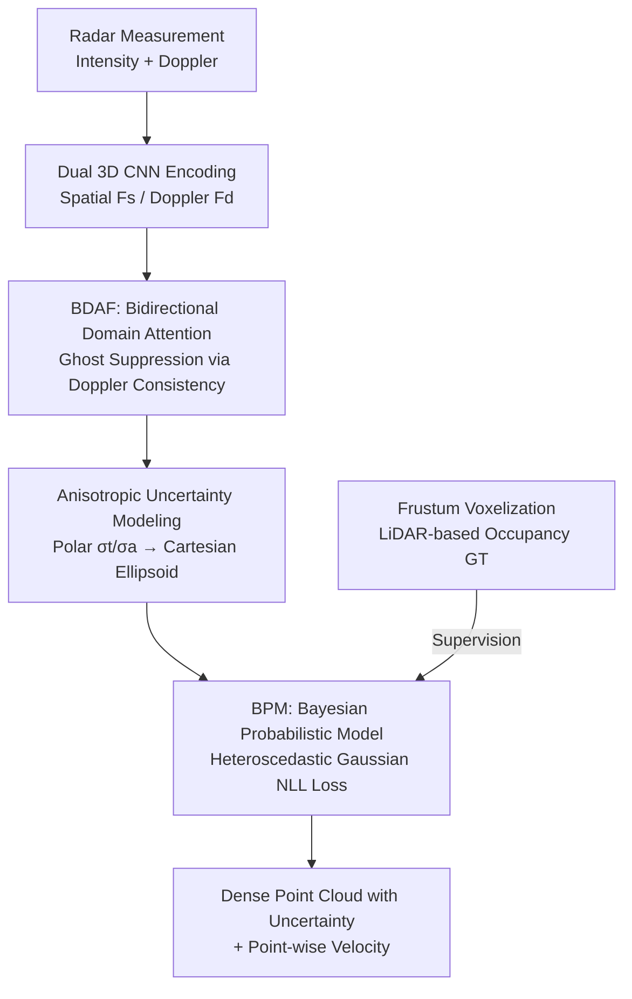

# RaUF: Learning the Spatial Uncertainty Field of Radar

**Conference**: CVPR 2026  
**Paper**: [CVF Open Access](https://openaccess.thecvf.com/content/CVPR2026/html/Wang_RaUF_Learning_the_Spatial_Uncertainty_Field_of_Radar_CVPR_2026_paper.html)  
**Code**: None (Project page https://shengpeng.wang/rauf)  
**Area**: Autonomous Driving Perception / Millimeter-Wave Radar / Uncertainty Modeling  
**Keywords**: Millimeter-Wave Radar, Spatial Uncertainty, Anisotropic Gaussian, Doppler Consistency, Point Cloud Reconstruction

## TL;DR
RaUF reformulates "low-fidelity radar point cloud reconstruction" as a Bayesian problem of learning a **spatial uncertainty field**. It employs anisotropic Gaussians to characterize the "crescent-shaped" azimuth/range uncertainty of radar, converting conflicting "feature-to-label" supervision into learnable confidence signals. By injecting Doppler consistency into spatial features via bidirectional domain attention to suppress ghost points, it achieves state-of-the-art reconstruction accuracy and downstream task reliability on Coloradar, RaDelft, and self-collected datasets.

## Background & Motivation
**Background**: Millimeter-wave (mmWave) radar operates stably in harsh environments like rain, fog, and darkness, and provides inherent Doppler (radial velocity) information, making it a crucial supplement for all-weather perception in autonomous driving and robotics. However, raw radar measurements are sparse, noisy, and have low angular resolution, making them difficult to use directly for dense perception. Consequently, the mainstream approach uses high-resolution sensors like cameras or LiDAR for **coarse-to-fine cross-modal supervision** to "super-resolve" sparse radar into dense point clouds (e.g., RadarHD, Radar-Diffusion, SDDiff).

**Limitations of Prior Work**: The authors identify two fundamental overlooked issues. First, **geometric inference is ill-posed**: "imagining" high-resolution structures from sparse radar cues essentially lacks physical fidelity. The same radar feature may correspond to different labels in different samples (ambiguous feature-to-label mapping), forcing the network to reconcile conflicting supervision signals. This often results in a "compromised average" geometric position that belongs to no mode of the true distribution, undermining optimization stability and generalization. Second, there is an **over-reliance on amplitude cues**: many methods only consider echo intensity, ignoring ghost points caused by multipath reflections and noise, which leads to unreliable detection.

**Key Challenge**: Existing methods treat radar perception as a **deterministic regression** (a feature maps deterministically to an occupancy label), but radar measurements carry inherently directional uncertainties. Forcing a deterministic fit under conflicting supervision leads to collapsed "average" solutions.

**Key Insight**: The authors make two observations based on the physics of radar. ① **Anisotropy**: Limited by the number of antennas for Angle of Arrival (AoA), azimuth uncertainty is much larger than range uncertainty, resulting in a characteristic "crescent-shaped" spatial distribution—distinctly different from the isotropic distribution of LiDAR. ② **Doppler Consistency**: The Doppler velocity of a true stationary object is uniquely determined by the radar's ego-velocity and the scatterer's direction vector (Theorem 1). Its temporal coherence serves as a physically reliable cue to identify and suppress ghost points.

**Core Idea**: Instead of deterministically "super-resolving" radar point clouds, it is better to learn a **spatial uncertainty field**. This involves explicitly modeling "crescent-shaped" uncertainty using anisotropic Gaussians within a Bayesian likelihood, transforming conflicting supervision into informative confidence learning signals, and using Doppler consistency as a physical prior to suppress false reflections.

## Method

### Overall Architecture
The input to RaUF is a radar measurement tensor $x \in \mathbb{R}^{R\times A\times E\times 2}$ (Range $R$, Azimuth $A$, Elevation $E$) with intensity and Doppler channels. The output is a dense spatial occupancy (point cloud) with anisotropic uncertainty and point-wise velocity predictions. The pipeline consists of three steps: two independent 3D CNNs encode intensity and Doppler into spatial features $F_s$ and Doppler features $F_d$, respectively. These are then enhanced via **Bidirectional Domain Attention Fusion (BDAF)**, where spatial features guide Doppler and Doppler refines spatial features to produce $F_s'$. Finally, a decoder outputs localization predictions $f_\theta(x)$ and anisotropic uncertainties $g_\phi(x)$ under a **Bayesian Probabilistic Model (BPM)**, trained with a heteroscedastic Gaussian Negative Log-Likelihood (NLL) loss. Supervision signals (occupancy ground truth) are constructed from LiDAR point clouds using a **frustum-based voxelization strategy**.

### Key Designs

**1. Bayesian Probabilistic Model (BPM): Translating Conflicting Supervision into Learnable Uncertainty**

To address the "compromised average" caused by ill-posed geometric inference, RaUF redefines the task as simultaneously estimating a localization model $f_\theta(x)$ and an uncertainty quantification model $g_\phi(x)$. Under a flat prior, learning $(\theta, \phi)$ is equivalent to minimizing the negative log-posterior, which simplifies to the negative log-likelihood. The key lies in likelihood modeling: considering radar anisotropy, the authors use a **heteroscedastic Gaussian** to characterize the data generation process, $y_i = f_\theta(x_i) + \epsilon_i$, where $\epsilon_i \sim \mathcal{N}\!\big(0,\, g_\phi(x_i)\big)$, with noise covariance varying per input. The resulting NLL loss is:

$$\mathcal{L} = \sum_{i=1}^{N}\Big[\, \|\epsilon_i(\theta)\|^2_{g_\phi(x_i)} + \log\det\big(g_\phi(x_i)\big) \,\Big]$$

where $\|\epsilon_i\|^2_\Sigma = \epsilon_i^\top \Sigma^{-1}\epsilon_i$ is the Mahalanobis distance. The first term encourages the network to fit data while considering predicted uncertainty—when a sample is ambiguous and $g_\phi$ is estimated to be large, the fitting error is automatically downweighted, preventing the network from collapsing into an average solution. The second term, $\log\det(g_\phi)$, penalizes excessive uncertainty to prevent the trivial solution of marking all points as "high uncertainty." Consequently, conflicting mappings are transformed into fine-grained confidence learning, stabilizing optimization and improving interpretability.

**2. Anisotropic Uncertainty Representation: Physical Modeling via "Crescent-to-Ellipsoid" Transformation**

The shape of the covariance $g_\phi(x)$ in Design 1 is the most physically grounded part of the paper. Common methods assuming isotropic scalar confidence cannot express the fact that radar is "accurate in range but blurry in azimuth." RaUF predicts radial uncertainty $\sigma_t$ and angular uncertainty $\sigma_a$ in **polar coordinates** and then transforms them to the Cartesian system via first-order error propagation (Theorem 2). Specifically, for a measurement $p$ near $(r, \alpha, \beta)$, the perturbation is $\delta p = J\,[\delta r,\ \delta\alpha,\ \delta\beta]^\top$, where the Jacobian $J$ consists of $\sin/\cos(\alpha, \beta)$ and $r$. Since $\delta r, \delta\alpha, \delta\beta$ are independent Gaussian variables, $\delta p$ remains Gaussian with covariance:

$$\Sigma = J\, D\, J^\top,\qquad D = \mathrm{diag}(\sigma_r^2,\ \sigma_\alpha^2,\ \sigma_\beta^2)$$

Intuitively, angular errors in azimuth/elevation are magnified by $r\sin/r\cos$ in the Jacobian, stretching the uncertainty into a wide "ellipsoid" at long ranges. This approximates the observed "crescent-shaped" uncertainty as an anisotropic Gaussian in Cartesian space. By feeding this $\Sigma = g_\phi(x)$ back into the NLL, the network learns a physically consistent confidence field.

**3. Bidirectional Domain Attention Fusion (BDAF): Doppler Consistency for Ghost Suppression**

To mitigate ghost points, RaUF uses Doppler consistency as a physical prior. Theorem 1 states that the radial Doppler velocity $v^r_{i,j}$ of a stationary scatterer is uniquely determined by the radar's ego-velocity $v^r$ and the scattering direction $(\alpha, \beta)$. Reflections following this kinematic constraint are considered real, while others are likely multipath ghosts. BDAF uses two layers of cross-attention: first, spatial $F_s$ and Doppler $F_d$ are patched and position-encoded into sequences $S_p, D_p \in \mathbb{R}^{L\times C}$. **In the first stage**, spatial cues serve as queries to enhance Doppler: $D_p' = \mathrm{Softmax}\!\big(Q_s K_d^\top / \sqrt{d_k}\big) V_d$, focusing the network on "Doppler consistent with ego-motion" regions. This is refined and projected via a **Domain Projection** network into a "latent occupancy" representation $D_p''$, acting as a differentiable spatial likelihood prior. **In the second stage**, $D_p''$ acts as a query to refine spatial features: $S_p' = \mathrm{Attention}(Q_d = W_d^q D_p'',\ K_s = W_s^k S_p,\ V_s = W_s^v S_p)$. This bidirectional refinement suppresses false reflections that may appear strong in intensity but are inconsistent in Doppler.

**4. Frustum Voxelization: Constructing Uncertainty-Aware Ground Truth**

To supervise uncertainty learning, the ground truth cannot be "point-to-point" hard labels. RaUF uses **frustum-based voxelization** from LiDAR: following radar intrinsics, rays are emitted along range/azimuth/elevation to span a frustum. All LiDAR points within this frustum are treated as potential reflections for that radar detection. This ground truth naturally represents a "region rather than a point," matching the inherent directional uncertainty of radar measurements.

### Loss & Training
Total Loss = Spatial NLL Loss $\mathcal{L}_{spatial}$ (with anisotropic covariance) + Auxiliary Doppler Velocity Regression Loss $\mathcal{L}_{doppler}$. To ensure positive-definiteness and stability, the network predicts the exponential (exp) of variance terms. Weight coefficients for occupancy and velocity MSE are 0.001. Optimizer: AdamW, initial learning rate $2\times10^{-4}$, trained on 4×RTX 4090 for approximately 6 days.

## Key Experimental Results

Datasets: Coloradar (43k frames, single-chip/cascaded, indoor/outdoor), RaDelft (long-range cascaded, urban), and a self-collected dataset (11k+ frames, Fast-Livo2 for velocity GT). Metrics: Chamfer Distance (CD↓), F-score (FS↑), and a custom **Clutter Point Ratio (CPR)** $\eta = |P_c|/|P|$ where $P_c$ are points $> 0.5$ m from any GT.

### Main Results (Coloradar Cascaded, CD↓ / FS↑)

| Scene | OS-CFAR | RPDNet | RadarHD | SDDiff | RaUF (Ours) |
|------|---------|--------|---------|--------|-------------|
| Armyroom | 2.14 / 0.04 | 1.81 / 0.05 | 1.08 / 0.23 | 0.86 / 0.43 | **0.50 / 0.47** |
| Hallways | 2.19 / 0.06 | 1.84 / 0.15 | 1.38 / 0.19 | 1.92 / 0.15 | **1.10 / 0.36** |
| Longboard | 12.99 / 0.04| 13.75 / 0.02 | 4.66 / 0.19 | 9.00 / 0.08 | **3.79 / 0.36** |

RaUF leads significantly in CD, improving by ~**70.1%** over traditional CFAR. High-performing diffusion baselines (SDDiff) degrade in complex long-range scenes (Longboard: 9.00), whereas RaUF remains robust (3.79) due to uncertainty calibration. ⚠️ Evaluation uses "ground-removed" point clouds.

### Ablation Study (Coloradar Cascaded, CD↓ / FS↑)

| Configuration | Armyroom | Longboard | Description |
|------|----------|-----------|------|
| Ours (w/o NLL) | 0.58 / 0.45 | 7.97 / 0.20 | No uncertainty calibration (Deterministic) |
| Ours (w/o BDA) | 0.99 / 0.40 | 5.98 / 0.28 | No bidirectional attention (Intensity-only) |
| Ours (Full) | 0.50 / 0.47 | 3.79 / 0.36 | Full model |

Uncertainty calibration (NLL) reduces CD by **30.55%–37.18%**, proving that anisotropic modeling provides physically consistent, conflict-free geometric representations. The BDA module improves results by **14.98%–15.95%**, validating Doppler consistency's role in clutter suppression.

### Key Findings
- **Uncertainty calibration is the most significant contributor**: Without NLL, performance in long-range scenes like Longboard drops from 3.79 to 7.97, indicating that ill-posed geometric inference is fatal in difficult scenes.
- **BDA provides clear gains in cluttered environments**: Doppler consistency primarily suppresses ghost points in multipath environments.
- **Generalization and Scalability**: Fine-tuning on RaDelft and self-collected data allows fast adaptation to different radar configurations.

## Highlights & Insights
- **Reframing "Super-resolution" as "Uncertainty Field Learning"**: The cleverest step is recognizing that ill-posedness arises from conflicting supervision, handled by explicitly modeling ambiguity rather than trying to eliminate it.
- **Physics-driven Anisotropic Covariance**: Using polar $(\sigma_t, \sigma_a)$ and error propagation to bake sensor physics directly into the loss function ensures high interpretability.
- **Doppler Consistency as a Physical Prior**: BDAF utilizes kinematic constraints from Theorem 1 to distinguish real vs. ghost reflections, a concept transferable to any radar task with velocity data.

## Limitations & Future Work
- High training cost (6 days on 4×RTX 4090) and reliance on LiDAR for frustum-based occupancy supervision.
- The Doppler consistency assumption (Theorem 1) primarily targets **stationary scatterers**; its effectiveness for dynamic ghost suppression remains less explored.
- Anisotropic Gaussians represent a first-order approximation; they might not fully capture extreme non-Gaussian or heavy-tailed clutter distributions.

## Related Work & Insights
- **vs CFAR**: Traditional signal processing is limited by antenna count; RaUF uses cross-modal learning and uncertainty for significant gains in CD/FS.
- **vs Diffusion-based Reconstruction**: Diffusion methods rely heavily on intensity and are sensitive to multipath; RaUF uses Doppler for physical suppression and is faster (single forward pass).
- **vs Isotropic Uncertainty (GICP/S3E/UTR)**: These methods fail to capture the range-azimuth resolution gap of radar; RaUF is the first to learn a **spatial anisotropic uncertainty field** for radar.

## Rating
- Novelty: ⭐⭐⭐⭐⭐ 
- Experimental Thoroughness: ⭐⭐⭐⭐ 
- Writing Quality: ⭐⭐⭐⭐ 
- Value: ⭐⭐⭐⭐⭐ 

<!-- RELATED:START -->

## Related Papers

- [\[CVPR 2026\] Evidential Deep Partial Label Learning to Quantify Disambiguation Uncertainty](evidential_deep_partial_label_learning_to_quantify_disambiguation_uncertainty.md)
- [\[ICLR 2026\] RADAR: Learning to Route with Asymmetry-aware Distance Representations](../../ICLR2026/others/radar_learning_to_route_with_asymmetry-aware_distance_representations.md)
- [\[ICML 2026\] Possibilistic Predictive Uncertainty for Deep Learning](../../ICML2026/others/possibilistic_predictive_uncertainty_for_deep_learning.md)
- [\[CVPR 2025\] Potential Field Based Deep Metric Learning](../../CVPR2025/others/potential_field_based_deep_metric_learning.md)
- [\[AAAI 2026\] Radar-APLANC: Unsupervised Radar-based Heartbeat Sensing via Augmented Pseudo-Label and Noise Contrast](../../AAAI2026/others/radar-aplanc_unsupervised_radar-based_heartbeat_sensing_via_augmented_pseudo-lab.md)

<!-- RELATED:END -->
