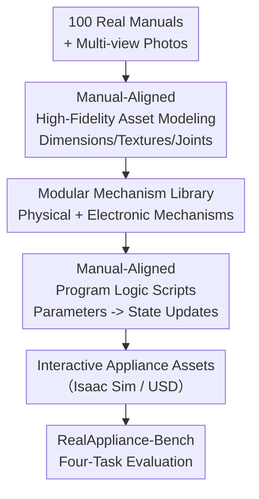

# RealAppliance: Let High-fidelity Appliance Assets Controllable and Workable as Aligned Real Manuals

**Conference**: CVPR 2026  
**Paper**: [CVF Open Access](https://openaccess.thecvf.com/content/CVPR2026/html/Gao_RealAppiance_Let_High-fidelity_Appliance_Assets_Controllable_and_Workable_as_Aligned_CVPR_2026_paper.html)  
**Code**: https://realappliance.github.io/  
**Area**: Embodied Intelligence / 3D Digital Assets / Robotics  
**Keywords**: Appliance operation planning, high-fidelity articulated assets, manual alignment, simulation mechanism, multimodal large model evaluation

## TL;DR
The authors manually modeled 100 high-fidelity appliance digital assets strictly aligned with real-world manuals (dimensions, textures, physical mechanisms, electronic mechanisms, and program logic are all reproduced according to real manuals). Based on these, they established RealAppliance-Bench to evaluate mainstream MLLMs and embodied planning models through four tasks: "manual retrieval, component grounding, open-loop planning, and closed-loop correction." It was discovered that even GPT-5's success rate for complete open-loop planning is only in the single digits.

## Background & Motivation
**Background**: Researching "robots operating appliances according to manuals" requires realistic appliance digital assets as a prerequisite. Mainstream asset sources include PartNet-Mobility (treating appliances as articulated objects with joints for knobs/buttons/doors), Infinite Mobility (automated mass generation), CheckManual (automatically assigning manuals to assets), and ArtVIP (adding damping/magnetic/trigger mechanisms to articulated assets).

**Limitations of Prior Work**: These assets lack realism across three dimensions. PartNet-Mobility has low rendering quality and components with "joints but no mechanism" (pressing them results in no response); CheckManual generates manual text and illustrations that differ significantly from real-world manuals; while ArtVIP adds some functional features, the number of assets is small, and components like knobs remain non-operable. Most critically, **no existing set of assets is directly modeled after real manuals**—dimensions, textures, mechanisms, and program logic do not match real appliances, leading to a massive sim-to-real gap.

**Key Challenge**: Appliances are not passive tools; they possess "state machines"—pressing a touch key changes the screen content, starts a motor, or toggles an indicator light. Only by reproducing this **program logic** in simulation can assets become "controllable and workable" like real appliances. Previous work focused either solely on appearance or solely on mechanism; none have aligned "appearance + physical mechanism + electronic mechanism + program logic + real manuals" simultaneously.

**Goal**: (1) To create a set of appliance assets modeled after real manuals with high-fidelity in both vision and function; (2) To build a benchmark on these assets to realistically evaluate the full-process capability of "operating appliances by reading manuals."

**Key Insight**: Using **real manuals as the sole alignment benchmark**, appliances are modeled as interactive assets where "dimensions, textures, physical mechanisms, electronic mechanisms, and program logic" are aligned item-by-item with the manuals. The "read manual → locate component → plan action → closed-loop correction" pipeline is then decomposed into four tasks for realistic model evaluation.

## Method

### Overall Architecture
The construction of RealAppliance follows a four-step serial pipeline: first, real appliance manuals and photos are collected from various countries; high-fidelity 3D assets (including independent components and precise colliders) are then manually modeled accordingly. Next, reusable **physical/electronic mechanism** classes are configured for each movable component. Finally, **program logic scripts** for each appliance are written based on the manual's operation flow, allowing assets to respond to interactions in Isaac Sim like real appliances. With these assets, the authors established RealAppliance-Bench, covering the full chain from reading to correction via four tasks.

### Key Designs

**1. Manual-Aligned High-Fidelity Asset Modeling: Aligning Dimensions, Textures, and Joints with Real Manuals**

To address the pain point of existing assets' dimensions and textures not matching real appliances, the modeling process is entirely bound to real manuals and photos. Four principles were followed during manual collection: exclude appliances with buttons too small for robotic arms; select manuals of moderate length that fit within MLLM contexts; require clear descriptions of components and workflows; and require manuals with dimensions and high-definition product images. Ultimately, manuals for 100 appliances across 14 categories (covering multiple languages like Chinese, Russian, French, and German) were obtained. Modeling was performed in 3Ds Max according to manual dimensions and photos, with each functional component **modeled independently with precise colliders** and poly counts increased using TurboSmooth. For textures, UV unwrapping was performed and high-resolution UV maps (restoring logos and scales) were drawn based on photos. After importing into Isaac Sim to generate USD assets, components were **named according to manual terminology** for retrieval and assigned joints based on real motion—revolute joints for knobs/hinged doors/flip covers, and prismatic joints for mechanical buttons/sliders/sliding doors.

**2. Modular Mechanism Library: Modularizing Physical + Electronic Mechanisms**

This is the core of upgrading assets from "movable" to "workable." Each mechanism is encapsulated into an **independent class following a unified interface**, which can be modularly combined, replaced, or extended. Mechanism classes are then attached to components as needed. Mechanisms are divided into two categories: **Physical Mechanisms** replicate force-driven behaviors—built-in springs (e.g., toaster popping up toast), magnetic suction (washing machine door seals), mechanical triggers (microwave door button popping the door, closing the door resetting all pressed buttons), knob countdown drives (air fryer timer knobs rotating back to zero and stopping), and safety locks (blender heads requiring a button press/knob turn to lift). **Electronic Mechanisms** replicate sensing, motors, and displays—screen displays (real-time generation of screen region textures to show temperature/time), touch sensing (binding virtual contact sensors to touch keys to detect external triggers), lighting (microwave interior lights turning on during operation), and logo indicators (washing machine status icons flashing upon completion). Compated to ArtVIP, which only added damping/triggers, this work completes **stateful electronic feedback** like "real-time screen changes, motors rotating by state, and lights reflecting state."

**3. Manual-Aligned Program Logic: Linking Components into a Functional State Machine via Parameter Settings**

Mechanisms alone are insufficient; logical links between components are required for realistic appliance behavior. A program script is written for each appliance in three steps: first, **defining setting parameters** based on the manual (e.g., power status, temperature, time, mode) and their candidate value ranges (e.g., power is binary 0/1); these parameters bridge information between components. Next, **configuring component mechanisms**—each component's mechanism class inherits from a base class, with parameters and functions modified according to the appliance's specific features. Finally, **designing program logic**—primarily by monitoring the state of setting parameters and updating component states accordingly; when a parameter enters a predefined range, related component states are updated and other parameters are adjusted if necessary. The paper provides an intuitive example: pressing a touch key changes screen content, starts a blender's rotation, or toggles an indicator light, replicating the real operation flow in simulation (e.g., a loop of "touch temperature key → enter temperature measurement state → up key increments time_v and redraws screen texture").

**4. RealAppliance-Bench: Decomposing Appliance Operation into Four Quantifiable Tasks**

Addressing two defects in previous evaluations (ApBot's state machine evaluation lacks visual feedback and assumes direct access to accurate post-operation states; ManualPlan uses synthetic manuals far from reality), the authors built a benchmark with real visual feedback based on real manuals + workable assets, featuring four core tasks: **Task 1: Manual Page Retrieval** (given a manual and target page category, find the relevant page, evaluated by precision/recall to reduce inference overhead); **Task 2: Open-loop Planning** (given instructions, manual, and initial observation, select actions from 9 appliance action types + 4 atomic object action types to sequence steps; evaluated by task completion/success rate, where a step is correct only if atomic actions and parameters match, and a plan is correct only if all steps match); **Task 3: Component Grounding** (given manual and target component name, predict the $[x_1, y_1, x_2, y_2]$ bounding box in the current observation; evaluated by Avg IoU and mAP@0.5); **Task 4: Closed-loop Correction** (injecting fixed-position and magnitude disturbances like opening a door/turning a knob/changing a screen during operation; given manual + instruction + history + initial plan + real-time observation, predict the next atomic action; evaluated by step-wise success rate). Additionally, **Task 5: Full-process Reasoning** runs the above end-to-end (failure if any component IoU < 0.5 or any action prediction is wrong; executed via "magic manipulation" to exclude low-level policy errors).

## Key Experimental Results

### Comparison of Asset Fidelity and Scale
RealAppliance is the only appliance asset set that simultaneously satisfies "Real Dimensions + Real Textures + Physical Logic + Electronic Components + Electronic Logic + Real Manuals."

| Digital Assets | Categories | Appliances | Real Dim. | Real Text. | Physical Logic | Electronic Logic | Manuals |
|----------|--------|--------|----------|----------|----------|----------|--------|
| PartNet-Mobility | 17 | 636 | ✗ | ✗ | ✗ | ✗ | ✗ |
| CheckManual | 11 | 369 | ✗ | ✗ | ✗ | ✗ | Synthetic |
| Infinite Mobility | 5 | – | ✗ | ✗ | ✗ | ✗ | ✗ |
| ArtVIP | 12 | 49 | ✓ | ✓ | ✓ | ✗ | ✗ |
| **RealAppliance (Ours)** | **14** | **100** | ✓ | ✓ | ✓ | ✓ | **Real** |

Data scale: 100 appliances with 589 operable components, 979 operation planning tasks, and 941 intermediate disturbance steps. Instructions average 766.18 words, and plans average 7.57 steps. A 50-person user study (0–5 scale) across dimensions, materials, and textures showed this work's realism exceeds ArtVIP / Infinite-Mobility / PartNet-Mobility.

### Main Results: Model Performance Across Four Tasks
General trend: Proprietary MLLMs > Open-source MLLMs > End-to-end embodied planning models; however, **complete open-loop planning is catastrophic across the board**, highlighting the benchmark's difficulty.

| Task (Metric, Total) | GPT-5 | Gemini 2.5 Pro | Qwen3-VL 235B Think | RoboBrain 2.0-32B | ManualPlan |
|---------------------|-------|----------------|---------------------|-------------------|------------|
| Task 1: Retrieval (Recall/F1) | 86.50/80.89 | 90.00/79.40 | 81.00/80.06 | 68.07/62.47 | 45.83/38.03 |
| Task 2: Open-loop (Compl./Succ.) | 4.30/1.22 | 4.08/2.45 | 4.36/1.73 | 0.37/0.00 | 5.61/0.40 |
| Task 3: Grounding (Avg IoU/mAP@0.5) | 12.15/8.59 | 8.16/6.64 | 2.80/0.87 | 0.00/0.00 | 1.92/0.00 |
| Task 4: Correction (Step Succ.) | 29.61 | 31.73 | – | 0.00 | – |

*Note: Values represent the total mean across 14 categories. Some Task 4 values (e.g., Qwen3-VL) were omitted in preliminary reads; refer to original text for details.*

### Key Findings
- **Open-loop planning is nearly a total failure**: Even GPT-5's "task success rate" is only ~1.22%, with the strongest being Gemini 2.5 Pro at 2.45%—because "all steps and all parameters must be correct," long-horizon multi-step planning fails easily at any single step.
- **Closed-loop correction is significantly easier than open-loop planning**: Step-wise success rates reach ~30%, indicating that providing real-time visual feedback for "next-step" prediction is far less difficult than generating a full plan at once.
- **Retrieval Strength $\neq$ Operation Strength**: Models achieve 80%+ F1 in manual retrieval, but performance drops off a cliff in component grounding (GPT-5 $\sim$ 12 IoU) and action planning, exposing the gap between "understanding documents" and "spatial operation."
- **End-to-end planning models struggle**: RoboBrain 2.0-7B scored zero on several tasks, and the 32B version was only marginally useful for retrieval, showing existing models generalize poorly to long-horizon, fine-grained manual-driven appliance scenarios.

## Highlights & Insights
- **"Program Logic" is the true moat for these assets**: While others achieved "doors opening and knobs turning," this work replicates the state machine (e.g., key press → parameter change → screen/motor/light update), allowing assets to "work" rather than just "move," which is a key step in reducing the sim-to-real gap.
- **Mechanisms as modular classes with unified interfaces**: The OOP encapsulation of physical/electronic mechanisms allows for plug-and-play combinations, meaning adding new appliances primarily involves "selecting mechanisms + writing parameters + linking manual logic," resulting in low expansion costs.
- **Real manuals as alignment anchors are a clever source of "Ground Truth"**: Manuals naturally provide component names, dimensions, and workflows, serving as ground truth for modeling and material for evaluating multi-modal long-document understanding.
- **Benchmark difficulty itself is a contribution**: The single-digit success rates clearly define the ceiling for current MLLMs/embodied models, pinpointing grounding and long-horizon planning as primary research targets.

## Limitations & Future Work
- **Reliance on manual modeling limits scale**: 100 appliances across 14 categories offer high quality but a small sample size; the manual 3Ds Max/Photoshop/Isaac Sim pipeline is difficult to scale like Infinite Mobility. How to achieve "automated generation + manual alignment" remains an open question.
- **Evaluation via "Magic Manipulation" bypasses low-level policy**: The full-process task uses magic manipulation to isolate planning errors from execution errors, meaning it measures **high-level planning** but does not guarantee successful real-robot execution.
- **Fixed disturbances**: For reproducibility, disturbances in closed-loop correction are pre-defined in position and magnitude, which may differ from continuous, random real-world interference, making success rates potentially optimistic.

## Related Work & Insights
- **vs PartNet-Mobility / Infinite Mobility**: These treat appliances as articulated objects or generate them en masse, but lack mechanisms, manual alignment, and realistic textures; this work uses manuals as anchors for high-fidelity modeling and functional logic.
- **vs CheckManual**: CheckManual **automatically generates** manuals for existing assets, resulting in low fidelity; this work reverses the process, building assets **based on real manuals**.
- **vs ArtVIP**: ArtVIP adds interaction logic like damping/triggers but lacks operation workflows, electronic logic, and manuals; this work adds electronic mechanisms (screens/touch/motors) and manual-aligned logic.
- **vs ApBot / ManualPlan**: ApBot's evaluation lacks visual feedback and assumes access to accurate states; ManualPlan uses synthetic manuals. This work uses real manuals + operable assets to provide realistic visual feedback.

## Rating
- Novelty: ⭐⭐⭐⭐⭐ First workable appliance asset set aligned item-by-item with real manuals (including program logic) + matching benchmark.
- Experimental Thoroughness: ⭐⭐⭐⭐ Coverage of dozen-plus proprietary/open-source/embodied models across five tasks, though asset scale is relatively small and execution relies on magic manipulation.
- Writing Quality: ⭐⭐⭐⭐ Mechanism pipelines are clearly explained; mechanism class pseudo-code and examples are helpful.
- Value: ⭐⭐⭐⭐⭐ Provides scarce high-fidelity assets and a rigorous benchmark for the "manual-driven appliance operation" embodied AI path.

<!-- RELATED:START -->

## Related Papers

- [\[CVPR 2026\] Differentiable Stroke Planning with Dual Parameterization for Efficient and High-Fidelity Painting Creation](differentiable_stroke_planning_with_dual_parameterization_for_efficient_and_high.md)
- [\[AAAI 2026\] I2E: Real-Time Image-to-Event Conversion for High-Performance Spiking Neural Networks](../../AAAI2026/others/i2e_real-time_image-to-event_conversion_for_high-performance_spiking_neural_netw.md)
- [\[AAAI 2026\] Learning Compact Latent Space for Representing Neural Signed Distance Functions with High-fidelity Geometry Details](../../AAAI2026/others/learning_compact_latent_space_for_representing_neural_signed_distance_functions_.md)
- [\[ECCV 2024\] High-Fidelity 3D Textured Shapes Generation by Sparse Encoding and Adversarial Decoding](../../ECCV2024/others/high-fidelity_3d_textured_shapes_generation_by_sparse_encoding_and_adversarial_d.md)
- [\[CVPR 2026\] Crowdsourcing of Real-world Image Annotation via Visual Properties](crowdsourcing_of_real_world_image_annotation_via_visual_properties.md)

<!-- RELATED:END -->
