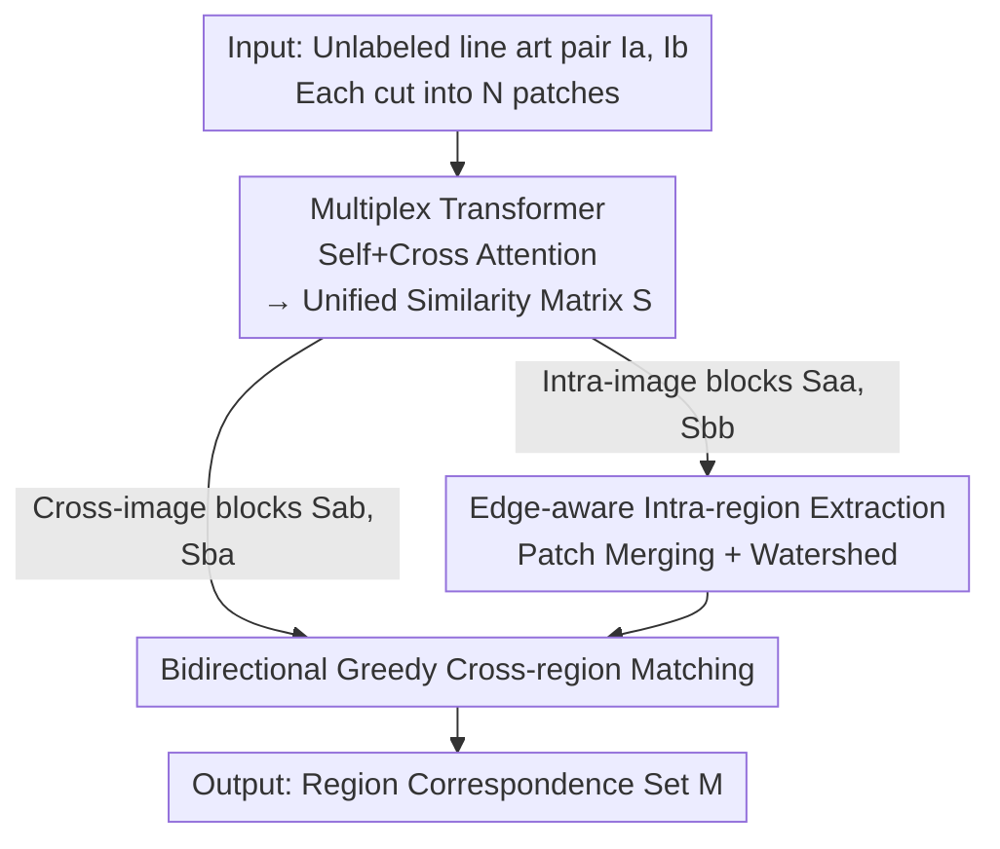

# Region-Wise Correspondence Prediction between Manga Line Art Images

**Conference**: CVPR 2026  
**Paper**: [CVF Open Access](https://openaccess.thecvf.com/content/CVPR2026/html/Li_Region-Wise_Correspondence_Prediction_between_Manga_Line_Art_Images_CVPR_2026_paper.html)  
**Code**: https://github.com/liyingxuan1012/r2r-lineart-correspondence  
**Area**: Line Art Understanding / Region Correspondence / Manga & Animation Processing  
**Keywords**: Manga Line Art, Region Correspondence, Transformer, Patch Similarity, Edge-Aware Segmentation

## TL;DR
This paper introduces the task of "directly predicting region-level correspondences from unlabeled raw manga line art pairs." It employs a combined ViT + Multiplex Transformer to jointly learn intra-image structural grouping and cross-image similarity. Combined with edge-aware post-processing to transform patch similarities into pixel-level region segmentation and matching, the method achieves 78.4–84.4% region-level accuracy on hand-drawn style line art.

## Background & Motivation
**Background**: In manga and animation production, artists must manually identify and track semantic regions across a vast number of line art frames—for instance, ensuring a character's hair remains the same blue in every frame or that an earring maintains consistent shape and position. Such cross-frame region correspondence is fundamental for downstream tasks like colorization and in-betweening, but currently relies entirely on manual labor, which is time-consuming and requires professional expertise.

**Limitations of Prior Work**: Most existing line art correspondence methods **presuppose that images are already segmented into closed regions** before performing matching. This assumption holds for 3D renderings or clean vector art but fails for authentic hand-drawn manga line art, where contours are often **open and loose**, preventing closed-region segmentation. Furthermore, point-to-point matching methods (such as LightGlue, designed for natural images) rely on color and texture cues that do not exist in line art, leading to sparse and unreliable keypoints.

**Key Challenge**: Line art consists of abstract, sparse black-and-white strokes lacking the texture and color cues found in natural images. The same character may also undergo changes in pose, scale, perspective, and drawing style across frames. More fundamentally, **there is a total lack of training data with region-level annotations**, and segmentation models trained on natural images (like SAM) perform poorly on line art due to the domain gap.

**Goal**: Given a pair of raw line art images without prior segmentation or manual annotation, simultaneously (1) identify semantically meaningful structural regions within each image and (2) predict the correspondence between regions across the images.

**Key Insight**: Rather than following a segment-then-match approach (which depends on closed regions), it is better to **jointly learn intra-image structure and cross-image correspondence at the patch granularity**, delaying segmentation until post-processing. Patch-level representations are more robust to open contours as they learn "which patches structurally belong to the same class" rather than "whether a contour is closed."

**Core Idea**: A Multiplex Transformer capable of performing self-attention (intra-image) and cross-attention (cross-image) simultaneously is used to produce a unified patch similarity matrix $S$. Intra-image grouping and cross-image matching are both derived from this single $S$. Subsequently, edge-aware post-processing transforms coarse patches into pixel-level regions that adhere to the strokes.

## Method

### Overall Architecture
The method consists of two main components: a **Transformer-based patch similarity learning model** and a **purely post-processing region matching pipeline**. The input is a pair of unlabeled line arts $I_a, I_b$, which are divided into $N$ patches of size $p\times p$. After encoding via ViT and interaction through the Multiplex Transformer, a unified similarity matrix $S\in[0,1]^{2N\times 2N}$ is generated. Its four blocks encode patch similarities for "$I_a$ internal," "$I_b$ internal," "$I_a\to I_b$," and "$I_b\to I_a$." In post-processing, the top-left block $S_{aa}$ and bottom-right block $S_{bb}$ are used for intra-image patch merging to obtain regions $R_a, R_b$, while the top-right block $S_{ab}$ and bottom-left block $S_{ba}$ are used for cross-image region matching to obtain the set of correspondences $M$.

### Key Designs

**1. Multiplex Transformer: Carrying Intra-image Structure and Cross-image Correspondence in a Unified Matrix**

In the absence of color and texture, it is difficult to judge which patches belong to the same semantic region within a single image, let alone across images. Ours first uses a ViT-B/16 pre-trained on ImageNet to embed each patch into a $d$-dimensional token (with learnable positional encodings $\tilde X = Z + E_{pos}$), which is then fed into an $M=4$ layer Multiplex Transformer $f_{MT}$. Within each layer, tokens from both images perform both self-attention (to capture intra-image structure) and cross-attention (to attend to tokens in the other image for cross-image correspondence). These tasks are learned **simultaneously** within the same network. After outputting $X'_a, X'_b$, the unified matrix $S$ is computed using cosine similarity followed by row-wise softmax.

The elegance of this design lies in the fact that the similarity required for intra-image grouping and cross-image matching is fundamentally the same; sharing a single matrix $S$ ensures consistency. Experiments show cross-image similarity performance approaches intra-image levels (both AP $> 83\%$), which the authors attribute to this joint learning where cross-attention allows features to align across images even without color cues.

**2. Contrastive Loss with Sampling under Sparse Supervision**

The ground-truth patch correspondence matrix $G\in\{0,1\}^{2N\times 2N}$ is extremely sparse (most patch pairs do not match). Naive supervision of all $2N\times 2N$ pairs results in severe class imbalance and difficulty in convergence. Ours adopts a CLIP-style **sampled contrastive loss**: at each step, positive pairs $(i,j)$ are randomly sampled from the non-zero entries of $G$, and $K$ negative samples $\{j_k\}$ are sampled for each $i$. A temperature-scaled softmax is applied across $\{j\}\cup\{j_k\}$ on the $i$-th row of $S$ to minimize the negative log-likelihood:

$$L_{i,j} = -\log\frac{\exp(S_{ij}/\tau)}{\exp(S_{ij}/\tau) + \sum_{k=1}^{K}\exp(S_{ij_k}/\tau)}$$

where $\tau$ is the temperature. The final loss is averaged over all sampled positive pairs in a batch. This focuses the supervision signal on "a few true matches vs. a small set of hard negatives," bypassing the imbalance problem.

**3. Edge-aware Intra-region Extraction: Refining Coarse Patches into Stroke-aligned Pixel Regions**

Directly merging similar adjacent patches based on $S_{aa}$ yields blocky 16x16 boundaries. Ours first applies Gaussian smoothing + Sobel gradients to $I_a$ to obtain a structural edge map $E_a$. Adjacent patches are merged within an 8-neighborhood based on $S_{aa}$ similarity, but **merging across strong edges is suppressed** (by checking the average edge response on shared boundaries). The merged patch clusters then act as seeds for a Watershed algorithm on $E_a$, aligning region boundaries with stroke structures. Finally, a second edge-aware merging of small regions is performed based on contact length and edge strength to avoid fragmentation.

This step is critical for handling "open contours": it does not require closure but uses learned patch similarities as a semantic prior for "what belongs together" and the edge map as a geometric constraint for "where to break." This avoids both the failure of ClosedRegion methods and the over-segmentation of TrappedBall (Ours maintains a stable Cluster Ratio of 1.4–1.7, whereas the baseline reaches 7–14).

**4. Bidirectional Greedy Cross-region Matching: Asymmetric Similarity and Union for Robustness**

Given region sets $R_a, R_b$, cross-image matching aggregates similarity from the cross-image sub-blocks $S_{ab}, S_{ba}$. For each region pair $(R_i, R_j)$, directional similarity is defined as the average similarity of all patch pairs within the regions:

$$s(R_i, R_j) = \frac{1}{|R_i||R_j|}\sum_{p\in R_i}\sum_{q\in R_j} S_{ab}[p,q]$$

Note that similarity is **asymmetric**—$s(R_i, R_j)$ is calculated from $S_{ab}$, while $s(R_j, R_i)$ is from $S_{ba}$. Matching is performed using **bidirectional thresholded greedy selection**: forward matching produces $M_{a\to b}$ by taking all $R_b$ regions with $s$ above a threshold for each $R_a$, and vice versa for $M_{b\to a}$. The final correspondence set is the union $M = M_{a\to b}\cup M_{b\to a}$. Taking the union instead of the intersection allows for tolerance against asymmetric matching caused by pose changes or one region being split into multiple parts in the other image, thereby improving recall.

### Loss & Training
**Automatic Annotation Pipeline (Training Data Engine)**: Since no region correspondence dataset exists for line art, a pipeline was built to generate large-scale pseudo-labels. (1) **Intra-image auto-segmentation**: Uses colored line art as auxiliary input, clustering by the $K$ dominant colors, detecting connected components, and merging fragments based on color and boundary cues. (2) **Cross-image auto-matching**: Uses LightGlue for point-to-point matching (expanded to 5x5 neighborhoods), filtering by average color, and voting to map regions in $I_a$ to the highest-voted region in $I_b$. A coarse matching step considering position and color is added for mismatched or face-heavy areas. The training set consists of 18-frame interval pairs from short animations converted via MangaNinja, totaling **200,000 pairs (364,015 images)**. Evaluation sets (ATD 25 pairs, GenAI 40 pairs) were manually refined to ensure ground-truth quality.

**Training Hyperparameters**: ViT-B/16 (ImageNet pre-trained) + patch size 16x16, Multiplex Transformer $M=4$ layers; 20 epochs, batch size 16, AdamW, initial LR $1\times10^{-4}$ with warm-up and cosine annealing, A100 GPU.

## Key Experimental Results

### Main Results
**Patch-level Evaluation** (Table 1, comparing predicted similarity $S$ vs. ground-truth $G$):

| Dataset | Match Type | AP | Best F1 | Top-1 Acc | Top-5 Acc |
|---------|------------|------|---------|-----------|-----------|
| ATD | Intra ($I_a$) | 88.75 | 79.29 | – | – |
| ATD | Cross | 83.72 | 73.44 | 82.51 | 92.44 |
| GenAI | Intra ($I_b$) | 88.42 | 79.03 | – | – |
| GenAI | Cross | 83.49 | 73.39 | 67.73 | 77.42 |

Intra-image AP exceeds 85% and Best F1 exceeds 76%. Cross-image performance is close to intra-image, proving joint learning aligns features well despite the lack of color.

**Region-level Evaluation** (Table 2, comparison with TrappedBall baseline):

| Dataset | Method | ARI | mIoU (P→G) | CR | Region Accuracy |
|---------|--------|------|-----------|------|-----------|
| ATD | Baseline | 64.04 | 13.05 | 7.23 | 82.94 |
| ATD | Ours | 48.11 | 31.00 | **1.41** | **84.44** |
| GenAI | Baseline | 33.90 | 5.89 | 13.84 | 72.36 |
| GenAI | Ours | 46.23 | 32.50 | **1.70** | **78.43** |

Ours achieves a Cluster Ratio (CR) near 1 (1.41–1.70), indicating balanced segmentation, while the baseline's CR of 7–14 indicates severe over-segmentation. Ours also achieves significantly higher mIoU(P→G) and higher cross-image region accuracy, especially on the challenging GenAI dataset.

### Ablation Study

| Configuration | Observation | Explanation |
|---------------|-------------|-------------|
| Increasing training set | Both PR curves improve | Larger data allows for more stable structural representations |
| Fixed CR at 1.4–1.7 | Most consistent visual/semantic results | CR $\ll 1$ = under-segmentation, CR $\gg 1$ = over-segmentation |
| ClosedRegion segmentation | Fails on hand-drawn art | Lack of closed contours |
| SAM segmentation | Merges face/background, coarse boundaries | Domain mismatch on non-textured images |

### Key Findings
- **Over-segmentation is the biggest trap**: Geometric baselines (TrappedBall) appear usable at the patch level but have a CR of 7–14, splitting one semantic region into a dozen pieces. Ours suppresses CR to 1.4–1.7 via edge-aware merging to ensure semantic coherence.
- **Recall is the bottleneck**: Cross-region recall is only 30–35%; the model struggles with large regions split across images (hair, clothes) or very fine details, which is an inherent difficulty of abstract line art.
- **Domain alignment matters**: ATD (adjacent animation frames, small pose variance) is easier than GenAI (Diffusion-generated, large structural variance), with cross-image accuracy being ~6% higher.

## Highlights & Insights
- **Unified Similarity Matrix**: Reducing "intra-grouping" and "cross-matching" to reading different blocks of the same $2N\times 2N$ matrix is elegant. The "one representation for two tasks" approach is transferable to any "clustering + cross-instance matching" scenario.
- **Practical Pseudo-labeling**: Using color line art as a bootstrap for LightGlue and color voting enables a scalable self-supervised pipeline for a task that would otherwise require massive manual labor.
- **Open Contour Handling**: By not forcing closure and instead combining semantic patch similarity with geometric edge constraints, the method directly addresses the core pain point of "incomplete contours" in hand-drawn art.

## Limitations & Future Work
- **Limitations**: Aggressive merging to avoid over-segmentation can lose fine-grained semantics (eyes/brows merged into faces). Cross-image recall remains low for inconsistent segmentations.
- **Evaluation Scale**: The refined manual evaluation sets are small (25 pairs in ATD, 40 in GenAI).
- **Pseudo-label Dependence**: Training rests on the auto-annotation pipeline; noise from point-matching or color-voting may propagate.
- **Future Work**: Making the post-processing (merging/matching) end-to-end differentiable might improve recall. Multi-frame temporal consistency could also improve stability.

## Related Work & Insights
- **vs. Pre-segmented matching (Dai et al., PBC etc.)**: These assume closed contours/vector art. Ours works on raw hand-drawn art by delaying segmentation to an edge-aware post-processing stage.
- **vs. Point matching (LightGlue)**: These rely on texture/color. Ours focuses on patch/region-level matching, which is more suited to the abstract nature of line art.
- **vs. Natural image segmentation (SAM)**: SAM suffers from domain mismatch, merging semantic parts with backgrounds due to the lack of color/shading.

## Rating
- Novelty: ⭐⭐⭐⭐⭐ First to define this specific task on raw unlabeled line art.
- Experimental Thoroughness: ⭐⭐⭐⭐ Complete evaluations, though the manual test set is small.
- Writing Quality: ⭐⭐⭐⭐ Clear motivation, flow, and formulas.
- Value: ⭐⭐⭐⭐ Direct utility for manga pipelines (colorization, etc.).

<!-- RELATED:START -->

## Related Papers

- [\[CVPR 2026\] ALLNet: Multi-task Dense Prediction for Degraded Images](allnet_multi-task_dense_prediction_for_degraded_images.md)
- [\[CVPR 2026\] Bootstrapping Multi-view Learning for Test-time Noisy Correspondence](bootstrapping_multi-view_learning_for_test-time_noisy_correspondence.md)
- [\[CVPR 2026\] A Difference-in-Difference Approach to Detecting AI-Generated Images](a_difference-in-difference_approach_to_detecting_ai-generated_images.md)
- [\[CVPR 2026\] PAUL: Uncertainty-Guided Partition and Augmentation for Robust Cross-View Geo-Localization under Noisy Correspondence](paul_uncertainty-guided_partition_and_augmentation_for_robust_cross-view_geo-loc.md)
- [\[CVPR 2026\] A Debiased Reconstruction-based Framework for Training-Free Detection of AI-Generated Images](a_debiased_reconstruction-based_framework_for_training-free_detection_of_ai-gene.md)

<!-- RELATED:END -->
