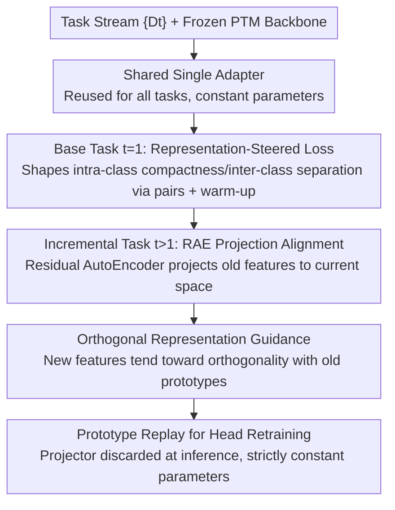

# Representation-Steered Incremental Adapter-Tuning for Class-Incremental Learning with Pre-Trained Models

**Conference**: CVPR 2026  
**Paper**: [CVF Open Access](https://openaccess.thecvf.com/content/CVPR2026/html/Zhao_Representation-Steered_Incremental_Adapter-Tuning_for_Class-Incremental_Learning_with_Pre-Trained_Models_CVPR_2026_paper.html)  
**Code**: https://github.com/zjrzjrz/RSIAT  
**Area**: Continual Learning / Class-Incremental Learning  
**Keywords**: Class-Incremental Learning, Pre-Trained Models, Shared Adapter, Representation Steering, Prototype Drift

## TL;DR
RSIAT employs a **single shared adapter** (with parameters remaining constant regardless of task growth) for PTM-based class-incremental learning. It first shapes features to be intra-class compact and inter-class separable using a "Representation-Steered Loss" in the base task. Then, in incremental tasks, it utilizes "Residual AutoEncoder Projection + Orthogonal Loss" to align new and old feature spaces and suppress prototype drift. It achieves a superior stability-plasticity trade-off across six CIL benchmarks with fewer parameters.

## Background & Motivation
**Background**: Class-incremental learning (CIL) requires models to continuously learn new classes from a data stream without forgetting old ones. With the proliferation of pre-trained models (PTMs), the mainstream approach has shifted from training from scratch to Parameter-Efficient Fine-Tuning (PEFT): freezing the backbone and training only small modules like prompts or adapters. Methods such as L2P/DualPrompt/CODA-Prompt use prompt pools, while EASE/MOS/SSIAT utilize adapters, both achieving promising results.

**Limitations of Prior Work**: These PTM-based CIL methods expose two fundamental issues. First, **most methods add a new set of task-specific modules** (prompts/adapters) for every new task. This causes trainable parameters to **grow linearly** with the number of tasks and requires module retrieval during inference, where module selection errors or interference can lead to significant performance drops. Second, despite the strong generalization of PTMs, existing methods **lack an explicit mechanism to structure the representation space across tasks**. Without explicit regularization, new tasks cause old class features to drift, resulting in prototype shift, blurred decision boundaries, and decreased representation stability.

**Key Challenge**: An ideal CIL system should satisfy two conditions: (i) limited or ideally constant parameter growth; (ii) a feature space that is intra-class compact, inter-class separable, and aligned between new and old tasks. Existing methods either continuously expand modules for plasticity (violating i) or use strong regularization (e.g., knowledge distillation) to fix old representations, which slows down or even hinders the adapter from learning new classes (failing on ii).

**Goal**: The objective is three-fold: eliminate parameter expansion via a single shared adapter; actively shape a favorable representation geometry in the base task; and gently align spaces in incremental tasks to suppress drift without "braking" the adapter's learning capacity.

**Key Insight**: The authors adopt a "representation-first" perspective—rather than rectifying drift post-hoc with heavy constraints, it is better to shape the feature space well from the start and use a lightweight projector that follows the evolution of representations for alignment in subsequent tasks.

**Core Idea**: A single shared adapter + base "Representation-Steered Loss" + incremental "Residual AutoEncoder Alignment + Orthogonal Loss" provides a stable yet plastic feature space through gentle constraints.

## Method

### Overall Architecture
RSIAT is built upon the SSIAT baseline (shared adapter $A$, frozen PTM, cosine classification loss $L_{cos}$, and retraining the classification head after each task using stored class prototypes and covariances for semantic drift estimation). Its core is a continuous mechanism spanning two stages: the **base task** ($t=1$) uses the shared adapter with a cosine classifier and a warm-up-regulated representation-steered loss $L_{RS}$ to shape features; the **incremental tasks** ($t>1$) continue updating the same adapter while using a Residual AutoEncoder (RAE) projector to align features from the previous model to the current space, accompanied by an orthogonal loss to prevent new classes from encroaching on old class prototypes. The entire pipeline reuses the same shared adapter, and the projector is discarded during inference, ensuring strictly constant parameters.

### Key Designs

**1. Shared Single Adapter: Keeping Parameter Growth Constant**

To address the issue where parameter counts grow linearly with tasks, RSIAT maintains only one shared adapter $A$ throughout the process. All tasks reuse this adapter without adding task-specific branches. Consequently, inference requires no instance-level module retrieval, and performance is not affected by selection errors. Formally following SSIAT, embeddings $f_i^t=\phi(x_i;A^t)$ are extracted and $\ell_2$-normalized to $\hat z_i^t=f_i^t/\lVert f_i^t\rVert$. A cosine loss $L_{cos}^{(t)}$ with scale $s$ and margin $m$ is used to tighten decision boundaries. The trade-off is that this single adapter must manage both plasticity and stability for all tasks, which the following two losses aim to resolve.

**2. Base Representation-Steered Loss $L_{RS}$ and Warm-up: Shaping Feature Geometry Early**

To address the weak constraints of using only cosine loss which leads to overlapping clusters, the authors add a pairwise representation-steered loss in the base task. Let $S_{ij}=\langle\hat z_i^1,\hat z_j^1\rangle$ be the cosine similarity between samples. Using positive pair mask $M_{ij}^+=\mathbb{I}(y_i=y_j,i\ne j)$ and negative pair mask $M_{ij}^-=\mathbb{I}(y_i\ne y_j)$:

$$L_{pos}=\frac{1}{|P|}\sum_{i,j}(1-S_{ij})M_{ij}^+,\quad L_{neg}=\frac{1}{|N|}\sum_{i,j}(1+S_{ij})M_{ij}^-,\quad L_{RS}=L_{pos}+\alpha L_{neg}.$$

The positive loss pulls similar classes together, while the negative loss pushes different ones apart. Crucially, a **warm-up schedule** is used: since applying $L_{RS}$ immediately might overpower $L_{cos}$ and hinder initial learning, the coefficient is scaled by $\lambda_{RS}(e)=\lambda_{RS}\cdot\min(1,e/E_w)$ from 0 to its target value (where $e$ is the epoch and $E_w$ is the warm-up duration). This allow the base stage to learn coarse features first before gradually strengthening representation shaping, leaving a robust and adaptable foundation for subsequent tasks.

**3. Residual AutoEncoder Projection Alignment $L_{align}$: Gentle Alignment Without Throttling the Adapter**

Updating a shared adapter inevitably perturbs previous task representations, but strong regularization like distillation can hinder learning new classes. RSIAT uses a Residual AutoEncoder projector with an identity skip-connection $P^t(f^{t-1})=\text{AutoEncoder}^t(f^{t-1})+f^{t-1}$ to align the feature spaces of $t-1$ and $t$. At the start of a task, $A^t=A^{t-1}$ and the projector is initialized to zero, making it an identity mapping (I-projection) perfectly aligned with the model. As the adapter updates, the projector **only needs to model the incremental drift of the representation** on the identity path. Alignment is achieved via L2 loss $L_{align}^{(t)}=\frac{1}{|B^t|}\sum_x\lVert f^t-P^t(f^{t-1})\rVert_2^2$. This "projector follows the model" design suppresses drift without creating optimization resistance.

**4. Orthogonal Representation Guidance $L_{orth}$: Preventing Encroachment on Old Classes**

To prevent new class learning from encroaching on old representation spaces, RSIAT uses accumulated old prototypes $\{\mu_c\}$. Old prototypes and previous task features are projected into the current space and normalized ($\hat p_c=P^t(\mu_c)/\lVert\cdot\rVert$, $\hat u_i=P^t(f_i^{t-1})/\lVert\cdot\rVert$). The absolute value of their cosine similarity is then minimized:

$$L_{orth}^{(t)}=\frac{1}{|Y_{1:t-1}||B^t|}\sum_{c}\sum_{i}|\langle\hat p_c,\hat u_i\rangle|.$$

This encourages new features to remain orthogonal to old prototypes, thereby minimizing interference during new class learning. The total loss for incremental tasks is $L^{(t)}=L_{cos}^{(t)}+\beta L_{align}^{(t)}+\gamma L_{orth}^{(t)}$.

### Loss & Training
Base Task: $L^{(1)}=L_{cos}^{(1)}+\lambda_{RS}(e)\,L_{RS}$; Incremental Tasks: $L^{(t)}=L_{cos}^{(t)}+\beta L_{align}^{(t)}+\gamma L_{orth}^{(t)}$. The adapter dimension is set to 64. The RAE has a fixed down-sampling dimension of 64, with the intermediate up-sampling dimension used to tune trainable parameter counts. At inference, RAE is discarded, utilizing only the frozen PTM, shared adapter, and classification head, keeping parameters strictly constant.

## Key Experimental Results

### Main Results
On six CIL benchmarks (ViT-B/16-IN21K backbone, exemplar-free), reporting average accuracy $\bar A$ and last accuracy $A_B$:

| Method | CIFAR $\bar A$ | IN-R $\bar A$ | IN-A $\bar A$ | OmniBench $\bar A$ | CUB $\bar A$ | VTAB $\bar A$ |
|------|------|------|------|------|------|------|
| RanPAC | 94.35 | 82.98 | 69.32 | 85.95 | 93.13 | 92.56 |
| EASE | 92.35 | 81.74 | 65.34 | 81.11 | 92.23 | 93.61 |
| MOS | 94.75 | 82.96 | 69.13 | 85.91 | 93.49 | 92.62 |
| SSIAT (Baseline) | 94.35 | 83.63 | 70.83 | 84.31 | 93.38 | 94.21 |
| **RSIAT** | **95.15** | **86.92** | **74.89** | **86.42** | **93.99** | **94.65** |

RSIAT achieves the best $\bar A$ and $A_B$ across all six datasets. Its advantage is particularly evident on datasets with large domain shifts like ImageNet-A/R (surpassing the second best by +1.91 on IN-A and +1.47 on IN-R in the final stage). Compared to **traditional CIL methods using 20 exemplars per class**, RSIAT remains superior even with **0 exemplars**:

| Method | Exemplar | IN-R $\bar A$ | IN-R $A_B$ | CIFAR $\bar A$ | CIFAR $A_B$ |
|------|----------|------|------|------|------|
| FOSTER | 20/class | 81.34 | 74.48 | 89.87 | 84.91 |
| TagFex | 20/class | 83.23 | 78.45 | 92.17 | 89.26 |
| **RSIAT** | **0** | **86.92** | **82.75** | **95.15** | **92.20** |

### Ablation Study
Ablation of components on ImageNet-R/A (B0I20) ($\bar A$/$A_B$):

| Configuration | IN-R $\bar A$ | IN-R $A_B$ | IN-A $\bar A$ | IN-A $A_B$ | Description |
|------|------|------|------|------|------|
| Baseline (Cosine head + shared adapter) | 83.63 | 79.38 | 70.83 | 62.43 | Starting point |
| + $L_{orth}$ | 84.15 | 78.32 | 72.83 | 61.95 | Increases $\bar A$ but slightly lowers plasticity |
| + $L_{align}$ | 84.72 | 80.17 | 74.30 | 65.04 | Consistent improvement on both |
| + IRS (align+orth) | 84.86 | 80.52 | 74.37 | 65.31 | Optimal incremental guidance |
| + IRS (wo res) | 80.59 | 74.02 | 65.37 | 51.48 | Performance collapses without skip-connection |
| + IRS + $L_{RS}$ | 85.36 | 81.45 | 74.62 | 65.50 | Adding base stage guidance |
| RSIAT (Full) | **86.92** | **82.75** | **74.89** | **66.23** | Full components |

### Key Findings
- **Residual connection is critical**: Removing the skip-connection from RAE (IRS wo res) causes $A_B$ on IN-A to drop from 65.31 to 51.48, proving that modeling "drift increments" without constraining the adapter is key to gentle alignment.
- $L_{orth}$ added alone improves $\bar A$ but slightly impairs final $A_B$ (limiting plasticity), whereas $L_{align}$ improves both metrics; their combination (IRS) yields the best synergy.
- The base stage $L_{RS}$ provides consistent gains when added to IRS, showing that "shaping geometry first" and "gentle alignment later" are complementary.

## Highlights & Insights
- **Residual Identity Projector**: By starting from an identity mapping and only modeling drift increments, alignment becomes a soft constraint that doesn't "brake" the adapter. This "projector follows model" approach is generalizable to any continual learning scenario requiring cross-stage alignment.
- **Representation-first + Warm-up**: Learning coarse features before gradually strengthening representation shaping prevents strong constraints from killing the learning process early, serving as a practical scheduling technique for stability-plasticity.
- **Constant Parameters with Higher Accuracy**: Using a single adapter solves parameter growth issues and outperforms traditional methods using 20 exemplars, making it highly scalable for long sequences.

## Limitations & Future Work
- The method depends on storing old class prototypes and covariances after each task to retrain the categorization head and compute orthogonal loss, which may increase prototype storage and computation as categories scale.
- The capacity of a single shared adapter is fixed. Whether it reaches a capacity bottleneck or maintains sufficient plasticity for extremely long sequences or massive domain shifts requires further exploration.
- Hyperparameters like RS loss, warm-up, and weights ($\alpha/\beta/\gamma$) require dataset-specific tuning; cross-dataset adaptive configuration remains an open problem.

## Related Work & Insights
- **vs SSIAT (Direct Baseline)**: SSIAT uses a shared adapter and semantic drift perception, but its weak geometric constraints (cosine loss only) lead to cluster overlap. RSIAT fills this gap with base representation steering and incremental RAE alignment + orthogonal loss.
- **vs EASE / MOS (Adapter Expansion)**: These methods trade parameter growth for plasticity via sub-space expansion/merging. RSIAT achieves stability with constant parameters through representation geometry and gentle alignment.
- **vs Strong Regularization (Distillation)**: Distillation suppresses the adapter's ability to learn new classes; RSIAT's residual projector provides soft alignment that suppresses drift without generating optimization resistance.

## Rating
- Novelty: ⭐⭐⭐⭐ While shared adapters are not new, the combination of "residual identity projection + base representation steering + orthogonality" and the "representation-first" perspective is fresh.
- Experimental Thoroughness: ⭐⭐⭐⭐⭐ Includes six benchmarks, two backbones, long-sequence/large-base settings, comparison with traditional exemplar methods, and extensive ablations/visualizations.
- Writing Quality: ⭐⭐⭐⭐ Clear logic from motivation to design; loss definitions are complete, though notation is dense in parts.
- Value: ⭐⭐⭐⭐⭐ Refreshes CIL trade-offs while keeping parameters constant and outperforming exemplar-based baselines in an exemplar-free setting; high practical value.

## Related Papers

- [\[CVPR 2026\] Smart Replay: Adaptive Scheduling of Memory Rehearsal for Computational Resource-Aware Incremental Learning](smart_replay_adaptive_scheduling_of_memory_rehearsal_for_computational_resource-.md)
- [\[AAAI 2026\] Incremental Maintenance of DatalogMTL Materialisations](../../AAAI2026/others/incremental_maintenance_of_datalogmtl_materialisations.md)
- [\[ICML 2025\] Addressing Imbalanced Domain-Incremental Learning through Dual-Balance Collaborative Experts (DCE)](../../ICML2025/others/addressing_imbalanced_domain-incremental_learning_through_dual-balance_collabora.md)
- [\[CVPR 2026\] Your Dissimilarities Define You: Complementary Learning Exploiting Class Diversities](your_dissimilarities_define_you_complementary_learning_exploiting_class_diversit.md)
- [\[ECCV 2024\] An Incremental Unified Framework for Small Defect Inspection](../../ECCV2024/others/an_incremental_unified_framework_for_small_defect_inspection.md)

<!-- RELATED:END -->

<!-- RELATED:START -->

## Related Papers

- [\[CVPR 2026\] Smart Replay: Adaptive Scheduling of Memory Rehearsal for Computational Resource-Aware Incremental Learning](smart_replay_adaptive_scheduling_of_memory_rehearsal_for_computational_resource-.md)
- [\[CVPR 2026\] Drainage: A Unifying Framework for Addressing Class Uncertainty](drainage_a_unifying_framework_for_addressing_class_uncertainty.md)
- [\[CVPR 2026\] Temporal Representation Enhancement (TRE): Learning to Forget Dominant Patterns for Enhanced Temporal Spiking Features](temporal_representation_enhancement_tre_learning_to_forget_dominant_patterns_for.md)
- [\[CVPR 2026\] Rethinking BCE Loss for Multi-Label Image Recognition with Fine-Tuning](rethinking_bce_loss_for_multi-label_image_recognition_with_fine-tuning.md)
- [\[CVPR 2026\] Bias In, Bias Out? Finding Unbiased Subnetworks in Vanilla Models](bias_in_bias_out_finding_unbiased_subnetworks_in_vanilla_models.md)

<!-- RELATED:END -->
