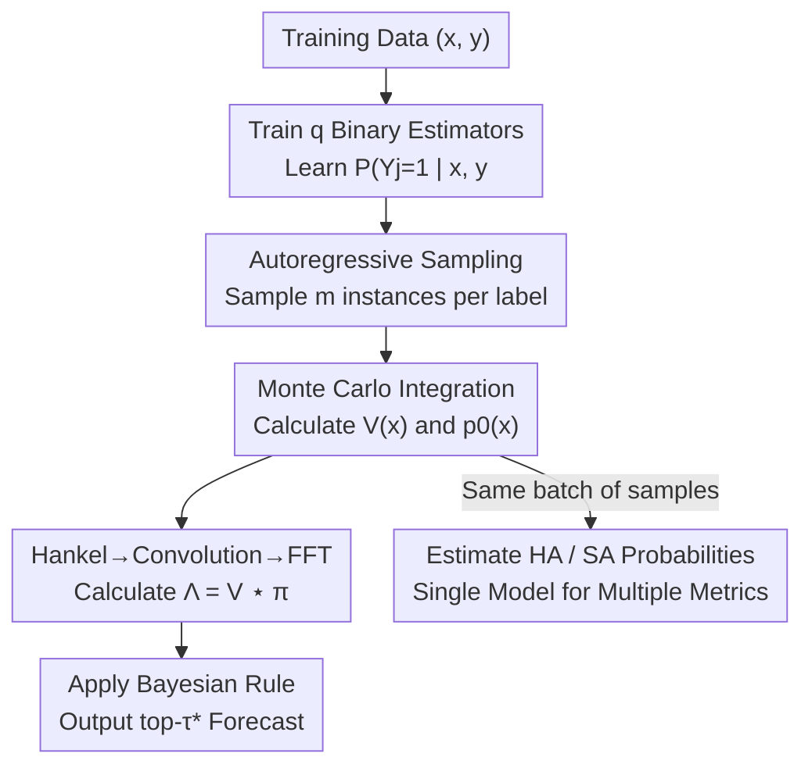

# Revisiting F-measure Optimization in Multi-Label Classification: A Sampling-based Approach

**Conference**: CVPR 2026  
**论文**: [CVF Open Access](https://openaccess.thecvf.com/content/CVPR2026/html/Wang_Revisiting_F-measure_Optimization_in_Multi-Label_Classification_A_Sampling-based_Approach_CVPR_2026_paper.html)  
**Code**: https://github.com/ZixunWang/MLC-F1-Sampling  
**Area**: Multi-label Classification / F-measure Optimization  
**Keywords**: Multi-label classification, F-measure optimization, Bayesian decision rules, Autoregressive sampling, FFT acceleration

## TL;DR
Addressing optimal F-measure prediction in multi-label classification, this paper rewrites the $O(q^3)$ matrix multiplication in the Bayesian rule into a convolution using the Hankel structure, further reducing complexity to $O(q^2\log q)$ via FFT. It replaces the traditionally difficult-to-train $q$ multinomial estimators with a "train $q$ binary estimators + autoregressive sampling + Monte Carlo integration" strategy to alleviate sparsity issues, consistently outperforming standard practices from the past decade across six datasets.

## Background & Motivation

**Background**: Multi-label classification (MLC) involves predicting multiple labels for a single sample simultaneously. Evaluation often uses the F-measure (the harmonic mean of precision and recall). Unlike Binary Relevance, which applies a 0.5 threshold to each label independently, the F-measure is a non-decomposable metric—it couples the entire label set, precluding label-wise independent optimization. Dembczynski et al. (2010) established the Bayesian optimal decision rule for F-measure (Theorem 1), proving that obtaining $q^2+1$ probabilities (a $q\times q$ matrix $V(x)$ plus the empty set probability $p_0(x)$) allows for consistent optimal prediction. This "estimate probabilities $\to$ apply Bayesian rule" paradigm has served as the standard solution for over a decade.

**Limitations of Prior Work**: The standard approach (denoted as DMN, Direct Multinomial estimation) suffers from two major engineering and statistical flaws. First is **Slow Prediction**: calculating $\hat\Lambda(x)=\hat V(x)U$ after obtaining $V(x)$ involves a matrix multiplication with $O(q^3)$ complexity, which becomes prohibitive as the number of labels $q$ grows (e.g., Bibtex has 159 labels). Second is **Difficulty in Estimation**: To estimate $V_{j,k}$, DMN reformulates the binary classification problem into $q$ multinomial tasks, where each estimator predicts $q+1$ classes. This "label transformation" (Equation 5) further splits already sparse positive samples into $q$ parts. Combined with the natural label imbalance in MLC, this creates an extremely long-tailed multinomial distribution that is very hard to train.

**Key Challenge**: The Bayesian rule itself is optimal and correct; however, obtaining the required probabilities $V(x)$ via "direct multinomial estimation" is both slow ($O(q^3)$ matrix multiplication) and inaccurate (sparsity caused by label transformation). The problem lies not with the Bayesian rule, but with the "computational method for prediction" and the "estimation strategy for probabilities."

**Goal**: Without altering the Bayesian rule and while maintaining consistency, this study aims to: (1) accelerate the matrix multiplication in the prediction phase; and (2) implement a probability estimation route that avoids label transformation and sparse distributions.

**Key Insight**: The authors make two observations. First, the matrix $U$ ($U_{k,\tau}=(k+\tau)^{-1}$) in the matrix multiplication is a **Hankel matrix** (constant entries along anti-diagonals). This structure allows converting matrix multiplication into convolution, accelerated via FFT. Second, drawing from the Bayesian inference experience that "sampling is better when direct estimation is hard" and the fact that generative classifiers often outperform discriminative ones under low-sample conditions, it is better to **sample first and then utilize Monte Carlo integration to compute probabilities** rather than directly estimating sparse multinomial distributions.

**Core Idea**: Use "Hankel $\to$ Convolution $\to$ FFT" to reduce prediction complexity from $O(q^3)$ to $O(q^2\log q)$. Replace "training $q$ multinomial estimators" with "training $q$ binary estimators for autoregressive sampling + Monte Carlo integration" to bypass label transformation and alleviate sparsity, termed SMN (Sampling-based MultiNomial estimation).

## Method

### Overall Architecture

The entire method is built upon Dembczynski's Bayesian rule, with the goal of estimating $V(x)\in[0,1]^{q\times q}$ and $p_0(x)$, then applying Theorem 1 for prediction. This pipeline modifies two components: the estimation phase uses the "binary estimator + autoregressive sampling + Monte Carlo integration" (SMN) instead of direct multinomial estimation; the prediction phase uses "Hankel convolution + FFT" instead of matrix multiplication. These two replacements are independent—FFT acceleration applies to any method based on Theorem 1, while SMN specifically addresses sparse estimation. An additional benefit: the sampled label instances can simultaneously estimate probabilities required for HA (Hamming Accuracy) and SA (Subset Accuracy) Bayesian rules, allowing one model to optimize multiple metrics.

### Key Designs

**1. Hankel Structure + FFT: Rewriting $O(q^3)$ Matrix Multiplication as Convolution**

The Bayesian rule requires calculating $\hat\Lambda(x)=\hat V(x)U$, where $U_{k,\tau}=(k+\tau)^{-1}$. This dense matrix multiplication is $O(q^3)$, becoming a prediction bottleneck as $q$ increases. The authors noticed that $U$ is a Hankel matrix—the values on each anti-diagonal are constant because $U_{k,\tau}$ only depends on the sum $k+\tau$. By flattening the anti-diagonals of $U$ into a vector $\pi=(U_{1,1},\cdots,U_{1,q},U_{2,q},\cdots,U_{q,q})^\intercal$, the product of the $j$-th row of $\hat V$ and $U$ equals the (flipped) convolution of that row with $\pi$: $\hat V_{j,\cdot}^\intercal U=\hat V_{j,\cdot}^\intercal\star\pi$, since $\pi_{k:k+q-1}=U_{1:q,k}$. Performing $q$ convolutions yields the entire $\hat\Lambda$. Convolution can be computed efficiently via Fast Fourier Transform (FFT), reducing complexity from $O(q^3)$ to $O(q^2\log q)$. This is well-supported by CUDA's cuFFT library. This approach was inspired by similar techniques used by Dai & Li for Dice optimization in segmentation, but here it is explicitly derived from the Hankel structure.

**2. Sample-then-Estimate: Replacing Multinomial Estimators with Binary Estimators**

To estimate $V_{j,k}=P(Y_j=1,\|Y\|_1=k\mid x)$, DMN uses label transformation for multinomial tasks, which fragments positive samples into long-tail distributions. This paper changes the approach: if $m$ label vector samples $\{\hat s^{(t)}\}_{t=1}^m$ can be drawn from the true conditional distribution $P(Y\mid X=x)$, then probabilities can be "counted" via Monte Carlo integration:

$$\hat V_{j,k}=\frac{1}{m}\sum_{t=1}^m \mathbb{1}\big(\hat s_j^{(t)}=1,\ \|\hat s^{(t)}\|_1=k\big),$$

As $m\to\infty$, this converges to the true value $V_{j,k}$ per the Law of Large Numbers. For sampling, the joint distribution is decomposed via the chain rule: $P(Y\mid x)=\prod_{j=1}^q P(Y_j\mid Y_{<j},x)$. Thus, $q$ **binary** estimators $\hat\psi_j$ are trained using BCE loss to learn the probability of the $j$-th label being positive given feature $x$ and preceding labels $y_{<j}$ (Equation 9). Together, these form an autoregressive model for step-by-step label sampling. Unlike multinomial estimators, these binary estimators are trained on **original labels**, avoiding sparsity and long-tail issues. If "sampling" is replaced with "greedy highest probability," the method reduces to the classic Classifier Chain—however, while Classifier Chain is a heuristic, this sampling approach provides theoretical consistency.

**3. Consistency Guarantee: Explicit Error Bounds for Sampling Estimation**

To validate the sampling estimation, the authors provide Theorem 2 for the consistency bound of $\hat V$. With probability at least $1-\delta$:

$$\| \hat V-V\|_F\le q\Big(\sqrt{\tfrac{\log(2q^2/\delta)}{2m}}+C\sqrt{q\,\epsilon_n}\Big),$$

where $\|\cdot\|_F$ is the Frobenius norm, and $\epsilon_{n}$ is the excess risk convergence rate of the binary estimator $\hat\psi_j$ under BCE loss. This bound splits the error into: (1) **Sampling error**, which vanishes as $m$ increases; and (2) **Training error** of the binary estimators. This explains why a small number of samples (e.g., $m=150$ for COCO with 80 labels) is sufficient for convergence, which the authors attribute to the low-dimensional structure of the label space.

**4. One Model, Multiple Metrics: Simultaneous HA/SA Optimization**

The Bayesian rules for different metrics differ (F-measure needs top-$\tau^*$, HA needs marginal probabilities at 0.5, SA needs the argmax of the joint distribution). Traditional approaches require separate models. This framework allows for unification: the samples $\{\hat s^{(t)}\}$ can be used to count marginal probabilities $\hat p_j=\frac{1}{m}\sum_t \hat s_j^{(t)}$ and joint probabilities $\hat p_y=\frac{1}{m}\sum_t \mathbb{1}(\hat s^{(t)}=y)$, which are then substituted into the respective Bayesian rules.

### Loss & Training

Binary estimators are trained using BCE loss (Equation 9) with inputs $(x, y_{<j})$ and targets $y_j$, sharing an encoder across $q$ heads. The framework is not limited to autoregressive sampling; changing the training condition to "all labels except self $y_{-j}$" and using Gibbs sampling (MCMC) also yields $V$, showing the sampling route is generalizable.

## Key Experimental Results

Experiments were conducted on six datasets: tabular (yeast, enron, medical, bibtex) and CV (COCO, VOC using ImageNet pre-trained ResNet50 features). All methods used a two-layer feedforward network as a backbone to ensure fair algorithmic comparison. Metrics are F1 ($\times 100$).

### Main Results (F1 Performance)

| Method | yeast | enron | medical | bibtex | COCO | VOC |
|------|-------|-------|---------|--------|------|-----|
| BR (Binary Relevance) | 62.20 | 51.50 | 33.89 | 29.70 | 77.19 | 84.24 |
| CC (Classifier Chain) | 62.75 | 51.83 | 32.96 | 34.15 | 77.51 | 83.86 |
| ASL (Asymmetric Loss) | 65.95 | 53.10 | 51.22 | 38.33 | 77.24 | 84.33 |
| SF1 (Smooth F1 Loss) | 63.89 | 52.92 | 36.17 | 31.11 | 77.87 | 84.49 |
| CCS [41] (Binary Proxy) | 65.16 | 54.89 | 23.94 | 21.06 | 75.17 | 83.84 |
| DMN [12] (Standard) | 65.89 | 55.33 | 38.54 | 37.85 | 77.27 | 85.01 |
| **SMN (Ours)** | **66.02** | **56.44** | **53.81** | **44.98** | **78.24** | **86.08** |

SMN achieved the best performance across all six datasets. Improvements were particularly significant on "difficult" datasets: medical (very small training set) improved from DMN's 38.54 to 53.81, and bibtex (159 labels) improved from 37.85 to 44.98. These datasets suffer most from sparsity, confirming that SMN effectively addresses DMN/CCS limitations.

### Running Time and Sampling Ablation

| Operation | yeast | enron | medical | bibtex | COCO | VOC |
|------|-------|-------|---------|--------|------|-----|
| Estimate $\hat V$: DMN | 3.34 | 5.70 | 5.49 | 59.27 | 85.10 | 15.01 |
| Estimate $\hat V$: SMN | 2.53 | 5.43 | 6.06 | 64.12 | 101.74 | 17.08 |
| Compute $\hat\Lambda$: Matrix Mult | 0.20 | 0.16 | 0.17 | 0.43 | 1.35 | 0.72 |
| Compute $\hat\Lambda$: FFT | 0.10 | 0.14 | 0.15 | 0.33 | 1.03 | 0.63 |

FFT was faster than matrix multiplication on all datasets, with gains increasing with label count (e.g., 1.35s $\to$ 1.03s on COCO, approx. 1.3$\times$ speedup). While SMN is slightly slower due to sampling, the overhead is under 20% on most datasets, which the authors consider worthwhile for the performance gains.

### Key Findings

- **Sampling Order Robustness**: Randomizing label order (100 orders for tabular, 20 for COCO) showed low variance (std < 0.4%). The default order performance was near the mean of random orders, indicating order is not a critical factor.
- **Gibbs Sampling Effectiveness**: Replacing autoregressive sampling with Gibbs sampling yielded comparable results (e.g., medical 56.68), proving the framework is compatible with various sampling methods.
- **Multi-metric Feasibility**: The same set of samples provided optimal predictions for F-measure, HA, and SA, eliminating the need to train separate models.

## Highlights & Insights

- **Converting Hankel Structure to 1.3$\times$ Acceleration**: By identifying that $U$ is a Hankel matrix, the study transforms a dense matrix multiplication into a convolution with FFT acceleration. This "observation of structure $\to$ change in computation paradigm" is a clever optimization applicable to any method based on this Bayesian rule.
- **Reinterpreting Estimation as a Sampling Dual**: The core insight is that DMN's failure stems from label transformations creating sparsity. By switching to a sampling-based "counting" method with binary estimators, the study bypasses these hurdles.
- **Connecting New and Classic Methods**: The observation that SMN reduces to Classifier Chain under greedy decoding provides a theoretical grounding for why CC works while offering clear improvements via consistent sampling.
- **Practical Theoretical Bound**: Theorem 2 explains why $m=150$ samples suffice, grounding hyperparameter selection in logic rather than trial and error.

## Limitations & Future Work

- **Sampling Overhead**: SMN is generally slower than DMN in estimating $\hat V$ (85s $\to$ 102s on COCO). While manageable, the trade-off requires caution in ultra-high $q$ or low-latency scenarios.
- **Simplicity of Backbones**: The use of 2-layer MLPs ensured fair comparison but did not explore gains with end-to-end deep backbones like Transformers for label dependency modeling.
- **Dependence on Binary Estimator Quality $\epsilon_n$**: The error bound includes $C\sqrt{q\,\epsilon_n}$, implying that if binary estimators are poorly trained (as in small datasets), estimation quality suffers.
- **Potential Improvements**: Replacing autoregressive heads with structures that explicitly model label dependencies or adaptively determining $m$ for easy vs. hard samples could further optimize performance and speed.

## Related Work & Insights

- **vs DMN [Dembczynski 12]**: Both use the same Bayesian rule, but DMN relies on label transformation and multinomial estimators, causing sparsity and $O(q^3)$ complexity. SMN uses binary estimators + sampling and $O(q^2 \log q)$ FFT, outperforming DMN particularly on sparse datasets.
- **vs CCS [41]**: CCS uses binary estimators but retains label transformation and ignores label dependencies, resulting in poor performance on datasets like medical (23.94). SMN uses autoregressive training to capture dependencies.
- **vs Classifier Chain [31]**: SMN reduces to CC under greedy decoding but provides theoretical consistency and optimization for the F-measure.
- **vs Waegeman [37]**: Earlier work also used autoregressive sampling but lacked the analysis of its benefits and the theoretical consistency bounds provided here.

## Rating
- Novelty: ⭐⭐⭐⭐ Identifying the Hankel structure for FFT acceleration and using sampling to bypass sparsity are effective, logically sound deconstructions of existing bottlenecks.
- Experimental Thoroughness: ⭐⭐⭐⭐ Coverage of six datasets across domains plus comprehensive ablations (sampling order, Gibbs, multi-metric). Lacks end-to-end deep backbone validation.
- Writing Quality: ⭐⭐⭐⭐ Strong logical flow from motivation to theory and experiment.
- Value: ⭐⭐⭐⭐ Solves the dual "speed" and "training" issues for a decade-old standard solution with high practical applicability.

<!-- RELATED:START -->

## Related Papers

- [\[CVPR 2026\] Prototype-based Causal Intervention for Multi-Label Image Classification](prototype-based_causal_intervention_for_multi-label_image_classification.md)
- [\[CVPR 2026\] Cross-View Distillation and Adaptive Masking for Incomplete Multi-View Multi-Label Classification](cross-view_distillation_and_adaptive_masking_for_incomplete_multi-view_multi-lab.md)
- [\[CVPR 2026\] Revisiting Sparsity Constraint Under High-Rank Property in Partial Multi-Label Learning](revisiting_sparsity_constraint_under_high-rank_property_in_partial_multi-label_l.md)
- [\[CVPR 2026\] DF²-VB: Dual-level Fuzzy Fusion with View-specific Boosting for Multi-view Multi-label Classification](df2-vb_dual-level_fuzzy_fusion_with_view-specific_boosting_for_multi-view_multi-.md)
- [\[CVPR 2026\] EXOTIC: External Vision-driven Incomplete Multi-view Classification](exotic_external_vision-driven_incomplete_multi-view_classification.md)

<!-- RELATED:END -->
