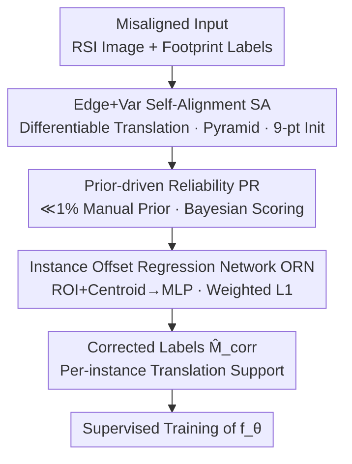

# Revisiting the Necessity of Full Accuracy: Weakly Supervised Object-Level Offset Correction for Misaligned Building Labels

**Conference**: CVPR 2026  
**Paper**: [CVF Open Access](https://openaccess.thecvf.com/content/CVPR2026/html/Xu_Revisiting_the_Necessity_of_Full_Accuracy_Weakly_Supervised_Object_Level_Offset_CVPR_2026_paper.html)  
**Code**: https://github.com/dayunyan/OMAF-Building-Alignment  
**Area**: Remote Sensing / Semantic Segmentation  
**Keywords**: Building extraction, label offset correction, weakly supervised, instance-level offset, domain adaptation

## TL;DR
To address the misalignment between building footprint labels and roof positions caused by the lack of orthorectification in Google Earth images, this paper proposes the OMAF framework. It uses a differentiable self-alignment with edge and variance constraints to estimate instance-level offsets, filters these using Bayesian confidence with minimal manual priors, and distills the knowledge into an offset regression network. This process generates clean corrected labels, improving various segmentation models' mIoU by up to 40.6%.

## Background & Motivation
**Background**: Semantic segmentation of buildings in high-resolution remote sensing imagery is fundamental for urban planning and disaster response. A cost-effective paradigm for data expansion is pairing Google Earth RGB imagery with public footprint databases (e.g., Google Open Buildings, Microsoft Global ML Building Footprints), particularly for developing regions where professional annotations are scarce.

**Limitations of Prior Work**: Free Google Earth imagery lacks RPC metadata and high-precision DSMs, preventing rigorous orthorectification. This results in intrinsic 2D translation offsets between footprint outlines and roof positions in the image (Figure 2 categorizes these into position offset, shape mismatch, and false additions, with position offset being most prevalent). Directly training models on misaligned $(I, M_{raw})$ pairs forces them to learn incorrect spatial associations, significantly degrading performance in dense urban areas.

**Key Challenge**: Prior methods either rely on **simulated offsets** (artificially adding displacement to ground truth) for supervised learning—which generalizes poorly to real images—or use **template matching + cross-correlation** for local grid searches. The latter's performance depends heavily on template design; edge-based templates only work for regular building textures, and complex urban scenes require labor-intensive manual template design. Essentially, prior work assumes either precise reference labels are available or that the majority of labels in a dataset are unbiased, assumptions that fail across arbitrary spatiotemporal conditions in real-world geographic data.

**Goal**: To generate high-quality, spatially aligned corrected labels from raw misaligned footprint labels with **almost no additional manual labeling**, which can then be used to train any segmentation model.

**Key Insight**: Two key observations are made: (1) When correctly aligned, the footprint boundaries should fit the strong edges of roof outlines in the image; (2) The pixels within a single roof region should exhibit consistent texture/color and low variance. By formulating alignment as a differentiable objective function, instance-level offsets can be optimized automatically without manual templates.

**Core Idea**: A three-stage pipeline consisting of "Alignment → Confidence Selection → Regression Distillation." It uses differentiable self-alignment to formulate alignment as an optimization problem, applies minimal priors (≪1%) to score each estimation, and uses a regression network to generalize knowledge to the full set. The title "Revisiting the Necessity of Full Accuracy" posits that pixel-perfect labels are not mandatory; weakly supervised object-level offset correction is sufficient to recover segmentation performance.

## Method

### Overall Architecture
OMAF (Object-based Multi-stage Alignment Framework) decomposes label correction into two phases. Phase I estimates the optimal offset vector $\hat{v}_i$ for each instance $i$ to generate a corrected label set $\hat{M}_{corr}=\bigcup_i \mathcal{T}_{\hat{v}_i}(M_{raw}^i)$. Phase II uses the corrected clean pairs $(I, \hat{M}_{corr})$ for fully supervised training of the final segmentation model $f_\theta$. Phase I sequentially connects three modules: **Self-Alignment (SA)** searches for coarse offsets per instance via edge and variance losses; **Prior-driven Reliability (PR)** uses statistical priors to score offsets and suppress outliers; **Offset Regression Network (ORN)** distills confidence-weighted pseudo-labels into a generalizable regressor to output smooth offsets for the whole set.

Misalignment is modeled as instance-level 2D translation: for instance $i$, there exists an unknown $v_i=(dx_i, dy_i)$, such that the corrected mask is $M^i(x,y)=M_{raw}^i(x-dx_i, y-dy_i)$.

### Key Designs

**1. Differentiable Self-Alignment (SA): Turning Alignment into Gradient Descent**

This module addresses the limitations of manual template matching and non-differentiable grid searches. A total alignment loss is defined for each instance: $\mathcal{L}_{align}(v)=\lambda_{edge}\mathcal{L}_{edge}(v)+\lambda_{var}\mathcal{L}_{var}(v)+\lambda_{reg}\mathcal{L}_{reg}(v)$. The edge term $\mathcal{L}_{edge}$ fits the mask boundary $\partial M_v$ to strong image edges using a distance transform (DT) map $D_E$. The variance term $\mathcal{L}_{var}=\sum_{c\in\{R,G,B\}}\text{Var}(I_c(M_v))$ encourages homogeneity within the roof mask. The regularization term $\mathcal{L}_{reg}=\|v\|_2^2$ penalizes excessive offsets. 

To handle the non-differentiable nature of translation sampling, bilinear interpolation is used: $M_v=\text{Sample}_{bilinear}(M_{raw}, G-v)$, allowing $\nabla_v\mathcal{L}_{align}$ to be calculated. To avoid local minima in non-convex loss surfaces, a **coarse-to-fine pyramid** and **robust 9-point initialization** are employed.

**2. Statistical Prior-Driven Confidence Estimation (PR): Scoring Offsets with ≪1% Manual Labels**

SA is accurate for most instances but can fail by converging to structurally similar but incorrect positions. A small batch of representative samples (≪1% of the set) is manually labeled to fit a 2D Gaussian prior $p(v)=\mathcal{N}(v\,|\,\mu_p,\Sigma_p)$ of ground truth offsets. Under a Bayesian framework, the reliability $c_i$ of an SA estimate $\hat{v}_i^*$ is simplified to the prior density $p(\hat{v}_i^*)$. Offsets that are statistically reasonable according to the manual prior receive high scores, while outliers are downweighted.

**3. Instance-Level Offset Regression Network (ORN): Distilling Noise into Generalizable Knowledge**

Rather than direct segmentation with noisy labels, OMAF trains a network to **regress instance-level offsets** directly. This avoids edge blurring caused by pixel-level pseudo-labels. A DeepLabV3+ backbone extracts multi-scale feature maps $F$. For each instance $i$, ROI pooling on the bounding box $B_i$ extracts features $f_{roi_i}$, which are concatenated with normalized centroid coordinates $p_i$ as spatial context. An MLP then regresses the predicted offset $\hat{v}_{pred,i}$. 

The network is trained with a **confidence-weighted L1 loss**: $\mathcal{L}_{regress}=\frac{1}{\sum c_i}\sum_i c_i\cdot\|\hat{v}_{pred,i}-\hat{v}_i^*\|_1$, forcing the model to focus on high-confidence estimates and ignore poor pseudo-labels. This stage provides the largest performance gain (+5.00% mIoU).

### Loss & Training
ORN is trained using AdamW with cosine annealing for 1000 iterations. **Rotation and flip augmentations are explicitly disabled** during ORN training to preserve the learning of systematic geometric biases. The final segmentation network is trained for 2000 iterations using standard augmentations (scaling, rotation, flipping).

## Key Experimental Results

Experiments were conducted on two datasets: Islahiye (5825 buildings) and Antakya (7279 buildings), using Google Earth Pro imagery (0.5m resolution) lacking orthorectification. Labels were from Microsoft and BRIGHT databases.

### Main Results (Misaligned $M_{raw}$ vs. OMAF $\hat{M}_{corr}$, mIoU %)

Across CNN, Transformer, and Mamba architectures, OMAF consistently improves performance:

| Model | Architecture | Islahiye mIoU | Antakya mIoU | Max Gain |
|--------|------|------|------|------|
| Deeplabv3plus | CNN | 57.8 → 75.7 | 53.9 → 66.0 | +17.9 |
| UNetFormer | Transformer | 35.8 → 76.4 | 45.0 → 68.2 | **+40.6** |
| SegFormer-B | Transformer | 58.1 → 77.3 | 54.8 → 67.7 | +19.2 |
| VMamba-B | Mamba | 58.0 → 76.3 | 57.3 → 68.5 | +18.3 |

### Ablation Study (Islahiye, mIoU %)

| Configuration | mIoU | Gain | Description |
|------|------|------|------|
| Misaligned $M_{raw}$ | 57.12 | — | Baseline |
| + SA | 66.34 | +9.22 | Edge+Var Self-Alignment only |
| + PR | 67.50 | +1.16 | Confidence weighting |
| + ORN (w/o $p_i$) | 72.50 | +5.00 | Regression distillation |
| + ORN (w/ $p_i$) | 73.32 | +0.82 | Centroid spatial context |

### Key Findings
- **SA and ORN are primary drivers**: SA provides a significant initial boost (+9.22), while ORN provides the largest single refinement (+5.00) by generalizing correct offset patterns.
- **Save sensitive models**: Models most sensitive to misalignment (e.g., UNetFormer) see the highest benefit (+40.6 mIoU), effectively normalizing performance across architectures.
- **Centroid context $p_i$** specifically aids buildings with larger centroid shifts.

## Highlights & Insights
- **Differentiable Alignment**: Replacing manual grid searches with a differentiable DT edge term and regional variance term allows for universal application without per-class templates.
- **Minimal Prior Leverage**: Using ≪1% of manual data as a Bayesian "anchor" is a highly economical way to filter pseudo-labels at scale.
- **Regression vs. Soft Labels**: Regressing scalar offsets instead of predicting soft pixel labels prevents boundary blurring, a common pitfall in noisy label learning.

## Limitations & Future Work
- **Pure 2D Translation Assumption**: The model assumes rotation and scale issues are negligible; this may not hold in areas with extreme terrain or high oblique viewing angles.
- **Non-Translation Errors**: Shape mismatches and missing/extra buildings (temporal differences) are only handled indirectly via confidence filtering.
- **Manual Prior Dependency**: While minimal, the framework still requires a small set of representative manual labels to define the offset distribution.

## Related Work & Insights
- **vs. Simulated Offsets**: Unlike methods relying on synthetic noise, OMAF estimates real distributions from the data itself, leading to better real-world generalization.
- **vs. Template Matching**: By using differentiable optimization, OMAF bypasses the need for hand-crafted templates, making it more robust for complex urban scenes.
- **vs. Learning-based Correction**: OMAF does not require the "majority unbiased" assumption, as the PR module explicitly identifies and downweights statistically improbable labels.

## Rating
- **Novelty**: ⭐⭐⭐⭐ Formulating alignment as differentiable optimization combined with Bayesian filtering and regression distillation is highly practical for remote sensing.
- **Experimental Thoroughness**: ⭐⭐⭐⭐ Solid results across seven models, though testing is limited to two geographically similar datasets.
- **Writing Quality**: ⭐⭐⭐⭐ Clear problem modeling and intuitive framework descriptions.
- **Value**: ⭐⭐⭐⭐ Provides a low-cost, deployable solution for large-scale remote sensing dataset construction.

<!-- RELATED:START -->

## Related Papers

- [\[NeurIPS 2025\] Semi-Supervised Regression with Heteroscedastic Pseudo-Labels](../../NeurIPS2025/others/semi-supervised_regression_with_heteroscedastic_pseudo-labels.md)
- [\[CVPR 2026\] 3D-Object Perception Transformer (3PT)](3d-object_perception_transformer_3pt.md)
- [\[CVPR 2026\] Debiased Sample Selection for Learning with Noisy Labels](debiased_sample_selection_for_learning_with_noisy_labels.md)
- [\[ICCV 2025\] Revisiting Image Fusion for Multi-Illuminant White-Balance Correction](../../ICCV2025/others/revisiting_image_fusion_for_multi-illuminant_white-balance_correction.md)
- [\[CVPR 2026\] Revisiting F-measure Optimization in Multi-Label Classification: A Sampling-based Approach](revisiting_f-measure_optimization_in_multi-label_classification_a_sampling-based.md)

<!-- RELATED:END -->
