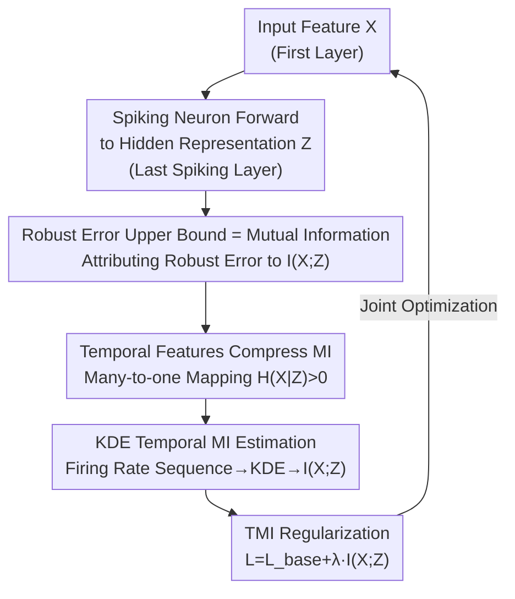

# Robust Spiking Neural Networks by Temporal Mutual Information

**Conference**: CVPR 2026  
**Paper**: [CVF Open Access](https://openaccess.thecvf.com/content/CVPR2026/html/Xu_Robust_Spiking_Neural_Networks_by_Temporal_Mutual_Information_CVPR_2026_paper.html)  
**Code**: https://github.com/zju-bmilab/SNN_TMI_code  
**Area**: Spiking Neural Networks / Adversarial Robustness  
**Keywords**: Spiking Neural Networks, Adversarial Robustness, Mutual Information, Information Bottleneck, Temporal Characteristics

## TL;DR
From an information theory perspective, this paper proves that the upper bound of the robust error in deep networks is determined by the "mutual information (MI) between input and hidden representations." It indicates that the unique temporal characteristics of SNNs (accumulative firing + temporal spike dependence) naturally result in smaller mutual information. Based on this, it proposes a TMI regularization term that directly minimizes MI along the temporal dimension, consistently enhancing the intrinsic robustness of SNNs across multiple datasets like CIFAR/ImageNet under various attacks.

## Background & Motivation

**Background**: Spiking Neural Networks (SNNs) have gained attention for their event-driven, low-power temporal dynamics. However, as deployments increase, their robustness under adversarial perturbations has become a critical issue. Existing work to enhance SNN robustness follows two paths: one adapts spatial feature methods from ANNs (Adversarial Training AT, input perturbation, weight regularization), while the other leverages SNN temporal dynamics (frequency domain encoding, timing-based gradient calculation).

**Limitations of Prior Work**: The first path treats SNNs as static networks, completely ignoring their temporal characteristics, which limits effectiveness; furthermore, adversarial training depends on external adversarial samples and does not provide intrinsic robustness, potentially failing against different types of attacks. The second path, although modeling temporal information, rarely explains **why and to what extent** temporal characteristics affect robustness—lacking a theoretical bridge to explain "temporal characteristics $\to$ robustness."

**Key Challenge**: The root cause of robustness has not been clearly attributed to a specific quantity. If only spatial features are considered, the network in the inference stage is a deterministic one-to-one mapping. Given the hidden representation $Z$, the input $X$ can be inversely mapped, resulting in a conditional entropy $H(X|Z)=0$. This leads to mutual information being calculated as overly large and loose, failing to characterize robustness.

**Goal**: (1) Establish a rigorous connection between the model's robust error and an optimizable quantity; (2) Prove that SNN temporal characteristics naturally optimize this quantity; (3) Provide a practical estimation and regularization method.

**Key Insight**: The authors utilize the Information Bottleneck (IB) principle to view the network as a Markov chain $X\to Z\to Y$. Using the generalization error bound by Shamir et al., they rewrite the "robust error" as an upper bound related to mutual information $I(X;Z)$—the tighter (smaller) the MI, the tighter the robust error bound. It is observed that SNN spike firing is a **many-to-one** mapping; given spikes, the membrane potential cannot be uniquely recovered, thus $H(X|Z)>0$, making the mutual information naturally smaller than that of spatial features.

**Core Idea**: Replace "adapting ANN spatial defenses" with "direct minimization of input-hidden representation mutual information along the temporal dimension," explicitly utilizing the intrinsic advantage of tight mutual information brought by SNN temporal characteristics as robustness regularization.

## Method

### Overall Architecture
The objective is to add a **temporal mutual information regularization term** during SNN training to grant the network intrinsic robustness without relying on adversarial samples. The pipeline is as follows: first, theoretically attribute the robust error bound to $I(X;Z)$; then, argue that SNN temporal characteristics naturally tighten $I(X;Z)$; finally, engineer a method to compress the first-layer input features $X$ and the last spiking neuron layer's hidden representation $Z$ into one-dimensional "firing rate sequences," using Kernel Density Estimation (KDE) to fit continuous distributions and calculate $I(X;Z)$, which is then optimized alongside the standard classification loss.

The framework consists of a "theoretical side (why minimize $I(X;Z)$)" and an "implementation side (how to estimate and minimize)." The implementation side follows a clear forward pipeline:

### Key Designs

**1. Robust Error Upper Bound = Input-Hidden MI: Finding an Optimizable "Anchor" for Robustness**

The problem with adversarial training is that it treats symptoms rather than the root cause—it relies on memorizing external samples and fails against new attacks, as it does not characterize what determines robustness. The authors view the network as an information flow $X\to Z\to Y$ and introduce a corresponding hidden representation $Z+\epsilon'$ for an adversarial sample $X+\epsilon$. In a robust model, $Z+\epsilon'$ merely contains redundant noise compared to $Z$, and the information flow can be written as $X+\epsilon \to Z+\epsilon' \to Z \to Y$. During inference, parameters are fixed, and there is no uncertainty in $Y$ given $Z$, so $\hat H(Y|Z)=\hat H(Y|Z+\epsilon')=0$, thus $\hat I(Z+\epsilon';Y)=\hat I(Z;Y)$. Substituting into the generalization error bound by Shamir et al., the robust error is bounded by:

$$|I(Z;Y)-\hat I(Z+\epsilon';Y)| \le C\big(c_1\log(m)\sqrt{|Z|}\,I(X;Z) + c_2|Z|^{3/4}I(X;Z)^{1/4} + c_3\hat I(X;Z)\big)$$

This transforms the abstract "robust error" into an upper bound that **monotonically depends on $I(X;Z)$**: the smaller the $I(X;Z)$, the tighter the bound, and the more intrinsically robust the model. This step is the theoretical foundation, making "minimizing mutual information" a justified optimization objective rather than an empirical heuristic. ⚠️ Refer to the original paper for the specific forms of constants $c_1,c_2,c_3,C$.

**2. Temporal Characteristics Tighten MI Naturally: Many-to-One Mapping Makes $H(X|Z)>0$**

To tighten the upper bound, $I(X;Z)=H(X)-H(X|Z)$ must be reduced; since $H(X)$ is fixed for a given $X$, the focus is whether the conditional entropy $H(X|Z)$ is large. The authors compare two types of features. Under **spatial features**, ANN inference is a deterministic one-to-one mapping $Z_S=\sigma(WX_S+b)$, where $X_S$ can be uniquely recovered from $Z_S$, making $H(X_S|Z_S)=0$ and the MI large. Under **temporal characteristics**, SNN spike transmission is **many-to-one** for two reasons: first, the **accumulative firing mechanism**—membrane potential accumulates until a threshold triggers a spike, so $Z$ cannot recover the specific membrane potential (different $X_1, X_2$ map to the same spike), thus $H(X|Z)>0$; second, **temporal dependency between spikes**—the current spike $z_t$ is influenced by current and all previous inputs $x_i\,(i\le t)$, so $x_t$ cannot be uniquely determined from $z_t$. Together, these result in $H(X|Z)>H(X_S|Z_S)=0$, leading to $I(X;Z)<I(X_S;Z_S)$. This is the fundamental reason why SNNs are more suitable for this type of intrinsic robustness regularization: the temporal dimension itself acts as a free information compressor.

**3. KDE Temporal MI Estimation: Converting Spike Sequences into Differentiable Continuous Distributions**

Directly calculating MI on SNNs faces two challenges: existing histogram binning methods (AIMIE) ignore continuous information between spikes, and for efficiency, the SNN time step $T$ is small, hindering discriminative distribution from few bins. The authors use **firing rate sequences + Kernel Density Estimation (KDE)**. Temporal features are averaged across the channel dimension ($\hat X_{input}=\frac{1}{C_i}\sum_j x_i[:,j,:,:]$) and then averaged across spatial dimensions to obtain a 1D firing rate sequence $X\in\mathbb{R}^T$ (same for $Z$). Channel averaging removes spatial noise while retaining more continuous information than max-pooling. A Gaussian KDE is then applied to the sequence of length $T$ to estimate probability density, e.g., $\text{PDF}_X=\frac{1}{T}\sum_{i=1}^{T}\exp\!\big(-\frac{(x_i-\hat b_{x_j})^2}{2\sigma^2}\big)$, deriving marginal and joint distributions to compute $I(X;Z)=\sum_{i}\sum_{j}p(\hat b_{x_i},\hat b_{z_j})\log\frac{p(\hat b_{x_i},\hat b_{z_j})}{p(\hat b_{x_i})p(\hat b_{z_j})}$. KDE is smoother and converges faster than histograms, providing usable continuous distribution estimates even at small $T$.

**4. TMI Regularization and Layer Selection: Using MI as a Loss Term**

With a differentiable $I(X;Z)$, it is added as a regularization term to any conventional loss:

$$L = L_{base}(Y,Y_{target}) + \lambda\, I(X;Z)$$

Where $L_{base}$ is typically cross-entropy for SNNs, and $\lambda$ is a fixed scaling coefficient (set to 0.05 in experiments). A key engineering choice is which layers to use for $I$. By the Data Processing Inequality, a shallow layer $Z'$ satisfies $I(X;Z)\le I(X;Z')$; choosing a shallow layer might imply poor extraction ability, dragging down final features. Therefore, TMI uses the **first-layer input $X$** and the **last spiking neuron layer (before the classification layer) hidden representation $Z$**—covering the entire info flow while concentrating regularization on the most representative deep representation. Ablations confirm that deep $Z$ outperforms shallow $Z'$ by about 3% on PGD/FGSM.

### Loss & Training
The final objective is $L=L_{base}+\lambda I(X;Z)$. In KDE, bandwidth is fixed at $\sigma=0.4$ with 256 uniform bins in the $[0,255]$ range, and $\lambda=0.05$. This regularization can be combined with any training paradigm (STBP, TET, SNN-RAT, etc.) and is universal across attack types as it enhances "intrinsic robustness" rather than specific adversarial samples.

## Key Experimental Results

Datasets: CIFAR-10/100, DVS-CIFAR10, Tiny-ImageNet, ImageNet; Networks: VGG11, AlexNet, VGGSNN; Attacks: FGSM, PGD, BIM, RGA (SNN-specific), AutoAttack, Gaussian Noise (white-box $\epsilon=4/255$, some $8/255$).

### Main Results (CIFAR-100, VGGSNN/AlexNet, Test Accuracy % under PGD/FGSM)

| Network | Method | Natural | FGSM | PGD | Note |
|------|------|---------|------|-----|------|
| VGGSNN | STBP | 68.11 | 13.51 | 2.05 | Baseline |
| VGGSNN | STBP-H (Output Entropy) | 68.62 | 12.14 | 1.69 | Alternative Reg |
| VGGSNN | STBP-AIMIE (Histogram MI) | 67.98 | 12.54 | 1.47 | Alternative Reg |
| VGGSNN | **STBP-TMI (Ours)** | 68.12 | **15.20** | **2.45** | FGSM +1.7%, PGD +0.4% |
| VGGSNN | TET | 72.66 | 15.19 | 2.25 | Baseline |
| VGGSNN | **TET-TMI (Ours)** | 72.32 | **17.29** | **4.63** | PGD doubled |
| AlexNet | STBP | 66.33 | 13.11 | 2.40 | Baseline |
| AlexNet | **STBP-TMI (Ours)** | 66.44 | **15.20** | **5.02** | Significant PGD gain |

TMI consistently improves points across various attacks with almost no loss in Natural accuracy, performing better than output entropy regularization (-H) and histogram mutual information (-AIMIE). It also works when combined with SOTA robust methods: for CIFAR-100/VGG11 under FGSM, SNN-RAT improves robust accuracy from 4.30% to 25.86%, and adding TMI further increases it to **27.32%**.

### Ablation Study (CIFAR-100, FGSM/PGD)

| Configuration | FGSM | PGD | Note |
|------|------|-----|------|
| TMI (Channel Avg + Deep $Z$) | **25.80** | **4.36** | Complete Method |
| Max-pooling instead of Average | 12.23 | — | Half performance drop |
| Shallow $Z'$ instead of Deep $Z$ | ~22.8 | ~1.4 | ~3% lower than deep |

Additional Temporal Average Spike Activity (TASA) analysis (Table 2, CIFAR-10/AlexNet/PGD): Without TMI, the TASA difference between original and adversarial images in AlexNet increases per layer, reaching 0.1661 at layer 5; with TMI, it drops to **0.0802**, indicating the model learns more similar temporal features for both images.

### Key Findings
- **Channel averaging is more critical than max-pooling**: Max-pooling compresses discrete spikes into single values, losing continuous info, causing FGSM robust accuracy to plummet from 25.80% to 12.23%. Continuous representation (Averaging + KDE) is a prerequisite for TMI.
- **Deep layer $Z$ is superior to shallow $Z'$**: Smaller MI better characterizes how well input info is extracted. Applying regularization to the deep representation before the classification layer yields ~3% higher results.
- **Temporal characteristics are the effective metric for robustness**: MI calculated using SNN spatial features (MINE) shows no stable monotonic relationship with robustness, while temporal MI shows a clear trend where "higher MI leads to more fragility"—providing empirical support for "why use temporal regularization."

## Highlights & Insights
- **Translating "Robustness" to "Mutual Information" to "Temporal Characteristics"**: The two-level reduction (Robust error bound $\leftarrow$ $I(X;Z)$ $\leftarrow$ SNN many-to-one mapping) makes an empirical goal optimizable and interpretable. This is the most elegant part of the paper.
- **Turning SNN "weaknesses" into advantages**: Irreversible spike firing and unrecoverable membrane potentials, originally seen as information loss, provide the free $H(X|Z)>0$ compression that serves as the source of intrinsic robustness.
- **KDE vs. Histogram for MI Estimation**: This trick is transferable to any scenario requiring "distribution estimation under small samples/short sequences," being smoother and faster to converge.
- **Plug-and-play Regularization**: TMI does not depend on adversarial samples and can be stacked on STBP/TET/SNN-RAT. As an intrinsic robustness enhancer, it is more universal than adversarial training.

## Limitations & Future Work
- Absolute robust accuracy remains low: For CIFAR-100/PGD, even the best results are in the single digits (e.g., 4–5%); TMI provides "relative improvement" rather than making robustness practical for high-stakes use.
- Theoretical bounds rely on several assumptions (IB Markov chain, deterministic inference, $\hat H(Y|Z)=0$, etc.), with many constant terms; the quantitative relationship between bound tightness and actual gain is not fully quantified. ⚠️ Refer to the original paper for derivation details.
- MI is only calculated between "First Layer $\leftrightarrow$ Last Spike Layer." Whether this is the optimal layer choice for all architectures or holds for very deep networks is not fully explored.
- Future directions: Explicitly combining TMI with adversarial training or extending to multi-layer MI constraints; validating energy-robustness trade-offs on neuromorphic hardware.

## Related Work & Insights
- **vs. Adversarial Training (AT / HIRE-SNN / SNN-RAT / MPPD)**: These rely on external adversarial samples for robustness, lack intrinsic robustness, and are easily bypassed by new attacks. TMI focuses on intrinsic robustness from an information theory standpoint, is independent of samples, and can further improve SNN-RAT.
- **vs. Temporal Dynamics Methods (FEEL-SNN frequency encoding / Temporal gradient reg)**: These improve temporal modeling but don't explain *why* temporal features affect robustness. This paper provides the $H(X|Z)>0$ theoretical explanation.
- **vs. ANN MINE MI Estimation**: MINE approximates spatial MI via batch sampling, destroying individual image specificity and lacking a stable relationship with SNN robustness. TMI uses KDE on the temporal dimension, bringing a ~1.69% gain on CIFAR-100/FGSM vs. MINE's ~0.43%.
- **vs. Histogram MI (AIMIE)**: Histograms ignore continuous info between spikes and fail at small $T$. KDE provides smoother, faster-converging estimates, resulting in better robustness.

## Rating
- Novelty: ⭐⭐⭐⭐⭐ Reducing robust error bounds to temporal MI and identifying SNN many-to-one mapping as a natural MI compressor is a novel and self-consistent perspective.
- Experimental Thoroughness: ⭐⭐⭐⭐ Covers 5 datasets, 3 networks, and multiple attacks, including TASA and MI-robustness trend analysis; however, absolute robust accuracy is low and some results are in the appendix.
- Writing Quality: ⭐⭐⭐⭐ Theoretical derivations are clear, and motivation progresses logically. There are many constants, and some symbols require cross-referencing with the text.
- Value: ⭐⭐⭐⭐ Provides an interpretable theoretical framework and plug-and-play regularization for SNN robustness, useful for neuromorphic/low-power robust deployment.

<!-- RELATED:START -->

## Related Papers

- [\[CVPR 2026\] On the Role of Temporal Granularity in the Robustness of Spiking Neural Networks](on_the_role_of_temporal_granularity_in_the_robustness_of_spiking_neural_networks.md)
- [\[CVPR 2026\] Temporal Interaction in Spiking Transformers with Multi-Delay Mixer](temporal_interaction_in_spiking_transformers_with_multi-delay_mixer.md)
- [\[CVPR 2026\] Temporal Representation Enhancement (TRE): Learning to Forget Dominant Patterns for Enhanced Temporal Spiking Features](temporal_representation_enhancement_tre_learning_to_forget_dominant_patterns_for.md)
- [\[ICML 2026\] Bullet Trains: Parallelizing Training of Temporally Precise Spiking Neural Networks](../../ICML2026/others/bullet_trains_parallelizing_training_of_temporally_precise_spiking_neural_networ.md)
- [\[AAAI 2026\] TDSNNs: Competitive Topographic Deep Spiking Neural Networks for Visual Cortex Modeling](../../AAAI2026/others/tdsnns_competitive_topographic_deep_spiking_neural_networks_for_visual_cortex_mo.md)

<!-- RELATED:END -->
