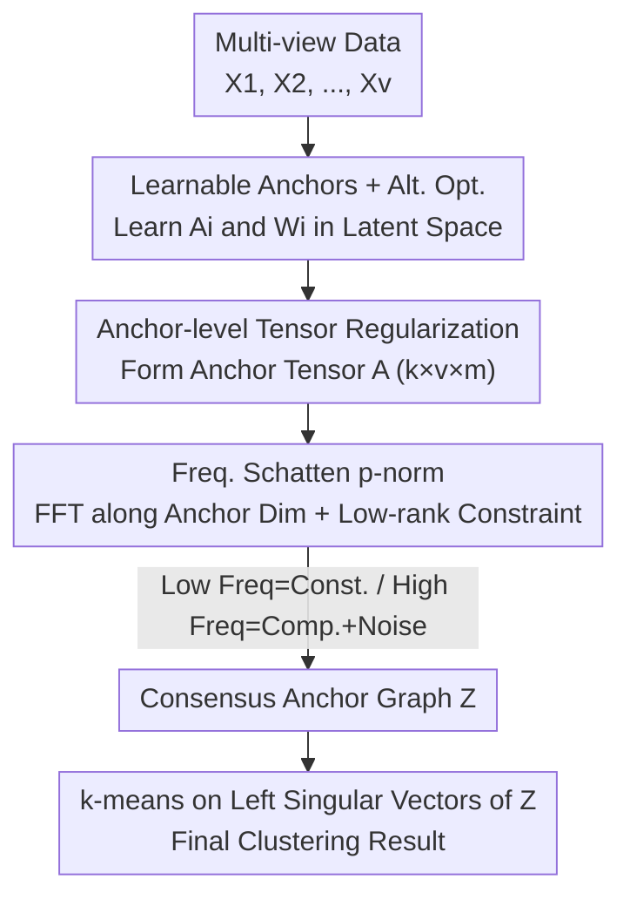

# Scalable Multi-View Subspace Clustering with Tensorized Anchor Guidance

**Conference**: CVPR 2026  
**Paper**: [CVF Open Access](https://openaccess.thecvf.com/content/CVPR2026/html/Jia_Scalable_Multi-View_Subspace_Clustering_with_Tensorized_Anchor_Guidance_CVPR_2026_paper.html)  
**Code**: https://github.com/Jiamiao2024/SMVS-TAG  
**Area**: Multi-View Subspace Clustering / Large-scale Unsupervised Clustering  
**Keywords**: Multi-view clustering, anchor learning, tensor Schatten p-norm, subspace clustering, scalability

## TL;DR
SMVS-TAG concatenates anchors learned from each view into a third-order tensor and imposes a tensor Schatten p-norm low-rank constraint in the frequency domain. This directly couples cross-view consistency and complementarity at the "anchor itself" level. This approach improves anchor quality while ensuring the regularization term is independent of the sample size $n$. It significantly refreshes the ACC for large-scale multi-view clustering across seven datasets (leading the second-best method by over 30% on certain datasets).

## Background & Motivation

**Background**: Multi-view clustering (MVC) aims to find a unified partition of samples by utilizing consistency and complementarity across multiple data sources (different features or modalities) without labels. Subspace-based methods are popular due to their robustness to noise, but similarity matrices with $O(n^2)$ complexity are computationally prohibitive for large datasets. Consequently, **anchor-based methods** have emerged: instead of calculating pairwise similarities for all samples, a small set of representative anchors $m \ll n$ is selected to construct an "anchor graph," reducing complexity from $O(n^2)$ to $O(nm)$.

**Limitations of Prior Work**: The effectiveness of anchor methods is **highly dependent on anchor quality**. Early methods (e.g., selecting centers via k-means or variance) fixed anchors after initial selection, making them extremely sensitive to initialization and potentially unstable. Later adaptive methods refined quality by jointly updating anchor generation, projection, and graph construction. However, they **mostly ignore the interaction between cross-view anchors**—each view learns its anchors independently, without awareness of the anchor positions in other views.

**Key Challenge**: To utilize cross-view information, recent methods have taken an "**indirect**" route—constructing individual anchor graphs first and then using neighboring graphs to enhance the current view's anchors. The problem is that anchor graphs are sample-dependent, scale linearly with $n$, and are highly sensitive to initial anchors and construction strategies. While tensor-based methods capture high-order structures, they typically impose low-rank constraints on the "anchor graph tensor" $\mathcal{Z} \in \mathbb{R}^{m \times v \times n}$, which swells with sample size, leading to OOM (Out of Memory) or OT (Out of Time) issues on large datasets during t-SVD/FFT operations.

**Goal + Key Insight**: The authors' key observation is that **instead of reconciling potentially inconsistent graph structures, it is better to directly shape the "anchor representation" to be cross-view consistent**. Once anchors are coordinated across views, the downstream consensus anchor graph naturally becomes cleaner.

**Core Idea**: Move the regularization target **from the anchor graph to the anchors themselves**. Concatenate anchor matrices from different views into a compact third-order **anchor tensor** $\mathcal{A} \in \mathbb{R}^{k \times v \times m}$ and impose a tensor Schatten p-norm low-rank constraint to directly couple cross-view anchors. Since the anchor tensor's dimensions depend only on the number of clusters $k$, views $v$, and anchors $m$—**completely independent of the sample size $n$**—the method achieves both high quality and scalability.

## Method

### Overall Architecture

The input to SMVS-TAG consists of $v$ feature matrices $\{X_i\}_{i=1}^{v}$ ($X_i \in \mathbb{R}^{d_i \times n}$), and the output is a consensus anchor graph $Z \in \mathbb{R}^{m \times n}$ shared by all views. The clustering results are obtained by performing k-means on the left singular vectors of $Z$. The pipeline can be summarized as: **learning a set of anchors $A_i$ for each view in a $k$-dimensional latent space, assembling them into an anchor tensor with low-rank constraints in the frequency domain, and jointly optimizing the projection matrices $W_i$, anchors $A_i$, and consensus graph $Z$.**

The most critical step is the "cross-view anchor interaction": anchor matrices $A_i \in \mathbb{R}^{k \times m}$ are rotated and concatenated into a third-order tensor $\mathcal{A} \in \mathbb{R}^{k \times v \times m}$ (with the view dimension in the middle), followed by an FFT along the **anchor dimension (3rd dimension)** to obtain the frequency-domain tensor $\widehat{\mathcal{A}}$. Each frontal slice $\widehat{\mathcal{A}}^{i}$ in the frequency domain characterizes the interaction of all views at the $i$-th Fourier mode—**low-frequency slices aggregate shared consistent information, while high-frequency slices contain view-specific information and noise.** Imposing low-rank constraints on each slice forces cross-view anchor synergy while preserving individual differences.

### Key Designs

**1. Anchor-level Tensor Regularization: Shifting Constraints from Graphs to Anchors**

This is the core contribution. Existing tensor-based MVC methods apply low-rank constraints to the "anchor graph tensor," but anchor graphs are sample-dependent and sensitive to initialization. Furthermore, anchor updates and consensus graph optimization are often not end-to-end coordinated. The authors instead **directly mine and constrain cross-view correlations at the anchor level**. They represent anchors for the $i$-th view as $A_i \in \mathbb{R}^{k \times m}$ in a $k$-dimensional latent space ($k$ is the number of clusters), then merge them into a 3rd-order anchor tensor $\mathcal{A} \in \mathbb{R}^{k \times v \times m}$ and apply the Schatten p-norm. By shaping the "anchor representation," the resulting anchors are inherently cross-view consistent, making the downstream consensus graph more reliable—a process the paper describes as proactively shaping anchors rather than passively reconciling graph structures.

**2. Frequency Schatten p-norm: Decomposition via FFT into Consensus and Complementarity**

To implement the low-rank constraint effectively, the authors use the tensor Schatten p-norm ($0 < p \le 1$), which approximates the tensor rank more closely than the nuclear norm. Specifically, an FFT is performed along the 3rd dimension of the anchor tensor to get $\widehat{\mathcal{A}} = \mathrm{fft}(\mathcal{A}, [\,], 3)$. The tensor Schatten p-norm is defined as the sum of the $p$-th powers of the singular values of each frequency slice:

$$\|\mathcal{B}\|_{S_p}^{p} = \sum_{i=1}^{n_3} \big\|\widehat{\mathcal{B}}^{i}\big\|_{S_p}^{p} = \sum_{i=1}^{n_3} \sum_{j=1}^{h} \widehat{S}^{i}_{\mathcal{B}}(j,j)^{p}$$

where $h = \min(n_1, n_2)$ and $\widehat{S}^{i}_{\mathcal{B}}$ comes from t-SVD. This FFT perspective provides a physical interpretation: **low-frequency slices correspond to consistent information shared across views, while high-frequency slices correspond to view-specific information and noise**. Penalizing rank in these slices forces synergy while suppressing high-frequency noise. Experiments confirm that $p \in [0.1, 0.3]$ significantly outperforms $p=1$.

**3. Sample-Independent Scalability: Anchor Tensor vs. Anchor Graph Tensor**

Traditional tensor MVC fails on large datasets due to the anchor graph tensor $\mathcal{Z} \in \mathbb{R}^{m \times v \times n}$ scaling linearly with $n$. SMVS-TAG's anchor tensor $\mathcal{A} \in \mathbb{R}^{k \times v \times m}$ has **dimensions determined only by $k, v, m$, decoupled from $n$**. The update for the auxiliary variable $H$ (handling tensor regularization) does not involve $n$. The total time complexity is linear with respect to $n$: $O(ndm{+}mdk{+}dk^2)$, $O(ndk{+}nvkm{+}vmk^2)$, $O(nm^3)$, and $O(vmk\log m{+}v^2km)$, plus $O(n)$ for k-means. This allows the model to run on VGGFace, AwA, and YoutubeFace (100k samples) where methods like TBGL/Orth-NTF/TC-MVSC suffer from OOM/OT.

**4. Learnable Anchors + Alternating Optimization: Bypassing Manual Selection**

To eliminate dependence on initial anchor selection, the authors treat $\{A_i\}$ as optimizable variables initialized from zero matrices. They apply orthogonal constraints $A_i^\top A_i = I$ to ensure anchors are discriminative and diverse. The objective function is:

$$\min_{W_i, A_i, Z}\ \sum_{i=1}^{v} \|X_i - W_i A_i Z\|_F^2 + \lambda \|Z\|_F^2 + \|\mathcal{A}\|_{S_p}^{p},\quad \text{s.t. } W_i^\top W_i = I,\ A_i^\top A_i = I,\ Z^\top \mathbf{1} = \mathbf{1},\ Z \ge 0$$

The Augmented Lagrangian Method (ALM) is used to solve this by introducing an auxiliary tensor $H$. $W_i$ and $A_i$ updates are solved via SVD for closed-form solutions under orthogonal constraints. $Z$ is solved as $n$ independent quadratic programming subproblems. $H$ is solved in the frequency domain using the thresholding operator $\Gamma_{1/\rho,\,p}$ defined in Theorem 1.

### Loss & Training
The objective function is as shown above: reconstruction error $\sum_i \|X_i - W_i A_i Z\|_F^2$, Frobenius regularization $\lambda\|Z\|_F^2$ for the consensus graph, and the Schatten p-norm $\|\mathcal{A}\|_{S_p}^{p}$. Hyperparameters: anchors $m \in \{k, 3k, 5k\}$, $p \in \{0.1, 0.3, 0.5\}$, $\alpha \in \{10^{-4}, 0.01, 0.1, 1\}$, and $\lambda \in \{1, 10, 100, 1000\}$. ALM starts with $\rho = 10^{-5}$ and $\eta = 1.1$.

## Key Experimental Results

The method was evaluated on seven multi-view benchmarks (from 358 to 101,499 samples) against 10 SOTA MVC methods.

### Main Results (ACC %, Selected)

| Dataset | Samples | AEVC(CVPR24) | LMTC(CVPR25) | Prev. SOTA | SMVS-TAG | Gain |
|--------|--------|--------------|--------------|----------|----------|----------|
| Dermatology | 358 | 93.42 | 89.11 | 93.42 | **97.49** | +4.07 |
| Scene15 | 4,485 | 42.11 | 40.11 | 44.59 | **61.00** | +16.41 |
| COIL100 | 7,200 | 75.78 | 87.01 | 87.01 | **90.60** | +3.59 |
| Hdigit | 10,000 | 89.68 | 78.04 | 89.68 | **92.52** | +2.84 |
| AwA | 30,475 | 8.65 | 10.37 | 10.37 | **11.45** | +1.08 |
| VGGFace | 36,287 | 6.40 | 9.92 | 9.92 | **10.67** | +0.75 |
| YoutubeFace | 101,499 | 23.72 | 26.31 | 26.31 | **36.62** | +10.31 |

> Note: SMVS-TAG achieved the best performance across all seven datasets and all four metrics (ACC, NMI, Purity, Fscore).

### Ablation Study (Tensor Anchor Regularization TA)

| Dataset | Config | ACC | NMI | Purity | Fscore |
|--------|------|-----|-----|--------|--------|
| Dermatology | w/o TA | 92.46 | 85.54 | 92.46 | 87.29 |
| Dermatology | Proposed | **97.49** | **94.02** | **97.49** | **96.25** |
| Scene15 | w/o TA | 50.95 | 47.29 | 54.54 | 36.09 |
| Scene15 | Proposed | **61.00** | **55.83** | **63.39** | **45.92** |

### Key Findings
- **TA Regularization is the Main Driver**: Removing TA causes ACC to drop by 10% on Scene15 and ~5% on Dermatology, proving that frequency-domain low-rank constraints successfully extract consistent information.
- **Strong Baseline**: Even without TA, the method outperforms many competitors, suggesting that joint optimization of anchors in a shared latent space is already effective.
- **Schatten p-norm > Nuclear Norm**: Best results are seen at $p = 0.1$ or $0.3$; performance drops at $p=1$ (nuclear norm), indicating $p$-norm provides a tighter rank approximation.
- **Proven Scalability**: While TBGL OOM/OTs on Hdigit and larger sets, SMVS-TAG completes YoutubeFace (100k samples) in 905 seconds with SOTA accuracy.

## Highlights & Insights
- **Perspective Shift**: Moving the constraint from sample-dependent maps to sample-independent anchors is a clever "lever" that simultaneously improves quality and scalability.
- **Frequency Interpretation**: The decomposition of interactions into low-frequency consensus and high-frequency individuality/noise provides strong physical interpretability.
- **Learnable Anchors**: Bypassing manual anchor selection via zero-initialization and optimization removes a major bottleneck in anchor-based clustering.

## Limitations & Future Work
- **Absolute Accuracy**: On difficult datasets like AwA/VGGFace, ACC remains in the 10% range, suggesting performance is limited by feature quality rather than the clustering framework itself.
- **Hyperparameter Sensitivity**: The model requires grid searching for four hyperparameters ($m, p, \alpha, \lambda$), lacking a parameter-free mechanism.
- **Dimension Binding**: The latent space dimension is fixed to $k$, which may be inflexible for datasets where the cluster count is unknown or very large.

## Related Work & Insights
- Compared to **Adaptive Anchor methods**, SMVS-TAG avoids losing view-specific information or dealing with inconsistent anchor sets by coupling them directly via tensors.
- Compared to **Traditional Tensor MVC**, this method removes the linear dependence of tensor operations on sample size $n$, making high-order structural mining available for 100k-level datasets for the first time.
- **Transferable Insight**: Shifting high-order regularization from sample-dependent intermediate products (graphs) to sample-independent compact representations (anchors/prototypes) is a valuable strategy for any large-scale unsupervised method.

## Rating
- Novelty: ⭐⭐⭐⭐
- Experimental Thoroughness: ⭐⭐⭐⭐⭐
- Writing Quality: ⭐⭐⭐⭐
- Value: ⭐⭐⭐⭐

<!-- RELATED:START -->

## Related Papers

- [\[ICLR 2026\] Aligning Collaborative View Recovery and Tensorial Subspace Learning via Latent Representation for Incomplete Multi-View Clustering](../../ICLR2026/others/aligning_collaborative_view_recovery_and_tensorial_subspace_learning_via_latent_.md)
- [\[CVPR 2026\] Plug-and-Play Incomplete Multi-View Clustering via Janus-Faced Affinity Learning with Topology Harmonization](plug-and-play_incomplete_multi-view_clustering_via_janus-faced_affinity_learning.md)
- [\[CVPR 2026\] DF²-VB: Dual-level Fuzzy Fusion with View-specific Boosting for Multi-view Multi-label Classification](df2-vb_dual-level_fuzzy_fusion_with_view-specific_boosting_for_multi-view_multi-.md)
- [\[CVPR 2026\] Multi-view Crowd Tracking Transformer with View-Ground Interactions Under Large Real-World Scenes](multi-view_crowd_tracking_transformer_with_view-ground_interactions_under_large_.md)
- [\[CVPR 2026\] EXOTIC: External Vision-driven Incomplete Multi-view Classification](exotic_external_vision-driven_incomplete_multi-view_classification.md)

<!-- RELATED:END -->
