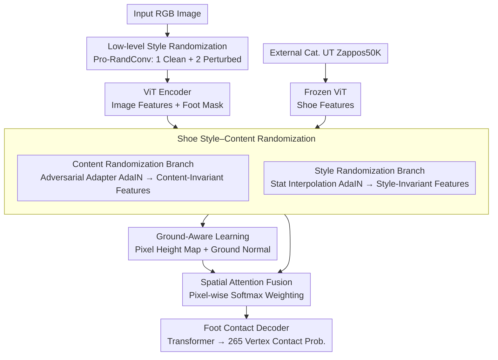

# Shoe Style-Invariant and Ground-Aware Learning for Dense Foot Contact Estimation

**Conference**: CVPR2026  
**arXiv**: [2511.22184](https://arxiv.org/abs/2511.22184)  
**Code**: [dqj5182/FECO_RELEASE](https://github.com/dqj5182/FECO_RELEASE)  
**Area**: Other  
**Keywords**: Foot Contact Estimation, Shoe Style Invariance, Ground-Aware Learning, Adversarial Training, Dense Contact Prediction

## TL;DR

The FECO framework is proposed to achieve robust dense foot contact estimation from a single RGB image through shoe style-content randomization (adversarial training) and ground-aware learning (pixel height maps + ground normals), significantly outperforming existing methods on multiple benchmarks.

## Background & Motivation

**Importance of Foot Contact**: Human movement and balance fundamentally rely on interactions between the feet and the environment. Accurately capturing dense foot contact areas is crucial for understanding human motion dynamics and modeling realistic physical behaviors.

**Limitations of Prior Work**: Existing works often simplify foot contact to joint-level contact, relying on geometric heuristics such as zero-velocity constraints, which fail to capture dense contact patterns distributed across multiple fine-grained regions of the sole.

**Insufficient Precision of General Models**: Although dense human contact estimation methods (POSA, BSTRO, DECO) exist, their prediction accuracy for foot regions remains poor; dedicated body-part contact models (such as HACO for hands) have proven superior to general-purpose models.

**Challenges of Shoe Appearance Diversity**: In the real world, feet are typically covered by shoes. Shoe color, texture, material, and style vary greatly, making models prone to overfitting to spurious correlations between shoe styles and contact patterns in training data (e.g., sneakers → skating actions).

**Ambiguity of Ground Information**: Ground surfaces (carpet, asphalt, flooring) often have monotonous or repetitive textures with scarce visual cues. Since contact happens along directions parallel to the ground, the lack of explicit ground geometric reasoning leads to inaccurate predictions.

**Occlusions and Viewpoint Changes**: The aforementioned difficulties are compounded by occlusions, viewpoints, and lighting changes, highlighting the need for representation learning that captures geometric and physical contexts rather than superficial appearance.

## Method

### Overall Architecture

This paper aims to predict dense contact regions of the sole from a single RGB image. The difficulty lies in feet often being obscured by various shoes and ground textures being monotonous, causing models to easily learn spurious correlations like "sneakers → skating." The **Core Idea** of FECO is to decouple the model's reliance on shoe appearance and local textures using two-level randomization, explicitly introduce ground geometry (height maps + normals) for the physical context required for contact reasoning, and finally use attention to fuse these features for a Transformer to decode contact probabilities for each foot vertex. During training, each sample is simultaneously fed as a clean image and two low-level randomized images, with five modules optimized jointly end-to-end.

### Key Designs

**1. Low-level Style Randomization: Removing reliance on local texture statistics**

**Mechanism**: Contact patterns are essentially geometric/physical, but models tend to use low-level textures (color, material) as shortcuts. Pro-RandConv is used at the input to perform random local texture perturbations: randomly sampling convolution weights, deformable offsets, and affine parameters. This is processed via "Deformable Conv → Instance Normalization → Affine Transform → tanh". One image is perturbed into two style-distinct but content-invariant copies, forcing the model to ignore local texture statistics and rely on stable structural cues.

**2. Shoe Style–Content Randomization: Decoupling "shoe appearance" from "foot contact"**

**Design Motivation**: Low-level randomization cannot handle global style bias (e.g., sneakers/boots/sandals naturally correspond to different motion distributions). An external shoe dataset, UT Zappos50K, is used as an independent style source. Two parallel paths are processed: the content randomization branch uses adversarial adapters $\mathbf{A}_{\text{prev}}$, $\mathbf{A}_{\text{after}}$ (zero-initialized 3×3 conv + learnable scaling factor $\gamma=0.02$) to apply AdaIN, retaining shoe content while injecting input style statistics for adversarial training. The style randomization branch samples interpolation weights $\alpha$ from a uniform distribution to interpolate channel statistics between input and shoe features via AdaIN, generating shoe style-invariant representations.

**3. Ground-Aware Learning: Restoring missing ground geometry for contact reasoning**

**Function**: Contact happens parallel to the ground, but ground textures lack cues. FECO introduces a ground feature encoder outputting two signals: a pixel height map (via DPT decoder) providing dense geometric context, and ground normals. To prevent shortcut learning, foot masks are used to suppress foot-region features before global average pooling, two FC layers, tanh, and L2 normalization to predict a unit ground normal vector.

**4. Spatial Attention Fusion: Letting the model decide when to trust geometry vs. appearance**

**Mechanism**: Randomized features and ground features have different properties. They are concatenated along the channel dimension, processed through a 3×3 conv to 256 channels → ReLU → Dropout(0.2) → 1×1 conv, outputting dual-path softmax weights for adaptive weighted fusion of ground and style-invariant features.

**5. Foot Contact Decoder: Translating fused features into dense vertex contact probabilities**

**Mechanism**: A Transformer architecture (self-attention + cross-attention) takes contact tokens and image features as input to output contact logits for 265 foot mesh vertices. After sigmoid, a regressor projects these to 11 joints and 3 keypoints (OpenPose defined) for multi-level prediction, ensuring both dense output and joint-level compatibility.

### Loss & Training

$$\mathcal{L} = \mathcal{L}_{\text{main}} + \mathcal{L}_{\text{style}} + \mathcal{L}_{\text{style-adv}} + \mathcal{L}_{\text{mask}} + \mathcal{L}_{\text{ground}}$$

- $\mathcal{L}_{\text{main}}$: BCE loss for multi-level predictions in the main branch.
- $\mathcal{L}_{\text{style}}$: BCE loss for the style branch (gradient only backpropagates to the style branch decoder).
- $\mathcal{L}_{\text{style-adv}}$: BCE between style branch prediction and a uniform distribution (only trains adversarial adapters).
- $\mathcal{L}_{\text{mask}}$: Average of BCE and Dice loss for foot segmentation.
- $\mathcal{L}_{\text{ground}} = \mathcal{L}_{\text{pixel-height}}(\text{MAE}) + \mathcal{L}_{\text{ground-normal}}(\text{cosine similarity})$.

All losses are averaged across the clean image and the two ProRandConv augmented images.

## Key Experimental Results

### Main Results

| Method | Precision ↑ | Recall ↑ | F1-Score ↑ |
|------|------------|----------|------------|
| POSA | 0.276 | 0.308 | 0.255 |
| BSTRO | 0.436 | 0.538 | 0.464 |
| DECO | 0.374 | 0.511 | 0.409 |
| **FECO (Ours)** | **0.563** | **0.613** | **0.577** |

FECO outperforms BSTRO by 11.3% and DECO by 16.8% in F1-score on MMVP. On joint-level foot contact estimation (COFE video sequences), FECO achieves F1=0.515, significantly exceeding WHAM (0.363) and Footskate Reducer (0.301) without using temporal info.

### Ablation Study

| Ablation Item | F1-Score | Gain |
|--------|----------|----------|
| Baseline (w/o Low-level Rand) | 0.555 | - |
| + Low-level Rand | 0.577 | +4.0% |
| w/o Style/Content Rand | 0.522 | - |
| + Content Rand | 0.531 | +1.7% |
| + Style Rand | 0.554 | +6.1% |
| + Both (SCR) | 0.577 | +10.5% |
| w/o Ground Learning | 0.506 | - |
| + Ground Normal | 0.527 | +4.1% |
| + Pixel Height Map | 0.569 | +12.4% |
| + Spatial Attention | 0.577 | +14.0% |

### Key Findings

- **Style-Content Randomization Complementarity**: Content randomization improves recall (coverage), while style randomization improves precision (robustness). Combining both achieves the optimal F1 balance.
- **Ground Geometry Gains**: Normals provide global orientation, while pixel height maps provide dense geometric context. Adaptive fusion via spatial attention yields a 14% F1 improvement.
- **COFE Dataset Effectiveness**: Inclusive of COFE, F1 rose from 0.450 to 0.515 (+14.4%), as diverse in-the-wild appearances and interactions effectively supplement 3D mocap data.
- **Style Generalization Comparison**: FECO's shoe style-content randomization (0.577) significantly outperforms BIN (0.396), MixStyle (0.448), SagNets (0.511), and LatentDR (0.542).

## Highlights & Insights

- First dedicated framework for dense foot contact estimation, filling a critical gap in the field.
- The dual-branch shoe style-content randomization is cleverly designed, utilizing external shoe datasets to achieve style decoupling.
- Ground-aware learning incorporates complementary signals (pixel height and ground normals), with mask suppression to avoid shortcut learning.
- The COFE dataset (31K+ annotations) is introduced and open-sourced, providing a standardized in-the-wild benchmark.
- Achieves superior performance over video-based methods using only single-frame reasoning.

## Limitations & Future Work

- **Novelty**: Dense estimation relies on the SMPL-X foot mesh topology (265 vertices); generalization to non-humanoid feet or extreme shoe types is unknown.
- **Experimental Thoroughness**: Most training data comes from controlled 3D mocap environments; although COFE adds in-the-wild samples, the scale is still limited (31K).
- Errors in ground truth generation for height maps and normals (relying on existing depth tools) may introduce cumulative bias.
- Quantitative evaluation is limited to MMVP and COFE; further validation in complex outdoor terrains is needed.
- The ViT-Huge backbone is computationally intensive, questioning feasibility for real-time applications.

## Related Work & Insights

- **Joint-level Contact**: Footskate Reducer (zero-velocity) → HuMoR/PIP/WHAM (joint contact for motion) → Foot Stabilization (SMPL distance thresholds).
- **Dense Contact**: POSA (cVAE generation) → BSTRO (Transformer input) → DECO (in-the-wild labels) → HACO (hand-specific, decoder source for this work).
- **Style Generalization**: BIN (BN/IN gating) → SagNets (adversarial branches) → RandConv (random kernels) → Ours (shoe-specific style-content randomization).
- **Ground Representation**: Pixel Height (shadow generation) → PixHt-Lab/ORG (3D reconstruction) → FECO extends pixel height maps to contact estimation.

## Rating

- **Novelty**: ⭐⭐⭐⭐
- **Experimental Thoroughness**: ⭐⭐⭐⭐
- **Writing Quality**: ⭐⭐⭐⭐
- **Value**: ⭐⭐⭐⭐

<!-- RELATED:START -->

## Related Papers

- [\[ICCV 2025\] Magic Insert: Style-Aware Drag-and-Drop](../../ICCV2025/others/magic_insert_style-aware_drag-and-drop.md)
- [\[AAAI 2026\] Spike Imaging Velocimetry: Dense Motion Estimation of Fluids Using Spike Cameras](../../AAAI2026/others/spike_imaging_velocimetry_dense_motion_estimation_of_fluids_using_spike_cameras.md)
- [\[ICML 2026\] Learning Permutation-Invariant Macroscopic Dynamics](../../ICML2026/others/learning_permutation-invariant_macroscopic_dynamics.md)
- [\[ICML 2026\] Continual Learning of Domain-Invariant Representations](../../ICML2026/others/continual_learning_of_domain-invariant_representations.md)
- [\[CVPR 2025\] Sufficient Invariant Learning for Distribution Shift](../../CVPR2025/others/sufficient_invariant_learning_for_distribution_shift.md)

<!-- RELATED:END -->
## Related Papers

- [\[NeurIPS 2025\] Learning Dense Hand Contact Estimation from Imbalanced Data](../../NeurIPS2025/human_understanding/learning_dense_hand_contact_estimation_from_imbalanced_data.md)
- [\[CVPR 2026\] View-Aware Semantic Alignment for Aerial-Ground Person Re-Identification](view-aware_semantic_alignment_for_aerial-ground_person_re-identification.md)
- [\[ICCV 2025\] Contact-Aware Refinement of Human Pose Pseudo-Ground Truth via Bioimpedance Sensing](../../ICCV2025/human_understanding/contact-aware_refinement_of_human_pose_pseudo-ground_truth_via_bioimpedance_sens.md)
- [\[CVPR 2026\] COG: Confidence-aware Optimal Geometric Correspondence for Unsupervised Single-reference Novel Object Pose Estimation](cog_confidence-aware_optimal_geometric_correspondence_for_unsupervised_single-re.md)
- [\[CVPR 2026\] Region-Aware Instance Consistency Learning for Micro-Expression Recognition](region-aware_instance_consistency_learning_for_micro-expression_recognition.md)

<!-- RELATED:END -->
