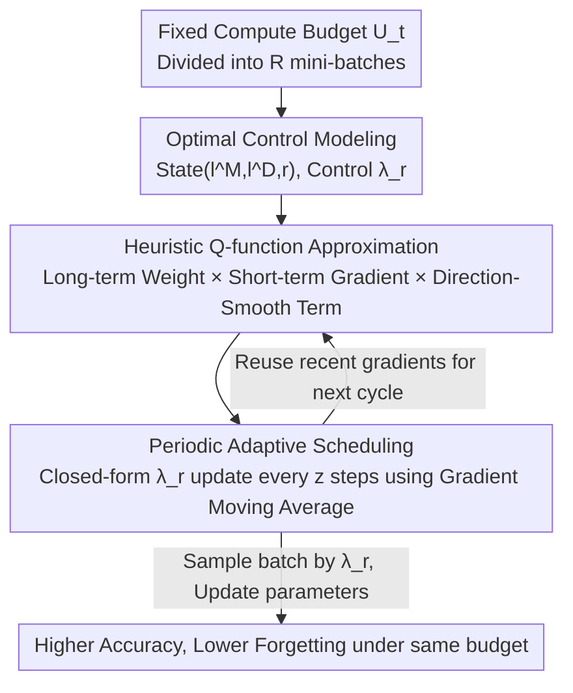

# Smart Replay: Adaptive Scheduling of Memory Rehearsal for Computational Resource-Aware Incremental Learning

**Conference**: CVPR 2026  
**Paper**: [CVF Open Access](https://openaccess.thecvf.com/content/CVPR2026/html/Chen_Smart_Replay_Adaptive_Scheduling_of_Memory_Rehearsal_for_Computational_Resource_Aware_CVPR_2026_paper.html)  
**Code**: None  
**Area**: Continual Learning / Incremental Learning  
**Keywords**: Incremental Learning, Memory Replay, Computational Budget, Optimal Control, Adaptive Scheduling

## TL;DR
This paper introduces the "Computational Resource-Aware Incremental Learning (CRIL)" setting and designs Smart Replay. By treating the replay sample ratio $\lambda_r$ in each mini-batch as a tunable control variable, it employs optimal control and a heuristic Q-function to dynamically schedule the replay ratio under a fixed computational budget. This achieves higher accuracy and lower forgetting than fixed-ratio baselines under the same compute constraints.

## Background & Motivation

**Background**: Incremental Learning (IL) aims to continuously learn new knowledge from data streams without full retraining while avoiding the forgetting of old knowledge. Mainstream approaches are categorized into three types: regularization (constraining parameter updates), structural expansion (freezing or expanding networks), and memory replay (storing a small buffer of old samples for repeated rehearsal). Memory replay is the most common due to its simplicity and generality. Typically, old and new samples are mixed in each mini-batch at a **fixed ratio** $\lambda$, or jointly sampled from their union.

**Limitations of Prior Work**: Most IL research focuses exclusively on "data scarcity," stacking heavy computation (distillation, gradient projection, dynamic expansion) to suppress forgetting. However, they ignore a more critical constraint in real-world scenarios: **limited computational/time budgets** (models may need updates daily or hourly). Furthermore, the authors observe an anti-intuitive phenomenon (Fig.1): under compute constraints, **more replay is not always better**. When the buffer is large, frequent replay protects old knowledge but hinders new task learning; when the buffer is small, frequent replay yields almost no benefit.

**Key Challenge**: The **learning dynamics are mismatched** between new samples and old (memory) samples. Memory samples have been optimized previously, so their loss often rises initially then drops rapidly during retraining; new samples must be optimized from scratch. Their computational requirements are heterogeneous and time-varying. A fixed replay ratio inevitably leads to **convergence imbalance** within finite epochs (Fig.2)—either overfitting the old tasks and underfitting the new, or vice versa.

**Goal**: To formalize the dynamic allocation of computational resources between learning new tasks and rehearsing old memories under a fixed budget as an optimization problem, allowing the replay ratio to adaptively change with the training state.

**Core Idea**: Instead of a fixed $\lambda$, the **replay ratio $\lambda_r$ for each mini-batch is treated as a time-scheduled control variable**. An optimal control framework is used to find a scheduling sequence that maximizes the total reduction of new task loss and memory loss. This is implemented via a practical algorithm that uses an analytically solvable heuristic Q-function to update $\lambda_r$ based on recent gradient moving averages every few steps.

## Method

### Overall Architecture

Smart Replay addresses how to optimize the replay ratio $\lambda_r$ for each mini-batch under a fixed computational budget $U_t$. The overall approach models the training process of a task stage as a **discrete-time dynamic system**: the state is the triplet of current memory loss, new task loss, and step count $(l_r^M, l_r^D, r)$; the control variable is the replay ratio $\lambda_r\in[0,1]$ (determining $\lambda_r b$ memory samples and $(1-\lambda_r)b$ new samples in the batch); the goal is to maximize the cumulative loss reduction throughout the training. The optimal $\lambda_r$ for each step is derived using Optimal Control (OC) and the Bellman equation, then simplified into a **periodic, closed-form scheduling algorithm based on the moving average of recent mini-batch gradients** to avoid the impracticality of calculating full gradients at every step.

The problem setting is defined as follows. Given a memory retention ratio $\delta$, the number of accessible samples at stage $t$ is $N_t = n[1+\delta(t-1)]$. The computational budget grows by a coefficient $\vartheta$: $U_t = U_{base}[1+\vartheta(t-1)]$, where $U_{base}=q\,e\,n$ ($e$ is the number of epochs for a single task). Under a fixed budget, the total number of processed samples is $C\le U/q$, divided into $R=C/b$ mini-batches of size $b$, each producing one parameter update. When $\delta=1,\vartheta=1$, it degrades to full retraining (upper bound), but in reality, budget growth rarely matches sample expansion, necessitating efficient allocation.

### Key Designs

**1. Optimal Control Modeling: Turning replay ratio scheduling into sequential decision-making for "maximizing cumulative loss reduction"**

The primary pain point is that a fixed $\lambda$ cannot adapt to the heterogeneous learning dynamics of new and old samples over time. This work models the training process as a discrete-time dynamic system: the state at step $r$, $(l_r^M, l_r^D, r)$, evolves according to $\Delta l_r^M = l_r^M - l_{r+1}^M$ and $\Delta l_r^D = l_r^D - l_{r+1}^D$, with $\lambda_r$ determining the batch composition. The optimization objective is to maximize the total reduction in both losses:

$$\min\,(l_R^M + l_R^D)\;\Leftrightarrow\;\max \sum_{r=0}^{R-1}\big(\Delta\mathcal{L}_r^M(\lambda_r) + \Delta\mathcal{L}_r^D(\lambda_r)\big).$$

Under the OC framework, an instant reward $R = \Delta l_r^M + \Delta l_r^D$ is defined. The value function $V$ represents the maximum cumulative loss reduction achievable from the current state to the end of training, satisfying the Bellman recurrence $V(l_r^M,l_r^D,r)=\max_{\lambda_r}[R + V(l_{r+1}^M,l_{r+1}^D,r+1)]$. The term in brackets is the state-action value function $Q$. The optimal control is $\lambda_r^* = \arg\max_{\lambda_r} Q(l_r^M, l_r^D, r;\lambda_r)$. This step transforms replay scheduling from a fixed or linear heuristic into an optimal scheduling problem with a clear mathematical objective (maximizing total loss reduction). Since the time horizon is finite and steps are equally weighted, no discount factor is introduced.

**2. Heuristic Q-function Approximation: Decomposing the unsolvable value function into four calculable factors**

The value function $V$ represents "maximum potential gain from now until training ends," which cannot be quantified precisely. Leveraging the rule that "loss usually decays exponentially," the authors heuristically model the predicted final loss as $l_r^\Omega e^{\rho_\Omega (r-R)/R}$ (where $\rho_M,\rho_D>0$ are decay rates for memory and new tasks). This decomposes $Q$ into two time-dependent exponential weights, $w_r^M = e^{\rho_M(r-R)/R}$ and $w_r^D = e^{\rho_D(r-R)/R}$, weighting the loss reductions, minus a smoothness regularization term $\epsilon(\lambda_r-\lambda_{r-1})^2$ to prevent drastic fluctuations between steps.

Using a first-order Taylor expansion, the loss reduction is linearized as a gradient inner product: $\Delta l_r^\Omega \approx \nabla L_r^\Omega \Delta\boldsymbol{\theta}_r$, where the parameter update is $\Delta\boldsymbol{\theta}_r = \eta[\lambda_r\nabla L_r^M + (1-\lambda_r)\nabla L_r^D]$. Substituting these, $Q$ becomes a quadratic expression in $\lambda_r$, involving four key factors: ① Long-term weight ratio $w_r^M/w_r^D$ (time-adaptive weighting between tasks); ② Short-term gradient norms $\|\nabla L_r^M\|,\|\nabla L_r^D\|$ (immediate contribution of each task); ③ Gradient direction correlation $\cos\beta$ (synergy vs. conflict between tasks); ④ Smoothness regularization. The quadratic form provides a closed-form solution for $\lambda_r$, ensuring the decision to focus on new tasks or replay is determined by these four physically meaningful quantities.

**3. Periodic Adaptive Scheduling: Closed-form update of $\lambda_r$ every z steps using gradient moving averages**

Calculating total losses and gradients $\nabla L_r^M,\nabla L_r^D$ at every step is impractical—only the current mini-batch gradient is available. This work uses moving averages for robust estimation: $\lambda_r$ is updated every $z$ steps. Gradient norms within the interval are estimated as $\|\widehat{\nabla L_r^\Omega}\| = \frac{1}{z}\sum_{j=r-z}^{r-1}\|\nabla_\theta L(\boldsymbol{\theta}_j; B_j^\Omega)\|$ ($\Omega\in\{M,D\}$), with $\widehat{\cos\beta}$ estimated similarly via the mean cosine in the interval. Solving the quadratic $Q$ yields the closed-form update:

$$\lambda_r = \lambda_{r-1} + \eta\frac{\gamma_r}{2\epsilon}\Big[\tfrac{w_r^M}{w_r^D}\tfrac{\|\widehat{\nabla L_r^M}\|^2}{\|\widehat{\nabla L_r^D}\|^2} + \big(1-\tfrac{w_r^M}{w_r^D}\big)\tfrac{\|\widehat{\nabla L_r^M}\|}{\|\widehat{\nabla L_r^D}\|}\widehat{\cos\beta} - 1\Big],$$

where the long-term weight ratio simplifies to $w_r^M/w_r^D = e^{\Delta\rho(r-R)/R}$. Treating $\gamma = \gamma_r/(2\epsilon)$ and $\Delta\rho = \rho_M - \rho_D$ as hyperparameters: $\gamma$ controls the update step size of $\lambda_r$, and $\Delta\rho$ characterizes the difference in decay rates between memory and new tasks. A larger positive $\Delta\rho$ implies memory samples converge faster, prompting the model to **lower** the replay ratio early in training to prioritize compute for new task adaptation. $\Delta\rho$ also correlates with the memory ratio $\delta$: smaller buffers ($\delta$) lead to faster fitting of memory samples, requiring a larger $\Delta\rho$. The initial ratio is set to $\lambda_0=\tau$. To save computation, only gradients of the **top-layer parameters** are used for $\lambda_r$ updates. This design compresses scheduling into an extremely lightweight operation every $z$ steps, adding negligible overhead while resolving the imbalance of fixed $\lambda$ through a state-adaptive "weak-to-strong" replay trajectory.

### Mechanism Example

Observing the actual trajectory of $\lambda_r$ in CIFAR-100 / Tiny-ImageNet under minimal budget (Fig.4): $\lambda_r$ is small early in training, dominated by $\Delta\rho$ in the long-term weight—less replay provides more compute to new tasks to enhance plasticity. As new tasks converge, $\lambda_r$, driven by gradients, gradually rises to accelerate memory loss reduction and restore stability. As the stage $t$ progresses and the buffer grows, a higher replay ratio is required. This overall "weak-to-strong" transition is observed. On Rotated-MNIST, with a lower learning rate (0.01), the trend is similar but smoother. Compared to a fixed $\lambda$ where memory loss increases over $t$ (forgetting), Smart Replay ensures both losses converge to similar levels (results closer to the diagonal in Fig.5), achieving a better balance between new and old tasks.

## Key Experimental Results

Datasets: CIFAR-100 (5 tasks) and Tiny-ImageNet (10 tasks) for Class-IL; Rotated-MNIST (5 domains) for Domain-IL. Three budget levels $\vartheta\in\{0,0.1,0.2\}$ and two memory levels: limited ($\delta=0.1$) and unlimited ($\delta=1$). Backbone: ResNet-18/34, three-layer MLP; base budget $e=20$ epochs, SGD, batch size 200. Metric: Average accuracy $A=\frac{1}{T}\sum_i\frac{1}{i}\sum_j A_{i,j}$ (higher is better). Baselines include Union sampling, various fixed $\lambda$ values, and linear heuristics $\lambda\!\uparrow$ (0.2→0.8) / $\lambda\!\downarrow$ (0.8→0.2). The method is applied to ER, iCaRL, MEMO, and STAR.

### Main Results (limited-memory, CIFAR-100 Average Accuracy %, excerpt)

| Replay Strategy | ER ϑ=0 | iCaRL ϑ=0 | STAR ϑ=0.2 |
|-----------------|--------|-----------|------------|
| Union           | 62.30  | 62.25     | 64.27      |
| λ=0.2 (Fixed)   | 61.94  | 62.90     | 65.11      |
| λ=0.3 (Fixed)   | 61.89  | 63.38     | 65.35      |
| λ↗ (Linear Inc) | 63.84  | 65.16     | 66.25      |
| λ↘ (Linear Dec) | 57.91  | 60.28     | 62.60      |
| **Smart (Ours)**| **64.58** | **65.43** | **67.27** |

Conclusion: In the limited-memory setting, Smart Replay outperforms the best fixed $\lambda$ by ~2% on CIFAR-100. On Tiny-ImageNet, gains are more significant at $\vartheta=0.1/0.2$ (up to nearly 5%), as efficient resource allocation becomes more critical when budgets are tighter. Improvements on the simpler Rotated-MNIST are moderate. In the unlimited setting (all samples available, higher diversity), Smart Replay consistently outperforms fixed baselines across all datasets and IL methods. The linear increase $\lambda\!\uparrow$ is the strongest non-adaptive heuristic but remains inferior to the adaptive Smart Replay.

### Ablation Study (Q-function Factors, Average Accuracy %)

| Configuration | CIFAR(Lim) | Tiny(Lim) | CIFAR(Unl) | Tiny(Unl) | Description |
|---------------|------------|-----------|------------|-----------|-------------|
| Smart (Full)  | 64.58      | 42.37     | 74.70      | 53.94     | — |
| w/o Long ($w_r^M/w_r^D=1$) | 61.43 | 41.39 | 74.20 | 52.93 | No long-term weight; significant drop in limited setting (overfits memory) |
| w/o Short (Grad Ratio=1) | 40.20 | 18.32 | 56.55 | 23.54 | No short-term gradient; loses adaptivity, λ trends to 0, severe forgetting |
| w/o Cosine ($\cos\beta=0$) | 64.03 | 42.02 | 74.27 | 53.23 | No direction correlation; slight decrease |
| w/o Smooth (No smoothing) | 36.89 | 16.23 | 39.12 | 20.12 | Q becomes linear, λ oscillates between 0/1; worst performance |

### Key Findings

- **Smoothing and short-term gradient factors are most critical**: Without smoothing, $\lambda_r$ switches between 0 and 1, causing training to collapse to 36.89%. Without the short-term gradient ratio, the model loses adaptivity, and $\lambda_r$ trends toward zero, causing forgetting (dropping to 40.20%). These two are pillars for stability.
- **Long-term weight is more important in limited settings**: When the buffer is small, memory samples are easily overfitted. Long-term weights suppress early replay to protect plasticity. w/o Long hurts significantly more in the limited setting (3.15 drop for CIFAR) compared to unlimited (only 0.5 drop).
- **$\Delta\rho$ is the most sensitive hyperparameter**: In the limited setting, accuracy rises as $\Delta\rho$ increases from 1.0 to 3.0 (using $\tau=0.2,\Delta\rho=2.0$). In the unlimited setting, $\Delta\rho=0.5$ is better than 0 or 1.0 (using $\tau=0.5,\Delta\rho=0.5$). $\Delta\rho$ is strongly related to buffer size—smaller buffers require larger $\Delta\rho$. $z=50, \gamma=1$ are robust across all settings.

## Highlights & Insights

- **Promoting the "replay ratio" from a fixed hyperparameter to a scheduled control variable**: This is the core perspective shift. While others focus on "which samples to store" or "how to sample," this work focuses on "how much to replay in each batch," using optimal control for a mathematically grounded dynamic scheduling. This approach is clean and general (applicable to ER/iCaRL/MEMO/STAR).
- **The heuristic Q-function decomposes abstract values into four physically meaningful factors**: Long-term exponential weights (time adaptivity), short-term gradient norms (instant contribution), $\cos\beta$ (task synergy/conflict), and smoothing (stability). Being quadratic, it allows for a closed-form solution—preserving the theoretical framework of optimal control while enabling lightweight calculations using mini-batch gradient moving averages.
- **The "weak-to-strong" replay trajectory is insightful**: Less replay early on ensures plasticity for new tasks, while intensified replay later ensures stability for old knowledge. This empirical trajectory is a natural temporal unfolding of the stability-plasticity trade-off, applicable to any scenario requiring dynamic compute allocation between "learning new" vs. "preserving old."
- **The CRIL setting itself is a contribution**: Explicitly incorporating a fixed computational budget $q C_t\le U_t$ into the IL optimization objective is more aligned with real-world deployments (e.g., hourly model updates) than traditional data-scarcity-only IL.

## Limitations & Future Work

- **Dependence on empirical tuning of $\Delta\rho$**: The choice of an appropriate $\Delta\rho$ relies on manual tuning. Although it has an interpretable relationship with buffer size, there is no automatic determination mechanism.
- **Reliance on first-order Taylor approximation and exponential decay assumptions**: The Q-function linearizes loss reduction and assumes exponential decay. Whether these approximations hold during violent training dynamics or non-monotonic loss behavior has not been fully verified ⚠️.
- **Top-layer gradient only**: Using only top-layer gradients to save compute might underestimate true gradient signals for tasks with significant deep representation changes; the impact of this approximation is not ablated ⚠️.
- **Exclusion of heavy architecture-expansion frameworks**: High-compute frameworks like DER/TagFex were excluded due to their high overhead, which conflicts with the constrained setting. Thus, the gains of Smart Replay on such frameworks are unknown.
- **Future Directions**: Incorporating $\Delta\rho$ into online adaptation (e.g., based on buffer state) or using higher-order loss dynamic models instead of first-order Taylor could further reduce tuning and improve robustness.

## Related Work & Insights

- **vs. Fixed Ratio/Union Sampling**: Traditional methods either sample with a fixed $\lambda$ or from a joint union. This paper argues neither can adapt to the heterogeneous dynamics of samples over time. Smart Replay tunes $\lambda_r$ at the mini-batch level, achieving higher accuracy and lower forgetting with the same compute.
- **vs. Task/Cluster-level Replay Scheduling [22,39]**: Existing work schedules at the task or cluster level. This paper pushes control granularity to the **batch level**, deciding how many memory samples to replay in every single batch.
- **vs. Reordering Training (e.g., Curriculum Learning [44])**: Curriculum learning orders samples from easy to hard. This work borrows the idea of "dynamically deciding when samples participate," but applies it to compute allocation between "new vs. old" in IL, providing a closed-form schedule via optimal control rather than heuristic ranking.
- **vs. Online IL [26,43,45]**: The CRIL setting resembles online IL but relaxes the strict "single-pass" constraint, allowing controlled replay to balance performance and efficiency.

## Rating
- Novelty: ⭐⭐⭐⭐ Treats replay ratio as a tunable control variable under optimal control and defines the CRIL setting; the perspective is fresh and general.
- Experimental Thoroughness: ⭐⭐⭐⭐ Covers 2 memory levels × 3 budgets × 4 IL methods × 3 datasets, with complete ablation and hyperparameter analysis; however, it lacks large-scale datasets.
- Writing Quality: ⭐⭐⭐⭐ Clear chain from motivation to OC derivation and closed-form algorithm. Formulas are dense but have intuitive physical explanations.
- Value: ⭐⭐⭐⭐ Plug-and-play with almost zero overhead, making it highly practical for real-world IL deployments with limited compute.

<!-- RELATED:START -->

## Related Papers

- [\[CVPR 2026\] DREAM: Document Recognition with Explicit Adaptive Memory](dream_document_recognition_with_explicit_adaptive_memory.md)
- [\[CVPR 2026\] Representation-Steered Incremental Adapter-Tuning for Class-Incremental Learning with Pre-Trained Models](representation-steered_incremental_adapter-tuning_for_class-incremental_learning.md)
- [\[CVPR 2026\] FEAT: Federated Geometry-Aware Correction for Exemplar Replay under Continual Dynamic Heterogeneity](feat_federated_geometry_aware_correction_for_exemplar_replay_under_continual_dynamic_heterogeneity.md)
- [\[CVPR 2026\] Curvature-Aware Zeroth-Order Optimization for Memory-Efficient Test-Time Adaptation](curvature-aware_zeroth-order_optimization_for_memory-efficient_test-time_adaptat.md)
- [\[CVPR 2026\] HAD: Heterogeneity-Aware Distillation for Lifelong Heterogeneous Learning](had_heterogeneity-aware_distillation_for_lifelong_heterogeneous_learning.md)

<!-- RELATED:END -->
