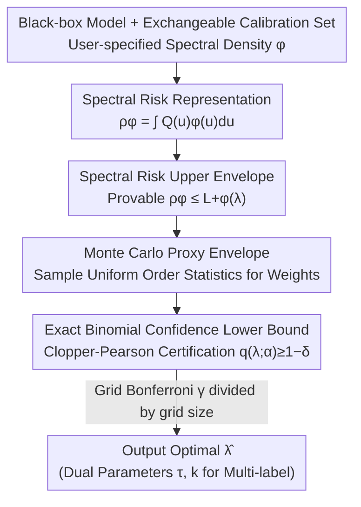

# Spectral Conformal Risk Control: Distribution-Free Tail Guarantees via Bayesian Quadrature

**Conference**: CVPR 2026  
**Paper**: [CVF Open Access](https://openaccess.thecvf.com/content/CVPR2026/html/Esfeh_Spectral_Conformal_Risk_Control_Distribution-Free_Tail_Guarantees_via_Bayesian_Quadrature_CVPR_2026_paper.html)  
**Code**: https://github.com/MohammadMahdiKazemi/BQ_SRC (will be public)  
**Area**: Conformal Risk Control / Uncertainty Quantification / Safe Deployment Theory  
**Keywords**: Conformal Prediction, Spectral Risk, CVaR, Binomial Confidence Lower Bound, Bayesian Quadrature

## TL;DR
This paper proposes BQ-SRC, extending conformal risk control from "averaging loss" to "managing high-cost tail errors" using spectral risk (such as CVaR). By constructing a distribution-free risk upper envelope from a Bayesian quadrature perspective and replacing the DKW inflation with an exact binomial confidence lower bound, the method reduces Monte Carlo conservatism by approximately 3x. It maintains finite-sample tail risk guarantees with smaller prediction sets across tasks including synthetic regression, multi-label classification, and semantic segmentation.

## Background & Motivation
**Background**: Modern vision systems (medical imaging, autonomous driving, security monitoring) prioritize avoiding occasional catastrophic errors over average accuracy during deployment—missing a small tumor, missegmenting a pedestrian, or suppressing rare but critical labels are "tail events." Conformal Prediction (CP) provides distribution-free, finite-sample uncertainty guarantees: split CP controls miscoverage probability, while CRC (Conformal Risk Control) extends this to control the expectation of any bounded monotonic loss $\mathbb{E}[\ell(Z;\lambda)]$, and RCPS provides finite-sample guarantees for risk control. Recently, BQC integrated conformal prediction into the "Bayesian Quadrature" framework: viewing the test loss distribution as its quantile function $Q_Z$ and integrating it via a uniform integrator.

**Limitations of Prior Work**: Most existing methods focus on controlling the **mean**—average miscoverage or average loss—implicitly assuming all errors carry the same cost. However, safety-critical deployment requires the opposite: even if the overall error rate is low, practitioners need to "prove that rare, high-loss failures remain almost impossible." Mean-risk methods lack a mechanism to specifically tighten the tail.

**Key Challenge**: The objective is to utilize "tail-sensitive" risk measures (e.g., CVaR: the average of the worst losses) while preserving the **distribution-free + finite-sample** hard guarantees of conformal prediction, using only black-box access to pre-trained models. Incorporating the family of "spectral/coherent risk" criteria into the conformal framework without sacrificing validity is an open problem. Furthermore, DKW-style Monte Carlo quantile estimation is uniformly valid across all thresholds, resulting in high conservatism and bloated prediction sets.

**Goal**: (1) Generalize CRC/BQC to any spectral risk (law-invariant coherent risk measure), allowing practitioners to encode tail aversion with a spectral density $\phi$; (2) Tighten Monte Carlo conservatism to provide tighter prediction sets without weakening validity; (3) Provide dual-parameter control for multi-label classification.

**Key Insight**: Replace the uniform integrator in Bayesian quadrature with a non-decreasing spectral density $\phi$ to construct a "spectral risk upper envelope" computable from calibration data; then use an **exact binomial confidence lower bound** (instead of DKW inflation) to certify the high-probability event that "the upper envelope does not exceed the target $\alpha$."

## Method

### Overall Architecture
BQ-SRC addresses the following: given a pre-trained black-box model and a set of exchangeable calibration data, select a deployment hyperparameter $\lambda$ (e.g., threshold, set size) that **provably** satisfies $\rho_\phi(\lambda)\le\alpha$, where $\rho_\phi$ is a user-specified spectral risk. The pipeline is: first, express the spectral risk as an "integral of the quantile function against a spectral density"; then, construct an **upper envelope** $L_\phi^+(\lambda)$ using order statistics of calibration losses (provably $\rho_\phi(\lambda)\le L_\phi^+(\lambda)$); since the true loss CDF is unknown, sample uniform order statistics to obtain the distribution of a "proxy upper envelope" $\widetilde L_\phi^+(\lambda)$; finally, perform an **exact binomial confidence lower bound** test on the success probability of the "proxy envelope $\le\alpha$," certifying all $\lambda$ on a grid that pass the test (using Bonferroni across the grid) and outputting the optimal $\lambda$ that satisfies the constraint.

### Key Designs

**1. Spectral Risk Upper Envelope: Encoding tail aversion via spectral densities**

To control the tail, a risk measure capable of encoding "higher weight for worse losses" is required. This paper employs spectral risk: for a random variable $Z$, $\rho_\phi(Z)=\int_0^1 Q_Z(u)\,\phi(u)\,du$, where $Q_Z$ is the quantile function and the spectral density $\phi:[0,1]\to\mathbb{R}_+$ is **non-decreasing** and $\int_0^1\phi(u)\,du=1$. The non-decreasing property ensures higher quantiles (worse losses) receive more weight, which is the source of "risk aversion." $\phi\equiv 1$ reduces to mean risk (CRC/split CP), $\phi(t)=\frac{1}{1-\beta}\mathbf{1}\{t>\beta\}$ yields $\mathrm{CVaR}_\beta$, and a "mix 95/5" density $\phi(t)=0.95\cdot 1+0.05\cdot\frac{1}{0.1}\mathbf{1}\{t>0.9\}$ assigns 95% weight to the mean and 5% to $\mathrm{CVaR}_{0.9}$. By the Kusuoka representation, any law-invariant coherent risk can be written as a mixture of CVaR, making this family of $\phi$ very broad.

The technical core is how to **provably upper-bound** $\rho_\phi(\lambda)$ from calibration data. Sort calibration losses $\ell_{(1)}\le\cdots\le\ell_{(n)}$ (defining $\ell_{(n+1)}=1$). Using order statistics $T_{(i)}$ of the probability integral transform (PIT) $U_i=F_\lambda(\ell_i)$ to partition $[0,1]$ into $n+1$ intervals, define interval weights $W_i=F_\phi(T_{(i)})-F_\phi(T_{(i-1)})=\int_{T_{(i-1)}}^{T_{(i)}}\phi(t)\,dt$ (where $F_\phi$ is the antiderivative of $\phi$). The upper envelope is the weighted sum:

$$L_\phi^+(\lambda):=\sum_{i=1}^{n+1} W_i\,\ell_{(i)}(\lambda).$$

Theorem 3.1 proves $\rho_\phi(\lambda)\le L_\phi^+(\lambda)$, and among all non-decreasing quantile functions compatible with calibration order constraints, this bound is the **tightest** (attained by the piecewise constant "worst-case rearrangement" $K^*_\lambda$). When $\phi\equiv 1$, uniform spacings follow Dirichlet(1), recovering split CP / CRC. The beauty of this step is transforming "spectral risk of an unknown distribution" into a "sum of exchangeable losses weighted by independent uniform order statistics," allowing for Monte Carlo analysis.

**2. Exact Binomial Confidence Lower Bound: Pointwise precision over uniform conservatism**

Since the true CDF $F_\lambda$ is unknown, the distribution of $L_\phi^+(\lambda)$ cannot be computed directly. This paper constructs a proxy envelope $\widetilde L_\phi^+(\lambda)$: directly sample $n$ i.i.d. uniform random variables and use their order statistics to compute weights $W_i'$ (after PIT, $F_\lambda(\ell_i)$ are i.i.d. Unif(0,1) with identical spacing distributions). The event to certify is "the $(1-\delta)$ quantile $Q_{1-\delta}(\lambda)\le\alpha$," which is equivalent to the non-exceedance probability $q(\lambda;\alpha)=\mathbb{P}[\widetilde L_\phi^+(\lambda)\le\alpha]\ge 1-\delta$.

Traditional methods use DKW inflation: taking the empirical $(1-\delta+\eta)$ quantile, where $\eta=\sqrt{\log(2/\gamma)/(2M)}$. This bound is **uniformly valid for all thresholds**, which makes it conservative. This paper instead observes that the success count $S_\lambda(\alpha)=\sum_{m=1}^M\mathbf{1}\{\widetilde L_{\phi,m}^+(\lambda)\le\alpha\}\sim\mathrm{Binomial}(M,q(\lambda;\alpha))$. A one-sided exact Clopper-Pearson lower bound is applied to this count:

$$\underline q_\lambda=\mathrm{Beta}^{-1}\big(\gamma;\,S_\lambda(\alpha),\,M-S_\lambda(\alpha)+1\big),$$

accepting $(\lambda,\alpha)$ when $\underline q_\lambda\ge 1-\delta$. Because this is **pointwise** (for a fixed threshold $\alpha$) rather than uniform, the margin is much smaller: for $M=5000,\gamma=10^{-3},\delta=0.05$, DKW adds $\eta\approx 0.0276$, while the binomial LCB adds approximately $z_{1-\gamma}\sqrt{(1-\delta)\delta/M}\approx 0.0096$, a roughly **3x** reduction. Crucially, this reduction only affects Monte Carlo error without changing the envelope itself, preserving validity under calibration conditions. For a finite grid $\Lambda$, setting the test level for each to $\gamma/|\Lambda|$ via Bonferroni allows simultaneous certification of all accepted $\lambda$ with probability $1-\gamma$ (Theorem 3.2).

**3. Dual-parameter $(\tau,k)$ control: Two knobs for multi-label classification**

A single threshold is often inflexible for multi-label classification (e.g., MS-COCO 80 classes). This paper defines the prediction set as "labels exceeding a score threshold $\cup$ Top-$k$ labels": $S(x;\tau,k)=\{c:s_c(x)\ge\tau\}\cup\{\text{Top-}k\}$, with deployment parameters $\lambda=(\tau,k)$. Since the false negative rate loss for each image is non-decreasing in $\tau$ and non-increasing in $k$, Theorem 3.1 and the binomial LCB hold for each fixed $(\tau,k)$ under the partial order $(\tau_1,k_1)\preceq(\tau_2,k_2)\iff\tau_1\ge\tau_2,k_1\le k_2$. The pair that is **feasible and minimizes average set size** is chosen on the 2D grid:

$$(\hat\tau,\hat k)=\arg\min_{(\tau,k)\in G}\mathbb{E}[|S(X;\tau,k)|]\quad\text{s.t.}\quad \underline q_{(\tau,k)}\ge 1-\delta.$$

Because the feasible frontier includes pure $\tau$ and pure $k$ optimal points, the selected $(\hat\tau,\hat k)$ **weakly dominates** any single-parameter control—it is either more efficient or has better validity, never worse. The cost is a 2D grid search with complexity $O(|G|(n\log n+Mn))$, which remains parallelizable.

### Loss & Training
Ours is a post-processing calibration method that **does not train the model**, only calibrates black-box outputs. Algorithm 1 flow: for each $\lambda$ in the grid, sort calibration losses; sample $M$ sets of uniform order statistics to compute proxy envelopes; calculate success counts $S_\lambda(\alpha)$ for Clopper-Pearson lower bounds; return the first $\lambda$ satisfying $\underline q_\lambda\ge 1-\delta$. Weight integrals for piecewise constant $\phi$ (CVaR, mixtures) have prefix-sum closed forms; smooth $\phi$ utilize Gauss-Legendre quadrature (tolerance $10^{-8}$). Reusing the same Monte Carlo order statistics (common random numbers) across $\lambda$ reduces variance without affecting validity, as the LCB only depends on counts.

## Key Experimental Results

### Main Results
Evaluated against CRC, RCPS, and BQC across synthetic benchmarks, heteroscedastic regression, MS-COCO multi-label, Cityscapes/ADE20K semantic segmentation, and CLIP zero-shot classification. Settings: $1-\delta=0.95$, $M=5000$, $\gamma=10^{-3}$, binomial LCB.

Synthetic Spectral Risk Control ($\alpha=0.4$, goal is to suppress violation rate below $\delta=5\%$):

| Task/Setting | Method | Spectral Risk | Violation Rate |
|--------|------|------|------|
| Synthetic $n=10$ | CRC | 0.342 | 21.46% |
| Synthetic $n=10$ | BQC | 0.152 | 0.08% |
| Synthetic $n=10$ | BQ-SRC (CVaR 0.9) | 0.000 | 0.00% |
| Synthetic $n=200$ | CRC | 0.397 | 42.50% |
| Synthetic $n=200$ | BQ-SRC (CVaR 0.9) | 0.234 | 0.00% |
| Heteroscedastic Regr. | CRC | 0.099 | 46.18% |
| Heteroscedastic Regr. | BQ-SRC (mix 95/5) | 0.010 | 0.90% |

CRC, a mean-risk method, suffers significant violations under tail measures (up to 42.5% in synthetic $n=200$ and 46.18% in regression), while BQ-SRC with tail-heavy spectra (CVaR 0.9 / mix 95/5) keeps violations $\le 1\%$.

MS-COCO Multi-label ($\alpha=0.1$, efficiency measured by average prediction set size):

| Method | Spectral Risk | Violation Rate | Prediction Set Size |
|------|------|------|----------|
| CRC | 0.099 | 44.50% | 2.93 |
| RCPS | 0.061 | 0.00% | 3.57 |
| BQC | 0.090 | 5.00% | 3.04 |
| BQ-SRC-LCB (mix 95/5) | 0.087 | 1.80% | **3.39** |
| BQ-SRC-2D ($\tau$-$k$) | 0.085 | 0.60% | 3.47 |

Under matched validity, BQ-SRC's prediction set (3.39) is smaller than RCPS (3.57), indicating higher efficiency. Dual-parameter control swaps a slightly larger set (3.47) for stronger validity (0.60% violation vs. 1.80%).

### Ablation Study
| Configuration | Key Findings | Description |
|------|---------|------|
| Monte Carlo Budget $M$ | Violation rate stabilizes for $M\ge 2000$ | Supports $M=5000$ in main experiments; binomial LCB is tighter than DKW across all budgets |
| Binomial LCB vs DKW | Margin $0.0096$ vs $0.0276$ (~3x reduction) | Tightens Monte Carlo error without changing the envelope or sacrificing validity |
| Dual-parameter Frontier | $(\hat\tau,\hat k)$ weakly dominates pure $\tau$/pure $k$ | 2D frontier yields extra efficiency |
| ADE20K Segmentation | Mix 95/5 reduces empirical risk 0.099→0.082 and coverage 0.901→0.918 with only ~0.25 extra classes per pixel | CVaR 0.9 results in a trivial upper bound (predicting nearly all labels, set size 134–150) |

### Key Findings
- Spectral density selection is a double-edged sword: extreme tail spectra like CVaR 0.9 can reduce violation rates to zero but may result in "trivial solutions" in segmentation (predicting 134–150 classes per pixel). A "mix 95/5" (mean + small tail component) is most practical.
- Binomial LCB benefits are universal: it is tighter than DKW across all Monte Carlo budgets without sacrificing validity, serving as a "free lunch."
- Mean-risk methods (CRC) systematically violate tail measures, with violations worsening as the calibration set grows ($n=10$ at 21% vs. $n=200$ at 42%), demonstrating that "average compliance $\neq$ tail compliance."

## Highlights & Insights
- **Effective use of the Bayesian Quadrature perspective**: Conformal Prediction → Quantile Function → Integral against spectral density. This change of variables enables "tail risk control" by simply switching the integration weight $\phi$, making the framework unified and backward compatible ($\phi\equiv 1$ recovers CRC).
- **Insight on "Pointwise Exact vs. Uniformly Conservative"**: DKW is conservative because it holds for all thresholds simultaneously, whereas only certification at the target $\alpha$ is needed—switching to a one-sided binomial/Clopper-Pearson saves ~3x margin. This "avoiding uniform bounds for pointwise tasks" logic applies to many confidence interval scenarios.
- **Clean argument for dual-parameter dominance**: Since the feasible frontier includes both pure $\tau$ and pure $k$ optima, adding a degree of freedom can only improve or maintain performance. This structural guarantee is more persuasive than empirical results alone.
- **Fully black-box and post-processing**: No modification to model weights or retraining required, making it friendly to already deployed systems.

## Limitations & Future Work
- **Finite Grid + Bonferroni**: Guarantees are "valid over the family of the finite grid." Bonferroni becomes loose for continuous $\Lambda$ or extremely large grids; the authors leave anytime-valid e-process constructions for future work.
- **Variance and Trivial Solutions for Extreme Tail Spectra**: As $\phi$ concentrates mass at $t\to 1$, envelope estimation variance increases. CVaR 0.9 on segmentation leads to uselessly large sets, and the paper does not propose an automatic method for selecting $\phi$.
- **Efficiency vs. Tail Control Trade-off**: In heteroscedastic regression, BQ-SRC's interval length (15.62) is longer than RCPS (14.32), reflecting a trade-off of efficiency for tail control; BQ-SRC is not universally superior in all metrics.
- **Calibration-Conditional Guarantee**: Validity is conditional on calibration data; robustness to distribution shift was not explored in depth.

## Related Work & Insights
- **vs CRC [5]**: CRC controls the **expectation** (mean risk) of bounded monotonic losses; BQ-SRC generalizes this to any spectral/coherent risk by replacing the uniform integrator with $\phi$. CRC's systematic violation of tail measures highlights the gap BQ-SRC fills.
- **vs RCPS [7]**: RCPS provides finite-sample risk control guarantees but targets the mean and has larger prediction sets; BQ-SRC is more efficient (COCO 3.39 vs 3.57) due to the binomial LCB tightening.
- **vs BQC [39]**: BQC introduced the Bayesian quadrature perspective to conformal prediction but remained focused on mean control; BQ-SRC is its spectral risk extension with added binomial LCB and dual-parameter control.
- **Connection to Spectral/Coherent Risk Theory**: Rooted in Artzner’s coherence axioms, Kusuoka representations, Rockafellar-Uryasev CVaR optimization, and Acerbi’s spectral representations, this work imports mature financial risk tools into vision system deployment.

## Rating
- Novelty: ⭐⭐⭐⭐ Merging spectral risk + Bayesian quadrature + binomial exact LCB is a unified and backward-compatible approach, though individual components are largely adapted from existing theories.
- Experimental Thoroughness: ⭐⭐⭐⭐ Five task categories with violation rates, efficiency, and ablations; solid for a theoretical paper, though some results are delegated to appendices.
- Writing Quality: ⭐⭐⭐⭐ Clear theorem-proof-algorithm-experiment chain with rigorous notation, though the high symbol density assumes significant background in conformal prediction.
- Value: ⭐⭐⭐⭐ Provides a "plug-and-play" tool for safety-critical vision deployment where switching $\phi$ controls the tail, and the binomial LCB tightening is a broadly applicable trick.

<!-- RELATED:START -->

## Related Papers

- [\[ACL 2025\] Theoretical Guarantees for Minimum Bayes Risk Decoding](../../ACL2025/others/theoretical_guarantees_for_minimum_bayes_risk_decoding.md)
- [\[CVPR 2026\] Tunable Soft Equivariance with Guarantees](tunable_soft_equivariance_with_guarantees.md)
- [\[CVPR 2026\] Spectral Mixture-of-Experts for Continual Learning](spectral_mixture-of-experts_for_continual_learning.md)
- [\[ICLR 2026\] Bayesian Influence Functions for Hessian-Free Data Attribution](../../ICLR2026/others/bayesian_influence_functions_for_hessian-free_data_attribution.md)
- [\[CVPR 2026\] Confusion-Aware Spectral Regularizer for Long-Tailed Recognition](confusion-aware_spectral_regularizer_for_long-tailed_recognition.md)

<!-- RELATED:END -->
