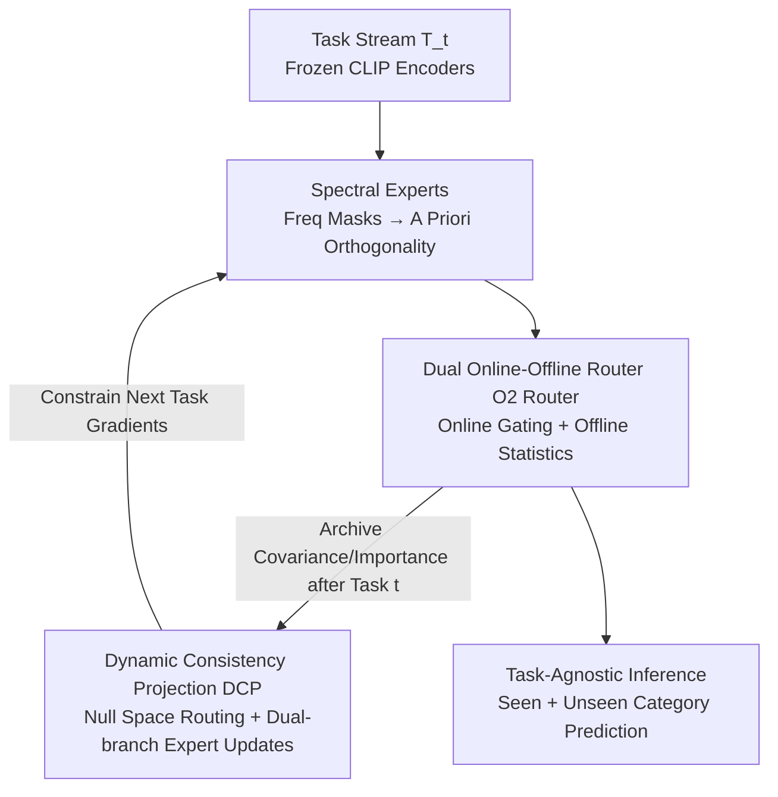

# Spectral Mixture-of-Experts for Continual Learning

**Conference**: CVPR 2026  
**Paper**: [CVF Open Access](https://openaccess.thecvf.com/content/CVPR2026/html/Yin_Spectral_Mixture-of-Experts_for_Continual_Learning_CVPR_2026_paper.html)  
**Code**: https://github.com/ouycc/Spectral_MoE  
**Area**: Continual Learning / Mixture-of-Experts / Parameter-Efficient Fine-Tuning  
**Keywords**: Continual Learning, Spectral Experts, Frequency Domain Orthogonality, Router Drift, Consistency Projection

## TL;DR
To address "structural interference" and "compositional forgetting" in LoRA-MoE for continual learning, this paper proposes Spectral MoE: it employs non-overlapping frequency domain masks to constrain each expert into independent subspaces for inherent orthogonality, combined with a dual online/offline router and Dynamic Consistency Projection to lock routing policies. It achieves higher retention and plasticity in cross-domain task-agnostic incremental learning.

## Background & Motivation
**Background**: Continual Learning (CL) aims to enable models to learn new tasks sequentially without forgetting old ones. When performing CL on pre-trained VLMs like CLIP, full fine-tuning is computationally expensive. Consequently, mainstream research has shifted toward Parameter-Efficient Fine-Tuning (PEFT), particularly the MoE-Adapter approach, which organizes multiple LoRA modules into sparsely activated experts dynamically combined by a router. Intuitively, using different experts for different tasks should naturally isolate interference.

**Limitations of Prior Work**: The authors identify two overlooked failure modes in task-agnostic cross-domain settings. First is **Structural Interference**: the LoRA increments $\Delta W_m$ of all experts are attached to the same frozen backbone without enforced orthogonality constraints, causing parameter updates to fall into overlapping subspaces. When top-k routing activates both new and old experts, their non-orthogonal updates entangle, causing performance collapse even if the old expert weights are not directly overwritten. Second is **Router Drift**: a shared router trained continuously on new tasks experiences decision boundary shifts, leading it to route old task inputs to incorrect expert combinations—the model retains individual expert skills but forgets "how to combine them," termed **Compositional Forgetting**.

**Key Challenge**: The root cause lies in the tension between experts sharing the same parameter space and routing policies being plastic yet prone to drifting. Existing remedies are either reactive gradient projections (like OGD) or task-level frequency subspace allocation (like BiLoRA). Task-level masks are insufficient for MoE, as multiple experts co-activated by the same input still share the same task-level mask, leading to update overlaps.

**Goal**: Resolve these failures at their source—aiming for "a priori orthogonality" to prevent structural interference and constrained routing to prevent compositional forgetting without sacrificing plasticity for new tasks.

**Core Idea**: Assign mutually exclusive frequency domain masks to **each expert**, ensuring expert increments are mathematically Frobenius-orthogonal (Spectral Experts). Then, use a dual online/offline router to archive historical expert statistics, driving a Dynamic Consistency Projection that projects routing gradients into the null space of historical inputs while differentially protecting experts based on their importance.

## Method

### Overall Architecture
The input is a sequence of cross-domain tasks $\{T_1,\dots,T_T\}$, each with its own dataset and disjoint label space, inaccessible after training. At inference, no task IDs are provided, requiring prediction over the union of all seen and unseen categories. The backbone consists of frozen CLIP encoders with Spectral MoE modules inserted into Transformer blocks, adapted via contrastive loss. The framework comprises three synergistic components: ① **Spectral Experts** isolate each expert into independent frequency subspaces at the parameter level; ② **Dual Online-Offline Router (O2 Router)** decouples online instance-level routing from offline historical archiving; ③ **Dynamic Consistency Projection (DCP)** uses archived covariance to project gradients into subspaces protecting old knowledge.

### Key Designs

**1. Spectral Experts: Prior Orthogonality via Mutually Exclusive Frequency Masks**

To address structural interference, experts are parameterized in the frequency domain. The weight increment for each spectral expert $E_m$ is defined as $\Delta W_m = F_o (S_m \odot \Theta_m) F_i^H$, where $F_o, F_i$ are unitary DFT matrices, $\Theta_m$ denotes learnable complex frequency coefficients, and $S_m \in \{0,1\}$ is a **fixed binary mask**. The key is mask construction: a layer-wise, without-replacement allocator partitions all frequency pairs among experts, ensuring $S_m \odot S_n = 0,\ \forall m \neq n$. Under unitary DFT parameterization and conjugate symmetry constraints, the updates are proven (Proposition 1) to be Frobenius-orthogonal: $\langle \Delta W_m, \Delta W_n \rangle_F = 0$. This ensures that even if top-k activates multiple experts, their updates remain non-conflicting.

**2. Dual Online-Offline Router (O2 Router): Decoupling Inference and Archiving**

To combat compositional forgetting, the routing strategy must be preserved. The **Online shared instance router** $G^I_{\text{shared}}$ uses shared parameters $W_g$ for real-time top-k gating $a(x) = \sigma(\text{Topk}(xW_g, k))$ during training and inference. The **Offline task-specific router** $G^T_t$ is not a network but a static summary vector $\bar{a}_t = \frac{1}{|D_t|}\sum_{x \in D_t} a(x)$ calculated after task $T_t$, recording the average usage intensity of each expert. This decouples task-agnostic inference from the historical statistics needed for protection.

**3. Dynamic Consistency Projection (DCP): Null Space Routing & Dual-branch Updates**

DCP ensures (i) **routing consistency** via $\Delta W_g = H_w \nabla_{W_g}\mathcal{L}$, where $H_w$ is the null space projection of historical input covariance, and (ii) **expert consistency** via a dual-branch rule:

$$\Delta E = \underbrace{H_e (D_\eta \nabla_E \mathcal{L})}_{\text{Stable Branch}} + \underbrace{(I - H_e)\big((I - D_\eta)\nabla_E \mathcal{L}\big)}_{\text{Plastic Branch}}$$

Here, $D_\eta = \text{diag}(\eta_1,\dots,\eta_N)$ is a relaxation matrix based on expert importance $\eta_m = \eta_{\min} + (\eta_{\max}-\eta_{\min})\,\bar{a}_{t,m}^{\,\gamma}$, where $\bar{a}_{t,m}$ is the archived usage intensity. This allows "important" experts to be protected in the stable null space while "cold" experts remain plastic for new learning.

### Loss & Training
Task adaptation uses a contrastive loss $\mathcal{L}$. Optimizer: AdamW (LR 0.001, batch 64). Architecture: $N=32$ spectral experts, top-$k=4$. DCP hyperparameters: $\eta_{\min}=0.95$, $\eta_{\max}=1.0$, $\gamma=2$. After each task, the router covariance $H_w$, expert covariance $H_e$, and average usage intensity are archived.

## Key Experimental Results

### Main Results
On the 11-task cross-domain MTIL benchmark, the method achieves SOTA across multiple metrics:

| Setting | Metric | Ours | Previous SOTA | Note |
|------|------|------|----------|------|
| Full-shot MTIL | Average | **78.1** | 77.5 (MoE-Adapters++) | Overall best |
| Full-shot MTIL | Last | **86.3** | 86.2 | Highest retention |
| Full-shot MTIL | Transfer | **70.1** | 69.0 | Highest generalization |
| Few-shot MTIL | Average | **72.1** | 71.7 | Robust in low-data |

Efficiency: Trainable parameters are only **23.5M**, approximately 1/2.5 of MoE-Adapters and 1/6.4 of ZSCL. Training speed (1.24s/it) is over 3x faster than ZSCL.

### Ablation Study

| Config | Transfer | Average | Last | Note |
|------|---------|---------|------|------|
| Full | 70.1 | 78.1 | 86.3 | SE + DCP enabled |
| w/o $H_w$ | 66.2 | 75.1 | 84.0 | Unstable routing |
| w/o $H_e(D_\eta)$ | 69.4 | 74.6 | 79.8 | Last drops by 6.5 |
| w/o both | 69.8 | 75.0 | 80.2 | SE alone is insufficient |

### Key Findings
- **$H_e(D_\eta)$ is the most critical component**: Removing it causes a catastrophic drop in retention, proving the necessity of differiated expert protection.
- **Synergy between SE and DCP**: SE eliminates structural interference, while DCP handles compositional forgetting. Both are required to reach the 78.1 Average score.
- **Efficiency gains**: Spectral experts reduce parameter count significantly by replacing heavy LoRA weights with a sparse set of fixed frequency coefficients.

## Highlights & Insights
- **Converting orthogonality into a prior**: By using expert-level mutually exclusive frequency masks, orthogonality is mathematically guaranteed throughout training, unlike reactive methods like OGD.
- **Router Decoupling**: Separating online gating from offline archiving resolves the conflict between task-agnostic inference and task-specific protection.
- **Expert-level Trade-off**: The importance-weighted dual-branch update refines the stability-plasticity trade-off from a global hyperparameter to an adaptive per-expert mechanism.

## Limitations & Future Work
- **Archiving Overhead**: Storing covariance for each task leads to linear growth in memory/computation as the number of tasks increases.
- **Fixed Frequency Budget**: Masks are partitioned statically; the model's capacity for expanding experts beyond the initial frequency budget is not explored.
- **Domain Limitation**: Evaluations are restricted to CLIP-based image classification; performance on detection or pure NLP tasks remains unverified.

## Related Work & Insights
- **vs. MoE-Adapters**: While MoE-Adapters use heuristic freezing, Spectral MoE uses principled geometric projection and spectral orthogonality, outperforming them with fewer parameters.
- **vs. BiLoRA**: BiLoRA uses task-level masks, which fail in MoE when multiple experts are activated for one input. Spectral MoE upgrade this to expert-level masks.
- **vs. ZSCL**: ZSCL relies on full-parameter distillation. Spectral MoE achieves better results with PEFT and significantly higher training efficiency.

## Rating
- Novelty: ⭐⭐⭐⭐⭐ 
- Experimental Thoroughness: ⭐⭐⭐⭐ 
- Writing Quality: ⭐⭐⭐⭐ 
- Value: ⭐⭐⭐⭐ 

<!-- RELATED:START -->

## Related Papers

- [\[CVPR 2026\] A Faster Path to Continual Learning](a_faster_path_to_continual_learning.md)
- [\[CVPR 2026\] Exemplar-Free Continual Learning for State Space Models](exemplar-free_continual_learning_for_state_space_models.md)
- [\[CVPR 2026\] Subspace Alignment for CLIP-based Continual Learning via Canonical Correlation Analysis](subspace_alignment_for_clip-based_continual_learning_via_canonical_correlation_a.md)
- [\[CVPR 2026\] Neural Mixture Density Processes](neural_mixture_density_processes.md)
- [\[CVPR 2026\] Parameter-efficient Continual Learning for Enhancing Plasticity without Forgetting under Limited Model Capacity](parameter-efficient_continual_learning_for_enhancing_plasticity_without_forgetti.md)

<!-- RELATED:END -->
