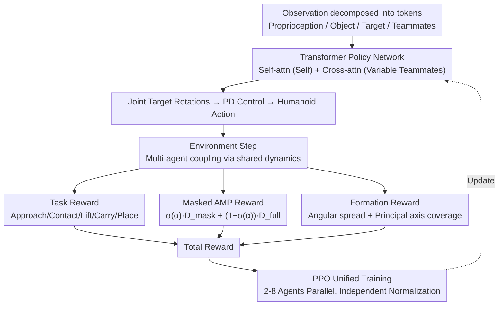

# TeamHOI: Learning a Unified Policy for Cooperative Human-Object Interactions with Any Team Size

**Conference**: CVPR 2026  
**arXiv**: [2603.07988](https://arxiv.org/abs/2603.07988)  
**Code**: [Project Page](https://splionar.github.io/TeamHOI)  
**Area**: Others  
**Keywords**: Multi-agent cooperation, Physics-based humanoid control, Human-object interaction, Transformer policy network, Adversarial motion priors

## TL;DR

The TeamHOI framework is proposed, utilizing a Transformer-based decentralized policy network and Masked Adversarial Motion Priors (Masked AMP). This allows a single policy to generalize to cooperative carrying tasks with an arbitrary number of agents, achieving a $97\%+$ success rate for teams of 2-8 humanoid agents carrying tables.

## Background & Motivation

**Limitations of Prior Work**: While physics-based humanoid control has achieved significant progress in single-agent behaviors (walking, grasping, manipulation), many real-world tasks (e.g., carrying heavy loads) require physical coordination between multiple agents, which existing frameworks struggle to handle.

**Key Challenge**: Most existing methods use MLP policy networks with fixed-size inputs, restricting policies to a specific team size (e.g., SMPLOlympics only supports fixed small teams) and failing to adapt to varying numbers of collaborators.

**Key Insight**: Methods like CooHOI lack explicit inter-agent communication, relying solely on shared object dynamics as an implicit channel. This fails to capture the essence of human collaboration, which involves continuous perception and dynamic adjustment to teammates.

**Background**: High-quality multi-person collaborative motion capture data is nearly non-existent. Directly using single-person reference motions in AMP frameworks severely limits the diversity of learned collaborative behaviors.

**Goal**: Existing methods (e.g., CooHOI) are restricted to simple lift-and-carry patterns due to their dependence on complete single-person reference motions, unable to produce diverse strategies like side-walking while carrying.

**Novelty**: CooHOI requires pre-assigned contact points for each agent (oracle assignment); agents lack the autonomy to infer suitable positions for stable transport.

## Method

### Overall Architecture

TeamHOI extends the AMP framework to a variable-scale multi-agent reinforcement learning (MARL) setting. Each agent, within its local coordinate system, decomposes observations into tokens (proprioception, object state, target position, teammate cues) fed into a **Transformer policy network**. Self-attention processes individual tokens, while cross-attention handles a variable number of teammate tokens, enabling a single network to support any team size. The network outputs target joint rotations, driving humanoid actions via PD control, with agents coupled through shared object dynamics.

The reward function consists of three components: phased task rewards (approach / contact / lift / carry / place), **Masked AMP rewards** that decouple motion naturalness from object interaction, and **formation rewards** that encourage autonomous uniform distribution around the object. The unified policy is optimized via PPO, with parallel instances of 2-8 agents and independent advantage normalization for stable training.

### Key Designs

**1. Transformer Policy Network and Teammate Tokens**

Observation composition (all in the agent's local frame):

- Proprioception $\in \mathbb{R}^{223}$: Joint states and root kinematics.
- Object Center $\in \mathbb{R}^{3}$: 3D coordinates of the table center.
- Candidate Contact Points $\in \mathbb{R}^{64 \times 3}$: 64 points sampled uniformly along the table perimeter.
- Nearest Hand-Object Points $\in \mathbb{R}^{2 \times 3}$: Closest candidate contact points to both hands.
- Target Location $\in \mathbb{R}^{3}$: Target x, y coordinates and height/elevation indicator.
- Teammate Cues $\in \mathbb{R}^{(n-1) \times 9}$: Root position (2D), orientation (6D rotation), and relative angle (1D) for each teammate.

Each component is encoded into a 64-dimensional token via a 3-layer MLP tokenizer. The Transformer consists of 3 layers of alternating self-attention and cross-attention (2 heads each, 512-dim feed-forward). The updated embedding $e$ is mapped through an MLP `[1024, 512, 28]` to output target rotations.

**2. Masked Adversarial Motion Priors (Masked AMP)**

Two discriminator networks are trained:
- $D_{\text{full}}$: Evaluates full-body reference motion.
- $D_{\text{mask}}$: Excludes body parts involved in object interaction (hands and forearms).

The blended style reward is:
$$r_t^{\text{style}} = \sigma(\alpha_t) \, r_t^{\text{mask}} + (1 - \sigma(\alpha_t)) \, r_t^{\text{full}}$$

where $\sigma$ is the sigmoid function and $\alpha_t$ is a continuous interaction indicator (e.g., agent-object distance). Full discriminators ensure realism when not interacting, while the masked discriminator releases hand degrees of freedom to be guided by task rewards during interaction.

**3. Formation Reward**

Composed of two complementary parts:

- **Angular Spread Reward** $r_{\text{ang}}$: Encourages $m$ agents to distribute uniformly around the table with an ideal spacing of $2\pi/m$:
$$r_{\text{ang}} = \exp\!\left(-k_\theta \frac{1}{2}\left[(\Delta\phi_i^{\text{ccw}} - \frac{2\pi}{m})^2 + (\Delta\phi_i^{\text{cw}} - \frac{2\pi}{m})^2\right]\right)$$

- **Principal Axis Coverage Reward** $r_{\text{cov}}$: Measures the coverage of the object's principal axes by the agents' support region, calculated via convex hull projections for each axis $g_i = \min(d_i^+ / \ell_i^+, d_i^- / \ell_i^-)$, resulting in $r_{\text{cov}} = \frac{1}{2}(g_1 + g_2)$.

Total formation reward: $r_{\text{form}} = 0.25 \, r_{\text{ang}} + 0.75 \, r_{\text{cov}}$.

### Loss & Training

Total reward: $r_t = r_t^{\text{task}} + \lambda_{\text{AMP}} \, r_t^{\text{style}}$

- **Task Reward** $r_t^{\text{task}}$: Includes components for approach, contact, lift, carry, and place stages, plus the formation reward.
- **Style Reward** $r_t^{\text{style}}$: Output from the Masked AMP hybrid discriminators.
- **Discriminator Loss**: Standard GAN loss where $D_{\text{full}}$ and $D_{\text{mask}}$ are trained separately to distinguish between reference/policy state transitions.

Policy optimization uses PPO with advantages normalized independently across different team sizes.

## Key Experimental Results

### Main Results

Evaluated on cooperative table-carrying tasks with square ($1.6\text{m} \times 1.6\text{m}$), rectangular ($2.0\text{m} \times 1.2\text{m}$), and circular (diameter $2.0\text{m}$) geometries, weighing 50-70kg. Evaluations were run for 10,000 episodes.

| Method | Formation | 2-agt SR(%) | 4-agt SR(%) | 8-agt SR(%) | 4-agt Coop. Rate | 8-agt Coop. Rate |
|------|---------|---------|---------|---------|----------|----------|
| CooHOI*-2 | Pre-defined | 97.5 | 73.2 | 10.1 | 54.6% | 1.0% |
| CooHOI*-4 | Pre-defined | 95.5 | 94.5 | 61.5 | 92.1% | 27.2% |
| CooHOI*-8 | Pre-defined | 29.4 | 52.4 | 42.2 | 93.6% | 81.6% |
| **TeamHOI** | **Learned** | **99.1** | **99.2** | **97.5** | **96.1%** | **90.1%** |

**Heavy Load Setting ($5 \times$ Weight)**: In 4-agent scenarios, TeamHOI achieves 3.5% SR (virtually impossible for small teams to lift), while in 8-agent scenarios, TeamHOI reaches **81.1%** SR. All CooHOI* baselines remain $< 15\%$.

### Ablation Study

| Ablation | Effect |
|--------|------|
| W/o Masked AMP | Significant drop in lifting success; frequent hand-object interaction failures. |
| Angular Spread Only (No Coverage) | Agents fail to align with principal axes, resulting in unnatural diagonal gaits. |
| Full Method | Agents align with principal axes, exhibiting natural symmetric gaits and stable transport. |

### Key Findings

- **Unified Policy**: TeamHOI achieves high success rates across all configs (2-8 agents) with a single policy, whereas CooHOI* variants only perform well on the specific team size they were trained for.
- **Zero-shot Generalization**: The model generalizes zero-shot to configurations with 16 agents.
- **Autonomous vs. Pre-defined Formation**: TeamHOI agents must infer positions autonomously, yet significantly outperform baselines that use oracle contact points.
- **Role of Masked AMP**: The masking strategy allows single-person side-walking reference motions to be repurposed for side-walking while carrying, greatly expanding the diversity of valid collaborative behaviors.

## Highlights & Insights

1. **Scalable Decentralized Architecture**: Using Transformer cross-attention to process variable teammate tokens elegantly solves fixed-input limitations.
2. **Masked AMP Design**: Masking only the body parts in contact with the object maintains global realism while unlocking diverse collaborative behaviors from limited single-person data via task-guided hand freedom.
3. **General Formation Rewards**: The combination of angular spread and principal axis coverage is robust to team size and object shape, and potentially generalizes to irregular geometries.
4. **No Oracle Assignment**: Agents start from random positions and autonomously infer stable formations.

## Limitations & Future Work

1. **Task Specificity**: Currently validated only on table carrying; not yet extended to pushing, pulling, or throwing/catching.
2. **Simplified Hand Model**: Uses spherical hands without fingers, lacking fine-grained grasping.
3. **Horizontal Transport Only**: Table height is fixed near standing hand level, avoiding complex interactions like crouching or high lifting.
4. **Reference Motion Scarcity**: Still relies on limited AMASS motions; more complex collaborative patterns may need richer data.
5. **Homogeneous Agents**: All agents share the same policy and body type; heterogeneous team collaboration remains unexplored.

## Related Work & Insights

- **AMP / ASE / PMP**: TeamHOI's Masked AMP is inspired by partial priors in PMP but uses masking and task rewards instead of learning explicit sub-part priors.
- **TokenHSI**: A pioneer in Transformer policies and task tokenization; TeamHOI adapts this to multi-agent cross-attention.
- **CooHOI**: The primary baseline; it relies only on implicit communication through physics and lacks inter-agent perception and behavioral diversity.
- **PHC**: The underlying framework for physics-based humanoid control.

## Rating

- Novelty: ⭐⭐⭐⭐ — Masked AMP and principal axis coverage are novel; Transformer teammate tokens are a natural yet effective extension.
- Experimental Thoroughness: ⭐⭐⭐⭐ — Comprehensive 10k episode evaluations, diverse geometries, 2-8 agent configs, and heavy-load tests.
- Writing Quality: ⭐⭐⭐⭐⭐ — Clear structure, complete equations, and intuitive diagrams.
- Value: ⭐⭐⭐⭐ — Provides a solid foundation for scalable multi-agent physical collaboration.

<!-- RELATED:START -->

## Related Papers

- [\[CVPR 2026\] MooCap: A Multi-View Benchmark for Cow-Object-Human Interaction and Behavior Dynamics](moocap_a_multi-view_benchmark_for_cow-object-human_interaction_and_behavior_dyna.md)
- [\[ICCV 2025\] SyncDiff: Synchronized Motion Diffusion for Multi-Body Human-Object Interaction Synthesis](../../ICCV2025/others/syncdiff_synchronized_motion_diffusion_for_multi-body_human-object_interaction_s.md)
- [\[CVPR 2026\] Modeling the Visual Ambiguity of Human Sketches](modeling_the_visual_ambiguity_of_human_sketches.md)
- [\[CVPR 2026\] BrepVGAE: Variational Graph Autoencoder with Unified Latent Representation for B-rep](brepvgae_variational_graph_autoencoder_with_unified_latent_representation_for_b-.md)
- [\[ICLR 2026\] PU-Bench: A Unified Benchmark for Rigorously Reproducible PU Learning](../../ICLR2026/others/pu-bench_a_unified_benchmark_for_rigorous_and_reproducible_pu_learning.md)

<!-- RELATED:END -->
