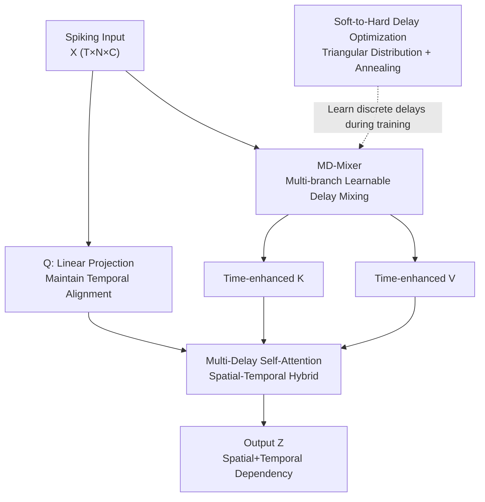

# Temporal Interaction in Spiking Transformers with Multi-Delay Mixer

**Conference**: CVPR 2026  
**Paper**: [CVF Open Access](https://openaccess.thecvf.com/content/CVPR2026/html/Shi_Temporal_Interaction_in_Spiking_Transformers_with_Multi-Delay_Mixer_CVPR_2026_paper.html)  
**Code**: None  
**Area**: Spiking Neural Networks / Spiking Transformer  
**Keywords**: Spiking Neural Networks, Spiking Transformer, Temporal Modeling, Learnable Delay, Self-Attention

## TL;DR
To address the deficiency where spiking self-attention "models only space and almost no time," this paper first proposes the TIC metric to quantify the issue. It then introduces the Multi-Delay Mixer (multi-branch learnable delays), inspired by biological axonal transmission delays, as a plug-and-play module to inject multi-scale temporal dependencies into Key/Value. This approach consistently refreshes SOTA for Spiking Transformers across static, neuromorphic, and long-sequence benchmarks.

## Background & Motivation

**Background**: Spiking Neural Networks (SNNs) process information in an event-driven, sparse manner, making them extremely energy-efficient on neuromorphic hardware. Recently, migrating the Transformer architecture to SNNs has yielded models like Spikformer, QKFormer, and Spike-driven Transformer V1/V2, which show impressive performance on image recognition and neuromorphic data.

**Limitations of Prior Work**: Spiking self-attention mechanisms (SSA, QKTA, SDSA, etc.) in these models compute spatial correlations almost exclusively within a **single time step**. **Temporal dependency** is left to be handled implicitly by the membrane potential dynamics of the spiking neurons (LIF leakage integration). This implicit temporal modeling is too weak, limiting performance when processing neuromorphic data rich in temporal information. Existing explicit temporal methods are either computationally expensive (STSA) or sacrifice modeling capability.

**Key Challenge**: The intrinsic dynamics of spiking neurons are insufficient to capture long-range temporal patterns across time steps, while the attention mechanism itself is designed to be "step-wise independent." Furthermore, the field **lacks a metric to quantify how much temporal dependency is modeled by attention**, forcing researchers to rely solely on task accuracy without identifying the bottleneck.

**Goal**: (1) Provide a metric to directly measure the temporal modeling capability of attention; (2) Design a plug-and-play module that adds multi-scale temporal modeling to existing spiking self-attention without compromising event-driven characteristics.

**Key Insight**: The authors draw inspiration from **axonal transmission delays** in biological neural systems—different axons have varying transmission delays, allowing neurons to integrate information across different time scales. By making this "delay" mechanism learnable, attention can explicitly incorporate information from historical time steps.

**Core Idea**: Upgrade spiking self-attention from "purely spatial" to "spatial-temporal hybrid" by using a set of **channel-level, learnable multi-branch temporal delays** to construct time-enhanced Key/Value pairs.

## Method

### Overall Architecture

The goal is to solve the "lack of temporal modeling in spiking self-attention." The approach comprises three layers: first, diagnosing the problem with the **TIC metric** (showing temporal dependency is highly concentrated on the current step); second, using the **Multi-Delay Mixer (MD-Mixer)** core module to weighted-mix historical features through learnable delay branches; and third, embedding MD-Mixer into the K/V projection paths to form the **Multi-Delay Self-Attention Framework**. To optimize discrete delays, a **Soft-to-Hard delay optimization** strategy is employed to learn discrete delays via continuous gradients.

The input is a spiking tensor $X \in \mathbb{R}^{T \times N \times C}$ ($T$ time steps, $N$ tokens, $C$ channels). The Query follows a standard Linear projection to maintain temporal alignment, while the Key and Value each pass through an MD-Mixer for temporal mixing. All three are processed by BN + spiking neurons before entering the original spiking self-attention to produce output $Z$. The MD-Mixer is a drop-in replacement that does not modify the attention body itself.

### Key Designs

**1. TIC (Temporal Interaction Coefficient): Quantifying "How much time is modeled"**

To improve temporal modeling, it must first be measurable. The authors define the temporal interaction coefficient for time step $q$ as $\text{TIC}_q = H(\tilde{R}_q)$, the information entropy of the **dependency distribution** $\tilde{R}_q$. The dependency distribution is obtained by L1-normalizing the dependency vector $R_q = [R_{q\to 1}, \dots, R_{q\to q}]$, where each component $R_{q\to p} = \left\| \frac{\partial Z_q}{\partial X_p} \right\|_1$ ($p \le q$) measures the gradient dependency of the attention output at step $q$ on the input at step $p$. Intuitively, a higher TIC indicates a more "spread out" dependency distribution across historical steps; a lower TIC indicates dependency is concentrated on the current step. Visualizing SSA/QKTA/SDSA on CIFAR10-DVS reveals distributions **sharply concentrated on the current step**, with historical contributions near zero and consistently low TIC values.

**2. MD-Mixer: Channel-level Temporal Aggregation via Learnable Delays**

As the core of the paper, this directly addresses the lack of historical information. Inspired by axons having multiple transmission delays, MD-Mixer assigns $K$ delay branches to each channel $i$. Each branch has its own learnable delay $d_i^{(k)}$ and aggregation weight $\alpha_i^{(k)}$, performing a weighted sum of historical features:

$$\tilde{X}_{t,i} = \sum_{k=1}^{K} \alpha_i^{(k)} X_{t-d_i^{(k)}, i}$$

Both $d_i^{(k)}$ and $\alpha_i^{(k)}$ are jointly optimized during training, allowing the model to learn the most suitable multi-scale temporal patterns for each channel in a **data-driven** manner. Unlike fixed time windows or recurrent connections, this approach uses sparse, channel-specific delay sampling. It preserves event-driven properties and is efficient: complexity is reduced from $O(TD^2)$ to $O(KTD)$ and parameter count from $D^2$ to $KD$ (a reduction of approximately $D/K$ times).

**3. Multi-Delay Self-Attention Framework: Delay only for K/V, Query remains aligned**

The authors choose to apply the **MD-Mixer only to Key and Value** (to absorb historical context) while keeping the **Query as a standard Linear projection to maintain current temporal alignment**:

$$Q = \text{SN}(\text{BN}(\text{Linear}(X))), \quad K = \text{SN}(\text{BN}(\text{MD-Mixer}(X))), \quad V = \text{SN}(\text{BN}(\text{MD-Mixer}(X)))$$

This allows the current Query to attend to "K/V pairs already infused with historical context," expanding attention from per-step spatial correlation to cross-step spatial-temporal hybrid modeling ($Z = \text{Atten}(Q, K, V)$). The framework is agnostic to the underlying attention mechanism and can be applied to Spikformer, QKFormer, SDT, etc.

**4. Soft-to-Hard Delay Optimization: Learning Discrete Delays via Continuous Gradients**

Delay $d$ is inherently a discrete integer, making it non-differentiable. The authors introduce a **triangular delay distribution** $\phi(d; d^*) = N\!\left(\sigma\!\left(1 - \frac{|d - d^*|}{\tau}\right)\right)$, where $d^*$ is the center (the delay to learn), $\tau$ is the temperature controlling sharpness, $\sigma(\cdot)=\max(0,\cdot)$ is ReLU, and $N(\cdot)$ normalizes over all candidate delays. The delay is softened into a distribution and integrated into the membrane potential update: $I_{t,j} = \sum_{k=1}^{K} \alpha_j^{(k)} \sum_{d=0}^{T-1} \phi(d; d_j^{(k),*}) \cdot X_{t-d,j}$. During training, the temperature $\tau$ **anneals via a cosine squared schedule**: initially large to explore multiple scales, and eventually narrowing to 1-hot to lock onto a specific discrete delay.

### Loss & Training

No additional loss terms are used; the standard classification objectives of the baselines are maintained. The key mechanism is the **cosine squared annealing schedule** for the delay temperature $\tau$. Ablations were performed on SDT-V1.

## Key Experimental Results

### Main Results

**Static ImageNet** (Top-1 Accuracy, T=4): MD-Mixer as a K/V replacement provides consistent gains.

| Architecture | Params(M) | Baseline | +STAtten | +MD-Mixer |
| :--- | :--- | :--- | :--- | :--- |
| SDT-V1-8-768 (224²) | 66.34 | 76.32 | 78.11 | 78.23 |
| SDT-V2-8-512 (224²) | 55.4 | 79.49 | 79.85 | **80.02** |

On SDT-V1-8-768, MD-Mixer improves by 1.91% over the baseline, performing slightly better than STAtten while being more efficient.

**Neuromorphic + Long-Sequence Datasets**: MD-Mixer shows more significant improvements on DVS and sequence benchmarks.

| Dataset | Architecture | Baseline | +STAtten | +MD-Mixer |
| :--- | :--- | :--- | :--- | :--- |
| CIFAR10-DVS | Spikformer-2-256 (T=16) | 80.90 | 82.40 | **83.37** |
| N-Caltech101 | SDT-V1-2-256 (T=16) | 81.80 | 83.15 | **84.59** (+2.79) |
| s-CIFAR100 | QKFormer-2-256 | 55.99 | 56.23 | **64.33** (+8.34) |
| s-CIFAR10 | SDT-V1 | 83.65 | 83.90 | **86.65** |
| UCF101-DVS | +SDT-V2 | — | TIM: 63.8 | **66.3** (+2.5) |
| HMDB51-DVS | +SDT-V2 | — | TIM: 58.6 | **62.8** (+4.2) |

### Ablation Study

**Learnable Delay vs. Random Delay** (Aggregation weights learnable for both):

| Dataset | Configuration | Accuracy (%) | Note |
| :--- | :--- | :--- | :--- |
| s-CIFAR10 | Baseline | 83.65 | — |
| s-CIFAR10 | + Random Delay | 84.39 | Gain +0.74, due to diversity |
| s-CIFAR10 | + MD-Mixer | **86.65** | Gain +3.00, learnability is key |

**Branch Count K**: More branches are not always better. For s-CIFAR10, performance peaked at $K=3$ (86.7%) and dropped at $K=6$ (84.2%). For CIFAR10-DVS, $K=4$ was optimal.

### Key Findings
- **Learnable delays are the primary performance driver**: Random delays provide marginal gains (~0.5-0.7%), whereas learnable delays provide significant improvements (2.4-3.0%).
- **Optimal branch count exists**: Too many branches can degrade performance due to over-complex temporal modeling, supporting the efficiency of $K \ll D$.
- **MD-Mixer increases TIC**: After integration, the dependency vector widens significantly, and TIC values increase across various attention types (e.g., SSA TIC16 increases from 2.10 to 3.39).

## Highlights & Insights
- **Metric-driven Design**: Using TIC to quantify the bottleneck ensures the motivation is measurable and the solution is verifiable.
- **Biologically Inspired Efficiency**: The transition from axonal delays to multi-branch learnable delays is natural. Reducing complexity from $O(TD^2)$ to $O(KTD)$ makes temporal modeling a "free lunch."
- **Soft-to-Hard Optimization**: This annealing trick is a reusable strategy for learning discrete indices or selections in a neural network via continuous gradients.
- **Asymmetric Design**: Applying delays only to K/V while keeping Query aligned ensures the current time step can search historical context without losing its temporal anchor.

## Limitations & Future Work
- Lack of end-to-end measured latency/energy consumption on hardware; gains are primarily based on theoretical analysis.
- The branch count $K$ is a sensitive hyperparameter that depends on the dataset, lacking an adaptive selection mechanism.
- Limited gains on static ImageNet (~0.5-1.9%) compared to sequence data suggest the method's value is proportional to the temporal structure of the data.

## Related Work & Insights
- **vs. STSA / STAtten**: STSA is computationally heavy. STAtten uses block strategies for efficiency. MD-Mixer serves as a drop-in replacement with lower theoretical complexity and superior performance on most benchmarks.
- **vs. TIM**: TIM injects history into the Query branch. This work does the opposite (injecting into K/V with multi-branch learnable delays) and outperforms TIM on action recognition datasets like HMDB51-DVS by 4.2%.
- **vs. Standard Spiking Attention**: Previous methods relied on implicit neuron dynamics. TIC analysis proves their temporal dependency is concentrated on the current step, whereas MD-Mixer explicitly expands this dependency.

## Rating
- **Novelty**: ⭐⭐⭐⭐⭐ (TIC metric + bio-inspired multi-delay + soft-to-hard optimization)
- **Experimental Thoroughness**: ⭐⭐⭐⭐⭐ (Covers static, neuromorphic, and long-sequence across four architectures)
- **Writing Quality**: ⭐⭐⭐⭐ (Logical flow is clear)
- **Value**: ⭐⭐⭐⭐ (Plug-and-play SOTA achiever for temporal modeling in Spiking Transformers)

<!-- RELATED:START -->

## Related Papers

- [\[CVPR 2026\] On the Role of Temporal Granularity in the Robustness of Spiking Neural Networks](on_the_role_of_temporal_granularity_in_the_robustness_of_spiking_neural_networks.md)
- [\[CVPR 2026\] Robust Spiking Neural Networks by Temporal Mutual Information](robust_spiking_neural_networks_by_temporal_mutual_information.md)
- [\[CVPR 2026\] Temporal Representation Enhancement (TRE): Learning to Forget Dominant Patterns for Enhanced Temporal Spiking Features](temporal_representation_enhancement_tre_learning_to_forget_dominant_patterns_for.md)
- [\[CVPR 2026\] MooCap: A Multi-View Benchmark for Cow-Object-Human Interaction and Behavior Dynamics](moocap_a_multi-view_benchmark_for_cow-object-human_interaction_and_behavior_dyna.md)
- [\[CVPR 2026\] Keep It Frozen: Domain-Routed Conditional Residual Modulation for Multi-Domain Vision Transformers](keep_it_frozen_domain-routed_conditional_residual_modulation_for_multi-domain_vi.md)

<!-- RELATED:END -->
