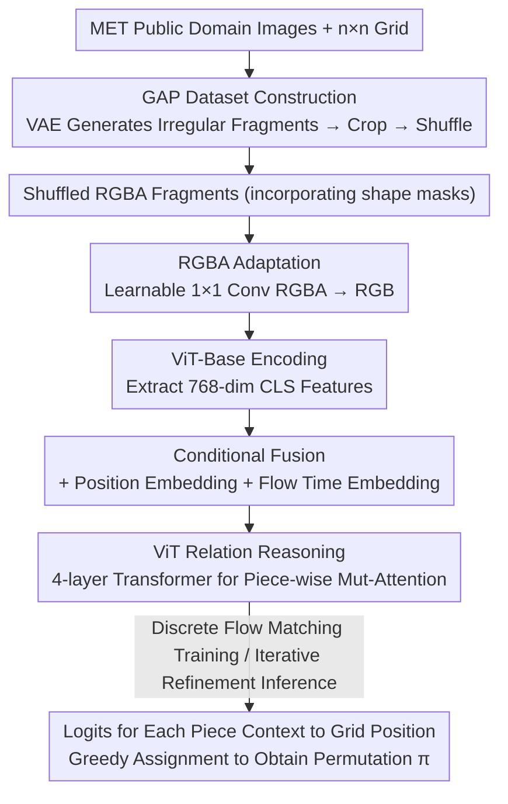

# The Missing GAP: From Solving Square Jigsaw Puzzles to Handling Real World Archaeological Fragments

**Conference**: CVPR 2026  
**Paper**: [CVF Open Access](https://openaccess.thecvf.com/content/CVPR2026/html/Shahar_The_Missing_GAP_From_Solving_Square_Jigsaw_Puzzles_to_Handling_CVPR_2026_paper.html)  
**Code**: None (The paper states that the dataset, VAE model, and evaluation scripts will be released upon acceptance)  
**Area**: Jigsaw Puzzle Assembly / Cultural Heritage Reconstruction  
**Keywords**: Jigsaw Puzzle Solving, Archaeological Fragments, Discrete Flow Matching, ViT, Dataset Benchmark

## TL;DR
Addressing the gap where existing puzzle solvers only handle square pieces and fail when applied to real archaeological fragments, this work proposes two contributions: GAP, an irregular fragment puzzle benchmark constructed by learning the shape distribution of real-world archaeological fragments using a VAE, and PuzzleFlow, a solving framework that performs permutation learning via ViTs and discrete flow matching. Relying on holistic visual relations of the pieces rather than boundary matching, PuzzleFlow significantly outperforms both classical and recent SOTA methods on GAP.

## Background & Motivation
**Background**: Jigsaw puzzle solving has been considered a classic computer vision task since the 1960s. Recently, it has evolved from hand-crafted optimization (greedy, genetic algorithms, relaxation labeling) to data-driven frameworks such as CNNs, ViTs, diffusion models, and reinforcement learning, progressively achieving higher scores on benchmarks like JPwLEG and Deepzzle.

**Limitations of Prior Work**: Almost all of these methods share a deliberately simplified setup—**only handling strictly square pieces**, where pieces are either seamless or separated by a uniform, fixed gap (e.g., the 44px fixed gap in JPwLEG). However, the "killer application" repeatedly marketed in this field is **cultural heritage reconstruction**: real-world pottery and fresco fragments are highly irregular, heavily eroded at the boundaries, and separated by wide, non-linear gaps. This creates "the missing GAP" between academic benchmarks and real-world scenarios.

**Key Challenge**: The success of mainstream solvers heavily relies on **boundary continuity matching**, judging adjacency based on whether textures/colors align at the seams. However, once edges are eroded, the original boundary information disappears completely, rendering boundary-based pathways useless. Meanwhile, real archaeological fragment data is extremely scarce (e.g., RePAIR has only a few hundred scanned fragments), which is insufficient to support large-scale training and systematic comparison.

**Goal**: (1) Create a benchmark that closely mimics the geometric complexity of real-world archaeological fragments, supports large-scale generation, and is compatible with existing input formats; (2) design a solving framework that does not rely on boundary matching and can handle fragments of any shape.

**Key Insight**: Instead of relying on local boundaries, the model should perform holistic relation reasoning over the **entire fragment surface**. Features that transcend local boundaries, such as global visual patterns, color distribution, and structural coherence, remain preserved even after edge erosion.

**Core Idea**: Model the shape distribution of real fragments using a VAE to synthetically generate large-scale irregular puzzle benchmarks (GAP), and formulate puzzle reconstruction as a **permutation learning** problem solved via discrete flow matching and a ViT for iterative holistic reasoning (PuzzleFlow).

## Method

### Overall Architecture
This paper makes dual contributions in both "dataset + solver," which can be viewed through two pipelined processes. The **GAP generation pipeline** creates the puzzles: starting from public-domain Met Museum (MET) images, an $n\times n$ regular grid is superimposed, an irregular fragment mask is generated in the center of each grid cell using a VAE to crop the textured fragments, and the fragments are then randomly shuffled to produce a 9-piece (GAP-3, $3\times3$) or 25-piece (GAP-5, $5\times5$) irregular puzzle. The **PuzzleFlow solver pipeline** solves the puzzles: the $N$ shuffled fragments (stored as RGBA images with an alpha channel) are projected into RGB via a learnable $1\times1$ convolution, which is then fed into an ImageNet-21K pre-trained ViT-Base to extract [CLS] features. Position embeddings and flow-time embeddings are added before passing through a 4-layer Transformer for inter-fragment relation reasoning. Finally, an MLP head predicts the target grid position ($N$-dimensional logits) for each fragment. Training employs discrete flow matching to learn "step-by-step refinement" instead of single-step prediction, and inference starts from a random permutation and iteratively refines via 20-step greedy allocation.

### Key Designs

**1. GAP Dataset: Replicating "Real Archaeological Fragment Shape Distributions" at Scale via VAE**

The primary bottleneck is that real-world archaeological fragment databases (such as RePAIR, which contains only 958 scanned Pompeii fragments) are too small to support large-scale deep learning or rigorous evaluations, while existing synthetic alternatives rely on simple square splitting or fixed geometric gaps. To resolve this, a VAE is trained to learn the shape distribution of real fragment masks. The encoder consists of four convolutional layers (with channels 32/64/128/256), squeezing the $128\times128$ input down to $256\times8\times8$, which is then mapped to a 64-dimensional latent space and reparameterized. A symmetric decoder recovers the $128\times128$ binary mask. The network is trained with Adam (lr=$10^{-4}$) for 44 epochs, utilizing a combination of reconstruction loss (binary cross-entropy) and KL regularization. The generated continuous masks undergo morphological post-processing (thresholding at 0.5, internal hole filling, extracting the largest connected component, and smoothing boundaries using a disk structure element with a radius of 2 pixels) to guarantee a single, continuous fragment shape. To compile the dataset, a $3\times3$ or $5\times5$ grid is overlaid on MET images, VAE-generated masks are placed at the grid centers to crop the textures, and the resulting pieces are shuffled. This yields 20,000 puzzles each for GAP-3 ($384\times384$ canvas) and GAP-5 ($640\times640$).

This strategy succeeds because it balances high-fidelity representation with controllable, large-scale generation. Geometric validation demonstrates that the generated fragments align closely with real fragments across core shape parameters (area difference $<1\%$: 10,617 vs 10,716 px²; aspect ratio difference 3%; solidity difference 2%). Edge complexity metrics present moderate differences due to the smoothing effect of the VAE (perimeter difference 12%, circularity 18%, vertex count 22%, concavity 19%). PCA projection (explaining 63.2% of the variance) shows a significant overlap of real/synthetic distributions without mode collapse. Because it preserves a grid topology, the dataset is compatible with prior solvers, serving as a benchmark that is challenging for existing methods but solvable with appropriate model architectures.

**2. Permutation Learning via Discrete Flow Matching: Replacing "One-Step Prediction" with "Iterative Refinement"**

The assembly task can be formulated as follows: given $N$ shuffled fragments $X=\{x_1,\dots,x_N\}$ (from a $k\times k$ grid, where $N=k^2$), find the optimal permutation $\pi^*\in S_N$ such that $\pi^*=\arg\max_{\pi\in S_N} p_\theta(\pi\mid X)$. Solving directly in the combinatorial space of size $N!$ is hard to optimize and yields discrete outputs. The authors extend flow matching to discrete permutations: define a distribution evolving over time $t\in[0,1]$. At $t=0$, $\pi_0\sim\text{Uniform}(S_N)$ (completely random), and at $t=1$, $\pi_1=\pi^*$ (ground truth). Linear-scheduled stochastic interpolation is used in-between: each piece $i$ takes the ground truth position $\pi_1^{(i)}$ with probability $t$, and a random position $\pi_0^{(i)}$ with probability $1-t$. The training objective is to predict the target position of each piece given the current state $\pi_t$ and time $t$:

$$\mathcal{L}_{\text{CFM}}=\mathbb{E}_{t,\pi_0,\pi_t}\Big[-\sum_{i=1}^{N}\log p_\theta(\pi_1^{(i)}\mid x_i,\pi_t,t)\Big]$$

Thus, the model learns to make incremental corrections based on a partially reconstructed layout instead of blind guessing in a single step. Ablations show that replacing this with single-step cross-entropy directly predicting positions degrades performance by 5.9 PA points, demonstrating that iterative refinement is particularly useful for pieces with weak visual anchors.

**3. RGBA Adaptation: Feeding Shape Masks to ViT via Learnable $1\times1$ Convolutions Instead of Simply Discarding Alpha**

The boundary geometry of irregular fragments serves as a crucial spatial cue, whereas square puzzle methods typically discard the alpha channel and only keep RGB. This work stores fragments as $128\times128$ RGBA images (where alpha encodes the irregular shape mask) and projects them to RGB using a learnable $1\times1$ convolution before feeding them into the ViT. This adaptively merges all four channels, ensuring shape information is preserved instead of being crudely discarded. This step is critical for irregular puzzles: in ablations, replacing this with standard square patch slicing (RGB-only) leads to a major performance drop across all metrics (PA drops by 19.3 points). The authors emphasize that this is not an "unfair" advantage, but a necessary adaptation when dealing with a task where shape symmetry is inherently valuable—square puzzles do not need explicit shape encoding, but irregular fragments do.

**4. Holistic Relation Reasoning via ViT + Iterative Greedy Inference: Relying on Holistic Visual Relations Rather Than Boundary Matching**

After $1\times1$ convolution, fragments are interpolated to $224\times224$ and passed through the ViT-Base, extracting the [CLS] token as a global summary feature $h_i\in\mathbb{R}^{768}$. Two sets of conditional embeddings are added: the current position index mapped through a lookup table to yield the position embedding $e_{\text{pos}}(p_i)$, and the flow time $t$ mapped via a 192-dimensional sinusoidal embedding followed by a two-layer SiLU MLP to yield the time embedding $e_{\text{time}}(t)$. The residual sum $z_i=h_i+e_{\text{pos}}(p_i)+e_{\text{time}}(t)$ simultaneously encodes "appearance, current location, and flow step". Subsequently, a $L=4$ layer pre-normalization Transformer (12 heads, hidden size 768, FFN size 3072) performs inter-fragment attention across all pieces, capturing global visual relationships (color distribution, structural continuity) beyond local boundaries. An MLP head ($768\to3072\to N$) outputs position logits, and a softmax yields $p_\theta(\pi_1^{(i)}=j\mid x_i,\pi_t,t)$. During inference, starting from a random permutation, the model recalculates logits at each of the $S=20$ steps (where $t=s/S$) and greedily assigns pieces to unoccupied positions via $\arg\max_{j\in P_{\text{avail}}}\ell_i[j]$. The complexity is $O(N^2)$, which is far more efficient than the exhaustive $O(N!)$ or Hungarian matching at $O(N^3)$.

### Loss & Training
The learning objective is the conditional flow matching loss $\mathcal{L}_{\text{CFM}}$ described above. Optimization is performed using AdamW (lr=$10^{-5}$, weight decay 0.01), with a OneCycleLR scheduler (10% warmup step), dropout of 0.1, FP16 mixed precision, for 30 epochs with a batch size of 8 on a single RTX 4090 GPU.

## Key Experimental Results

### Main Results
Tested on 3,000 synthetic puzzles for both GAP-3 ($3\times3$, 9 pieces) and GAP-5 ($5\times5$, 25 pieces). Metrics used: Perfect Accuracy (PA, percentage of completely reconstructed puzzles), Absolute Accuracy (AA, percentage of correctly placed fragments), and Spatial Relationship Accuracy (SRA, percentage of ground-truth adjacent pairs that remain adjacent in the same relative direction in the prediction, formulated in Eq. 6 of the paper—measuring local spatial structure preservation). PuzzleFlow is compared with 7 baselines (classical greedy/genetic algorithms + five deep learning methods: FCViT, JPDVT, DiffAssemble, JigsawGAN, and PuzLM, all retrained on GAP with a comparable budget).

| Dataset | Metric | PuzzleFlow | Runner-up | Gain |
|--------|------|-----------|------|------|
| GAP-3 | PA (%) | **28.5** | 25.2 (FCViT) | +3.3 |
| GAP-3 | AA (%) | **62.9** | 60.7 (FCViT) | +2.2 |
| GAP-3 | SRA (%) | **55.7** | 47.6 (FCViT) | +8.1 |
| GAP-5 | PA (%) | **0.3** | 0.0 | +0.3 |
| GAP-5 | AA (%) | **29.1** | 21.9 (DiffAssemble) | +7.2 |
| GAP-5 | SRA (%) | **19.8** | 14.7 (DiffAssemble) | +5.1 |

On GAP-3, classical methods (greedy/genetic) and several deep learning baselines (JPDVT, PuzLM) fall to 0% PA and around 11–15% AA (near random guessing), validating that irregular geometries and eroded boundaries violate the assumptions of boundary-matching-driven solvers. PuzzleFlow's advantage in SRA (+8.1 / +5.1 points) is particularly notable, indicating it captures superior spatial consistency. Escalating to GAP-5 increases the combinatorial complexity from $9!\approx3.6\times10^5$ to $25!\approx1.55\times10^{25}$, where most baselines degrade to near-random performance. The performance gap between PuzzleFlow and the strongest baselines actually widens from GAP-3 to GAP-5, showing that its holistic visual reasoning can "partially survive" in larger configurations.

### Ablation Study
All evaluations are conducted on GAP-3 under the same training script.

| Configuration | PA | AA | SRA | ΔPA | Note |
|------|----|----|----|-----|------|
| Full Model | 28.5 | 62.9 | 55.7 | – | Full model |
| Direct Prediction | 22.6 | 57.9 | 50.0 | -5.9 | Flow matching replaced with single-step cross-entropy |
| Frozen ViT | 7.4 | 42.2 | 34.5 | -21.1 | Freezing the pre-trained ViT degrades performance the most |
| Fixed Slicing (RGB-only) | 9.2 | 44.4 | 34.6 | -19.3 | Discards alpha shape information |
| 0 Layers | 10.1 | 45.1 | 35.3 | -18.4 | No task-specific Transformer layers |
| 2 Layers | 23.5 | 58.8 | 50.6 | -5.0 | Layer count L=2 |
| 6 Layers | 24.7 | 59.5 | 52.2 | -3.8 | No further gain with L=6 |

### Key Findings
- **Fine-tuning the ViT is the primary driver of performance**: Freezing the pre-trained ViT leads to a drop of 21.1 PA points, the largest drop among all ablations. Pre-trained ImageNet features must be adapted to learn cross-boundary continuity, erosion resistance, and global structural patterns. Thus, the authors suggest future work prioritize transfer learning strategies.
- **RGBA shape adaptation is the second most crucial component**: Discarding the alpha channel drops performance by 19.3 PA points, proving that "shapes must be explicitly encoded" for irregular fragments.
- **A depth of $L=4$ is sufficient**: $L=0$ achieves only 10.1% PA (showing pre-trained features alone are insufficient), which jumps to 23.5% at $L=2$, and plateaus around $L=4$ (with $L=6$ yielding no additional gains), balancing accuracy and efficiency.
- **Flow matching yields a steady yet modest gain** (+5.9 PA). The authors suspect that better inference algorithms (such as ancestral sampling) might unlock higher gains.
- Approximately 71% of GAP-3 and almost all GAP-5 puzzles remain unsolved, leaving ample room for improvement and demonstrating GAP's longevity as a viable benchmark.

## Highlights & Insights
- **Dual contribution of data generation and solving methodology**: Leveraging a VAE to learn real-world fragment distributions permits low-cost generation of realistic irregular fragments at scale, bypassing the data-scarcity bottleneck of archaeological collections. This paradigm of "replicating scarce real-world distributions via generative models to construct controllable benchmarks" can seamlessly transfer to other domains where real samples are difficult to collect (e.g., medical imaging, damaged remote sensing data).
- **Linking combinatorial permutation problems with flow matching**: Discrete flow matching enables the model to learn "iterative permutation correction" rather than single-step guesswork, compressing the $N!$ search space into $O(N^2)$ iterative greedy decisions—a clean example of migrating continuous generative paradigms to discrete structured output spaces.
- **The SRA metric addresses the blind spots of PA/AA**: While PA and AA look strictly at absolute position correctness, they cannot differentiate between "preserving local structures with a global shift" and "pure randomness". SRA resolves this by quantifying the spatial adjacency retention rate, which is a highly valuable evaluation design for puzzle and layout tasks.
- **The most counter-intuitive finding**: While boundary erosion causes traditional "edge-seam-based fitting" methods to completely collapse, performing global relationship reasoning over the entire surface of the fragment via a ViT remains effective. This demonstrates that global visual semantics are far more robust than local boundary elements.

## Limitations & Future Work
- **Absolute performance is still low**: The PA for GAP-3 is only 28.5%, and the PA for GAP-5 is close to 0%, which is far from being viable for practical archaeological reconstruction. The authors themselves point out that a 74% gap on PA remains.
- **Synthetic $\neq$ Real**: GAP fragments are generated via VAE followed by morphological smoothing, resulting in boundaries that are much "cleaner" than real fractures (with 12-22% differences in perimeter, vertex count, and concavity). Real archaeological materials exhibit complex texture wearing, missing pieces, and 3D warping, which are not modeled here. The authors acknowledge that real-world archaeological material remains the gold standard.
- **Assumption of grid topology and no missing pieces**: The current setup assumes a regular $n \times n$ grid, a known number of pieces, and no missing fragments. Real-world scenarios typically involve an unknown status of fragments, missing pieces, and non-grid configurations.
- **Modest gains from flow matching**: The +5.9 PA gain from flow matching is modest compared to the impact of fine-tuning (+21.1) and shape encoding (+19.3). The authors suggest that superior inference techniques (e.g., ancestral sampling) may amplify these benefits, serving as a direct path for future improvement.

## Related Work & Insights
- **vs Boundary-Matching Methods (Greedy / Genetic / DNN-Buddies / Deepzzle)**: While these methods assemble puzzles based on edge-adjacency texture coherence, this paper shifts toward holistic visual relationship reasoning. When erosion destroys boundary information, the former degrade to near-random guessing, while the latter continues to function.
- **vs FCViT**: FCViT uses a ViT to regress continuous fragment coordinates, representing the strongest baseline on GAP-3. While this work similarly builds on a ViT, it models outputs as discrete permutations coupled with discrete flow matching inference, outperforming FCViT on SRA by 8.1 points and exhibiting better spatial consistency.
- **vs DiffAssemble / JPDVT (Diffusion-Based)**: These methods rely on diffusion or graph-based denoising for assembly. This work implements discrete flow matching, achieving inference in only 20 greedy steps at a complexity of $O(N^2)$, degrading much more gracefully under larger setups like GAP-5.
- **vs Real Fragment Datasets (e.g., RePAIR)**: RePAIR provides real scanned fragments but is limited in scale (a few hundred pieces). This work uses a VAE to learn their distribution and construct a dataset of 40,000 puzzles, balancing scalability and fidelity.

## Rating
- Novelty: ⭐⭐⭐⭐ Combines "VAE-based archaeological fragment benchmarks" and "discrete flow matching for permutation solving" to bridge the real-world gap. Highly original, though both components build upon well-established technologies.
- Experimental Thoroughness: ⭐⭐⭐⭐ Compares against 7 baselines across two dataset scales, provides four ablation groups, and introduces the SRA metric. Quite solid, though absolute performance remains low and validation on genuine archaeological fragments is limited.
- Writing Quality: ⭐⭐⭐⭐ Clear motivation, well-elaborated dataset and solver pipelines, with consistent math formulations and ablation findings.
- Value: ⭐⭐⭐⭐ GAP as an open benchmark, combined with the SRA metric, holds long-term value for the puzzle solving and cultural heritage reconstruction communities, leaving ample room for future progress.

<!-- RELATED:START -->

## Related Papers

- [\[CVPR 2026\] VideoWorld 2: Learning Transferable Knowledge from Real-world Videos](videoworld_2_learning_transferable_knowledge_from_real-world_videos.md)
- [\[CVPR 2026\] UniMERNet: A Universal Network for Real-World Mathematical Expression Recognition](unimernet_a_universal_network_for_real-world_mathematical_expression_recognition.md)
- [\[CVPR 2026\] Clair Obscur: an Illumination-Aware Method for Real-World Image Vectorization](clair_obscur_an_illumination-aware_method_for_real-world_image_vectorization.md)
- [\[CVPR 2026\] Multi-view Crowd Tracking Transformer with View-Ground Interactions Under Large Real-World Scenes](multi-view_crowd_tracking_transformer_with_view-ground_interactions_under_large_.md)
- [\[ICLR 2026\] SmellNet: A Large-scale Dataset for Real-world Smell Recognition](../../ICLR2026/others/smellnet_a_large-scale_dataset_for_real-world_smell_recognition.md)

<!-- RELATED:END -->
