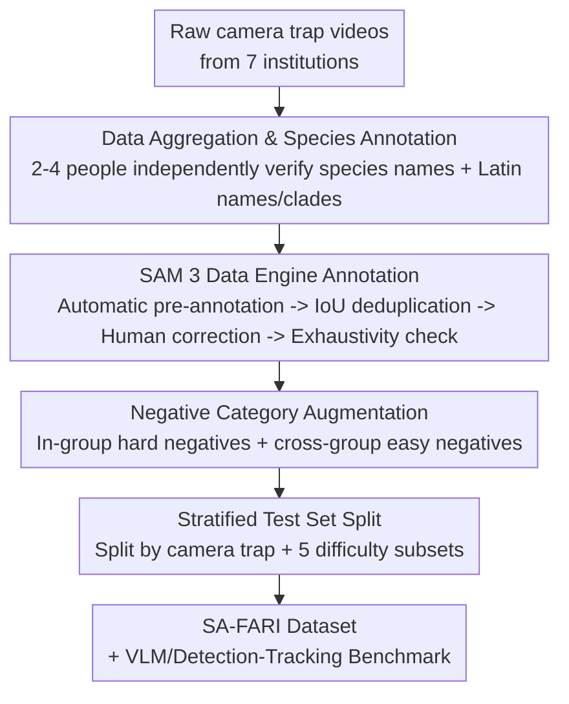

# The SA-FARI Dataset: Segment Anything in Footage of Animals for Recognition and Identification

**Conference**: CVPR 2026  
**Paper**: [CVF Open Access](https://openaccess.thecvf.com/content/CVPR2026/html/Wasmuht_The_SA-FARI_Dataset_Segment_Anything_in_Footage_of_Animals_for_CVPR_2026_paper.html)  
**Code**: https://conservationxlabs.com/SA-FARI (Dataset Homepage)  
**Area**: Video Segmentation / Multi-Object Tracking  
**Keywords**: Multi-animal tracking, video segmentation, camera traps, wildlife conservation, masklet annotation

## TL;DR
SA-FARI is the largest in-the-wild multi-animal tracking (MAT) dataset to date, aggregating 11,609 camera trap videos spanning 10 years across 4 continents, 741 stations, and 99 species. It provides the first large-scale **human-verified spatiotemporal segment masklets** (16,224 individual trajectories, 940k boxes/masks). Experiments demonstrate that training on SA-FARI improves SAM 3 on HOTA-like metrics by over 20 points.

## Background & Motivation
**Background**: Wildlife conservation increasingly relies on automated video analysis, the cornerstone of which is multi-animal tracking (MAT)—localizing individual animals in space and time to support downstream tasks such as species identification, individual re-identification (re-ID), behavior recognition, and population estimation. The volume of data yielded by in-situ sensors like camera traps (CTs) has far outpaced human processing capacity, making automated methods urgent.

**Limitations of Prior Work**: Although large-scale datasets exist for species classification and re-ID, MAT (especially in-the-wild) remains significantly underdeveloped. The authors identify four major shortcomings of existing datasets: (i) those specifically designed for MAT (e.g., AnimalTrack, GMOT, TAO) are **too small** (annotation duration $<1$ hour) and lack real-world ecological sensor footages like those from camera traps or drones; (ii) larger datasets cover **very few species** ($\le 5$), with even the most comprehensive containing under 10 hours of annotations; (iii) drone-based in-the-wild tracking datasets have **narrow geographic and temporal spans**, often limited to a single reserve or single behavioral context (e.g., mating season); (iv) most provide only **bounding boxes**, and the few that offer masks rely on **automated generation without human post-processing**, leaving quality questionable.

**Key Challenge**: Methodological progress is tightly coupled with data availability, yet "species diversity $\times$ geographic/temporal breadth $\times$ annotation quality (pixel-level masks)" has never been simultaneously satisfied in a single dataset. Missing any of these elements prevents trained models from generalizing to real-world conservation scenarios.

**Goal**: To construct a large-scale MAT dataset that simultaneously satisfies high species diversity, multi-region and multi-year coverage, and high-quality human-verified spatiotemporal annotations, accompanied by standard benchmarks for state-of-the-art vision-language models (VLMs).

**Core Idea**: To integrate camera trap videos from seven conservation organizations spanning a decade, and leverage the SAM 3 data engine to design a semi-automatic pipeline of "automatic pre-annotation + human-in-the-loop refinement." This yields pixel-level, identity-aware masklets, establishing training and evaluation grounds for "generalist in-the-wild MAT models" for the first time.

## Method

### Overall Architecture
SA-FARI is essentially a **data construction pipeline** rather than a new model: the inputs are scattered raw camera trap videos from seven institutions, and the output is a trainable and evaluable MAT dataset (videos + species class labels + individual masklets + boxes/masks + negative categories + splits). The pipeline consists of four main steps: first, **data aggregation and species annotation**; second, semi-automatic spatiotemporal segmentation mask annotation using the **SAM 3 data engine**; third, **negative category augmentation** and **stratified test set splitting**; and finally, running a complete set of VLM/detection-tracking **benchmarks** on the dataset to validate its value. Spatiotemporal mask annotation is the core and most intensive step, which itself is a sub-pipeline of "automatic $\rightarrow$ human-in-the-loop $\rightarrow$ exhaustivity check."

### Key Designs

**1. Decade-Long, Cross-Continental Camera Trap Data Aggregation: Breaking the "Narrow Domain" Curse with Real Ecological Sensor Materials**

The primary weakness of in-the-wild MAT datasets is their extremely narrow geographic, temporal, and species spans, which causes models to fail as soon as they are tested on new scenes. SA-FARI solves this at the source by integrating camera trap recordings from seven organizations (including Osa Conservation, IREC, Pan African Programme, and Conservation X Labs) spanning four major ecozones (Central Africa, South America, Central America, and Southern Europe). It covers 741 independent sampling stations over approximately 10 years (2014–2024). The footage is highly "messy and realistic," featuring multi-brand cameras, resolutions ranging from $320 \times 194$ to $2688 \times 1234$, frame rates of 10–60 FPS, durations of 0.5–90 seconds, nighttime infrared recordings, and even 2,790 videos from canopy camera traps at heights of 8–24 meters. Ultimately, 99 species classes cover 4 classes (Mammalia 67.7%, Aves 27%, Reptilia 4%, Amphibia 1%), 23 orders, and 53 families. This natural diversity of "multi-device $\times$ multi-region $\times$ multi-year $\times$ long-tail species" yields a **total annotation duration 5 times larger and species diversity 2 times wider** than any existing MAT dataset, making the training of generalist models possible for the first time.

**2. SAM 3 Data Engine's "Automatic Pre-annotation + Human-in-the-Loop" Segmentation Pipeline: Scaling Up Trustworthy Pixel-Level Spatiotemporal Annotation**

The extreme cost of pixel-level masklet annotation is the root reason why previous datasets either only provide bounding boxes or rely on unverified, purely automated masks. SA-FARI overcomes this at 6 FPS using the SAM 3 data engine in three stages: ① **Automated Stage**: SAM 3 generates initial pseudo-annotated masklets for each "video-species" pair, followed by deduplication based on inter-masklet IoU to filter out redundant trajectories. ② **Human Correction Stage**: The first annotator determines if the animal is clearly segmentable (filtering out overly blurry individuals or those heavily blended into herds/packs). The second annotator deletes incorrect masklets and uses online SAM 2 in-the-loop to supplement or refine the masklets. ③ **Exhaustivity Check Stage**: A final round of exhaustivity check is performed to ensure all valid masklets are included. Bounding boxes are not manually annotated; instead, they are **trivially derived** from the spatial boundaries of the masks. This pipeline divides labor into "automation for recall, humans for precision, and exhaustivity checks for completeness," sustaining high throughput while producing the **first large-scale, human-verified** spatiotemporal mask dataset in this field, demystifying annotation quality.

**3. Negative Category Augmentation (Hard/Easy Negatives): Providing "What Should Not Appear" Labels for Open-Vocabulary Detector Evaluation**

Only annotating which species are present (positive classes) in a video is insufficient for evaluating detector precision—models might generate false positive boxes for absent species without being penalized. Under the premise of exhaustive annotation (every present species in a video is fully annotated), the authors automatically construct two types of negative samples for each "video-species" pair. They first group the 99 species into 29 taxonomic groups based on family (or elevated to order/class if a family contains too few species). Then, **a hard negative is randomly selected from an absent species within the same taxonomic group** (e.g., another canid that is not in the video), and **an easy negative is randomly selected from an absent species in a different taxonomic group**. This two-tier negative categorization enables detection precision evaluation (especially cgF1) to inspect both near-neighbor confusion and distant mispredictions, while helping suppress false positives during training.

**4. Camera-Trap-Aware Splitting + Five-Dimensional Stratified Test Set: Ensuring Leak-Free Evaluation and Fine-Grained Attribution**

Splitting videos from the same camera trap into both training and validation sets causes background/illumination leakage, yielding artificially inflated metrics. The partition of SA-FARI uses the **camera trap station as the minimum split unit**, ensuring that all videos from a single station remain on the same side. The split greedily prioritizes camera traps with high "species-to-video ratios" for the test set (down-weighting stations containing already-covered species upon each selection) to maximize species diversity within a $\le 1,000$-video budget. Furthermore, the test set is stratified into five analytical subsets: **challenging** (mean inter-frame IoU of masklets $<0.7$, indicating rapid movement, or occlusion count $\ge 2$), **night** (nighttime capture), **multi-masklet** ($\ge 2$ animals), and **large-masklet / small-masklet** (mean mask size above the 75th percentile / below the 25th percentile). This stratification allows the benchmark to look beyond a single global score and pin down whether a model struggles with "small objects, occluded motion, or nighttime" scenarios.

## Key Experimental Results

### Main Results
Following the "Promptable Concept Segmentation (PCS)" protocol of SAM 3, the authors conduct two evaluation protocols: **class-specific prompting** (detecting/segmenting/tracking given species names) and **class-agnostic prompting** (querying uniformly with "animal"). The metrics are cgF1, pHOTA, TETA (for class-specific) and IDF1, HOTA (for class-agnostic).

Under class-specific prompting, SAM 3 already outperforms the open-vocabulary detector GLEE and the detection-specific LLMDet. **Incorporating SA-FARI during training or fine-tuning yields substantial performance gains**:

| Configuration | cgF1 | pHOTA(Total) | TETA | Description |
|---|---|---|---|---|
| GLEE | -0.2 | 7.5 | 22.0 | Open-vocabulary detection + tracking, almost fails in the wild |
| LLMDet + SAM 3 Tracker | 2.6 | 41.3 | 30.4 | Detection-specific model with SAM 3 tracker |
| SAM 3 (Zero-shot) | 14.0 | 48.5 | 39.6 | Baseline without exposure to SA-FARI |
| SAM 3 (SA-FARI, proportionally mixed) | 39.0 | 63.1 | 52.1 | Jointly trained with SA-FARI |
| **SAM 3 FT (SA-FARI, fine-tuned)** | **46.9** | **68.1** | **58.7** | In-domain fine-tuning, best performance |

Compared to zero-shot SAM 3, the fine-tuned version achieves gains of **+32.9 / +19.6 / +19.1** on cgF1 / pHOTA / TETA respectively, directly validating the benefits of "large-scale, high-quality in-domain data" on SOTA models.

In the class-agnostic ("animal" prompt) evaluation, SAM 3 (SA-FARI) also significantly outperforms the "MegaDetector + classical tracker" combinations:

| Method | IDF1 | HOTA(Total) | Description |
|---|---|---|---|
| MD + ByteTrack | 38.6 | 39.5 | Detector + classical tracking |
| MD + OCSort | 33.9 | 45.5 |  |
| MD + BoostSort++ | 47.2 | 38.3 | Strongest vision-only baseline |
| **SAM 3 (SA-FARI)** | **71.1** | **64.4** | IDF1 +23.9, HOTA +18.9 |

Note: SAM 3 only saw class-specific prompts during training. Crucially, the "animal" query is used only during inference, yet it still wins by a wide margin.

### Ablation Study
The authors perform difficulty attribution using SAM 3 (SA-FARI) across five test subsets (class-specific prompt):

| Test Subset | cgF1 | pHOTA(Total) | Key Findings |
|---|---|---|---|
| Large masks | 63.4 | 81.4 | Large objects are the easiest |
| Small masks | 25.3 | 52.2 | Small objects are the hardest, pHOTA is 29.2 lower than large objects |
| Multiple animals | 45.9 | 67.8 | Comparable to the full set (neutralized by "multiple animals often accompanying larger masks") |
| Challenging | 36.8 | 61.7 | Detection slightly degrades, but association (Ass) difficulty increases significantly |
| Night | 44.1 | 66.0 | Nighttime detection is slightly harder, but overall performance remains close to the full set |
| All | 46.9 | 68.1 | Full-set baseline |

### Key Findings
- **Object scale is the primary challenge**: The pHOTA of large masks is **29.2 points** higher than that of small masks, making the detection and tracking of small animals the major bottleneck.
- **Occlusion/motion primarily degrades "association" rather than "detection"**: The challenging subset's detection score is only 4.1 pHOTA-Det lower than the full set, but its tracking association is 9.3 pHOTA-Ass lower. When animals move rapidly or occlude each other, the core difficulty lies in linking the same animal across frames.
- **Multiple-animal scenes are less difficult than expected**: The multi-masklet subset (67.8 pHOTA) is nearly on par with the full set, as multi-animal contexts often coincide with large-mask scenarios, offsetting the negative impact.
- **In-domain data $\gg$ model capacity**: For the same SAM 3, cgF1 jumps from 14.0 to 46.9 after fine-tuning. This highlights that in wild MAT, "having the right data" matters significantly more than "using a stronger model architecture"—which is the core thesis of this dataset work.

## Highlights & Insights
- **Dual breakthroughs in scale and quality**: Over 741 stations, 99 species, 46 hours, and 16k masklets, coupled with the first large-scale **human-verified** pixel-level spatiotemporal annotations. It simultaneously delivers "diversity, breadth, and precision" within a single MAT dataset for the first time, filling the blank in training generalist wild-tracking models.
- **Reusable semi-automatic annotation paradigm**: The division of labor, characterized by "SAM 3 automatic pseudo-labeling $\rightarrow$ IoU deduplication $\rightarrow$ human correction + SAM 2 in-the-loop completion $\rightarrow$ exhaustive check," serves as a highly cost-effective pipeline that any project targeting large-scale video instance segmentation can adopt.
- **Evaluation design using negative classes + difficulty stratification**: Constructing hard/easy negative samples under the exhaustive annotation assumption, alongside difficulty attribution via five-dimensional subsets, elevates the benchmark from "a single score" to a diagnostic tool capable of identifying model bottlenecks.
- **Leak-free splitting at the camera-trap level**: Prioritizing camera trap stations to greedily maximize species diversity in the test set while strictly isolating locations is a clean and effective way to handle leaks caused by highly correlated backgrounds from the same cameras.

## Limitations & Future Work
- **Unutilized Audio**: All videos contain audio, but this work does not utilize it. Acoustic cues could be of great assistance for tracking in nighttime or occluded scenarios.
- **Extreme Long-Tail Imbalance**: 29 species contribute 90% of the data, with the top three (spider monkeys, collared peccaries, and agoutis) taking up a dominant share. Tail species are highly sample-scarce, which limits evaluation reliability for rare species under open-world settings (e.g., Saki monkeys appearing only in the test set).
- **Annotation Dependency on SAM 3**: Using SAM 3 for automatic pre-annotation while evaluating the SAM 3 family on the benchmark introduces a potential bias where the data engine and the evaluated model share a common inheritance. Whether this is equally fair to non-SAM-based approaches requires caution.
- **Future Directions**: Implementing multimodal audio integration, designing targeted augmentations for small objects/nighttime, and incorporating standard downstream evaluations like individual-level re-ID and behavior recognition to extend the dataset from tracking to a full pipeline of "recognition - individual identity - behavior."

## Related Work & Insights
- **vs AnimalTrack / GMOT / TAO-BURST**: These are classical MAT/MOT benchmarks but feature fewer species, much shorter durations (on the scale of $<1$ hour), and consist primarily of YouTube clips without actual camera trap footage. SA-FARI completely dominates in the number of stations, species, duration, and masklets, and exclusively provides human-verified masks.
- **vs Drone-based In-the-Wild Datasets (BuckTales / BaboonLand / KABR / WildLive)**: While providing valuable wild footages, they are almost entirely limited to a single reserve, a single behavioral context, and 3–5 species. Their masks (if any) are mostly automatically generated. SA-FARI stands out due to its cross-continental, multi-year span and human-verified annotation quality.
- **vs Behavior/re-ID Datasets with Ancillary Tracking (PanAf500 / CCR / MammAlps / LoTE)**: Created for behavior or identity recognition, tracking annotations in these datasets are mere byproducts. They suffer from inadequate species coverage and spatial-temporal scale. SA-FARI is built specifically for generalist MAT.
- **vs SAM 3 / SAM 2**: This work does not modify the model architecture; instead, it uses SAM 3 as both the annotation engine and the evaluation subject, proving that "feeding the right data" leads to a leap-frog improvement for SOTA models on in-the-wild MAT.

## Rating
- Novelty: ⭐⭐⭐⭐ Not in the model design but in the data construction—this represents the first wild MAT dataset that simultaneously satisfies high species diversity, multi-region and multi-year coverage, and human-verified pixel-level annotations.
- Experimental Thoroughness: ⭐⭐⭐⭐⭐ Rigorous benchmark design with dual protocols (class-specific/-agnostic), multi-model comparisons, and five-dimensional difficulty attribution.
- Writing Quality: ⭐⭐⭐⭐ Clearly communicated motivation, data construction pipeline, and evaluation protocols, with honest discussions on limitations (audio/long-tail distributions).
- Value: ⭐⭐⭐⭐⭐ Directly addresses the critical needs of wildlife conservation, establishing a solid foundation for training and evaluating generalist in-the-wild multi-animal tracking models.

<!-- RELATED:START -->

## Related Papers

- [\[CVPR 2026\] ImmerIris: A Large-Scale Dataset and Benchmark for Off-Axis and Unconstrained Iris Recognition in Immersive Applications](immeriris_a_large-scale_dataset_and_benchmark_for_off-axis_and_unconstrained_iri.md)
- [\[ICLR 2026\] SmellNet: A Large-scale Dataset for Real-world Smell Recognition](../../ICLR2026/others/smellnet_a_large-scale_dataset_for_real-world_smell_recognition.md)
- [\[CVPR 2026\] Upsample Anything: A Simple and Hard to Beat Baseline for Feature Upsampling](upsample_anything_a_simple_and_hard_to_beat_baseline_for_feature_upsampling.md)
- [\[CVPR 2026\] DREAM: Document Recognition with Explicit Adaptive Memory](dream_document_recognition_with_explicit_adaptive_memory.md)
- [\[CVPR 2026\] Confusion-Aware Spectral Regularizer for Long-Tailed Recognition](confusion-aware_spectral_regularizer_for_long-tailed_recognition.md)

<!-- RELATED:END -->
