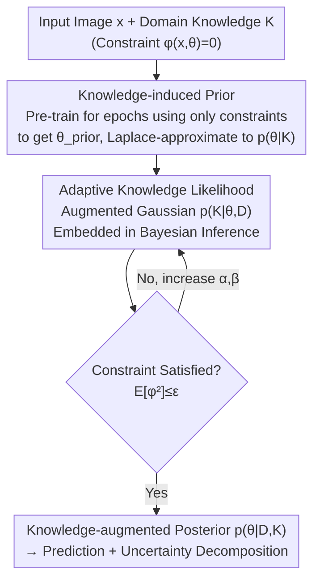

# Towards Knowledge-augmented Bayesian Deep Learning For Computer Vision

**Conference**: CVPR 2026  
**Paper**: [CVF Open Access](https://openaccess.thecvf.com/content/CVPR2026/html/Ma_Towards_Knowledge-augmented_Bayesian_Deep_Learning_For_Computer_Vision_CVPR_2026_paper.html)  
**Code**: To be confirmed  
**Area**: Bayesian Deep Learning / Uncertainty Estimation  
**Keywords**: Bayesian Deep Learning, Knowledge Augmentation, Informative Prior, Adaptive Likelihood, Constrained Optimization

## TL;DR
This work embeds domain knowledge into both the "prior" and the "likelihood" of Bayesian inference. An informative prior $p(\theta\mid K)$ is first pre-trained under knowledge constraints, followed by an adaptive "knowledge likelihood" $p(K\mid\theta,D)$ during the main training stage to continuously enforce constraints. This approach achieves higher accuracy, stable constraint satisfaction, and superior uncertainty estimation in image classification and monocular 3D hand reconstruction.

## Background & Motivation
**Background**: Bayesian Deep Learning (BDL) treats network parameters as random variables, enabling uncertainty quantification alongside predictions, which is critical for high-risk decision-making. However, mainstream BDL typically utilizes **non-informative priors** (e.g., isotropic Gaussian, Laplacian, Logistic), effectively ignoring domain-specific knowledge in the prior.

**Limitations of Prior Work**: When domain knowledge is available (e.g., physical laws, biomechanical joint limits, feature importance constraints), non-informative priors waste this information, leading to reduced accuracy particularly in data-sparse scenarios. Existing "informative prior" methods (such as BANANA) analytically encode knowledge into the prior; however, **the prior is frozen once learned**. As a soft inductive bias, it is easily "washed away" by gradients from the data likelihood during training, causing the model to drift into regions that violate knowledge constraints ("knowledge drift"), especially under distribution shifts or noisy data.

**Key Challenge**: Should knowledge serve as "initialization" or as a "continuous constraint throughout training"? Using it only as a prior (the BANANA route) risks being overridden by data gradients, while using it only as a regularization term lacks a probabilistic foundation and fails to integrate with Bayesian inference.

**Goal**: Construct a unified probabilistic framework where the same domain knowledge $K$ **shapes the initial prior and is continuously enforced throughout the Bayesian inference process**, with theoretical guarantees for convergence and generalization.

**Key Insight**: Starting from the factorization of the posterior, the target posterior can be written as $p(\theta\mid D,K)\propto p(D\mid\theta)\,p(K\mid\theta,D)\,p(\theta\mid K)$. Knowledge naturally appears in two positions: the prior term $p(\theta\mid K)$ and an additional likelihood term $p(K\mid\theta,D)$. This provides a clean Bayesian interpretation for the "dual appearance of knowledge."

**Core Idea**: A two-stage hybrid framework using an "informative prior + adaptive knowledge likelihood" to upgrade knowledge from a "one-time initialization" to a "continuous constraint throughout initialization and training."

## Method

### Overall Architecture
The method addresses how knowledge can permeate the entire Bayesian inference process. The starting point is the three-factor decomposition of the posterior:

$$p(\theta\mid D,K)\propto p(D\mid\theta)\,p(K\mid\theta,D)\,p(\theta\mid K)$$

Here, $p(D\mid\theta)$ is the standard data likelihood, $p(\theta\mid K)$ is the **informative prior** learned from knowledge (replacing traditional non-informative priors), and $p(K\mid\theta,D)$ is an **adaptive knowledge likelihood** responsible for continuously enforcing constraints during training. The pipeline consists of two sequential stages:

- **Stage 1**: Perform pre-training for a few epochs using only knowledge $K$ (without fitting task data) to obtain a point estimate $\theta_{\text{prior}}$ that satisfies constraints, then transform it into a Gaussian prior $p(\theta\mid K)$ via Laplace approximation.
- **Stage 2**: Starting from this learned prior, perform full Bayesian inference on task data $D$. Insert the adaptive knowledge likelihood $p(K\mid\theta,D)$ during inference and iteratively increase constraint penalties using rules inspired by the Augmented Lagrangian Method (ALM) until knowledge is strictly satisfied.

During inference, sample averaging is performed on the posterior $p(y\mid x^*,D,K)\approx\frac1S\sum_{s=1}^{S}p(y\mid x^*,\theta_s)$, through which total uncertainty is decomposed into epistemic (model knowledge deficiency) and aleatoric (inherent data randomness) components, measured by mutual information and variance respectively.

### Key Designs

**1. Knowledge-induced Prior: Using Constraint Pre-training for a "Knowledge-aware" Starting Point**

To address the issue of non-informative priors wasting knowledge, Stage 1 ignores data fitting and focuses solely on satisfying knowledge constraints. Let $L_1(\theta,K)$ be a differentiable knowledge loss derived from a constraint function $g(x)=0$ (e.g., joint angle limits, geometric consistency). Solving $\theta_{\text{prior}}=\arg\min_\theta L_1(\theta,K)$ corresponds to the MAP estimate of the knowledge-conditioned prior $\arg\max_\theta p(\theta\mid K)\propto p(K\mid\theta)p(\theta)$. Since it only focuses on knowledge and not data fitting, this step is lightweight (typically <5 epochs), leaving data fitting to Stage 2.

A point estimate is insufficient for Bayesian inference, which requires a distribution. Thus, Laplace approximation is applied at $\theta_{\text{prior}}$ to expand the point estimate into a Gaussian prior:

$$p(\theta\mid K)\approx\mathcal N\!\left(\theta_{\text{prior}},\,H^{-1}\right),\quad H=\nabla_\theta^2 L_1$$

This Gaussian encodes the "average behavior" under constraints (mean $\theta_{\text{prior}}$) while characterizing allowable "local fluctuations" via the inverse Hessian. This provides Stage 2 with a starting point that already satisfies the knowledge. The paper uses PAC-Bayes theory (Theorem 3.3 / Corollary 3.4) to prove that as long as this knowledge prior $P_K$ is sufficiently close to the data posterior $Q$, the generalization bound using $P_K$ is **strictly tighter** than the bound using a random small Gaussian prior $P_0$.

**2. Adaptive Knowledge Likelihood: Formulating Hard Constraints as Differentiable "Augmented Gaussian" Likelihoods**

Since relying solely on the prior can be overridden by data gradients, Stage 2 ensures knowledge remains present throughout training. The challenge lies in formulating the constraint $\phi(x,\theta)=0$ as a probability distribution that can be inserted into the likelihood and optimized via gradients. Ideally, $\phi(x,\theta)\sim\delta(0)$ (Dirac), meaning the probability of satisfying the constraint is 1 and 0 otherwise. However, the Dirac delta is discontinuous and causes training divergence.

This work approximates the Dirac delta using an **Augmented Gaussian with adaptive hyperparameters**: $p(\phi(x,\theta))\sim\mathcal N\!\left(-\tfrac{\alpha}{\beta},\,\tfrac1\beta\right)$. The total knowledge likelihood is the product over samples $p(K\mid\theta,D)=\prod_{x\in D}p(\phi(x,\theta))$. It achieves maximum density at zero within the $\phi\ge 0$ interval with finite density at the origin, ensuring numerical stability. Critically, it is naturally isomorphic to the Augmented Lagrangian Method:

$$-\log p(\phi(x,\theta))=\text{const.}+\alpha\,\phi(x,\theta)+\tfrac{\beta}{2}\,\phi(x,\theta)^2$$

Minimizing this negative log-likelihood is equivalent to constrained optimization with $\alpha$ (Lagrange multiplier) and $\beta$ (penalty coefficient). As $\alpha,\beta$ grow sufficiently large, $\phi(x,\theta)\to 0$ is enforced. Various constraints can be converted to this equality form: constant constraints $\phi=a$ become $\phi-a=0$, and inequality constraints $\phi\ge 0$ are expressed as $\min(0,\phi)=0$.

**3. Adaptive Update Rules: Dynamically Increasing Penalties Based on "Constraint Violation"**

Fixed $\alpha,\beta$ are either too weak to enforce constraints or too strong, suppressing data fitting. Algorithm 1 borrows the dual ascent logic from ALM, iteratively adjusting these parameters based on the constraint violation $\mathbb E_{x\sim D,\theta\sim\hat p}[\phi^2(x,\theta)]$. In each round, the likelihood is computed using current $\alpha^{(k)},\beta^{(k)}$, the posterior $\hat p^{(k+1)}$ is re-estimated, and then:

$$\alpha^{(k+1)}=\alpha^{(k)}+\beta^{(k)}\,\mathbb E_{x\sim D,\theta\sim\hat p^{(k+1)}}[\phi^2(x,\theta)]$$

Larger violations lead to larger increases in $\alpha$. $\beta$ is adapted based on progress: if the violation significantly decreases ($<\tau$ times the previous) it is maintained, otherwise it is linearly scaled by $\gamma\beta^{(k)}$ ($\gamma>1$). This loop continues until violations fall below a threshold $\epsilon$. Theorem 3.1 states that sequence limit points achieve optimal knowledge satisfaction, and Theorem 3.2 states that under ideal conditions $\epsilon_k\to0$, it converges to the global optimum. In practice, **three iterations are usually sufficient**.

### Loss & Training
The objective of Stage 1 is the knowledge loss $L_1(\theta,K)$. The training objective for Stage 2 is the sum of the data term and the negative log of the adaptive knowledge likelihood. For 3D hand reconstruction, the data term is a weak 2D reprojection loss (lacking 3D supervision), while the knowledge term comes from joint angle violations. Posterior estimation defaults to deep ensembles, though the framework is compatible with SGLD, Bayes-Backprop, and Laplace approximation.

## Key Experimental Results

### Main Results
Two tasks: image classification with semi-synthetic knowledge (feature importance on Decoy MNIST, rotation invariance on Rotated MNIST) and monocular 3D hand reconstruction with real biomechanical knowledge (FreiHAND). Metrics include accuracy (ACC), negative log-likelihood (NLL), knowledge constraint violation (KC, $\mathbb E[\phi^2]$), and OOD detection via AUROC/AUPR.

| Dataset | Metric | Ours (Full) | BANANA | Gaussian Prior |
|--------|------|-----------|--------|---------|
| Decoy MNIST | ACC ↑ | **98.37** | 91.32 | 80.21 |
| Decoy MNIST | KC ↓ | **0.00** | 1.03 | 2.95 |
| Rotated MNIST | ACC ↑ | **94.68** | 51.11 | 37.92 |
| Rotated MNIST | KC ↓ | **0.003** | 0.062 | 0.033 |
| FreiHAND (EJ, mm) | EJ ↓ | **7.89** | 19.83 | 25.06 |
| FreiHAND (EV, mm) | EV ↓ | **8.25** | 20.75 | 27.74 |

On Rotated MNIST, this method improved accuracy from 51% (BANANA) to 95%, exposing the flaw of "frozen priors" in BANANA. In 3D hand reconstruction, KC dropped from 2.08 to 0.02, and EJ improved by nearly 60% relative to BANANA.

### Ablation Study

| Configuration | Key Metric | Description |
|------|---------|------|
| Ours (Full) | DecoyMNIST ACC 98.37 / KC 0.00 | Informative Prior + Adaptive Likelihood |
| Ours (Likelihood-Only) | ACC 98.33 / KC 0.01 | No Stage 1, only Adaptive Likelihood + Random Prior |
| Gaussian Prior Violation Rate | 5.48% | FreiHAND, training from scratch without constraints |
| Full Version Violation Rate | **0.14%** | Violation rate near zero after Stage 1 pre-training |

### Key Findings
- **Likelihood-Only significantly outperforms baselines, with Full providing further stable gains**: Continuous constraints during training are the primary driver of performance. Adding the Stage 1 informative prior ensures more thorough constraint satisfaction.
- **Stage 1 prior yields the highest benefits in low-data regimes**: The gap between Full and other methods is largest when using 1%–10% of training data on Decoy MNIST.
- **Framework decoupling**: The framework works consistently (ACC 97.8%–98.5%) across different Bayesian inference methods like SGLD or Laplace.

## Highlights & Insights
- **Probabilistic explanation for "dual appearance of knowledge"**: Factorizing the posterior into $p(D\mid\theta)p(K\mid\theta,D)p(\theta\mid K)$ provides a clean theoretical grounding rather than an ad-hoc engineering fix.
- **"Soft landing" of hard constraints**: Using Augmented Gaussians to make constraints differentiable while maintaining an isomorphism with the Augmented Lagrangian Method brings mature optimization tools into Bayesian inference.
- **Scalable logic**: Any domain knowledge expressible as $\phi(x,\theta)=0$ (physical laws, geometric consistency) can be plugged into this template, providing value for high-stakes applications like medical imaging or autonomous driving.

## Limitations & Future Work
- **Differentiability requirement**: Core constraints must be differentiable. The handling of purely symbolic or discrete logic knowledge is not explored.
- **Idealized theoretical conditions**: Global optimality (Theorem 3.2) requires $\epsilon_k\to0$, which is difficult to verify in practice.
- **Computational overhead**: Stage 2 roughly doubles training time compared to standard ensembles, and while Stage 1 is lightweight, full efficiency comparisons on large-scale models are missing from the main text.

## Related Work & Insights
- **vs BANANA**: BANANA treats knowledge as a **static initialization**. This method extends knowledge into an adaptive likelihood during inference, preventing "knowledge drift."
- **vs Traditional BDL**: Standard BDL emphasizes prior expressivity (e.g., heavy tails) but ignores domain knowledge. This work proves that informative priors yield strictly tighter generalization bounds.
- **vs Constraint Optimization (ALM)**: This work "translates" ALM's multiplier/penalty updates into Bayesian hyperparameter updates, bringing deterministic convergence tools to probabilistic inference.

## Rating
- Novelty: ⭐⭐⭐⭐⭐ 
- Experimental Thoroughness: ⭐⭐⭐⭐ 
- Writing Quality: ⭐⭐⭐⭐ 
- Value: ⭐⭐⭐⭐⭐ 

<!-- RELATED:START -->

## Related Papers

- [\[CVPR 2026\] Computer Vision with a Superpixelation Camera](computer_vision_with_a_superpixelation_camera.md)
- [\[CVPR 2026\] Adaptive Bayesian Early-Exit Networks for Efficient Non-Transferable Learning](adaptive_bayesian_early-exit_networks_for_efficient_non-transferable_learning.md)
- [\[CVPR 2026\] Learning What Helps: Task-Aligned Context Selection for Vision Tasks](learning_what_helps_task-aligned_context_selection_for_vision_tasks.md)
- [\[CVPR 2026\] Evidential Deep Partial Label Learning to Quantify Disambiguation Uncertainty](evidential_deep_partial_label_learning_to_quantify_disambiguation_uncertainty.md)
- [\[CVPR 2026\] AdaPrior: Bayesian-Inspired Adaptive Prior Correction for Long-Tailed Continual Learning](adaprior_bayesian-inspired_adaptive_prior_correction_for_long-tailed_continual_l.md)

<!-- RELATED:END -->
