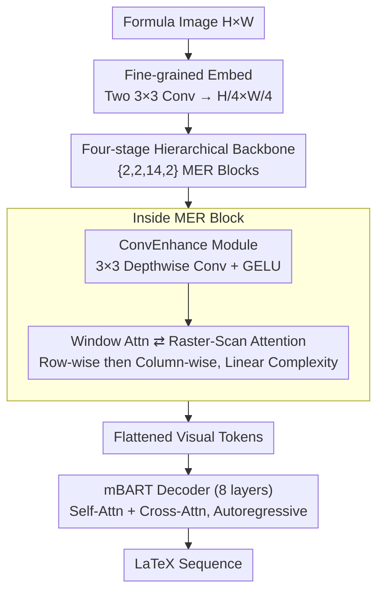

# UniMERNet: A Universal Network for Real-World Mathematical Expression Recognition

**Conference**: CVPR 2026  
**Paper**: [CVF Open Access](https://openaccess.thecvf.com/content/CVPR2026/html/Gu_UniMERNet_A_Universal_Network_for_Real-World_Mathematical_Expression_Recognition_CVPR_2026_paper.html)  
**Area**: Mathematical Expression Recognition / Document OCR  
**Keywords**: Formula Recognition, Raster-Scan Attention, Attention Decomposition, Million-scale Dataset, Visual Encoder

## TL;DR
UniMERNet redefines the task of converting formula images to LaTeX: it constructs the UniMER-1M dataset covering four real-world scenarios and, based on the observation that "decoder attention naturally follows a raster-scan (horizontal then vertical) pattern," proposes Raster-Scan Attention. This decomposes 2D attention into two orthogonal 1D computations, reducing complexity from $O(NH^2W^2D)$ to $O(NHWD(H+W))$. With 313M parameters, it achieves ~10× VRAM savings and 5× speedup, while its CDM consistently outperforms Texify, GOT, and even 72B/78B multimodal large models across four real-world scenarios.

## Background & Motivation

**Background**: Mathematical Expression Recognition (MER) is the task of converting formula screenshots into LaTeX/Markdown. It is a critical preprocessing step for scientific document parsing, mathematical data preparation for large models, and multimodal understanding. A practical MER tool requires high accuracy, fast computation, and strong generalization (especially under diverse fonts, backgrounds, and long formulas in the real world).

**Limitations of Prior Work**: Existing specialized models (Pix2tex, Texify, CAN, etc.) are mostly trained on simple handwritten formulas or clean printed text, failing on complex long formulas in real scenarios. General document models based on Donut (Nougat, GOT) lack specific optimization for formulas, struggling with structured parsing. On the other hand, multimodal large models like GPT-4o, Qwen2.5-VL, and InternVL2.5 generalize better due to massive parameters but lag behind specialized models in high-precision and real-time performance, often requiring 8-GPU distributed inference.

**Key Challenge**: Standard attention mechanisms are inherently mismatched with "dense, strictly 2D layout, sequential reading" formula data. Global self-attention models long-range dependencies but incurs quadratic computational redundancy for high-resolution images. Local window attention like Swin saves computation but has a limited receptive field, failing to capture cross-line relationships. Accuracy and efficiency are trapped in a trade-off.

**Goal**: To create a high-precision, low-cost, open-source MER solution for real-world scenarios, addressing both the lack of diverse training data and the mismatch between attention mechanisms and formula structures.

**Key Insight**: The authors observed the cross-modal attention distribution of a pre-trained mBART decoder during formula prediction. A strong pattern emerged: the model's attention precisely falls on the "next character to be predicted," moving from left to right and jumping to the start of the next line at the end of a row—a standard raster-scan path aligned with human reading habits. This suggests the model inherently learns 2D spatial relationships, making global attention (where every position attends to the whole image) computationally wasteful.

**Core Idea**: Since formula information flow follows a "horizontal then vertical" structure, 2D attention can be decomposed into two orthogonal 1D passes (row-wise and column-wise). By replacing global attention with an inductive bias aligned with reading order, linear complexity is achieved, matching the accuracy of global attention at a fraction of the cost.

## Method

### Overall Architecture
UniMERNet adopts a dual-stream encoder-decoder structure. Given a formula image, a visual encoder compresses it into hierarchical visual tokens, which the mBART decoder then translates autoregressively into a LaTeX sequence. The core innovation lies in the encoder, which stacks "MER blocks." Each block alternates between window attention (for local details) and the proposed Raster-Scan Attention (for global dependencies via 1D decomposition) and includes a lightweight convolutional enhancement module before the attention/MLP layers.

### Key Designs

**1. Raster-Scan Attention: Decomposing 2D Attention into Sequential 1D Passes**

Addressing the redundancy of global attention and the limited reach of window attention, this module decomposes standard 2D attention into two orthogonal 1D passes: **Row-wise** attention followed by **Column-wise** attention. For a feature map $X \in \mathbb{R}^{H\times W\times C}$, $Q, K, V$ are projected and transposed to compute attention within each row:

$$A_w = \mathrm{softmax}\!\left(\frac{Q_w K_w^{\top}}{\sqrt{D}}\right) \in \mathbb{R}^{N\times H\times W\times W}, \quad V'_w = A_w V_w$$

This steps models horizontal dependencies. The result is then transposed to compute attention vertically:

$$A_h = \mathrm{softmax}\!\left(\frac{Q_h K_h^{\top}}{\sqrt{D}}\right) \in \mathbb{R}^{N\times W\times H\times H}, \quad \mathrm{Attention_{final}} = A_h V_h$$

This accounts for cross-line relationships. Total complexity drops from $O(NH^2W^2D)$ to $O(NHWD(H+W))$. Effectiveness stems from: (i) Horizontal-first order provides a useful inductive bias; (ii) The two-step process aligns with the hierarchical structure of formulas; (iii) Linear complexity allows high-resolution ($384\times1344$) inputs. Reversing the order (V→H) leads to a drop in CPE performance (0.948 vs 0.952 CDM), confirming the value of the reading order bias.

**2. Hierarchical Encoder with MER Blocks and ConvEnhance**

Formula recognition requires both local stroke details and global structural relationships. The encoder uses a four-stage hierarchical backbone starting from $H/4\times W/4$. Each MER block alternates between Window Attention (local) and R-S Attention (global). A **ConvEnhance** module ($3\times3$ depthwise convolution + GELU) is added before attention layers to provide local inductive priors, which ablation studies show consistently improves performance across all subsets.

**3. UniMER-1M Dataset + Stratified Sampling**

To solve the generalization issues of existing datasets (which are often too clean or short), the authors constructed UniMER-1M (1,061,791 pairs) and UniMER-Test (23,757 samples) covering four scenarios: SPE (Simple Printed), CPE (Complex Printed), SCE (Screen/Document Screenshots), and HWE (Handwritten). **Stratified sampling** is used to balance formula length and structural complexity, incorporating extremely long and complex samples. Using UniMER-1M increases CPE CDM from 66.5% to 95.5% compared to training on Pix2tex alone.

### Loss & Training
Implemented in PyTorch with a maximum sequence length of 1536. Trained on 8×A100 (80GB) with a batch size of 64 using AdamW and a linear warmup cosine annealing schedule. Initial learning rate is $1\times10^{-4}$, weight decay is 0.05, over 500K iterations. Input resolution is $192\times672$ (baseline) or $384\times1344$. Data augmentation includes geometric transformations and Gaussian noise. BPE tokenizer from Donut is used with LaTeX-specific tokens.

## Key Experimental Results

### Main Results
Comparison on UniMER-Test subsets using CDM (Confidence-based Displacement Metric):

| Type | Method | Params | FPS(bs=64) | SPE CDM | CPE CDM | SCE CDM | HWE CDM |
|------|------|------|-----------|---------|---------|---------|---------|
| Spec. | Pix2tex | 25M | - | 0.939 | 0.461 | 0.653 | 0.213 |
| Spec. | Texify | 312M | 8.05 | 0.985 | 0.706 | 0.799 | 0.534 |
| Spec. | GOT | 535M | 3.88 | 0.541 | 0.189 | 0.750 | 0.612 |
| Spec. | Mathpix(API)| - | - | 0.966 | 0.842 | 0.815 | 0.931 |
| Gen. | Qwen2.5-VL| 72B | - | 0.804 | 0.365 | 0.940 | 0.863 |
| Gen. | GPT-4o(API) | - | - | 0.962 | 0.783 | 0.920 | 0.836 |
| **Ours** | **UniMERNet** | **313M** | **10.48** | **0.991** | **0.955** | **0.939** | **0.941** |
| **Ours** | **UniMERNet†** | **313M** | **8.39** | **0.995** | **0.972** | **0.940** | **0.954** |

† indicates $384\times1344$ input. UniMERNet outperforms heavy 72B/78B MLLMs and specialized models across all categories while maintaining high FPS on a single GPU.

### Ablation Study
Ablation of attention types and ConvE module:

| Attn Type | FPS(bs=64) | VRAM (Max GPU) | CPE CDM | HWE CDM | Note |
|-----------|-----------|--------------|---------|---------|------|
| Global Attn | OOM | 3.2GiB(bs=1) | 0.943 | 0.939 | Acc. but OOM at bs=64 |
| Window Attn | 5.9GiB | 1.6GiB | 0.931 | 0.929 | Limited receptive field |
| Criss-Cross Attn | 5.6GiB | 1.2GiB | 0.938 | 0.934 | Simultaneous H-V |
| Axial Attn | 5.9GiB | 1.6GiB | 0.930 | 0.926 | Independent axes |
| R-S Attn (V→H) | 5.6GiB | 1.2GiB | 0.948 | 0.938 | Reversed order drop |
| R-S Attn (ours) | 5.6GiB | 1.2GiB | 0.952 | 0.939 | H→V |
| R-S Attn w/ ConvE | 5.6GiB | 1.2GiB | **0.955** | **0.941** | Final model |

### Key Findings
- **R-S Attention as the efficiency king**: Compared to Global Attention, it uses only 37% VRAM and is 5× faster, even improving CPE CDM by 1.2%.
- **Reading order bias is real**: Reversing H→V to V→H drops CPE CDM from 0.952 to 0.948, proving the gain comes from aligning with reading habits, not just extra computation.
- **Data diversity drives generalization**: Switching to UniMER-1M provided the largest single gain (CPE 66.5% → 95.5%).
- **Handwriting performance**: UniMERNet outperforms specialized handwritten MER models on CROHME/HME100K even without specific fine-tuning.

## Highlights & Insights
- **Deriving architecture from observed behavior**: Designing the encoder's attention based on the observed "raster-scan" path of the decoder's cross-attention is more grounded than arbitrary module stacking.
- **Sequential 2D decomposition**: While axial decomposition exists, the sequential "horizontal-then-vertical" flow is the key to encoding strict reading order constraints for dense OCR tasks like MER.
- **Dual-engine drive**: Generalization is addressed by data (UniMER-1M), while efficiency is addressed by architecture (R-S Attention).
- **Small models beating large models**: Surpassing 72B MLLMs with a 313M parameter model demonstrates the massive potential of specialized structures and high-quality data for vertical tasks.

## Limitations & Future Work
- **Reliance on strict 2D order**: R-S Attention assumes a horizontal-then-vertical reading flow, which might fail on highly irregular, rotated, or overlapping layouts.
- **Metric trade-offs**: While CDM is more suitable than BLEU for MER, it relies on rendering; robustness against rendering failures or rare symbols warrants further study.
- **Data licensing**: Portions of UniMER-1M come from various sources (arXiv, Wikipedia); consistency and licensing details are potential engineering hurdles.
- **Future Direction**: Generalizing sequential axial decomposition to non-Cartesian orders (e.g., RTL languages, mixed table orders) or making the scanning order learnable.

## Related Work & Insights
- **vs Texify**: Both use Swin-style encoders and mBART decoders. UniMERNet's superiority (+26.6% CPE CDM, +42.0% HWE CDM) stems directly from R-S Attention and the UniMER-1M dataset.
- **vs Global/Window Attention**: Global attention suffers from quadratic complexity and VRAM issues, while window attention lacks a global view. R-S achieves global reach with linear complexity.
- **vs CCNet/Axial-DeepLab**: These use simultaneous or independent axis decomposition, lacking the sequential constraint required for MER. R-S's H→V sequence is the differentiator.
- **vs MLLMs (GPT-4o, etc.)**: Large models lack specific adaptation for formulas. UniMERNet achieves better accuracy and real-time performance with 1/200th the parameters.

## Rating
- Novelty: ⭐⭐⭐⭐ The insight of deriving encoder design from decoder behavior is solid; R-S is a meaningful advancement over standard axial decomposition.
- Experimental Thoroughness: ⭐⭐⭐⭐⭐ Comprehensive testing across four real scenarios, multi-dimensional ablations, and efficiency benchmarks.
- Writing Quality: ⭐⭐⭐⭐ Clear logic from motivation to verification; complexity derivations are well-presented.
- Value: ⭐⭐⭐⭐⭐ An open-source high-precision, low-cost MER solution with a million-scale dataset has immediate utility for document parsing and data science.

<!-- RELATED:START -->

## Related Papers

- [\[ICLR 2026\] SmellNet: A Large-scale Dataset for Real-world Smell Recognition](../../ICLR2026/others/smellnet_a_large-scale_dataset_for_real-world_smell_recognition.md)
- [\[CVPR 2026\] VideoWorld 2: Learning Transferable Knowledge from Real-world Videos](videoworld_2_learning_transferable_knowledge_from_real-world_videos.md)
- [\[CVPR 2026\] Clair Obscur: an Illumination-Aware Method for Real-World Image Vectorization](clair_obscur_an_illumination-aware_method_for_real-world_image_vectorization.md)
- [\[CVPR 2026\] The Missing GAP: From Solving Square Jigsaw Puzzles to Handling Real World Archaeological Fragments](the_missing_gap_from_solving_square_jigsaw_puzzles_to_handling_real_world_archae.md)
- [\[CVPR 2026\] Multi-view Crowd Tracking Transformer with View-Ground Interactions Under Large Real-World Scenes](multi-view_crowd_tracking_transformer_with_view-ground_interactions_under_large_.md)

<!-- RELATED:END -->
