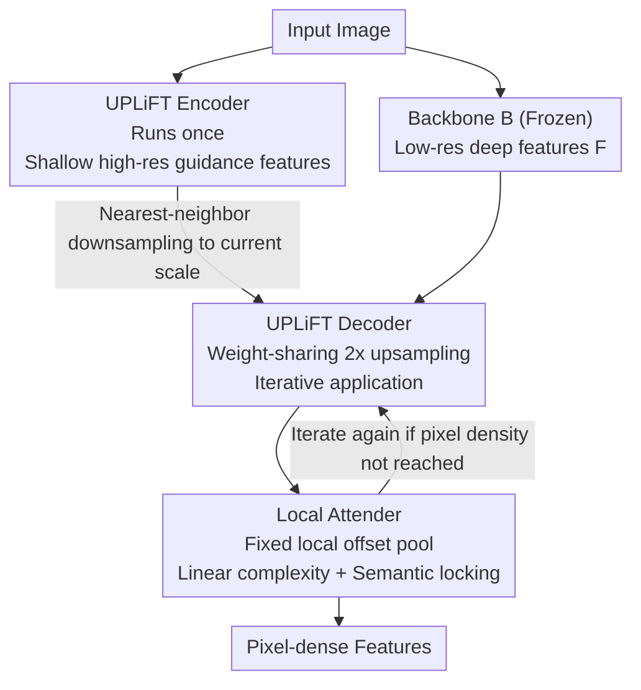

# UPLiFT: Efficient Pixel-Dense Feature Upsampling with Local Attenders

**Conference**: CVPR 2026  
**Paper**: [CVF Open Access](https://openaccess.thecvf.com/content/CVPR2026/html/Walmer_UPLiFT_Efficient_Pixel_Dense_Feature_Upsampling_with_Local_Attenders_CVPR_2026_paper.html)  
**Code**: https://github.com/mwalmer-umd/UPLiFT/ (Available)  
**Area**: Representation Learning / Feature Upsampling / General Vision  
**Keywords**: Feature Upsampling, Local Attention, Linear Complexity, DINOv2, VAE Features

## TL;DR
UPLiFT uses a weight-sharing convolutional $2\times$ decoder to iteratively upsample low-resolution features from pretrained backbones (e.g., DINOv2) to pixel-level density. It introduces a **Local Attender** operator based entirely on fixed local offsets to replace cross-attention, reducing complexity from quadratic to linear while maintaining semantic consistency and avoiding "upsampling semantic drift"—outperforming existing upsamplers in segmentation and depth estimation with faster speeds.

## Background & Motivation
**Background**: Pretrained ViT backbones like DINOv2, CLIP, and SigLIP are powerful starting points for dense vision tasks. However, ViT must downsample spatial dimensions to construct tokens, resulting in naturally sparse output feature maps (e.g., a $448\times448$ input yields only $32\times32$ features). Many tasks (segmentation, depth, super-resolution) require dense features. Directly increasing ViT token density leads to **quadratic** growth in self-attention costs. Thus, a class of "task-agnostic feature super-resolution" methods has emerged as plug-and-play add-ons to learnable densify coarse features while reusing backbone semantics without the quadratic cost.

**Limitations of Prior Work**: This field has two main streams, each with fatal flaws. Early iterative methods (FeatUp, LiFT) use simple modules for multiple $2\times$ upsampling steps; they are cheap and lightweight, but LiFT suffers from **semantic drift** when iterating to pixel levels—the feature distribution deviates from the backbone with each step, leading to blurriness and performance collapse. Recent cross-attention streams (LoftUp, JAFAR, AnyUp) use high-resolution queries to pool low-resolution keys/values; while effective and scale-agnostic, they suffer from the same **quadratic** scaling with token counts, exploding time and memory usage.

**Key Challenge**: There is an apparent trade-off between "semantic stability" and "linear scalability." Cross-attention stabilizes the semantic distribution through the implicit constraint that the output must be a linear combination of input features, but this global pooling is the source of quadratic costs; iterative methods are cheap but fail to stabilize semantics.

**Goal**: To create an iterative upsampler that is both linearly scalable and semantically stable, while expanding applicability from predictive tasks (segmentation/depth) to generative tasks (VAE latent upsampling, text-to-image, super-resolution).

**Key Insight**: The authors noted an observation (from [44]) that some self-attention heads in ViT learn to attend to local positions via fixed directional offsets. Since the effective parts of attention are often local, fixed-direction pooling, why compute global cross-attention? Local neighborhood information is sufficient for upsampling features within an image region.

**Core Idea**: Use a **Local Attender operator defined entirely on fixed local offsets, discarding the Query-Key-Value paradigm** to perform feature pooling. It retains the "output as a local linear combination of input features" semantic regularization (preventing drift), but achieves strictly linear complexity relative to the number of tokens because the neighborhood size is constant.

## Method

### Overall Architecture
At inference, UPLiFT consists of two simple convolutional modules: the **UPLiFT Encoder $E_{\text{UPLiFT}}$** and the **UPLiFT Decoder $D_{\text{UPLiFT}}$**. The backbone $B$ (frozen) produces low-resolution deep features from the input image. $E_{\text{UPLiFT}}$ runs **only once** on the original image to produce a "shallow and dense" guidance feature map at the original pixel density. Then, $D_{\text{UPLiFT}}$, a **single, weight-sharing** $2\times$ upsampler, is **repeatedly applied**: each step upsamples current features by $2\times$, guided by the guidance features nearest-neighbor downsampled to the corresponding scale. The **final step** of the decoder employs the Local Attender operator to complete the upsampling and lock the semantic distribution.

The key efficiency difference from LiFT is that LiFT re-runs the image encoder on the bilinearly magnified input at every step (accumulating costs); UPLiFT runs the encoder once to generate full-resolution guidance features, which are then merely downsampled for use.

### Key Designs

**1. Local Attender: Replacing QKV Cross-Attention with Fixed Offset Local Pooling**

This is the core of the paper, addressing the conflict between "semantically stable but quadratic cross-attention" and "cheap but drifting iterative methods." The operator takes two feature maps: **Guidance features $G$** (high-res, $C_G$ channels) and **Value features $V$** (low-res, $C_V$ channels). It fixes a **neighborhood $N$**—a set of 2D integer directional offsets $(i,j)$, where $\|N\|=n$. For a token $V_{x,y}$ at position $(x,y)$ in $V$, it **can only** attend to $V_{x+i,y+j},\ (i,j)\in N$. The shape and size of $N$ are flexible.

Mechanistically, the operator has **only one learnable element**: a $1\times1$ convolution applied to $G$ to transform it into $H\times W\times n$, followed by a per-position softmax to obtain the "Attender Map" $A$. $A_{x,y,k}$ is the attention weight applied to $V_{x+i_k,y+j_k}$. Implementation-wise, each offset in $N$ is applied to $V$ using replication padding to create $n$ "shifted value maps," which are multiplied by $A$ and summed to produce local attention features of shape $H\times W\times C_V$. Given $T$ spatial tokens in $G$, the cost is:

$$\mathcal{O}(nT)$$

Since $n$ is a constant, this is **strictly linear** relative to $T$. It stabilizes semantics because the output is always a **convex/linear combination** of features in $V$ (softmax weights sum to 1), replicating the implicit regularization of cross-attention. No positional encodings are needed.

**2. Local Attender as Upsampler: Partitioning Guidance Features into $c\times c$ Cells**

To allow the operator to perform upsampling, the authors relax the assumption: let $V$ be $H\times W\times C_V$ and $G$ be $cH\times cW\times C_G$ ($c\in\mathbb{Z}$). Tokens in $G$ are grouped into $c\times c$ "cells" within an $H\times W$ grid. For all tokens in cell $C_{x,y}$, the neighborhood is defined around the corresponding value token $V_{x,y}$. This keeps the neighborhood size constant while each token in $V$ now corresponds to a $c\times c$ cell in $G$, resulting in magnified features of $cH\times cW\times C_V$. UPLiFT places this at the final decoding step: using the decoder’s initial output as $G$ and the **original backbone features** as $V$, ensuring that no matter how many iterations occur, the output is anchored to the backbone's distribution.

**3. Multi-depth Self-supervised Reconstruction: Training with Iterative Upsampling**

To address the issue where LiFT learns single-step upsampling but chains multiple steps at inference (causing error accumulation), UPLiFT **explicitly includes multiple decoder applications** in its training objective. Given a high-res image $I$ ($H\times W$) and a training depth $d$, the image is downsampled $2^d$ times to $I'$. Backbone $B$ extracts features $F=B(I)$ and $F'=B(I')$, and $E_U$ extracts guidance features $F'_E$. Starting from $F'$, $D_U$ + Local Attender upsample $d$ times to obtain $F'_{2^d\times}$. The target is:

$$L_{\text{simple}}=D_{L2}(F'_{2^d\times},\,F)$$

Additionally, intermediate losses are provided by comparing intermediate upsampled maps with Ground Truth from downsampled versions of $I$:

$$L_d=\sum_{k=1}^{d} D_{L2}\!\left(F'_{1/2^{d-k}},\,F_{1/2^{d-k}}\right)$$

Training with mixed depths $d\in \{1,2,3\}$ ensures the decoder learns to be stable during continuous upsampling.

### Loss & Training
Predictive tasks: DINOv2-S/14 backbone, trained on ImageNet-1K for 1 epoch, max GT image 448, max input 224, 3-depth multi-step loss. Generative tasks: Larger UPLiFT models (but still 1/2 to 1/6 the size of equivalent CFMs), trained on Unsplash-Lite (25k images) for 5 epochs, max GT image 1024, 4 depths, using SD1.5 VAE for encoding/decoding.

## Key Experimental Results

### Main Results: Segmentation and Depth Estimation (DINOv2-S/14, 448×448)
UPLiFT ranks first in mIoU/Acc across four segmentation datasets and is faster than all high-performance upsamplers. Depth estimation shows tied-best RMSE.

| Upsampler | Params(M) | Time(ms) | COCO mIoU↑ | VOC mIoU↑ | ADE20K mIoU↑ | Cityscapes mIoU↑ | Depth δ1↑ | Depth RMSE↓ |
|---|---|---|---|---|---|---|---|---|
| Bilinear | – | 2.8 | 59.41 | 81.62 | 40.43 | 59.71 | 58.83 | 0.68 |
| LiFT (to pixel-level) | 1.2 | 51.9 | 57.42 | 80.97 | 38.95 | 61.98 | 55.07 | 0.73 |
| FeatUp | 0.2 | 109.6 | 61.77 | 83.52 | 42.07 | 60.50 | 60.01 | 0.66 |
| LoftUp | 4.3 | 223.5 | 62.19 | 84.63 | 42.16 | 62.09 | 58.69 | 0.68 |
| JAFAR | 0.7 | 111.7 | 61.71 | 84.38 | 41.96 | 61.89 | 60.59 | 0.65 |
| AnyUp | 0.9 | 146.7 | 62.08 | 84.33 | 42.25 | 61.33 | **61.32** | **0.63** |
| **UPLiFT** | 0.8 | **79.4** | **62.55** | **85.21** | **42.97** | **65.38** | 61.16 | **0.63** |

On Cityscapes, UPLiFT improves LiFT's 61.98 to 65.38, proving the Local Attender resolves semantic drift.

### Efficiency and Scaling
| Configuration | Observation |
|---|---|
| $448\times448$ (1024 tokens) | UPLiFT 79.4ms, approx 2.8$\times$ faster than LoftUp |
| $\approx1500$ tokens ($624\times624$) | LoftUp/JAFAR/AnyUp OOM on 24GB VRAM; UPLiFT 2.5–5$\times$ faster |
| Maximum capacity | UPLiFT handles upsampling up to 2601 visual tokens |

### Key Findings
- **Local Attender is the dual engine for performance and efficiency**: It allows iterative upsampling to overtake cross-attention in segmentation by eliminating drift while reducing complexity to linear.
- **Local information is sufficient for dense prediction**: Even in depth estimation, which traditionally benefits from global context, the local-pooling UPLiFT matches AnyUp.
- **Multi-step training is critical**: Explicitly training for multiple iterations ensures stability at inference.

## Highlights & Insights
- **Redefining Attention**: Deconstructing "attention" into "fixed offsets + a $1\times1$ convolution-predicted weight map" achieves the core benefits of cross-attention (linear combination regularization) with $\mathcal{O}(nT)$ cost.
- **Improved Engineering Impulse**: Transforming quadratic costs into linear ones allows upsamplers to process significantly larger images without memory overflow.
- **Generalist Advantage**: A single UPLiFT module outperforms specialized modules like CFMs in generative tasks using only 1/6 the parameters and far less training data.

## Limitations & Future Work
- **Fixed Step Size**: UPLiFT is currently limited to integer factor iterations (e.g., $2\times$), lacking the flexibility of cross-attention to upsample to any arbitrary size.
- **Neighborhood Design**: The shape and size of $N$ are hyperparameters that may require tuning for different backbones.
- **Generative Scale**: Generative tasks require larger UPLiFT models to maintain latent distributions.

## Related Work & Insights
- **vs. LiFT**: Both are iterative and use image guidance, but LiFT re-runs the image encoder at every step and suffers from drift. UPLiFT runs the encoder once and uses Local Attender to anchor features to the backbone.
- **vs. LoftUp / JAFAR / AnyUp**: These rely on quadratic cross-attention; UPLiFT achieves the same semantic preservation with a linear local alternative.
- **vs. CFM**: UPLiFT achieves better FID/SSIM in generative upsampling with significantly fewer iterations (2 vs. 50) and parameters.

## Rating
- Novelty: ⭐⭐⭐⭐
- Experimental Thoroughness: ⭐⭐⭐⭐
- Writing Quality: ⭐⭐⭐⭐
- Value: ⭐⭐⭐⭐

<!-- RELATED:START -->

<!-- Paper links or lists would go here -->

<!-- RELATED:END -->

## Related Papers

- [\[CVPR 2026\] NAF: Zero-Shot Feature Upsampling via Neighborhood Attention Filtering](naf_zero-shot_feature_upsampling_via_neighborhood_attention_filtering.md)
- [\[CVPR 2026\] Upsample Anything: A Simple and Hard to Beat Baseline for Feature Upsampling](upsample_anything_a_simple_and_hard_to_beat_baseline_for_feature_upsampling.md)
- [\[ICLR 2026\] AnyUp: Universal Feature Upsampling](../../ICLR2026/others/anyup_universal_feature_upsampling.md)
- [\[CVPR 2026\] From Pixel to Precision: Enhancing Handwritten Mathematical Expression Recognition with Image-Level Reward](from_pixel_to_precision_enhancing_handwritten_mathematical_expression_recognitio.md)
- [\[CVPR 2026\] ALLNet: Multi-task Dense Prediction for Degraded Images](allnet_multi-task_dense_prediction_for_degraded_images.md)

<!-- RELATED:END -->
