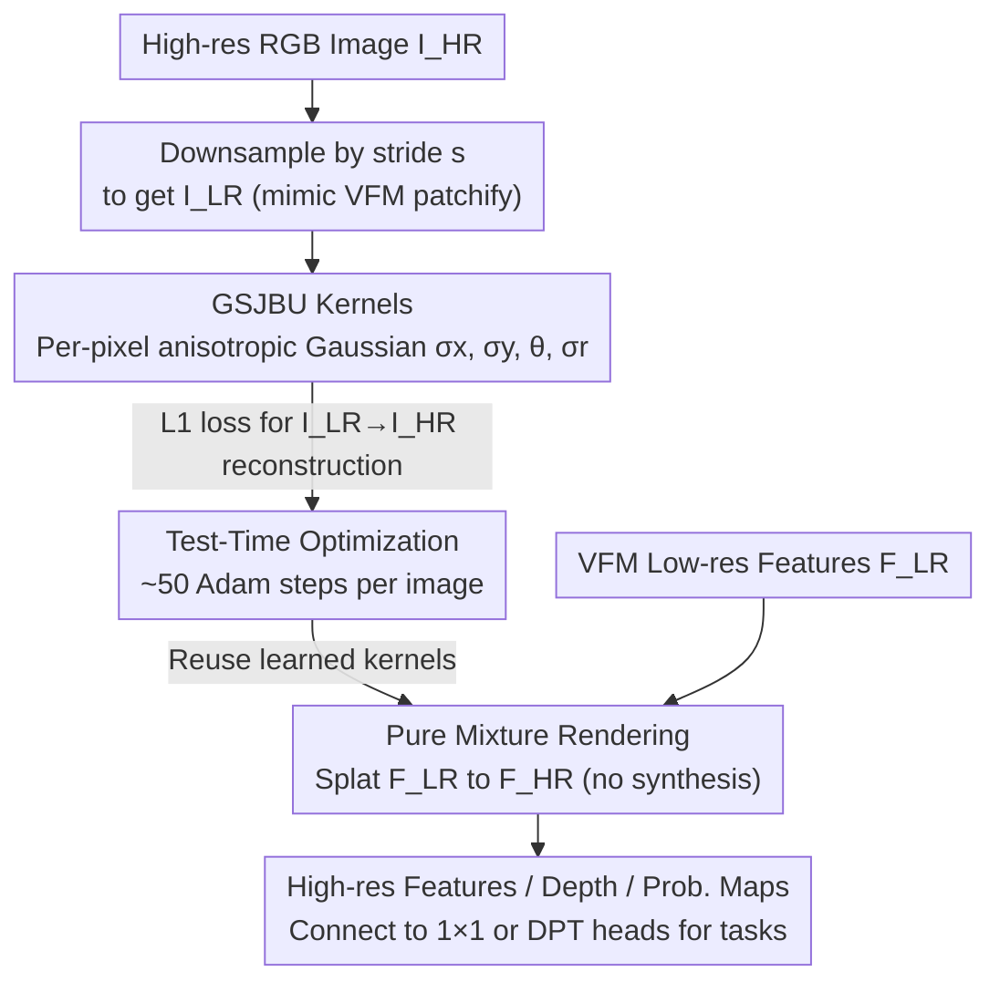

# Upsample Anything: A Simple and Hard to Beat Baseline for Feature Upsampling

**Conference**: CVPR 2026  
**Paper**: [CVF Open Access](https://openaccess.thecvf.com/content/CVPR2026/html/Seo_Upsample_Anything_A_Simple_and_Hard_to_Beat_Baseline_for_CVPR_2026_paper.html)  
**Code**: https://seominseok0429.github.io/Upsample-Anything/ (Project Page)  
**Area**: General Vision / Feature Upsampling  
**Keywords**: Feature Upsampling, Test-Time Optimization, Joint Bilateral Upsampling, Gaussian Splatting, Visual Foundation Models

## TL;DR
Upsample Anything unifies classical Joint Bilateral Upsampling (JBU) and 2D Gaussian Splatting into a per-pixel anisotropic Gaussian kernel. These kernels are learned via a 50-step "RGB self-reconstruction" test-time optimization for each image, then directly transferred to the low-resolution features of foundation models for pure mixture upsampling. It requires no dataset-level training, takes approximately 0.419 seconds for a 224×224 image, and achieves or approaches SOTA across segmentation, depth estimation, and depth/probability map upsampling.

## Background & Motivation
**Background**: Visual Foundation Models (VFM) such as DINO, CLIP, SigLIP, and MAE provide universal, semantically rich features. However, ViT backbones downsample features by 14×/16×, and CNN backbones do similarly through multi-stage pooling. Consequently, the spatial resolution of feature maps is too low, necessitating large and heavy decoders like DPT, UPerNet, or SegFormer to "recover" spatial details for pixel-wise tasks like segmentation and depth estimation.

**Limitations of Prior Work**: To increase feature resolution without modifying the encoder, the community has developed several "feature upsamplers" (FeatUp, LoftUp, JAFAR, AnyUp, etc.). These fall into two categories: dataset-level training, which requires retraining for different backbones or datasets and is memory-intensive (often limited to 112–224 pixels); and test-time optimization (e.g., FeatUp Implicit), which avoids offline training but takes about 49 seconds per image to converge, making it impractical. Neither path simultaneously satisfies the needs of being training-free, fast, and cross-domain stable.

**Key Challenge**: Upsamplers either solidify "knowledge" into network weights (limiting transferability across backbones/datasets) or trade speed for universality via pure optimization. The fundamental contradiction is that forward-pass upsamplers "synthesize" new feature values, making them powerful yet fragile under domain shift.

**Goal**: To create an upsampling operator that is independent of dataset-level training, completes in under one second, and is universal across backbones and modalities (features, depth, probability maps, or even 3D).

**Key Insight**: The authors return to the wisdom of JBU. JBU never "invents" new values; it only learns "how to mix neighbors," making it inherently model- and task-agnostic. However, classical JBU use global, isotropic $(\sigma_s, \sigma_r)$, which lacks expressiveness near complex structures. If these "mixture-only" weights could be made per-pixel, anisotropic, and differentiably optimized, one could achieve the best of both worlds.

**Core Idea**: Rewrite JBU as a per-pixel anisotropic 2D Gaussian Splatting kernel (referred to as GSJBU). Learn the kernels for each pixel at test-time using a self-supervised objective—reconstructing the RGB image from its downsampled version—and then apply these kernels to the feature space for pure mixture rendering.

## Method

### Overall Architecture
Upsample Anything consists of two steps: first, perform Test-Time Optimization (TTO) in the **RGB image domain** to learn a set of per-pixel Gaussian kernels; second, transfer these kernels to the **feature domain** for rendering-based upsampling. Crucially, the optimization only uses a single high-resolution RGB image for self-supervision, without touching any labels or downstream tasks.

Given a high-resolution image $I_{hr}$, it is first bilinear-downsampled by stride $s$ to obtain $I_{lr}$ (mimicking VFM patchify downsampling). Then, per-pixel anisotropic Gaussian parameters $\{\sigma_x, \sigma_y, \theta, \sigma_r\}$ are optimized such that GSJBU reconstructs $I_{hr}$ from $I_{lr}$. Once optimized (default 50 steps), the learned kernels $\{\hat\sigma_x, \hat\sigma_y, \hat\theta, \hat\sigma_r\}$ are applied to the low-resolution features $F_{lr} \in \mathbb{R}^{C \times H/s \times W/s}$ from the VFM to produce high-resolution features $F_{hr} \in \mathbb{R}^{C \times H \times W}$ using the same anisotropic weights. Since mixture weights only depend on spatial proximity and color similarity, these kernels remain effective across different backbones and modalities.

### Key Designs

**1. GSJBU: Merging JBU and 2D Gaussian Splatting into Per-pixel Anisotropic Kernels**

The limitation of classical JBU is the use of global and isotropic $(\sigma_s, \sigma_r)$ parameters, which are insufficient for boundaries and thin structures. Pure 2D Gaussian Splatting (2DGS), while differentiable, can be computationally heavy and prone to over-smoothing due to the lack of spatial-range constraints. The authors unify them by assigning an anisotropic spatial covariance to each low-resolution position $q$:

$$\Sigma_q = R(\theta_q)\begin{bmatrix}\sigma_x^2(q) & 0\\ 0 & \sigma_y^2(q)\end{bmatrix}R^\top(\theta_q),\quad R(\theta_q)=\begin{bmatrix}\cos\theta_q & -\sin\theta_q\\ \sin\theta_q & \cos\theta_q\end{bmatrix}$$

For a high-resolution coordinate $p$, the spatial and range (guidance) weights are $\log w^s_{p\leftarrow q}=-\tfrac12 (p-\mu_q)^\top\Sigma_q^{-1}(p-\mu_q)$ and $\log w^r_{p\leftarrow q}=-\tfrac{\lVert I(p)-I(q)\rVert^2}{2\sigma_r^2(q)}$, respectively. The final normalized mixture weight is $w_{p\leftarrow q}=\mathrm{softmax}_q\big(\log w^s_{p\leftarrow q}+\log w^r_{p\leftarrow q}\big)$. Geometrically, JBU is a special case where $\Sigma_q = \sigma_s^2 I$. GSJBU generalizes this to per-pixel, rotatable, and stretchable anisotropic Gaussians, allowing the kernel to align with local orientations and scales, better preserving edges.

**2. Test-Time Optimization via RGB Self-Reconstruction**

The challenge is learning per-pixel kernels without labels or paired training data. The authors observe that since VFMs use fixed-stride patchifying to downsample images into features, one can **simulate the same downsampling process in the RGB domain**. $I_{hr}$ is bilinear-downsampled to $I_{lr}$, and GSJBU is tasked to reconstruct it back. The loss is a simple L1: $\mathcal{L}_{TTO}=\lVert \text{GSJBU}(I_{lr})-I_{hr}\rVert_1$. The intuition is that kernels capable of correctly "mixing" RGB high-frequency details back must have learned the local mixing rules (e.g., how to sample neighbors across boundaries), which are shared with features on the same grid. Parameters are initialized as $\sigma_x=\sigma_y=16, \sigma_r=0.12, \theta=0$ and optimized for 50 steps with Adam (lr=1e-3). This simplicity makes it two orders of magnitude faster than FeatUp (Implicit).

**3. Pure Mixture Rendering & Zero Value Synthesis — The Source of Transferability**

During feature rendering, $F_{hr}(p)=\sum_{q\in\Omega(p)} w_{p\leftarrow q}\,F_{lr}(q)$. This strictly re-weights existing low-resolution features and **produces no new content**. While seemingly conservative, this is the key to cross-backbone/modality stability: because the kernel learns "how to mix" rather than "what to synthesize," the weights rely only on spatial-range similarity. Thus, the same kernels can splat features from DINOv2, ConvNeXt, or even raw depth/probability maps. In contrast, synthesis-based upsamplers (FeatUp, AnyUp) often fail when encountering unseen backbones or out-of-distribution data.

### Loss & Training
The sole optimization objective is the RGB self-reconstruction L1 loss: $\mathcal{L}_{TTO}=\lVert \text{GSJBU}(I_{lr})-I_{hr}\rVert_1$. There are no learnable network modules, no data augmentation, and no batching. The process runs in parallel on the entire high-resolution grid (pure PyTorch). By default, 50 Adam steps at lr=1e-3 are used per image. For downstream evaluation, segmentation uses a 1×1 convolutional linear head (extended to 100 epochs), and depth uses a DPT-style head without internal interpolation layers.

## Key Experimental Results

### Main Results
Semantic Segmentation (COCO / PASCAL-VOC / ADE20k, Backbone: DINOv2-S, Linear Probe):

| Method | COCO mIoU | PASCAL-VOC mIoU | ADE20k mIoU |
|------|-----------|-----------------|-------------|
| Bilinear | 60.43 | 81.27 | 41.48 |
| FeatUp | 60.96 | 81.91 | 41.92 |
| AnyUp (Prev. SOTA) | 61.25 | 82.18 | 42.02 |
| **Ours** | **61.41** | **82.22** | **42.95** |
| Ours (prob.) | **63.40** | **84.57** | **44.29** |

Depth / Surface Normal Estimation (NYUv2, Frozen DINOv2 + DPT-style head):

| Method | Depth RMSE↓ | Depth δ1↑ | Normal Mean↓ | Normal <11.25°↑ |
|------|-----------|----------|-----------|---------------|
| Bilinear | 0.545 | 0.804 | 23.8 | 33.0 |
| AnyUp | 0.513 | 0.817 | 22.2 | 36.8 |
| LoftUp | 0.796 | 0.789 | 28.9 | 25.0 |
| **Ours** | **0.498** | **0.829** | **21.5** | **38.1** |

### Ablation Study
Speed-Accuracy Trade-off (PASCAL-VOC Seg. + NYUv2 Depth):

| Method | Time(s) | VOC mIoU↑ | NYUv2 RMSE↓ |
|------|--------|-----------|-------------|
| Bilinear | 0.00009 | 81.27 | 0.545 |
| JBU (Manual) | 0.00600 | 81.65 | 0.531 |
| LIG (Implicit Opt) | 481.5 | 78.54 | 0.642 |
| 2DGS (Unconstrained) | — | Over-smooths | — |
| **GSJBU (Ours)** | 0.4197 | **82.22** | **0.498** |

Optimization Steps (PASCAL-VOC):

| Iterations | PSNR↑ | mIoU↑ | Time(s) |
|---------|-------|-------|---------|
| 50 | 35.33 | **82.22** | 0.041 |
| 500 | 35.60 | 82.15 | 6.161 |
| 5000 | 35.60 | 82.17 | 61.458 |

Scalability (AnyUp vs. Ours, Time s / Peak VRAM MB):

| Resolution | AnyUp | Upsample Anything |
|--------|-------|-------------------|
| 224×224 | 0.0137 / 531 | 0.0419 / 3970 |
| 512×512 | 0.0893 / 10284 | 0.3211 / 20590 |
| 1024×1024 | **OOM** | 1.808 / 82256 |

### Key Findings
- **Marginal gains for strong backbones**: On high-capacity backbones like DINOv2, the improvement of various upsamplers over bilinear is relatively small (e.g., 60.43 to 61.41 on COCO). The authors suggest that the contribution of feature upsamplers to segmentation should be re-evaluated when the backbone is strong enough.
- **Geometry tasks benefit more from precision**: Significant improvements were seen in depth/normal estimation, suggesting precise upsampling is more critical for geometric tasks.
- **PSNR saturates at 500 steps, but 50 steps is better for segmentation**: While PSNR converges later, downstream accuracy peaks at 50 steps. Over-optimization of reconstruction slightly hurts downstream performance.
- **Linear scalability is a hard advantage**: AnyUp's window attention grows quadratically, causing OOM at 1024×1024. This method's memory usage grows linearly, enabling high-resolution processing.
- **"Upsampling probability maps instead of features" is highly effective**: The `prob.` variant computes on smaller probability grids, achieving the lowest complexity and highest accuracy (ADE20k 42.95→44.29).

## Highlights & Insights
- **Unifying a 2003-era filter (JBU) with 2D Gaussian Splatting**: This perspective is elegant and practical, giving "training-free upsampling" a modern, differentiable, and per-pixel optimizable form.
- **Using RGB self-reconstruction as free supervision**: No labels are required. Learning kernels from the image itself and transferring them to the feature space is the root of the method's speed and universality.
- **The "mixture vs. synthesis" philosophy**: Learning weights instead of values ensures cross-backbone/modality stability. This approach was successfully applied to depth map and probability map upsampling.

## Limitations & Future Work
- Optimization can become unstable under heavy occlusion or low signal-to-noise ratios (e.g., blurry/noisy RGB guidance).
- The "mixture-only" nature means it cannot synthesize true super-resolution details—if a structure is already lost in the low-resolution features, it cannot be recovered.
- Independent optimization for every image (0.419s) is still slower than feedforward upsamplers (e.g., AnyUp at 0.0137s), posing a cumulative cost for video/batch scenes. VRAM usage at 1024×1024 is also high (~82GB).

## Related Work & Insights
- **vs JBU**: JBU uses global, manual $(\sigma_s, \sigma_r)$. This work makes the kernel per-pixel anisotropic and differentiable, serving as a continuous, edge-aware extension of JBU.
- **vs FeatUp**: FeatUp(JBU) learns a range kernel via MLP on a dataset; FeatUp(Implicit) uses per-image implicit function optimization (49s). This work achieves TTO in 0.419s using RGB reconstruction and fewer parameters.
- **vs AnyUp**: AnyUp uses cross-attention/resolution-conditioned kernels and requires training. While strong, it is prone to OOM and backbone-dependency. This work is training-free, linearly scalable, and more robust across domains.

## Rating
- Novelty: ⭐⭐⭐⭐ Re-interpreting JBU as 2DGS kernels with RGB self-supervision is a clean and novel perspective.
- Experimental Thoroughness: ⭐⭐⭐⭐ Extensive tasks (seg/depth/normal) and backbones; scalability and step ablations are comprehensive.
- Writing Quality: ⭐⭐⭐⭐ Clear motivation-methodology chain; honest discussion on the limits of upsampling gains.
- Value: ⭐⭐⭐⭐⭐ High practical value as a "hard to beat simple baseline" that is plug-and-play and training-free.

<!-- RELATED:START -->

## Related Papers

- [\[CVPR 2026\] NAF: Zero-Shot Feature Upsampling via Neighborhood Attention Filtering](naf_zero-shot_feature_upsampling_via_neighborhood_attention_filtering.md)
- [\[ICLR 2026\] AnyUp: Universal Feature Upsampling](../../ICLR2026/others/anyup_universal_feature_upsampling.md)
- [\[AAAI 2026\] How Hard Is It to Rig a Tournament When Few Players Can Beat or Be Beaten by the Favorite?](../../AAAI2026/others/how_hard_is_it_to_rig_a_tournament_when_few_players_can_beat_or_be_beaten_by_the.md)
- [\[CVPR 2026\] The SA-FARI Dataset: Segment Anything in Footage of Animals for Recognition and Identification](the_sa-fari_dataset_segment_anything_in_footage_of_animals_for_recognition_and_i.md)
- [\[CVPR 2026\] Hyperbolic Defect Feature Synthesis for Few-Shot Defect Classification](hyperbolic_defect_feature_synthesis_for_few-shot_defect_classification.md)

<!-- RELATED:END -->
