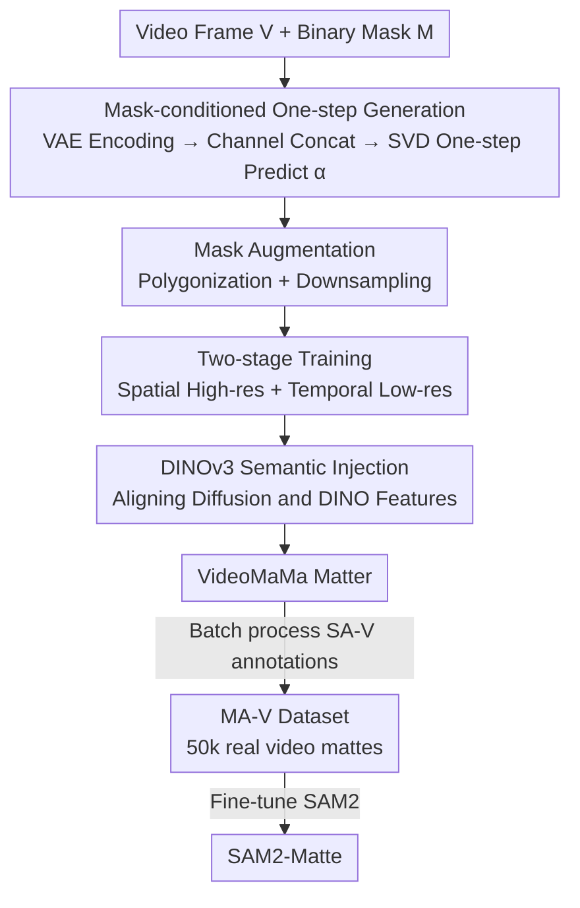

# VideoMaMa: Mask-Guided Video Matting via Generative Prior

**Conference**: CVPR 2026  
**Paper**: [CVF Open Access](https://openaccess.thecvf.com/content/CVPR2026/html/Lim_VideoMaMa_Mask-Guided_Video_Matting_via_Generative_Prior_CVPR_2026_paper.html)  
**Code**: https://cvlab-kaist.github.io/VideoMaMa (Project Page)  
**Area**: Video Matting / Segmentation  
**Keywords**: Video Matting, alpha matte, Video Diffusion Prior, Pseudo-labeling, SAM2

## TL;DR
VideoMaMa utilizes a pre-trained video diffusion model (SVD) to "translate" coarse binary segmentation masks into pixel-accurate alpha mattes. Trained solely on synthetic data, it achieves zero-shot generalization to real videos. It automatically converts SA-V segmentation annotations into MA-V, a matting dataset featuring over 50,000 real video clips, which is subsequently used to fine-tune a standard SAM2 into a more robust matting model, SAM2-Matte.

## Background & Motivation

**Background**: Video matting aims to extract foreground objects from video with pixel-level precision, outputting continuous opacity $\alpha$. It serves as a foundational component for video editing tasks such as background replacement, compositing, and relighting. Existing methods follow two paths: auxiliary-free methods mostly restricted to portraits, and trimap/mask-guided methods (e.g., MaGGIe, MatAnyone, GVM) that require extra annotations or are limited to specific domains.

**Limitations of Prior Work**: Two fundamental bottlenecks exist. First, **real alpha matte annotations are extremely scarce**. Ground-truth mattes typically require green screens or specialized camera arrays, making scaling difficult; existing datasets are mostly portrait-centric and small (VM800 contains only 826 clips). Second, **the synthetic-to-real domain gap**. To obtain data, common practices involve compositing foregrounds onto random backgrounds, which introduces unrealistic artifacts in lighting, motion blur, and temporal consistency, leading to model failure on real-world footage.

**Key Challenge**: How to scale real video matting annotations when ground-truth mattes are nearly unobtainable, while binary segmentation masks are abundant (e.g., SAM2, SA-V)? The problem becomes: can "cheap binary masks" be exchanged for "expensive alpha mattes"?

**Key Insight**: Drawing inspiration from Marigold, which fine-tuned Stable Diffusion into a depth estimator for zero-shot generalization, the generative priors learned by diffusion models from internet-scale data inherently capture natural scene boundaries, motion blur, and temporal coherence. By treating a video diffusion model as a "mask-to-matte translator," it can use these priors to fill in details missing from masks, such as hair, semi-transparency, and motion blur.

**Core Idea**: Perform mask-guided one-step generation using a pre-trained video diffusion model (SVD) to translate a binary mask $M$ into a continuous alpha matte $\alpha$. This translator is then used to batch-convert SA-V segmentation labels into matting labels, self-bootstrapping a large-scale real-world video matting dataset.

## Method

### Overall Architecture

VideoMaMa addresses the problem: "Given video frames plus a binary mask trajectory, output a pixel-accurate alpha matte." It models matting as an inverse problem of the alpha compositing equation $I = \alpha F + (1-\alpha)B$. While the mask $M\in\{0,1\}$ provides the shape, the model completes details in $\alpha\in[0,1]$ such as hair fibers and motion blur. The pipeline encodes video frames $V$ and guidance masks $M$ into the same latent space via a VAE, concatenates them with Gaussian noise along the channel dimension, and feeds them into a modified SVD U-Net. The model **directly predicts** the alpha matte latent variables in a single step, which are then decoded back to pixel space. During training, DINOv3 semantic features are injected for alignment.

Choosing binary masks as conditions simplifies the task: the mask defines "where the object is," allowing the diffusion model to **focus purely on detail generation** rather than boundary inference, thereby decoupling "localization" from "detail refinement." Furthermore, since masks can be provided by any segmentation model, the application scope is greatly broadened.

Beyond being a matting tool, VideoMaMa serves as a **pseudo-labeler**. Applied to SA-V segmentation labels, it generates the MA-V dataset, which is then used to fine-tune SAM2 into SAM2-Matte, creating a self-improving loop of "model → data → stronger model."

### Key Designs

**1. Mask-Conditioned One-Step Diffusion: Decoupling Details and Localization**

The hardest part of matting is boundary detail, but the object location is already provided by the mask. The authors replace SVD's original image conditioning with a concatenated tensor of video latent $z_V$, mask latent $z_M$, and noise $\varepsilon$:

$$\hat{z}_\alpha = F_{\text{SVD}}\big(\text{concat}(z_V, z_M, \varepsilon)\big), \quad \hat{\alpha} = D(\hat{z}_\alpha)$$

Video frames, masks, and mattes are processed in the same latent space due to identical spatial dimensions. Unlike traditional diffusion requiring iterative denoising, VideoMaMa uses v-parameterization for **one-step** generation—predicting clean alpha latents directly from noise in a single forward pass. This is crucial for batch-labeling 50,000 videos, as it reduces generation costs to a scalable level. With the shape fixed by $z_M$, the model uses SVD’s temporal modeling and $z_V$'s appearance cues to synthesize matte details.

**2. Mask Augmentation: Preventing "Copy-Paste" Shortcuts**

Using binary masks directly poses a risk: for simple shapes or masks that already contain some detail, the model might simply **copy the mask to the output** rather than reasoning from the RGB image. To force the model to look at the frames, two augmentations "corrupt" the input mask details: (1) **Polygonization**, which approximates boundaries with polygons to smooth out fine structures; and (2) **Downsampling**, which lowers and then restores resolution to remove high-frequency details while keeping the overall shape. These force the model to rely on RGB appearance cues to regenerate realistic details.

**3. Two-Stage Training: Decoupling Spatial Resolution and Temporal Consistency**

Matting requires pixel-level precision, where low resolution destroys fine details, but training video diffusion models at high resolution is computationally prohibitive. The authors split the process: **Stage 1** freezes temporal layers and trains spatial layers on single high-resolution frames ($1024\times1024$) to learn pixel-level details. **Stage 2** freezes the spatial layers and trains temporal layers on low-resolution ($704\times704$) 3-frame clips to learn temporal consistency and motion perception. This bypasses the hardware constraints of high-resolution video training. Although trained on only 3 frames, the model stays stable for 1–24 frames during inference.

**4. DINOv3 Semantic Injection: Enhancing Object Understanding**

While diffusion priors excel at fine alpha generation, they can struggle with semantic boundaries and stable tracking of complex structures (e.g., overlapping objects). The authors align semantic features from a frozen DINOv3 encoder: DINO features $h_{\text{dino}}=F_{\text{dino}}(V)$ are extracted, and intermediate features $h_l$ from the $l$-th layer of the diffusion model are projected via a learnable MLP $p_\vartheta$, maximizing patch-wise cosine similarity:

$$L_{\text{reg}} = -\,\mathbb{E}\big[\text{cos-sim}(h_{\text{dino}},\, p_\vartheta(h_l))\big]$$

This allows the model to retain object category and structure awareness, improving results for difficult cases like occlusions and articulated structures.

### Loss & Training
The primary loss $L_{\text{mat}}=\mathbb{E}[\text{sim}(D(\hat{z}_\alpha), \alpha)]$ is calculated in pixel space, comprising **L1 loss** (pixel accuracy) and **Laplacian loss** (boundary sharpness). Combined with the DINO alignment loss $L_{\text{reg}}$, both stages use a batch size of 64, a learning rate of $5\times10^{-5}$ with AdamW, and are trained for 10,000 steps on A100s with mixed precision. SAM2-Matte is created by adding a sigmoid to the SAM2 mask logits without changing the architecture, fine-tuned on a combination of existing datasets and MA-V.

## Key Experimental Results

### Main Results

Full-frame mask guidance (V-HIM60 Hard / YouTubeMatte, lower MAD/Gradient is better): VideoMaMa consistently leads across various mask qualities.

| Setting (V-HIM60 Hard, MAD↓) | Input Mask | MaGGIe-FT | Ours |
|------|------|------|------|
| 8× Downsampling | 2.744 | 2.652 | **1.306** |
| 32× Downsampling | 5.132 | 2.896 | **1.461** |
| Polygon (Hard) | 6.771 | 3.446 | **1.640** |
| SAM2 Generated Mask | 4.666 | 3.644 | **2.435** |

First-frame mask guidance (V-HIM60 Hard): SAM2-Matte significantly outperforms the previous SOTA, MatAnyone.

| Method | MAD↓ | MAD-T↓ | MSE↓ | GRAD↓ |
|------|------|------|------|------|
| SAM2 | 7.85 | 130.0 | 6.01 | 26.34 |
| MatAnyone | 5.72 | 102.5 | 3.46 | 9.82 |
| SAM2+VideoMaMa | 2.78 | 53.4 | 1.44 | 4.83 |
| **SAM2-Matte** | **2.61** | 58.8 | **1.08** | 5.09 |

Refining SAM2 propagation results with VideoMaMa reduces MAD from 7.85 to 2.78, validating its power as a pseudo-labeler and refiner.

### Ablation Study

| Config | 32× DS MAD↓ | Polygon MAD↓ | SAM2 MAD↓ |
|------|------|------|------|
| Spatial only (S1) | 3.76 | 4.83 | 4.05 |
| Temporal only (S2) | 1.24 | 2.24 | 2.31 |
| S1+S2 w/o DINO | 1.26 | 2.00 | 1.94 |
| **S1+S2+DINO (Full)** | **1.03** | **1.40** | **1.74** |

Training data ablation (V-HIM60 Hard / DAVIS):

| Training Data | V-HIM60 MAD↓ | DAVIS J&F↑ |
|------|------|------|
| MatAnyone | 4.67 | 79.7 |
| (a) Existing Datasets (ED) only | 7.58 | 77.0 |
| (b) MA-V only | 3.18 | **87.9** |
| (c) ED + MA-V | **2.61** | 85.9 |

### Key Findings
- **Two-stage training is essential; DINO is the icing on the cake**: Training only S1 performs poorly on SAM2 masks, while adding temporal layers and DINO provides massive improvements.
- **MA-V is powerful on its own**: Training solely on MA-V (b) achieves J&F=87.9 on DAVIS, outperforming the ED+MA-V combination, suggesting that real-video pseudo-labels aid generalization better than synthetic data.
- **Stable temporal scaling**: Though trained on 3 frames, MAD remains stable up to 24 frames during inference, showing strong temporal generalization.

## Highlights & Insights
- **"Segmentation-for-Matting" self-bootstrapping**: The most brilliant insight is using the diffusion prior as a bridge to convert 50,000 SA-V segmentation labels into matting labels, bypassing the decade-old bottleneck of unavailable ground-truth mattes.
- **Mask augmentation as a reusable anti-cheating trick**: In any conditional generation task where the input and target are highly similar (e.g., mask-to-matte, low-res to high-res), models tend to "copy" the input. Active destruction of input details is a transferable strategy.
- **One-step diffusion + Two-stage resolution separation**: Meeting the conflicting demands for high-resolution detail and temporal consistency through staged training, combined with one-step inference, is a key engineering trade-off for large-scale annotation production.
- **SAM2-Matte requires zero architecture changes**: Changing a segmentation model into a matting model via a simple sigmoid proves that the bottleneck has always been data, not architecture.

## Limitations & Future Work
- Dependency on input binary mask quality; the model does not decide "who to mat," and errors in the mask (e.g., SAM2 tracking failure) lead to matte errors.
- MA-V consists of pseudo-labels; its quality is capped by VideoMaMa's performance and may inherit biases in extreme transparency, smoke, or glass scenarios.
- Inference handles 12-frame segments; long-term temporal consistency across segments and potential jumps are not deeply explored.
- Evaluation still relies heavily on portrait-centric benchmarks; quantitative evaluation for diverse non-human categories remains limited.

## Related Work & Insights
- **vs MaGGIe / MatAnyone**: These use specialized architectures for mask trajectories but are limited to portraits and synthetic data. VideoMaMa uses a general video diffusion prior and real pseudo-labels for superior generalization.
- **vs GVM**: GVM also uses diffusion but focuses on portrait hair; VideoMaMa is category-agnostic and constructs a data ecosystem.
- **vs Marigold**: Both fine-tune generative models for dense prediction with synthetic-to-real generalization. VideoMaMa extends this to video and adds matting-specific designs like DINO injection and mask augmentation.
- **vs ZIM**: ZIM trains image mask-to-matte converters on image data; this work brings the paradigm to video to solve the scarcity of video ground truth.

## Rating
- Novelty: ⭐⭐⭐⭐⭐ "Bridging segmentation and matting through diffusion priors" is a clean and effective solution.
- Experimental Thoroughness: ⭐⭐⭐⭐ Extensive ablations on masks, benchmarks, and data, though extra non-human quantification would be beneficial.
- Writing Quality: ⭐⭐⭐⭐⭐ Clear progression from motivation to the self-bootstrapping data loop.
- Value: ⭐⭐⭐⭐⭐ MA-V (50k clips) and the plug-and-play SAM2-Matte provide significant contributions to the video matting community.

<!-- RELATED:START -->

## Related Papers

- [\[CVPR 2026\] MatAnyone 2: Scaling Video Matting via a Learned Quality Evaluator](matanyone_2_scaling_video_matting_via_a_learned_quality_evaluator.md)
- [\[CVPR 2026\] MatchMask: Mask-Centric Generative Data Augmentation for Label-Scarce Semantic Segmentation](matchmask_mask-centric_generative_data_augmentation_for_label-scarce_semantic_se.md)
- [\[CVPR 2025\] MatAnyone: Stable Video Matting with Consistent Memory Propagation](../../CVPR2025/segmentation/matanyone_stable_video_matting_with_consistent_memory_propagation.md)
- [\[CVPR 2026\] SPOT: Spatiotemporal Prompt Optimization for Motion-Stabilized MLLM-Guided Video Segmentation](spot_spatiotemporal_prompt_optimization_for_motion-stabilized_mllm-guided_video_.md)
- [\[CVPR 2025\] Generative Video Propagation](../../CVPR2025/segmentation/generative_video_propagation.md)

<!-- RELATED:END -->
