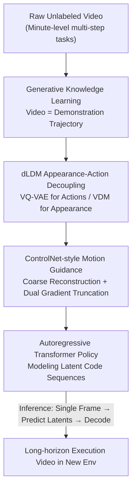

# VideoWorld 2: Learning Transferable Knowledge from Real-world Videos

**Conference**: CVPR 2026  
**Paper**: [CVF Open Access](https://openaccess.thecvf.com/content/CVPR2026/html/Ren_VideoWorld_2_Learning_Transferable_Knowledge_from_Real_world_Videos_CVPR_2026_paper.html)  
**Code**: https://VideoWorld2.github.io/ (Open source, includes data/models)  
**Area**: World Models / Embodied AI / Learning from Unlabeled Videos  
**Keywords**: World Models, Latent Dynamics Models, Video Diffusion Priors, Appearance-Action Decoupling, Long-horizon Manipulation  

## TL;DR
VideoWorld 2 proposes the "Dynamic-enhanced Latent Dynamics Model (dLDM)," which utilizes a pre-trained Video Diffusion Model (VDM) to handle appearance reconstruction. This forces latent codes to encode only task-relevant action dynamics, enabling the first-ever learning of transferable and executable long-horizon task knowledge from raw real-world videos. On a minute-level manual origami task, the 7-step continuous success rate improved from a 0% baseline to 68.8%, with the capability to transfer manipulation knowledge learned on Open-X to CALVIN.

## Background & Motivation

**Background**: Current AI primarily learns knowledge from large-scale text, but text cannot depict the dynamics, spatial relationships, and physical laws of the real visual world. Animals and children, however, learn skills directly from visual signals—watching an origami video and replicating it with a different piece of paper without linguistic instructions. Consequently, the vast amount of internet video is seen as a gold mine for scalable "world knowledge." The predecessor, VideoWorld, demonstrated that using an autoregressive video generation paradigm on visual signals alone allows models to learn rules, reasoning, and planning from chess notations and simulated robotic environments.

**Limitations of Prior Work**: Directly applying VideoWorld to real-world videos fails. Real videos exhibit high visual diversity, complex action dynamics, and often involve multi-step interactions spanning minutes. When the input consists of long, multi-step real-world task videos, VideoWorld fails to extract core task-solving knowledge and cannot generalize to new scenes through observation. It fails at tasks as simple as origami, producing predictions with distorted gestures, incorrect object shapes, and incoherent environment appearances. On the other hand, SOTA video generation models (Wan2.2, HunyuanVideo, Cosmos), while capable of high-fidelity frames, also fail to faithfully represent task execution.

**Key Challenge**: The root cause is that **action dynamics are entangled with visual appearance**. When jointly modeling both in a unified generative framework, the model absorbs task-irrelevant visual details such as background motion, lighting changes, textures, and camera shifts into the latent codes. This makes the model extremely sensitive to environmental changes, leading to poor long-term consistency and failure in new environments. Essentially, "actions that should be observed for the task" are drowned out by "aesthetic appearance."

**Goal**: Can a model learn transferable knowledge of complex, long-horizon tasks directly from unlabeled real-world videos? This is decomposed into two sub-problems: (1) how to cleanly strip core task actions from visual changes; and (2) how to use these action representations for long-horizon policy reasoning and transfer to new environments.

**Key Insight**: Humans naturally prioritize key actions and filter out irrelevant changes. Inspired by this, the authors explicitly decouple "appearance modeling" from "action learning." Since powerful pre-trained VDMs excel at rendering appearance, they are tasked exclusively with "painting," freeing the latent codes to focus solely on capturing actions.

**Core Idea**: A pre-trained VDM handles appearance reconstruction, forcing the latent dynamics codes to represent only compact, semantic, and transferable task actions. An autoregressive Transformer then models the policy over these action codes—i.e., "delegate appearance to the VDM, and keep dynamics in the latent code."

## Method

### Overall Architecture

VideoWorld 2 treats "a video clip" as a demonstration trajectory carrying world state transitions and latent action policies. The goal is to extract executable and transferable task knowledge from this trajectory. Formally, it is defined as a tuple $G=\langle X, A, \omega\rangle$: where $X$ is the observation space, $A$ is the action space, and $\omega$ is the video generator. Given historical frames $x_{0:t}$, $\omega$ is trained to model the next-frame conditional distribution $p(x_{t+1}\mid x_{0:t})$. This generator simultaneously acts as a policy model $\pi(\cdot\mid x_{0:t}):X\to A$, mapping visual state transitions to actions, thereby learning task knowledge **without any action labels**.

The pipeline consists of two stages: **During training**, the dLDM compresses future visual changes into a sequence of compact, generalizable latent dynamics codes, while appearance reconstruction is delegated to a pre-trained VDM; meanwhile, an autoregressive Transformer learns to predict these codes. **During inference**, given an initial frame of a new environment, the Transformer autoregressively predicts future latent codes, which are then decoded by the dLDM/VDM into coherent long-horizon execution videos—this is how the model transfers learned actions to unseen environments and executes action sequences beyond the training distribution.

### Key Designs

**1. Generative Knowledge Learning + Latent Dynamics Codes: Compressing Unlabeled Videos into Action-focused Latents**

Mainstream video generation frameworks use VQ-VAE to encode videos into compressed representations, but capturing complete visual information often requires thousands of discrete tokens. This leads to spatio-temporal redundancy and sparse knowledge distribution, where visual changes corresponding to key decisions or actions are submerged. VideoWorld’s countermeasure is the Latent Dynamics Model (LDM): using a MAGVITv2-style causal encoder-decoder, it first encodes a segment $x$ of length $T$ into a feature sequence $f_{0:K}$ (where $K=1+\lceil\frac{T-1}{s}\rceil$ and $s$ is the temporal downsampling stride). Then, $N$ learnable query embeddings $q=\{q_n\}_{n=1}^N$ are defined to capture "change information" in $\{f_{0:k}\}$ via cross-attention, resulting in a continuous representation $z$. Subsequently, $z$ is quantized—quantization **prevents the model from taking shortcuts** (otherwise it would degenerate into directly copying $f_k$ to $z_k$). Finally, the decoder causally reconstructs subsequent frames using $f_0$ and the quantized $z$, with the training target being the $\ell_2$ distance between original and reconstructed frames. This sequence of embeddings constitutes the "latent dynamics codes," acting as the carrier for multi-step motion dynamics.

**2. dLDM Appearance-Action Decoupling: Delegating Appearance to VDM, Dynamics to Latent Codes**

LDM works in simulated environments but fails in the real world—the learned latent codes become contaminated with background motion, lighting, textures, and camera shifts. The key move in dLDM is **replacing the original LDM decoder with a pre-trained VDM**. The VDM itself does not understand the dynamics of the target task, but once provided with appropriate dynamic guidance, it excels at generating realistic visual content. Specifically, dLDM consists of a causal VQ-VAE (encoding future visual changes into discrete latents) and a pre-trained VDM (reconstructing with high fidelity conditioned on these codes). Latents are injected into the VDM via a projection layer and **causal cross-attention**. To ensure temporal correctness, the VDM employs internal causal attention, where features at time $t$ can only attend to information at $\le t$. Since appearance is completely handled by the VDM, the latent codes are liberated from "encoding fine-grained visual details" and instead focus on task-relevant dynamics. UMAP visualizations show that with the VDM, latent codes for the same action across different environments align more closely with lower variance—direct evidence of "robust, transferable dynamics."

**3. ControlNet-style Motion Guidance + Dual Gradient Truncation: Providing Coarse Motion Cues while Blocking Noise**

Training a VDM to generate future frames from noise is extremely slow and prone to action errors because it has never seen long-horizon tasks like origami. The authors' approach is to **reuse the VQ-VAE decoder**: after warm-up, although the original decoder produces blurry images, it reconstructs low-fidelity videos that retain coherent object motion (hand movements, object displacements), providing coarse-grained temporal cues. This signal is fed into the VDM via a **gradient-stopped, ControlNet-style branch**, allowing the VDM to focus on "refining appearance" rather than inferring motion from scratch. Simultaneously, the **gradient flow from the decoder back to the latent codes is truncated** to prevent irrelevant noise from being back-propagated. Ablations confirm both stop-grad operations are critical: adding only the truncated decoder (without reconstructing video) improves the success rate by ~20% over the baseline, suggesting the original decoder indeed injects noise that degrades the latent representation. Using the reconstructed video as a condition (ControlNet branch) further stabilizes output, adding another ~20% to the success rate, with higher gains in long-horizon origami than short-duration block stacking.

**4. Autoregressive Transformer Policy: Modeling Long-horizon Dependencies as Language**

After extracting latent codes $\{z_k^n\}_{k=1,n=1}^{K,N}$ for each video $x_{0:T}$, the authors flatten them into a sequence and train an autoregressive Transformer to predict them, conditioned on the initial frame $x_0$ and task instructions. periodically. This enables the model to learn long-range patterns in complex tasks. During inference, given a single frame of a new environment, the Transformer predicts future latent dynamics based on learned task representations, and the dLDM decodes them into coherent long-horizon videos. Implementation-wise, the model reuses the next-token prediction capabilities of NVIDIA Cosmos AR 4B for latent prediction, and the Cosmos DiT 2B for the appearance prior (generating 93 frames ≈5s@16fps at 480px). dLDM typically processes 93 frames at a time, with a vocabulary of 1000 (FSQ levels [8,5,5,5]) and query length $N=4$.

### Loss & Training
The dLDM training objective is the $\ell_2$ reconstruction loss between original and reconstructed frames. Training is phased: first, warm-up with the original VQ-VAE decoder; then, discard the VQ-VAE reconstruction loss to avoid noise injection and feed the coarse motion video from the warmed-up decoder into the VDM as a ControlNet-style condition. Two stop-grad points (decoder → latent codes, and the ControlNet branch) are essential for stable training. The AR Transformer performs next-token prediction on flattened latent sequences conditioned on $x_0$ and instructions.

## Key Experimental Results

### Main Results

7-step continuous success rate on Video-CraftBench (Trained on Video-Craft only vs. joint pre-training on Open-X & Craft), highlighting increasing difficulty at later steps:

| Method | Training Data | Origami Step1 | Step4 | Step7 | Block Tower | SSIM↑ | LPIPS↓ |
| :--- | :--- | :---: | :---: | :---: | :---: | :---: | :---: |
| Wan2.2 14B (VDM) | Craft-text | 81.2 | 10.6 | 0.0 | 42.6 | 0.719 | 0.237 |
| VideoWorld | Craft | 70.3 | 21.3 | 0.0 | 33.9 | 0.680 | 0.351 |
| **VideoWorld 2** | Craft | **97.2** | **83.3** | **68.8** | **81.5** | **0.770** | **0.205** |
| CoLA | OpenX & Craft | 83.5 | 64.8 | 40.2 | 52.4 | 0.668 | 0.289 |
| VideoWorld | OpenX & Craft | 91.7 | 63.1 | 31.9 | 52.7 | 0.601 | 0.389 |
| **VideoWorld 2** | OpenX & Craft | **98.2** | **86.7** | **72.3** | **83.0** | **0.774** | **0.193** |

CALVIN long-horizon sequence evaluation (5 consecutive tasks, Avg. Len. = Average completed tasks, higher is better):

| Idx | Method | Pre-training | Fine-tuning | Task 1 | Task 5 | Avg. Len. |
| :--- | :--- | :--- | :--- | :---: | :---: | :---: |
| 2 | Transformer (Oracle) | - | 10% data | 50.5 | 0 | 1.11 |
| 3 | LAPA | In-domain Latents | 10% data | 74.4 | 2.30 | 1.49 |
| 4 | **VideoWorld 2** | In-domain Latents | 10% data | 75.8 | 9.70 | **1.87** |
| 1 | Transformer (Oracle) | - | 100% (22k) | 80.9 | 24.6 | 2.36 |
| 6 | LAPA | Cross-domain OpenX | 22k | 84.0 | 27.0 | 2.51 |
| 7 | **VideoWorld 2** | Cross-domain OpenX | 22k | 88.5 | 30.9 | **2.88** |

### Ablation Study

dLDM architectural breakdown (Table 3a, Video-Craft training only):

| Pre-trained VDM | Decoder Stop-Grad | ControlNet | Origami | Blocks | LPIPS↓ |
| :---: | :---: | :---: | :---: | :---: | :---: |
| ✗ | ✗ | ✗ | 0.0 | 28.5 | 0.312 |
| ✓ | ✗ | ✗ | 30.3 | 45.2 | 0.297 |
| ✓ | ✓ | ✗ | 47.3 | 54.7 | 0.275 |
| ✓ | ✓ | ✓ | **68.8** | **77.5** | **0.205** |

Hyperparameter sensitivity (Table 3b/c/d):

| Configuration | Origami Success | CALVIN Avg. Len. | Description |
| :--- | :---: | :---: | :--- |
| Query length $N=1 / 2 / 4 / 8$ | 41.9 / 55.1 / **68.8** / 65.0 | 1.53 / 1.64 / **1.87** / 1.88 | $N=4$ is optimal; $N=8$ introduces noise. |
| Codebook size $8 / 1000 / 4096 / 64k$ | 20.1 / **68.8** / 50.4 / 29.4 | 1.65 / 1.87 / 1.90 / 1.89 | Large codebooks capture noise, hindering convergence. |
| Context length $T=2 / 9 / 49 / 93 / 177$ | 19.1 / 55.4 / 65.3 / **68.8** | 1.55 / 1.61 / 1.80 / 1.87 | Performance saturates at Cosmos VDM's 93-frame limit. |

### Key Findings
- **VDM Decoupling is the Major Contributor**: Without the VDM prior, origami success drops to zero (0.0); adding it jumps to 30.3, and adding stop-grad layers reaches 68.8. This validates that "appearance-action decoupling" is the key to real-world knowledge learning.
- **The Original Decoder is both a Noise Source and a Motion Goldmine**: Directly connecting it injects noise (hence the stop-grad), but its coarse reconstructions provide the crucial motion cues VDM needs (hence the ControlNet branch)—this strategy separates the "pros" and "cons" of the same module.
- **Long-horizon is the Watershed**: All baselines reach 68%+ at Step 1 of origami, but by Step 4, they drop to $\le 10.6\%$, and Step 7 is nearly impossible for them; VideoWorld 2 is the only method to complete 7 steps (68.8%/72.3%), with ControlNet guidance showing more benefit in long-horizon tasks.
- **Impressive Data Efficiency**: CALVIN in-domain latent pre-training with only 10% action labels (Avg. Len. 1.87) approaches the oracle trained on 100% data (2.36); cross-domain OpenX pre-training even surpasses the full-label oracle (2.88 vs. 2.36).

## Highlights & Insights
- **"Let Experts Do Expert Work" Decoupling**: Rather than inventing new modules, the authors use the strongest existing VDM as an "appearance laborer," forcing the latent codes to learn only actions—a clean division of labor that shifts cross-environment transferability from "impossible" to "SOTA."
- **Clever Dual Use of stop-grad**: Using the same VQ-VAE decoder as a condition while killing its gradients cleanly captures "motion cues without noise."
- **Filling the Benchmark Vacuum**: Video-CraftBench (~7 hours, ~9.5k clips, 5 types of minute-level manual tasks) focuses on "fine-grained + long-horizon + hard-to-describe" real tasks, challenging existing methods with unseen backgrounds, materials, and layouts.
- **Latents as Transferable Action Dictionaries**: UMAP showing similar latent codes in Open-X and Video-Craft correspond to similar motion patterns across different agents and envs—suggesting the model learns abstract "action semantics" rather than specific robot arm poses.

## Limitations & Future Work
- **Dependency on Strong VDM Priors**: The performance upper bound is capped by the fidelity and context length (93 frames) of the pre-trained VDM (Cosmos DiT 2B). Performance saturation at $T=93$ reflects this limit.
- **Task Scope Remains Narrow**: Manual tasks + CALVIN robotic arms are still far from "vast internet videos." The authors leave "continuous scaling" as future work.
- **Quantization Hyperparameter Sensitivity**: Codebook size and query length have clear "sweet spots." This implies potential tuning requirements for new tasks or complex action spaces.
- **Future Directions**: Breaking the 93-frame bottleneck with longer contexts; replacing the AR Transformer with stronger world models for closed-loop planning; exploring latents as universal "action tokens" shared across robot morphologies.

## Related Work & Insights
- **vs. VideoWorld (Predecessor LDM)**: Both model visual changes as latent codes. However, VideoWorld's decoder handles appearance, causing latents to pick up irrelevant environment details. VideoWorld 2 achieves 68.8% on long-horizon tasks by delegating appearance to VDM.
- **vs. SOTA Video Gen (Wan2.2 / HunyuanVideo / Cosmos)**: These excel at high-fidelity frames but fail to disentangle core task actions, over-fitting to visual background and failing at long-horizon strategies.
- **vs. LAM / CoLA (Latent Action work)**: CoLA uses VDM for latent action optimization but is limited to short 2-frame transitions and misses structural temporal cues. VideoWorld 2 handles minute-level multi-stage tasks.
- **vs. JEPA-style World Models**: JEPA predicts in abstract space and avoids reconstruction; this work takes a "generative knowledge learning" route, using VDM reconstruction to obtain interpretable, executable action latents that serve directly as policies.

## Rating
- Novelty: ⭐⭐⭐⭐⭐ First work to learn complex, transferable long-horizon knowledge from raw real videos via an effective decoupling strategy.
- Experimental Thoroughness: ⭐⭐⭐⭐⭐ Dual benchmarks, strong baselines, and comprehensive ablations clearly demonstrate the long-horizon gap.
- Writing Quality: ⭐⭐⭐⭐ Clear motivation and excellent chart comparisons; some implementation details (causal attention, warm-up timing) rely on supplementary materials for full reproduction.
- Value: ⭐⭐⭐⭐⭐ Provides a practical paradigm for scaling world knowledge from unlabeled video, with open-source data and models for the community.

<!-- RELATED:START -->

## Related Papers

- [\[CVPR 2026\] SimRecon: SimReady Compositional Scene Reconstruction from Real Videos](simrecon_simready_compositional_scene_reconstruction_from_real_videos.md)
- [\[CVPR 2026\] UniMERNet: A Universal Network for Real-World Mathematical Expression Recognition](unimernet_a_universal_network_for_real-world_mathematical_expression_recognition.md)
- [\[CVPR 2026\] Clair Obscur: an Illumination-Aware Method for Real-World Image Vectorization](clair_obscur_an_illumination-aware_method_for_real-world_image_vectorization.md)
- [\[CVPR 2026\] Adaptive Bayesian Early-Exit Networks for Efficient Non-Transferable Learning](adaptive_bayesian_early-exit_networks_for_efficient_non-transferable_learning.md)
- [\[CVPR 2026\] Towards Knowledge-augmented Bayesian Deep Learning For Computer Vision](towards_knowledge-augmented_bayesian_deep_learning_for_computer_vision.md)

<!-- RELATED:END -->
## Related Papers

- [\[CVPR 2026\] TraceGen: World Modeling in 3D Trace Space Enables Learning from Cross-Embodiment Videos](tracegen_world_modeling_in_3d_trace_space_enables_learning_from_cross-embodiment.md)
- [\[CVPR 2026\] RoboWheel: A Data Engine from Real-World Human Demonstrations for Cross-Embodiment Robotic Learning](robowheel_a_data_engine_from_real-world_human_demonstrations_for_cross-embodimen.md)
- [\[CVPR 2026\] Dexterous World Models](dexterous_world_models.md)
- [\[CVPR 2026\] CoMo: Learning Continuous Latent Motion from Internet Videos for Scalable Robot Learning](como_learning_continuous_latent_motion_from_internet_videos_for_scalable_robot_l.md)
- [\[CVPR 2026\] Chain of World: World Model Thinking in Latent Motion (CoWVLA)](chain_of_world_world_model_thinking_in_latent_motion.md)

<!-- RELATED:END -->
