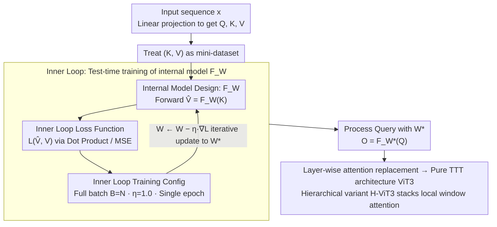

# ViT3: Unlocking Test-Time Training in Vision

**Conference**: CVPR 2026 Oral  
**arXiv**: [2512.01643](https://arxiv.org/abs/2512.01643)  
**Code**: [GitHub](https://github.com/LeapLabTHU/ViTTT)  
**Area**: Efficient Architecture / Vision Sequence Modeling  
**Keywords**: Test-Time Training, Linear Complexity, Internal Model, Vision Transformer, Convolution

## TL;DR

Systematically explores the design space of Test-Time Training (TTT) for vision tasks, summarizes six practical design insights, and proposes ViT3—a pure TTT vision architecture with linear complexity that matches or exceeds Mamba and linear attention methods in classification, generation, detection, and segmentation tasks.

## Background & Motivation

The quadratic complexity $O(N^2)$ of Vision Transformers limits the processing of long visual sequences. TTT models provide a new linear complexity path: reformulating the attention operation as an online learning problem—training a compact internal model using Key-Value pairs as a "mini-dataset" at test time, and then using this model to process the Query.

However, the design space of TTT is vast and underexplored: the choice of internal training (loss function, learning rate, batch size, number of epochs) and internal model (architecture, size) lacks systematic understanding. This has resulted in the performance of vision TTT models being locked, preventing them from reaching their full potential.

## Method

### Overall Architecture

ViT3 aims to effectively utilize Test-Time Training (TTT) in vision. The core of TTT is reformulating attention as an online learning problem: instead of performing softmax attention, each layer treats the Key-Value pairs of the current sequence as a "mini-dataset." An internal model $F_W$ is trained on-the-fly during testing, and the output is obtained by processing the Query with the trained $F_{W^*}$. The macro-architecture is identical to a Transformer (replacing attention with TTT layers layer-by-layer), reducing complexity from $O(N^2)$ to linear. The challenge lies in the massive design space of TTT (inner loop loss, learning rate, batch, epoch, and internal model architecture/size). This paper's contribution is a systematic sweep of this space, refining six insights into three core designs (inner loop loss, inner loop training configuration, and internal model design), leading to the development of ViT3.

The figure below shows the data flow of a single TTT layer: Key-Value pairs are fed into the inner loop, updating the internal model $F_W$ to obtain adapted weights $W^*$, which then process the Query. The three core designs correspond to the three knobs in this inner loop.

### Key Designs

**1. Inner Loop Loss Function: Avoiding losses with vanishing second-order derivatives (Insight 1)**

The inner loop relies on gradient backpropagation from the outer loop. If the mixed second-order derivative $\partial^2 L / \partial \hat{V} \partial V$ of the loss is zero (e.g., MAE/L1), the outer loop gradient signal disappears during internal updates, preventing the internal model from learning. Therefore, TTT is unsuitable for such losses; Dot Product Loss or MSE Loss is recommended.

**2. Inner Loop Training Config: Full-batch and large learning rates for vision instead of causal mini-batches (Insight 2&3)**

Vision data is non-causal, and copying causal mini-batches from language tasks is sub-optimal. Experiments show that vision tasks favor single-epoch, full-batch gradient descent ($B=N$), with a larger internal learning rate ($\eta=1.0$) being most effective. This contradicts findings in language TTT and is a common pitfall when migrating TTT to vision.

**3. Internal Model Design: Width is effective, depth is not, convolution is best (Insight 4, 5, & 6)**

The internal model architecture determines the upper bound of TTT. Increasing width consistently improves performance (width scaling is effective). However, deepening the internal model leads to worse results—a 3-layer MLP shows higher training loss, indicating optimization difficulties (underfitting) rather than insufficient capacity; neither residuals nor initialization can resolve this. Currently, depth scaling is ineffective. Architecturally, convolutions (especially Depthwise Separable Convolutions, DWConv) are particularly suitable as internal models, leveraging locality priors to achieve 80.1% Top-1 (vs. 78.9% for MLP) while allowing parallel computation.

### Loss & Training

- **Outer Loop**: Standard ImageNet 300-epoch training (DeiT-S settings).
- **Inner Loop**: Dot Product Loss, $\eta=1.0$, single-epoch full-batch.
- **Internal Model**: DWConv (Depthwise Separable Convolution), parallelizable.
- **Hierarchical Architecture (H-ViT3)**: Combines local window attention with global TTT.

## Key Experimental Results

### Image Classification (ImageNet-1K)

| Method | Type | Params | Top-1 |
|------|------|--------|-------|
| DeiT-S | Transformer | 22M | 79.8 |
| Vim-S | Mamba | 26M | 80.3 |
| Agent-DeiT-S | Linear | 23M | 80.5 |
| ViT3-S | TTT | 24M | 81.6 |
| H-ViT3-S‡ | TTT | 54M | 84.9 |
| H-ViT3-B‡ | TTT | 94M | 85.5 |

### Ablation Study (Internal Model Architecture)

| Internal Model | Top-1 | Description |
|----------|-------|------|
| FC(x) Linear Layer | 79.1 | Equivalent to Linear Attention |
| MLP r1 2-layer | 78.9 | Baseline TTT |
| MLP r4 2-layer | 79.6 | Width scaling effective |
| SiLU(FC(x)) | 79.4 | Bottleneck design outperforms full MLP |
| DWConv(x) | 80.1 | Convolution is optimal |

### Key Findings

- TTT is stronger than linear attention (as it can use more complex non-linear internal models).
- Full-batch is superior to mini-batch (due to the non-causal nature of vision), contrary to language task conclusions.
- Deep internal models lead to performance degradation (3-layer MLP 77.5% < 2-layer MLP 78.9%), which is an optimization issue rather than a capacity issue.
- Residual connections and initialization strategies cannot fully resolve the optimization difficulties of deep internal models.

## Highlights & Insights

- First systematic exploration of the vision TTT design space; six insights provide clear guidance for future research.
- Identifies the optimization difficulty of deep internal models in TTT as an important open problem.
- Discovery of DWConv as a superior internal model—leveraging convolutional locality priors.
- ViT3 as a pure TTT architecture competes with highly optimized Transformers across multiple tasks.

## Limitations & Future Work

- Optimization difficulty of deep internal models remains a core unresolved issue, limiting the potential ceiling of TTT.
- Internal model updates consume approximately 4x the computation of a standard forward pass; there is room for efficiency improvement.
- Mini-batching performs poorly in vision, but designing vision-specific scan orders might improve this.
- Potential of TTT in long-sequence vision tasks like video has not been explored.

## Related Work & Insights

- **vs Mamba**: SSM scan paths introduce causal bias; ViT3's full-batch approach naturally adapts better to vision.
- **vs Linear Attention**: Linear attention uses $d \times d$ linear layers; TTT can use any non-linear model, offering higher expressivity.
- **vs Softmax Attention**: Softmax attention can be viewed as a two-layer MLP with width $N$; TTT replaces this with a compact but trainable model.

## Rating

- **Novelty**: ⭐⭐⭐⭐ Systematic exploration and the summarization of six insights are novel in the field.
- **Experimental Thoroughness**: ⭐⭐⭐⭐⭐ Comprehensive coverage of classification, generation, detection, and segmentation, with detailed ablations of internal designs.
- **Writing Quality**: ⭐⭐⭐⭐⭐ Clear structure; the insight-experiment-remark organization is exemplary.
- **Value**: ⭐⭐⭐⭐ Establishes a systematic foundation for vision TTT and identifies multiple future directions.

<!-- RELATED:START -->

## Related Papers

- [\[ICML 2026\] Test-Time Training with KV Binding Is Secretly Linear Attention](../../ICML2026/others/test-time_training_with_kv_binding_is_secretly_linear_attention.md)
- [\[CVPR 2026\] Neural Collapse in Test-Time Adaptation](neural_collapse_in_test-time_adaptation.md)
- [\[CVPR 2026\] Towards Stable Federated Continual Test-Time Adaptation in Wild World](towards_stable_federated_continual_test-time_adaptation_in_wild_world.md)
- [\[CVPR 2026\] Bootstrapping Multi-view Learning for Test-time Noisy Correspondence](bootstrapping_multi-view_learning_for_test-time_noisy_correspondence.md)
- [\[CVPR 2026\] WiTTA-Bench: Benchmarking Test-Time Adaptation for WiFi Sensing](witta-bench_benchmarking_test-time_adaptation_for_wifi_sensing.md)

<!-- RELATED:END -->
