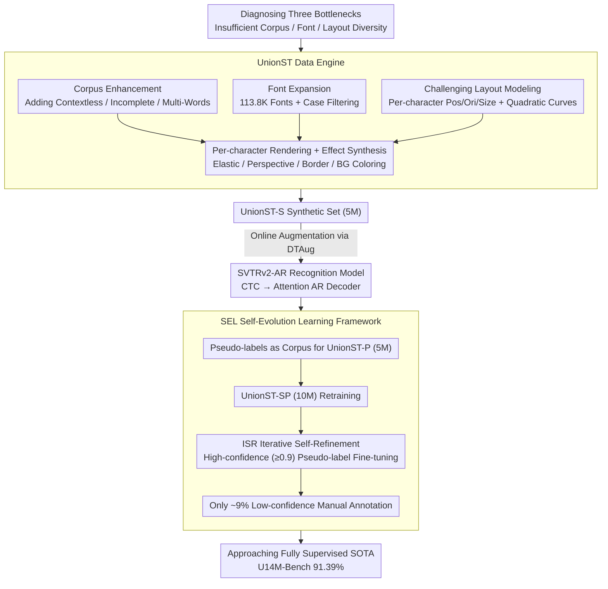

# What Is Wrong with Synthetic Data for Scene Text Recognition? A Strong Synthetic Engine with Diverse Simulations and Self-Evolution

**Conference**: CVPR2026  
**arXiv**: [2602.06450](https://arxiv.org/abs/2602.06450)  
**Code**: [YesianRohn/UnionST](https://github.com/YesianRohn/UnionST)  
**Area**: Others  
**Keywords**: Scene Text Recognition, Synthetic Data, Data Engine, Self-Evolution Learning, Pseudo-labels

## TL;DR

This paper systematically analyzes the deficiencies of existing rendered synthetic data in terms of corpus, font, and layout diversity. It proposes the UnionST synthesis engine and a Self-Evolution Learning (SEL) framework. Using only synthetic data, UnionST significantly outperforms traditional synthetic sets. Combined with SEL, it approaches fully supervised performance using only 9% of real-world annotations.

## Background & Motivation

**Scene Text Recognition (STR) relies on large-scale training data**: Annotating real-world data is expensive and suffers from class imbalance. Synthetic data serves as a low-cost alternative, but a significant domain gap exists between current synthetic and real-world data.

**Rendering methods still outperform generative methods**: Generative methods like diffusion models fall far behind rendering methods in terms of text correctness (the best edit accuracy is only 84.67%) and are 10-10,000 times more computationally expensive.

**Insufficient corpus diversity**: Existing synthetic sets primarily consist of single semantic words, lacking contextless text (license plates, phone numbers), incomplete text, and multi-word phrases.

**Limited font coverage**: Mainstream engines use only 1.2K-3.6K fonts, failing to cover artistic fonts found in reality.

**Single layout patterns**: Characters are mostly arranged horizontally with uniform sizes, failing to simulate curved, multi-oriented, and multi-scale text.

**Existing SOTA models still have room for improvement even on the largest real-world datasets**: This indicates that the STR problem remains unsolved at the data level, requiring higher-quality synthetic data.

## Method

### Overall Architecture

The paper begins by diagnosing "what exactly is wrong with existing rendered synthetic data," concluding that diversity in corpus, font, and layout is insufficient. Consequently, the **UnionST rendering engine** is developed to address these gaps, supplemented by a **Self-Evolution Learning (SEL) framework** to maximize the value of limited real data. The pipeline consists of four stages: ① The UnionST engine samples text from an augmented corpus, selects compatible fonts, renders characters independently with calculated position/orientation/size parameters, applies elastic deformation/perspective/borders, selects backgrounds, and colors them based on a color mapping table to output UnionST-S (5M samples); ② During training, DTAug online augmentation is applied to compensate for small/blurry samples; ③ The recognition model uses SVTRv2-AR, which replaces the CTC decoder with an attention-based AR decoder; ④ SEL generates pseudo-labels for unlabeled real data, utilizes them as a corpus to synthesize UnionST-P, combines it with UnionST-S for retraining, performs ISR iterative self-refinement, and finally requires manual annotation for only ~9% of low-confidence samples to reach the fully supervised upper bound.

### Key Designs

**1. Corpus Enhancement: Addressing "unconventional text" missing in existing sets**

Existing synthetic sets focus on single semantic words. This work introduces three categories of challenging text: Contextless (random characters simulating license plates/phone numbers), Incomplete (random character deletion simulating occlusion/cropping), and Multi-Words (phrases and multi-word fragments) to align the corpus distribution with real-world scenarios.

**2. Font Expansion: Expanding coverage from thousands to over a hundred thousand**

Mainstream engines use only 1.2K–3.6K fonts, missing long-tail artistic fonts. UnionST collects 113.8K public fonts (compared to MJ's 1.4K) and automatically filters those that do not distinguish between cases, ensuring coverage of artistic categories.

**3. Challenging Layout Modeling: Enabling curved, rotated, and variable-sized characters**

Characters are typically arranged horizontally. This engine models the position $p_i$, orientation $o_i$, and size $s_i$ for each character independently. A quadratic curve parameter $a \in [20, 200]$ controls curvature, and a global rotation angle $\phi \sim \text{Uniform}[0, 2\pi)$ introduces multi-orientation, facilitating the synthesis of Curve, multi-oriented, and multi-scale layouts.

**4. DTAug Online Augmentation: Simulating low-resolution and blurry samples during training**

To compensate for low-quality samples, downsampling and transmission distortion augmentations are applied online during training to simulate small or blurry text, enhancing robustness on the General subset.

**5. SVTRv2-AR Recognition Model: Replacing decoders unfriendly to curved text**

CTC decoders imply a monotonic alignment assumption, which is a bottleneck for curved/multi-oriented text. By replacing the SVTRv2 CTC decoder with an attention-based AR decoder, the monotonic alignment constraint is removed, improving performance on difficult layouts.

**6. SEL Self-Evolution Learning Framework: Reducing real-world annotation needs to 9%**

Despite high quality, synthetic data still has a domain gap, while full annotation of real data is expensive. SEL uses a model trained on UnionST-S to generate pseudo-labels for unlabeled real data, synthesizes UnionST-P (5M) using those labels as a corpus, and combines it with UnionST-S into UnionST-SP (10M). Then, Iterative Self-Refinement (ISR) is performed: high-confidence (≥0.9) samples are selected for fine-tuning. After two rounds, only ~9% of low-confidence samples require manual annotation to reach near-fully-supervised performance.

### Loss & Training

Standard STR training losses are used (CTC loss / AR cross-entropy loss). The focus is on data-level innovation rather than loss function design.

## Key Experimental Results

### Main Results

| Training Data | Data Volume | Common AVG | U14M-Bench AVG |
|---|---|---|---|
| ST-2D (Combined 2D Synthetic) | 36.0M | 94.90% | 73.36% |
| UnionST-S | 5.0M | **95.32%** | **83.00%** |
| U14M-Filter (Real Data) | 3.22M | 96.56% | 87.22% |
| UnionST-SP | 10.0M | 96.07% | 84.86% |
| UnionST-SP + Real | 10.0M + 3.22M | **97.84%** | **91.39%** |

- Using only 5M samples, UnionST-S outperforms the 36M ST-2D by **9.64%** on U14M-Bench, even exceeding real data on the Multi-Words subset.
- UnionST-SP + Real pushes U14M-Bench accuracy to **91.39%** (the first to exceed 90%).

### Ablation Study

| Stage | U14M-Bench AVG |
|---|---|
| UnionST-SP (Synthetic only) | 84.86% |
| + Round 1 Pseudo-labels | 89.12% |
| + Round 2 Pseudo-labels | 89.81% |
| + 290K Manually Labeled Hard Samples | 91.23% |
| Fully Supervised Upper Bound | 91.39% |

Labeling only 9% (290K / 3.22M) of the real data achieves performance within 0.16% of the fully supervised upper bound.

### Key Findings

1. **Curved Layout** provides the most significant boost to the Curve subset (from 19.83% → 46.70%).
2. **Multi-orientation variations** simultaneously affect the Curve, MLO, and Salient subsets.
3. **Corpus enhancement** primarily benefits Contextless (+11%) and Multi-Words (+18%), but shows a slight drop on Common, suggesting that Common consists mainly of common words and evaluating solely on it leads to overfitting.
4. **Font diversity** has negligible impact at small scales but, at 5M scale, reducing fonts leads to a significant drop in the Artistic subset.
5. **DTAug** provides clear improvements on the General subset.
6. **Irreplaceability of Pseudo-Corpus**: Using MJ+ST or ST-2D as the base for ISR only achieves 73.30% and 80.51% respectively, far below the 89.12% achieved by UnionST-SP.

## Highlights & Insights

- Systematically diagnoses three bottlenecks of rendered synthetic data (corpus/font/layout) and provides solutions for each.
- 5M synthetic samples outperform 36M traditional synthetic samples, proving that data quality is more important than quantity.
- The SEL framework reduces manual annotation requirements by 91%, offering extremely high practical value.
- Achieves accuracy over 90% on the Union14M-Benchmark for the first time.

## Limitations & Future Work

- Currently focused on English; extension to multi-lingual (Chinese, Arabic, etc.) scenarios has not been verified.
- Does not cover document OCR or handwriting recognition scenarios.
- The visual realism of rendered images is still inferior to generative methods, placing a ceiling on visual diversity.
- The font filtering strategy relies on case distinction, which might exclude some useful artistic fonts.
- No gains were observed in the third round of ISR; error accumulation in pseudo-labels remains an area for research.

## Related Work & Insights

- **Rendering Synthesis**: MJ, ST, CurvedST, SynthAdd, SynthTIGER, UnrealText, SynthText3D—none fully combine all challenging factors.
- **Generative Synthesis**: MOSTEL, AnyText, TextCtrl, TextSSR, Flux.1 Kontext—suffer from poor correctness and high cost.
- **Data Perspective Analysis**: TRBA, STR-Fewer-Labels, Union14M—revealed STR data bottlenecks.
- **Self/Semi-supervised Methods**: CCD, CCDPlus, ViSu—leverage synthetic data to drive semi-supervised learning.

## Rating

- Novelty: ⭐⭐⭐⭐ — A combination of systematic diagnosis and engineering improvements; the SEL framework is innovative.
- Experimental Thoroughness: ⭐⭐⭐⭐⭐ — Comprehensive comparisons, detailed ablations, covering multiple scenarios and baselines.
- Writing Quality: ⭐⭐⭐⭐ — Clear structure, well-defined problem, and rich visualizations.
- Value: ⭐⭐⭐⭐⭐ — Highly practical; the synthetic engine and SEL framework directly advance the STR community.

<!-- RELATED:START -->

## Related Papers

- [\[CVPR 2026\] What's Wrong with Synthetic Data for Scene Text Recognition? A Strong Synthetic Engine with Diverse Simulations and Self-Evolution](whats_wrong_with_synthetic_data_for_scene_text_recognition_a_strong_synthetic_en.md)
- [\[CVPR 2026\] Deconstructing the Failure of Ideal Noise Correction: A Three-Pillar Diagnosis](deconstructing_the_failure_of_ideal_noise_correction_a_three-pillar_diagnosis.md)
- [\[CVPR 2026\] Mitigating Instance Entanglement in Instance-Dependent Partial Label Learning](mitigating_instance_entanglement_in_instance-dependent_partial_label_learning.md)
- [\[CVPR 2026\] DiffBMP: Differentiable Rendering with Bitmap Primitives](diffbmp_differentiable_rendering_with_bitmap_primitives.md)
- [\[CVPR 2026\] Coded-E2LF: Coded Aperture Light Field Imaging from Events](coded-e2lf_coded_aperture_light_field_imaging_from_events.md)

<!-- RELATED:END -->
