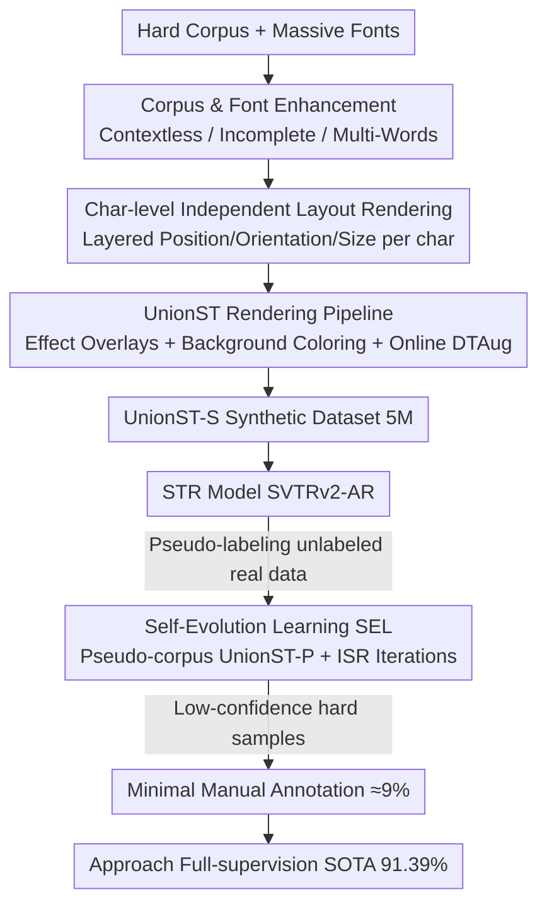

# What's Wrong with Synthetic Data for Scene Text Recognition? A Strong Synthetic Engine with Diverse Simulations and Self-Evolution

**Conference**: CVPR 2026  
**Paper**: [CVF Open Access](https://openaccess.thecvf.com/content/CVPR2026/html/Ye_Whats_Wrong_with_Synthetic_Data_for_Scene_Text_Recognition_A_CVPR_2026_paper.html)  
**Code**: https://github.com/YesianRohn/UnionST  
**Area**: Scene Text Recognition / Synthetic Data Engine  
**Keywords**: Scene Text Recognition, Synthetic Data, Rendering Engine, Pseudo-labeling, Self-evolution Learning

## TL;DR
The authors quantitatively diagnose three major shortcomings of mainstream rendering-based synthetic data: "monotonous corpus, conventional fonts, and flat layouts." They propose the UnionST rendering engine to bridge these dimensions, creating the UnionST-S dataset. Combined with a self-evolution learning framework featuring "pseudo-corpus + iterative self-refinement," the method achieves 83.0% average accuracy on Union14M using only synthetic data and approaches full-supervision SOTA (91.39%) with only 9% real data annotation.

## Background & Motivation

**Background**: Scene Text Recognition (STR) relies heavily on large-scale, class-balanced training text. However, real data collection and annotation are costly, and long-tail distributions are difficult to cover. Synthetic data has become a necessity due to its "inherently perfect labels + extremely low cost." Currently, two main paths exist: traditional rendering (MJ, ST, SynthTIGER, etc., ensuring 100% label accuracy via CPU rendering) and deep generative methods (text editing, Diffusion-based T2I).

**Limitations of Prior Work**: Although generative methods are visually more realistic, "drawing characters does not equal writing them correctly." Empirical tests on ScenePair show that the best TextCtrl editing accuracy is only 84.67%, while Flux.1 Kontext is only 12.81%; mislabeled data directly contaminates recognition models. While rendering methods provide reliable labels, a systematic evaluation of 36M mainstream samples reveals structural gaps: ① The corpus mostly consists of single, semantically rich short words, failing in multi-word or non-semantic scenarios; ② Fonts are standard and easy to recognize, failing on artistic fonts; ③ Layouts are monotonous with uniform character sizes and horizontal alignments, unable to synthesize curved or multi-oriented text.

**Key Challenge**: A massive domain gap exists between synthetic and real data. The root of this gap is not "quantity" (36M samples still underperform 3.2M real samples) but "diversity and compositional coverage of hard samples." Existing engines only handle individual difficulties separately (e.g., CurvedST only for curvature) and have never systematically modeled and freely combined these hard conditions.

**Goal**: (1) Determine if the potential of rendering engines is exhausted and if they can further approach real distributions. (2) Explore if enhanced synthetic data can leverage unlabeled real data for self-evolution to push annotation costs to the minimum.

**Key Insight**: Instead of pursuing "more realistic pixels," the work returns to a data-centric perspective. By decomposing every stage of the rendering pipeline (corpus/font/layout) and supplementing hard dimensions, a single engine can generate the "union of hard conditions."

**Core Idea**: Use a highly controllable rendering engine, UnionST, to combine hard corpora, massive fonts, and character-level free layouts. The generated model is used to provide pseudo-labels for unlabeled real data to drive iterative self-evolution. The strategy is to "rely on synthesis first, then finalize with minimal real annotations."

## Method

### Overall Architecture
The UnionST system consists of two parts. **The first part is the data engine**: samples target text from hard corpora → selects a font supporting all characters → independently calculates position/orientation/size for each character and renders in layers → overlays elastic deformation, perspective, and stroke effects → colors onto backgrounds with shadow/embossment enhancement to output "image + perfect label," batch-producing the 5M UnionST-S dataset. **The second part is Self-Evolution Learning (SEL)**: uses the STR model trained on UnionST-S to generate pseudo-labels for large-scale unlabeled real images. These predicted texts are used as a "pseudo-corpus" to drive the engine to create UnionST-P, which is merged with UnionST-S into UnionST-SP (10M) for retraining. Two rounds of Iterative Self-Refinement (ISR) follow, where each round incorporates only high-confidence pseudo-labels for self-training, leaving only low-confidence hard samples for manual annotation. The recognition model adopts SOTA SVTRv2 with an Auto-Regressive (AR) decoder to better utilize hard samples.

### Key Designs

**1. 3D Diagnosis: Quantifying and Filling the Rendering Gaps**

The authors decompose the rendering pipeline into "Corpus, Font, and Layout" and conduct a systematic check (see the comparison matrix in Tab. 1). Existing engines are mostly blank or partially implemented in these dimensions. UnionST is the first to achieve "complete and controllable" performance across four types of corpus (Common / Contextless / Incomplete / Multi-Words), font scale (113.8K fonts vs. ST's 1.2K), and four types of layout (Curve / Multi-Oriented / Multi-Sized / Salient). Specifically, Contextless uses random characters for license plates/phones; Incomplete randomly deletes characters to simulate occlusion; Multi-Words concatenates phrases and text segments of varying lengths.

**2. Character-level Independent Layout Modeling: Parametric Equations for Complex Layouts**

Traditional engines treat an entire line of text as a rigid body, failing to produce curved or multi-oriented text. UnionST's key change is "char-level layered rendering." For each character $i$ in text $T$, independent position, orientation, and size are defined: $\text{placement}_T = \{(p_i, o_i, s_i) \mid i = 1,\dots,N\}$. Position is given by a quadratic curve plus global rotation:

$$p_i = \begin{bmatrix} \cos\omega & \sin\omega \\ -\sin\omega & \cos\omega \end{bmatrix} \begin{bmatrix} x_i \\ a x_i^2 + b \end{bmatrix}, \qquad o_i = \arctan(2 a x_i) + \omega$$

Curvature parameter $a$ is sampled from $[20, 200]$, and the global rotation angle $\omega$ is uniformly sampled in $[0, 2\pi)$ to produce arbitrary orientations. Vertical text is equivalent to swapping axes. Character size $s_i$ varies with position to naturally create Multi-Sized effects. 

**3. UnionST Rendering Pipeline + Online DTAug**

The engine assembles the components: (a) Sample text and compatible fonts; (b) Layered rendering with placement parameters; (c) Apply elastic deformation, perspective transforms, and strokes; (d) Color based on backgrounds and coloring tables, with shadow/embossment enhancements. During training, an online DTAug (downsampling + transmission distortion) is introduced to simulate small and blurry samples, compensating for low-quality imaging conditions that are difficult to cover with offline rendering. The pipeline runs entirely on CPU, costing only 1/20 of diffusion-based TextSSR and ensuring absolute label correctness.

**4. Self-Evolution Learning (SEL): Reducing Real Annotations to 9%**

**Pseudo-corpus Enhancement**: The model $M_a$ trained on UnionST-S labels unlabeled real data $D_U$ to get $\hat{Y}_U$. These predicted texts are used as "target corpora" to drive the UnionST engine to create UnionST-P (5M). This utilizes the "content distribution" of real data rather than its pixels, avoiding pseudo-label pixel noise. **Iterative Self-Refinement (ISR)**: Starting from $M_0$, each round selects samples from $D_U$ with confidence higher than a threshold $\vartheta$ (e.g., 0.9) as $D_P^{(t)}$ for fine-tuning. High-confidence samples expand the training distribution, while low-confidence samples (usually the true hard samples with the highest marginal value) are reserved for final manual annotation $D_L^{\text{hard}}$. After two rounds of ISR, the model reaches 89.81% on Union14M, which is 2.59% higher than using full real data. Supplementing 9% hard sample annotation narrows the gap to SOTA to within 0.16%.

### Loss & Training
The model uses the SVTRv2 encoder with an Auto-Regressive (AR) attention decoder. While CTC decoding in SVTRv2 is strong, it assumes monotonic alignment, which struggles with highly curved/multi-oriented text. Switching to AR decoding allows for flexible alignment/reordering, fully exploiting the value of hard samples in UnionST.

## Key Experimental Results

### Main Results
Evaluation covers 6 standard benchmarks (Common) and Union14M-Benchmark (comprising Curve/MLO/ART/CTL/SAL/MLW/GEN subsets).

| Training Data | Size | Common AVG | U14M-Bench AVG |
|----------|------|-----------|----------------|
| ST-2D (All 2D Synthetic) | 36.0M | 94.90 | 73.36 |
| TextSSR (Diffusion Synth) | 3.55M | 86.10 | 48.46 |
| **UnionST-S** | 5.0M | 95.32 | **83.00** |
| **UnionST-P** | 5.0M | 96.21 | 84.30 |
| **UnionST-SP** | 10.0M | 96.07 | 84.86 |
| U14M-Filter (Pure Real) | 3.22M | 96.56 | 87.22 |
| UnionST-S + 1%R (32K Real) | 5.0M+32K | 96.44 | 87.26 |
| **UnionST-SP + R** | 10.0M+3.22M | **97.84** | **91.39** |

Key findings: Pure synthetic UnionST-S (5M) is 9.64% higher than 36M ST-2D on U14M-Bench. Adding only 1% real annotation (32K) matches 3.2M full real data.

### Ablation Study
Incremental contribution of engine components (0.5M scale):

| Config | Common AVG | U14M-Bench AVG | Note |
|------|-----------|----------------|------|
| Baseline | 88.30 | 42.26 | Flat layout + standard corpus |
| + Layout | 89.42 | 47.35 | Character-level layout |
| + Layout + Corpus | 90.55 | 63.82 | Hard corpus (largest gain) |
| + Layout + Corpus + Font | 90.60 | 70.60 | Massive fonts |
| + All + DTAug | 90.32 | — | Online degradation |

### Key Findings
- **Hard Corpus contributes most**: U14M-Bench jumped by 16.5%, confirming that "monotonous corpus" is the most critical weakness of rendering data.
- **Font diversity pulls up artistic text**: U14M rose another 6.8%, with the Artistic subset benefiting significantly.
- **Label correctness > Visual realism**: Generative methods suffer from mislabeling which contaminates training. Rendering methods, while less realistic, remain superior due to 100% label accuracy.
- **Quantity ≠ Quality**: Expanding UnionST-S from 5M to 10M yielded minimal gains, indicating the bottleneck is distribution coverage rather than sample count. Utilizing pseudo-corpus for distribution alignment (UnionST-P) is more effective.

## Highlights & Insights
- **Engineering the "domain gap"**: The work translates the vague concept of "synthetic vs. real" into an actionable engineering checklist.
- **Character-level Parametric Layout**: Using a quadratic curve + global rotation uniformly expresses curve/multi-oriented/multi-sized text, which is more elegant than preset templates.
- **Pseudo-labels as "Corpus" rather than "Supervision"**: Driving the engine with real text distributions avoids pixel noise, effectively decoupling content from pixels.
- **Active Selection for Annotation**: ISR identifies high-confidence samples for automatic consumption and targets manual budgets at high-value hard samples, reducing labor by 91%.

## Limitations & Future Work
- The system relies on large-scale unlabeled real data for SEL; gains might decrease in scenarios where real images are also scarce.
- Layout modeling is currently quadratic; more complex arrangements (e.g., circular or 3D perspective text) remain approximations.
- Online enhancements like DTAug and threshold $\vartheta$ require manual tuning and lack adaptive mechanisms.

## Related Work & Insights
- **vs. Rendering (MJ/ST/SynthTIGER/CurvedST)**: Previous works only filled localized gaps. UnionST is the first to simultaneously address corpus, font, and layout dimensions.
- **vs. Generative (TextSSR/AnyText)**: These prioritize pixel realism but sacrifice text correctness. This work proves "Correctness > Realism."
- **vs. Fewer-Labels STR**: This work pushes the boundary to "9% annotation approaching full-supervised SOTA."

## Rating
- Novelty: ⭐⭐⭐⭐ The combination of 3D diagnosis, char-level layout, and pseudo-corpus evolution is very comprehensive.
- Experimental Thoroughness: ⭐⭐⭐⭐⭐ Covers diverse baselines, meticulous ablations, and annotation gradients.
- Writing Quality: ⭐⭐⭐⭐ Problem-driven and logically clear.
- Value: ⭐⭐⭐⭐⭐ High engineering value for increasing the ceiling of synthetic data in STR.

<!-- RELATED:START -->

## Related Papers

- [\[CVPR 2026\] What Is Wrong with Synthetic Data for Scene Text Recognition? A Strong Synthetic Engine with Diverse Simulations and Self-Evolution](what_is_wrong_with_synthetic_data_for_scene_text_recognition_a_strong_synthetic_.md)
- [\[CVPR 2026\] Adaptive Data Augmentation with Multi-armed Bandit: Sample-Efficient Embedding Calibration for Implicit Pattern Recognition](adaptive_data_augmentation_with_multi-armed_bandit_sample-efficient_embedding_ca.md)
- [\[CVPR 2026\] DREAM: Document Recognition with Explicit Adaptive Memory](dream_document_recognition_with_explicit_adaptive_memory.md)
- [\[CVPR 2026\] Confusion-Aware Spectral Regularizer for Long-Tailed Recognition](confusion-aware_spectral_regularizer_for_long-tailed_recognition.md)
- [\[CVPR 2026\] Learning What Helps: Task-Aligned Context Selection for Vision Tasks](learning_what_helps_task-aligned_context_selection_for_vision_tasks.md)

<!-- RELATED:END -->
