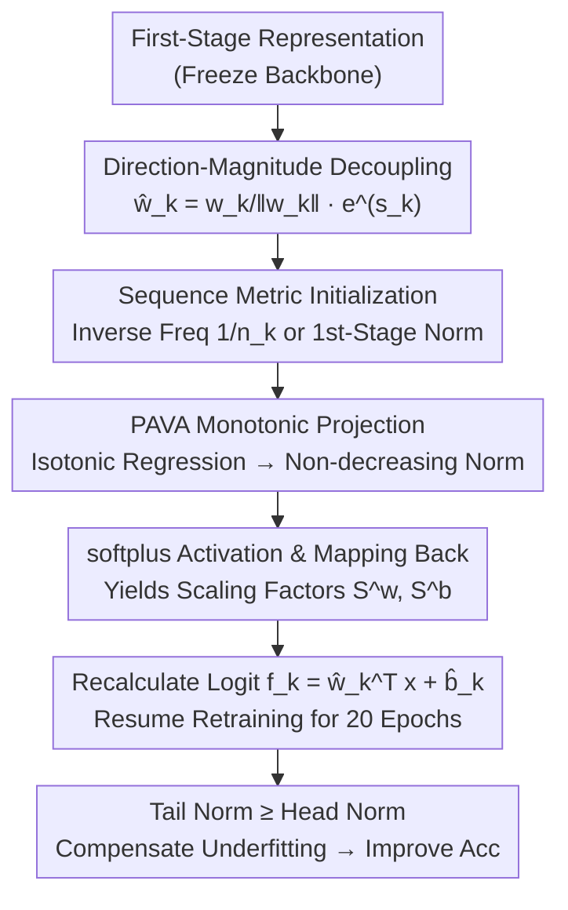

# Why Not Hyperparameter-Friendly Optimisation? A Monotonic Adaptive Norm Rescaling Approach For Long-Tailed Recognition

**Conference**: CVPR 2026  
**Paper**: [CVF Open Access](https://openaccess.thecvf.com/content/CVPR2026/html/Zhang_Why_Not_Hyperparameter-Friendly_Optimisation_A_Monotonic_Adaptive_Norm_Rescaling_Approach_CVPR_2026_paper.html)  
**Code**: https://github.com/Zhangshuojackpot/SAMN  
**Area**: Long-Tailed Recognition / Image Classification / Representation Learning  
**Keywords**: Long-Tailed Recognition, Weight Norm Rescaling, Monotonic Constraint, PAVA Isotonic Regression, Hyperparameter-free

## TL;DR
Addressing the critical pain point that "classifier norm rescaling highly relies on hyperparameters" in long-tailed recognition, this paper proposes SAMN. By using Celera/Pool Adjacent Violators Algorithm (PAVA) to directly enforce a monotonic non-decreasing constraint on class weight norms from head to tail classes, SAMN completely eliminates regularization hyperparameters. It can be integrated in a plug-and-play manner, pushing methods like CE, SLAS, and GLMC to SOTA performance on four long-tailed benchmarks: CIFAR, ImageNet, and iNaturalist.

## Background & Motivation
**Background**: In Long-Tailed Recognition (LTR), the "two-stage decoupling" framework is widely recognized as a strong baseline paradigm: representation learning in the first stage, followed by freezing the backbone and retraining the classifier in the second stage. The core strategy of classifier retraining is **classifier norm rescaling**: since many studies observe that the weight norm of rare classes $\|w_{rare}\|_2$ is significantly smaller than that of head classes $\|w_{head}\|_2$, methods like $\tau$-normalization, weight decay, MaxNorm, and class-balanced regularization are used to compensate for the tail class norms.

**Limitations of Prior Work**: Almost all norm rescaling methods are implemented via **parameter regularization**, which inevitably introduces continuous hyperparameters (e.g., regularization coefficient, margin $\tau$, smoothing coefficient $\epsilon$). LTR is notoriously sensitive to these hyperparameters. The paper provides empirical evidence: changing the hyperparameter of weight decay from 1e-4 to 1 results in a 4.1% accuracy shift; for SLAS, changing hyperparameters results in a 5.6% accuracy variation. This implies that without tedious fine-tuning, these methods quickly degrade, requiring case-by-case retuning across different datasets and imbalance ratios.

**Key Challenge**: ① Practical aspect: the process of "compensating for tail class norms" itself relies on hyperparameters that are highly sensitive, burying effective methods under intensive tuning. ② Theoretical aspect: although the phenomenon of "smaller tail class norms" is widely observed, the explanation is polarized. One school of thought attributes it to **underfitting** (poor representation learning), while another attributes it to **overfitting**. Without resolving this fundamental divergence, the theoretical support for whether and how to scale up tail class norms remains deficient.

**Goal**: (1) To determine whether the tail classes suffer from underfitting or overfitting from a probability distribution perspective, establishing a solid theoretical foundation for norm rescaling; (2) To design a plug-and-play norm rescaling strategy that **eliminates continuous hyperparameters** while reinforcing existing methods.

**Key Insight**: The authors observe that the ultimate goal of "compensating for tail class norms" can be summarized simply as: **making weight norms monotonically increase from head to tail classes**. Since the target is a monotonic sequence, instead of relying on indirect regularization or tuning, one can directly impose a monotonic constraint on the norms. Projecting an arbitrary sequence to the nearest monotonic sequence is precisely the classic **isotonic regression** problem, which can be solved exactly and without hyperparameters using PAVA.

**Core Idea**: Using PAVA to **directly enforce monotonicity** on the weight norms of various classes, replacing "tuning regularization hyperparameters" with "solving a hyperparameter-free isotonic regression", thus yielding the hyperparameter-friendly SAMN.

## Method

### Overall Architecture
SAMN operates during the **second stage (classifier retraining)** of the two-stage decoupled pipeline. After learning representations in the first stage, the weight $w_k$ of each class in the classifier is decoupled into "direction + magnitude" in the second stage. The magnitude is determined by a learnable class-level scalar $s_k^w$ via an exponential function. During training, a **sequence metric** (either inverse class frequency $1/n_k$ or the first-stage learned norms) is used to sort the classes. Then, PAVA projects this sequence of learnable scalars to be monotonic non-decreasing with respect to this order. Finally, these are mapped back to the original class indices to obtain scaling factors, recalculate logits, and resume retraining. There are no continuous hyperparameters requiring fine-tuning in the entire pipeline. The only "choice" is the sequence metric, which acts as a **discrete (categorical) hyperparameter**, and all options yield near-SOTA performance.

### Key Designs

**1. Class-Conditional Distribution Perspective: Diagnosing Long-Tailed Degradation as "Tail Representation Underfitting"**

This serves as the theoretical foundation of the paper and justifies "whether tail class norms should be amplified." Starting from the expanded logit $f_k(\mathbf{x})=\|w_k\|_2\cdot\|\mathbf{x}\|_2\cdot\cos\alpha_k+b_k$, the authors point out that the cumulative gradient magnitude received by weights is approximately proportional to the class frequency $n_k$ (due to more frequent updates). Consequently, both $\|w_k\|_2$ and $b_k$ increase as $n_k$ grows, pushing the decision boundary toward the rare classes. The authors then rewrite the posterior distribution as the class-conditional distribution $p(k|\mathbf{x})\propto \mathcal{D}_x^k(\mathbf{x})\propto e^{f_k(\mathbf{x})}$. A key step shows that if the weight norm of a class is scaled down by a factor of $\alpha$ ($0<\alpha<1$), the implicit class-conditional distribution after normalization becomes:

$$\mathcal{D'}_x^k(\mathbf{x})=\frac{[\mathcal{D}_x^k(\mathbf{x})]^{\alpha}}{\int [\mathcal{D}_x^k(\mathbf{x})]^{\alpha}\,d\mathbf{x}}$$

This is a form of "power-law contraction": the smaller $\alpha$ is (which corresponds to smaller norms for rarer classes), the flatter and more dispersed the distribution becomes, approaching a **uniform distribution** in the extreme case. This implies that the model has learned almost no knowledge from the samples of that class. Therefore, the small tail norm indicates **underfitting (too flat, lacking peakiness) rather than overfitting**. Empirically (Fig. 3), the class-conditional distribution of the head class (e.g., Airplane) is sharp, whereas that of the tail class (e.g., Truck) is flat and scattered on the test set, verifying this hypothesis. The conclusion is solid: given that it is underfitting, one should **amplify the tail norms** for compensation, which justifies the subsequent monotonic constraint.

**2. Direction-Magnitude Decoupling + Exponential Scaling: Translating "Norm Compensation" into a Learnable Scalar Operation**

To apply monotonic constraints, a "clean magnitude variable" is needed. SAMN decouples classifier weights into directions and magnitudes, calculating logits with modified parameters $\hat{w}_k,\hat{b}_k$:

$$\hat{w}_k=\frac{w_k}{\|w_k\|_2}\cdot e^{s_k^w},\qquad \hat{b}_k=e^{s_k^b}+b_k$$

where $s_k^w,s_k^b$ are learnable class-specific scalars. Consequently, the weight direction (semantics) and magnitude (norm size) are completely decoupled, and the monotonic constraint is solely applied to the **positive magnitude** $e^{s_k}$ without disturbing the learned direction. Using an exponential function serves two purposes: ensuring the final norm is strictly positive and greater than 1; and **amplifying the gradients of rare classes** during the second stage, enabling more effective compensation for the tail. This step converts the question of "how to rescale the norm" (which was implicitly governed by regularization terms) into an explicit problem of "how to arrange a sequence of scalars $\{s_k\}$".

**3. PAVA Monotonic Projection: Directly Enforcing Norm Monotonicity via Hyperparameter-free Isotonic Regression**

This is the core mechanism of SAMN to eliminate hyperparameters. The objective is clear: the scaling factors should be monotonically non-decreasing from head to tail classes. The authors formulate this as an **isotonic regression**: given an arbitrary raw sequence of learnable scalars $R=[r_1,\dots,r_n]$, find the closest non-decreasing sequence $S$,

$$\min_{s_1\le s_2\le\cdots\le s_n}\sum_{i=1}^{n}(r_i-s_i)^2$$

which is solved exactly using the **Pool Adjacent Violators Algorithm (PAVA)**—a hyperparameter-free and highly efficient method. Algorithm flow (Algorithm 1): Classes are first sorted according to a sequence metric. The reordered $R$ is projected using PAVA (adjacent blocks violating the monotonic order are "pooled" and averaged until the entire sequence is non-decreasing), passed through a softplus function to ensure positive values, and mapped back to the original class indices via the inverse permutation to yield $S^w, S^b$.

PAVA is chosen over more rigid recursive constructions (e.g., $s_{k+1}=s_k+p_{k+1}^2$) for two reasons: ① **Local plasticity**: recursive construction entangles $s_{k+1}$ with all preceding terms, making the entire sequence overly rigid; in contrast, PAVA's pooling is localized, where each $s_k$ only interacts with adjacent pooled classes, maintaining the learnable flexibility of individual norms under the monotonic constraint. ② **Prior utilization**: PAVA yields an isotonic projection closest in Euclidean distance to the input sequence. Since the initial $R$ is initialized using valuable priors (class frequency or first-stage norms), PAVA preserves this prior as much as possible while enforcing monotonicity. Moreover, PAVA is a **non-expansive operator**. Although it is an "abrupt manual adjustment" to the norms, it does not disrupt convergence—empirically, SAMN's loss curves are as smooth as those of CE/WD (Fig.  2).

**4. Choice of Sequence Metric: Demoting the Sole Remaining "Hyperparameter" to an Easy-to-Set Categorical Option**

PAVA requires a sorting criterion to define the monotonic order. This paper presents two: ① **Inverse Class Frequency** $1/n_k$ (prior analysis shows norms increase with class frequency, so the inverse matches PAVA's non-decreasing output); ② **Inverse of First-Stage Weight Norms**—directly using the norm imbalance learned by the model itself as the sorting criterion, which is more adaptive. The authors honestly acknowledge that the choice of sequence metric counts as a hyperparameter, but it is **discrete/categorical**, making it far easier to choose than continuous hyperparameters in prior art. Ablation studies demonstrate that both metrics yield comparable results, both approaching or surpassing most SOTA performance. Consequently, SAMN remains significantly more hyperparameter-friendly than methods dependent on continuous tuning.

## Key Experimental Results

### Main Results
SAMN as a plug-and-play module applied to three methods (CE, SLAS, GLMC) on CIFAR10-LT / CIFAR100-LT (IF = Imbalance Factor):

| Dataset | IF | Baseline Method | Baseline | +SAMN | Gain |
|---|---|---|---|---|---|
| CIFAR100-LT | 100 | CE | 47.4 | 54.0 | ↑6.6 |
| CIFAR100-LT | 100 | SLAS | 52.7 | 54.1 | ↑1.4 |
| CIFAR100-LT | 100 | GLMC | 56.8 | 57.7 | ↑1.1 |
| CIFAR10-LT | 100 | CE | 80.0 | 84.1 | ↑4.1 |
| CIFAR10-LT | 100 | GLMC | 88.2 | 88.5 | ↑0.3 |

ImageNet-LT / iNaturalist2018 (ResNeXt50, GLMC first stage + SAMN second stage):

| Dataset | Metric | GLMC | GLMC+SAMN |
|--------|------|------|-----------|
| ImageNet-LT | All Acc | 56.3 | **57.7** |
| ImageNet-LT | Medium | 52.4 | 56.1 |
| iNaturalist2018 | All Acc | 72.2 | **72.7** |

GLMC+SAMN achieves the best performance across all testing scenarios. Computational overhead is minimal: ResNet32/CIFAR100 experiences a +12.8% overhead per epoch (3.9s $\rightarrow$ 4.4s); for ResNeXt50/ImageNet, it is only +2.9% (dominated by forward/backward propagation, PAVA overhead is negligible).

### Ablation Study
Ablation on weight vs. bias, and the choice of sequence metric (CIFAR100-LT, IF=100, CE baseline 47.4):

| Configuration | Sequence Metric | Key Metric | Description |
|---|---|---|---|
| Bias only | Class Freq | 50.6 | ↑3.2 over baseline, limited gains from modifying bias |
| Weight only | Class Freq | 53.9 | ↑6.5 over baseline, weight modification is the primary driver |
| Weight + Bias | Class Freq | 54.0 | Modifying both is optimal (additional ~↑0.6) |
| Weight + Bias | 1st-stage Norm | 53.9 | Comparable to class frequency metric |

### Key Findings
- **Modifying Weight > Modifying Bias**: Applying the monotonic constraint on weight norms yields the largest contribution (6.6% improvement for weight vs. 3.2% for bias on CIFAR100 with IF=100); constraining both weight and bias delivers the best performance, prompting the paper to recommend applying both.
- **More Effective Under Higher Imbalance**: The gain from SAMN is positively correlated with the dataset's imbalance factor (IF)—the higher the IF, the larger the improvement. Consistent with this, the performance gain is larger on the more difficult, fine-grained CIFAR100 than on CIFAR10, indicating its proficiency in handling highly imbalanced and challenging distributions.
- **Insensitive to Sequence Metric**: The class frequency and first-stage norm metrics perform comparably overall, with optimal settings split between the two. This demonstrates that SAMN is robust to its sole remaining categorical hyperparameter.
- **Trade-offs**: On ImageNet-LT, the accuracy on "Many" (head classes) drops slightly (70.1 $\rightarrow$ 69.7), but this is outweighed by a more substantial performance boost in Medium/Few classes, leading to an overall net gain. The authors plan to alleviate this slight degradation in head performance using data augmentation in future work.

## Highlights & Insights
- **Translating "Hyperparameter Tuning" into a "Solvable Optimization Problem with an Exact Solution"**: This is the most elegant design choice. The fundamental demand of norm rescaling is achieving a "monotonic sequence." Mapping monotonic projection to isotonic regression via PAVA provides a closed-form, hyperparameter-free solution, eliminating continuous hyperparameters. This paradigm of "reducing engineering parameter-tuning to classical mathematical formulations" is highly transferable to other scenarios requiring order constraints (e.g., ordinal classes, confidence calibration).
- **Resolving the "Underfitting vs. Overfitting" Debate Before Method Formulation**: While many LTR methods rely heavily on heuristic tricks, this work first employs the power-law contraction of class-conditional distributions to demonstrate that "tail classes suffer from underfitting and their norms should be amplified." This provides theoretical legitimacy for "enforcing monotonic amplification" rather than using an ad-hoc construct.
- **Non-expansive Operator Ensuring Convergence**: PAVA might seem like an "abrupt intervention" on weights, but as a non-expansive projection, it does not disrupt SGD convergence, keeping loss curves smooth. This attribute guarantees that "hard constraints" are safe and viable in practice—an insightful engineering detail.
- **Plug-and-play + Near-Zero Overhead**: As a second-stage module, it consistently improves accuracy across CE, SLAS, and GLMC. The computational overhead on large models is <3%, displaying strong engineering friendliness.

## Limitations & Future Work
- **The authors acknowledge**: There is a slight drop in the accuracy of head classes ("Many"), which is a residual effect of the trade-off between head and tail performance. They plan to mitigate this with data augmentation.
- **Dependence on Prior Information for Sequence Metrics**: Both metrics rely on prior information such as class frequency or first-stage norms. How to sort categories when class frequency is unknown or unreliable (e.g., in online/streaming long-tailed settings) warrants further exploration; the paper also admits this counts as a (albeit weak) categorical hyperparameter.
- **Boundaries of Theoretical Assumptions**: The derivation of power-law contraction relies on approximations such as "gradient magnitude $\propto$ class frequency" and "norm growing monotonically with class frequency" (detailed derivation is in Appendix A). Whether these approximations remain robust under strong data augmentation, intense regularization, or non-CE losses has not been fully verified in the main text (⚠️ please refer to the original appendix for exact formula details).
- **Rigidity of the Monotonicity Assumption**: Forcing strict global monotonicity may over-constrain scenarios where "local inversion of mid-frequency classes is optimal." PAVA's local pooling partially mitigates this but does not eliminate it completely.

## Related Work & Insights
- **vs. $\tau$-normalization / cRT [18]**: The cRT series similarly retrains the classifier and adjusts norms in the second stage, but $\tau$-norm depends heavily on the margin hyperparameter $\tau$. SAMN directly imposes monotonic constraints using PAVA, eliminating continuous hyperparameters.
- **vs. WD + MaxNorm [2], Class-Balanced Regularization [42], IWB [10]**: These methods implicitly control norms via parameter regularization, introducing continuous hyperparameters that are extremely sensitive. SAMN shifts norm rescaling from "regularization parameter tuning" to "isotonic projection," represents a paradigm shift toward de-hyperparameterization.
- **vs. SLAS [48] / GLMC [11]**: Since these are stronger loss/consistency methods, SAMN does not compete with them but rather provides a **complementary boost**—incorporating SAMN further enhances both methods. It serves as a general-purpose plugin.
- **vs. *Reframing Long-Tailed Learning via Loss Landscape Geometry* (same conference, self_supervised/)**: Both focus on tail degradation, but the latter approaches it from the perspective of loss landscape geometry (sharp minima) + continual learning with SAM-style optimization. This work, by contrast, diagnoses underfitting via class-conditional distributions and directly constrains classifier norms using PAVA. Their motivations are complementary and can be read contrastively.

## Rating
- Novelty: ⭐⭐⭐⭐ Translating norm rescaling into PAVA isotonic regression and establishing "tail underfitting" using power-law contraction theory is highly novel and self-consistent.
- Experimental Thoroughness: ⭐⭐⭐⭐ Evaluated across four long-tailed benchmarks with three plug-and-play baselines, accompanied by complete hyperparameter sensitivity, computational overhead, and ablation analyses. However, metrics are mostly restricted to classification accuracy.
- Writing Quality: ⭐⭐⭐⭐ Smooth logic spanning theory, methodology, and experiments. Mathematical formulas and algorithms are clear, though some notations require cross-referencing with the appendix.
- Value: ⭐⭐⭐⭐ Removing hyperparameters, displaying plug-and-play capability, and introducing minimal overhead makes it highly practical for deploying long-tailed recognition.

<!-- RELATED:START -->

## Related Papers

- [\[CVPR 2026\] Confusion-Aware Spectral Regularizer for Long-Tailed Recognition](confusion-aware_spectral_regularizer_for_long-tailed_recognition.md)
- [\[CVPR 2026\] DREAM: Document Recognition with Explicit Adaptive Memory](dream_document_recognition_with_explicit_adaptive_memory.md)
- [\[CVPR 2026\] Adaptive Data Augmentation with Multi-armed Bandit: Sample-Efficient Embedding Calibration for Implicit Pattern Recognition](adaptive_data_augmentation_with_multi-armed_bandit_sample-efficient_embedding_ca.md)
- [\[CVPR 2026\] A Difference-in-Difference Approach to Detecting AI-Generated Images](a_difference-in-difference_approach_to_detecting_ai-generated_images.md)
- [\[CVPR 2026\] UniMERNet: A Universal Network for Real-World Mathematical Expression Recognition](unimernet_a_universal_network_for_real-world_mathematical_expression_recognition.md)

<!-- RELATED:END -->
