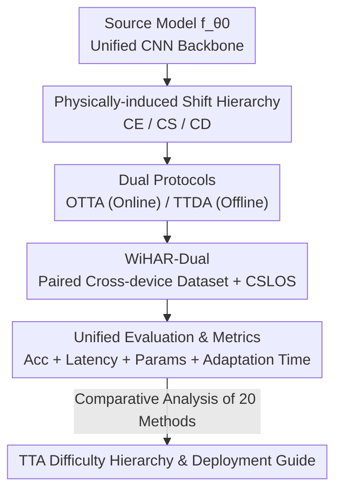

# WiTTA-Bench: Benchmarking Test-Time Adaptation for WiFi Sensing

**Conference**: CVPR 2026  
**Paper**: [CVF Open Access](https://openaccess.thecvf.com/content/CVPR2026/html/Li_WiTTA-Bench_Benchmarking_Test-Time_Adaptation_for_WiFi_Sensing_CVPR_2026_paper.html)  
**Code**: https://github.com/BdLI-group/WiTTABench  
**Area**: WiFi Sensing / Test-Time Adaptation / Benchmark  
**Keywords**: WiFi Sensing, Test-Time Adaptation, Domain Shift, Human Activity Recognition, Cross-Device

## TL;DR
WiTTA-Bench is the first benchmark to systematically evaluate "Test-Time Adaptation (TTA) for WiFi Sensing." It decomposes domain shifts in WiFi Channel State Information (CSI) into three physically-induced categories: cross-environment, cross-subject, and cross-device. Evaluating 20 representative TTA methods under Online TTA (OTTA) and Test-Time Domain Adaptation (TTDA) protocols, while introducing a paired cross-device dataset WiHAR-Dual, the study identifies a difficulty hierarchy of CE < CS < CD and reveals WiFi-specific findings, such as the failure of consistency-based methods that typically excel in computer vision.

## Background & Motivation

**Background**: WiFi sensing enables passive, privacy-preserving Human Activity Recognition (HAR) using commodity routers or network interface cards (NICs), serving as an alternative to cameras in low-light, occluded, or privacy-sensitive scenarios. Recently, CSI-based deep models (e.g., THAT, DeepFi, Person-in-WiFi) have achieved high accuracy under "in-distribution" testing.

**Limitations of Prior Work**: These models suffer from drastic performance drops when rooms, subjects, or NICs change, as minor variations in layout, body shape, or hardware disrupt multipath propagation patterns. Real-world deployments rarely have access to source training data due to privacy and online constraints. Traditional Domain Adaptation (DANN, MMD, MixStyle) requires source data and is thus inapplicable. Test-Time Adaptation (TTA), which performs self-calibration using only unlabeled target samples during inference, is a more realistic solution.

**Key Challenge**: While TTA is mature in computer vision, WiFi domain shifts are fundamentally different—they stem from wireless physical propagation and hardware variance (multipath, attenuation, antenna gain, oscillator drift), resulting in non-stationary, device-dependent distortions rather than texture or style changes. Whether visual TTA empirical knowledge transfers to WiFi remains systematically unverified, and the field lacks a unified evaluation benchmark.

**Goal**: To establish the first WiFi TTA benchmark to answer three questions: What are the dominant modes of WiFi domain shift (RQ1), how do various TTA methods perform under different shifts (RQ2), and what factors influence TTA effectiveness and efficiency (RQ3).

**Key Insight**: The authors argue that WiFi shifts should be organized by "physical source" rather than "data phenomena"—environment, subject, and device each correspond to a class of physical perturbation (propagation path, body kinetics, hardware response), forming a hierarchy of increasing difficulty.

**Core Idea**: Standardize "3 physically-induced shifts × 2 protocols (OTTA/TTDA) × 20 TTA methods × accuracy/efficiency metrics" into a reproducible and extensible testbed, supplemented by the long-missing "clean cross-device" data.

## Method

As a benchmark paper, the "Method" refers to the dataset, evaluation protocols, and benchmark design rather than a specific new model. The work transforms a fragmented research problem (WiFi models failing upon scene change) into a quantifiable pipeline: fixing a common backbone, slicing the target domain into three physical shifts, running 20 TTA methods under two protocols, and scoring them with metrics balancing accuracy and deployment cost.

### Overall Architecture

The input consists of a source-trained lightweight CNN model $f_{\theta_0}$ (4 Conv2d-BN-ReLU-MaxPool blocks, channels [16, 32, 64, 128], with a two-layer MLP head) and unlabeled target domain CSI. The output is an accuracy-efficiency profile of "20 TTA methods × 3 shifts × 2 protocols" along with WiFi-specific insights. The evaluation pipeline is as follows:

The benchmark feeds unlabeled target samples to TTA methods, which must update the model locally $\theta_t = \arg\min_\theta \mathcal{L}_{\text{TTA}}\big(f_\theta(x^{(t)})\big)$ via unsupervised objectives (e.g., entropy minimization, pseudo-label consistency) without revisiting source data $D_S$. This source-free constraint led the authors to exclude methods like DATTA or CARING that require source labels.

### Key Designs

**1. Physically-induced Domain Shift Hierarchy: Decomposing "Failure" into Interpretable CE / CS / CD**

Unlike vision, the authors categorize shifts by physical source. Three categories correspond to specific perturbations: Cross-Environment (CE) involves changes in room geometry and furniture, altering multipath trajectories; Cross-Subject (CS) involves body size and gait style, introducing Doppler shifts and dynamic scattering; Cross-Device (CD) stems from antenna patterns and oscillator drift, causing magnitude scaling and phase offsets. Using PCA/t-SNE visualization and clustering metrics, the authors found these shifts represent increasing destruction in feature space: CE is a "coherent translation" of feature clusters, CS is "manifold restructuring," and CD results in almost "disjoint manifolds." This hierarchy (CE → CS → CD) serves as the backbone of the findings.

**2. OTTA and TTDA Protocols: Covering Both Real-time and Offline Deployment Realities**

OTTA (Online TTA) processes CSI streams in real-time batches with lightweight updates (mostly BN recalibration or entropy minimization), emphasizing low latency and evaluating immediately after each batch. TTDA (Test-Time Domain Adaptation) allows offline fine-tuning on an unlabeled target set for several epochs before frozen inference, suitable for one-time calibration or short offline windows on edge devices. Both are source-free; the distinction lies in "when and how" adaptation occurs.

**3. WiHAR-Dual Paired Cross-Device Dataset: Filling the Gap for "Clean CD" Evaluation**

Cross-device shifts are the most challenging but data-scarce aspect of WiFi sensing. Existing datasets often entangle hardware with environment or subject factors. The authors collected WiHAR-Dual: synchronized recordings under identical environments, subjects, and activities using two heterogeneous NICs—Intel 5300 (802.11n) and Atheros AR9580 (802.11ac dual). This provides a controlled CD benchmark where only the device changes. Combined with the CSLOS dataset, it allows systematic coverage of CE/CS/CD shifts.

**4. Unified Metrics Balancing Accuracy and Deployment Cost**

Since WiFi sensing is often deployed on resource-constrained edge devices, accuracy alone is misleading. The authors include four efficiency metrics: GFLOPs per sample, latency (ms/sample for OTTA), number of updated parameters, and total adaptation time (seconds for TTDA). With 20 methods sharing a backbone, the resulting Accuracy-Latency-Parameter Pareto fronts provide direct deployment guidelines.

## Key Experimental Results

### Main Results: Difficulty Hierarchy Across Shifts

The table below summarizes the best and average accuracy (%) for OTTA/TTDA across shift types (Fig. 4), illustrating the CE < CS < CD trend and TTDA's advantage in heavy shifts:

| Shift Type | OTTA Best | OTTA Avg | TTDA Best | TTDA Avg |
|------------|-----------|----------|-----------|----------|
| Cross-Environment (CE) | 35.2 | 32.2 | 55.6 | 48.4 |
| Cross-Subject (CS) | 35.8 | 33.7 | 38.5 | 37.5 |
| Cross-Device (CD) | 23.0 | 21.5 | 37.0 | 28.7 |

Methods drop significantly on CD. TTDA pushes CE accuracy to 55.6%, far exceeding OTTA, demonstrating the power of offline feature realignment.

### Method Rankings: Protocols on WiHAR-Dual

| Protocol | Best Method | Best Acc | Worst Method | Worst Acc |
|----------|-------------|----------|--------------|-----------|
| OTTA | T3A | 37.9 | CoTTA | 26.2 |
| TTDA | SHOT++ | 74.7 | SFDA-UR | 35.0 |

On CSLOS, the best OTTA is PETAL (34.3) and the worst is CoTTA (24.9). Computationally heavy consistency methods like CoTTA consistently underperform, while lightweight normalization/entropy methods (DUA, EATA, TENT) remain in the top tier.

### Ablation Study: Backbone Generalization

To ensure conclusions are not backbone-dependent, the authors replaced the default CNN with MobileNetV2 and ResNet-10 (average accuracy %):

| Setting | Backbone | Base | TENT | EATA | T3A | SAR |
|---------|----------|------|------|------|-----|-----|
| CE | ResNet-10 | 25.72 | 39.37 | 39.87 | 38.93 | 39.73 |
| CE | MobileNetV2 | 25.10 | 36.60 | 36.90 | 35.30 | 34.70 |
| CD | ResNet-10 | 14.29 | 28.55 | 28.93 | 14.29 | 29.02 |
| CD | MobileNetV2 | 15.60 | 39.30 | 38.50 | 15.40 | 38.80 |

The CE/CS/CD trends are highly consistent, confirming the findings are WiFi-specific rather than backbone-specific.

### Key Findings

- **Counter-intuitive: CE is easier to adapt than CS**, contrary to early domain adaptation literature. CE is a global low-rank "envelope drift," requiring only mean/variance recentering. In contrast, CS involves "manifold restructuring" where target samples intrude into class boundaries, breaking the simple recentering assumption.
- **Domain shift metrics do not predict TTA difficulty**: Spearman correlations between metrics (MMD, entropy) and post-adaptation accuracy are only −0.21 to 0.18. Static geometric metrics fail to capture dynamic factors like optimization stability.
- **Visual experience fails on WiFi**: In CV, consistency-based OTTA (CoTTA) usually beats normalization (TENT), but on WiFi, the opposite is true. Distortions driven by hardware/RF response are not semantic; forcing consistency consumes computation without significant gains.
- **Hyperparameter sensitivity**: Normalization-based OTTA (TENT, DUA) is robust across learning rates, whereas clustering-based TTDA (ASFA) shows sharp, high-gain peaks—deviating slightly leads to performance collapse due to pseudo-label feedback loops.
- **Efficiency Profile**: OTTA maintains ~34-35% accuracy with <10ms latency. TTDA trades 80-500s of adaptation for 45-60% accuracy, with SHOT++ reaching the highest peaks (~57%).

## Highlights & Insights

- **Physics as a first-class citizen**: Categorizing CE/CS/CD by physical source rather than data phenomena provides a mechanistic explanation for why CD is hardest (device = entirely new manifold).
- **WiHAR-Dual's controlled pairing**: Synchronized recording with heterogeneous hardware is the key to isolating device shifts, a resource previously missing in the community.
- **Deployment Roadmap**: A direct guide for practitioners: use low-latency OTTA for light shifts (CE/CS) and offline TTDA for heavy shifts (CD).
- **Breaking Cross-Modal Intuition**: The discovery that "CV-proven" consistency methods are inefficient for WiFi warns against blindly porting visual TTA to the wireless domain.

## Limitations & Future Work

- **Task limited to HAR**: The benchmark currently ignores other WiFi tasks like localization or gesture recognition.
- **No new method proposed**: WiTTA-Bench identifies that "physically-induced shifts need physics-aware TTA" but doesn't provide a specific algorithm; CD remains an open challenge (~37% max accuracy).
- **Predictive metric gap**: No alternative to static metrics was proposed to predict TTA success before deployment.
- **Scale and Diversity**: WiHAR-Dual is limited to two NICs and a dozen subjects; broader hardware validation is needed.

## Related Work & Insights

- **vs. Visual TTA Benchmarks**: While CV benchmarks focus on texture/corruptions where consistency methods win, WiTTA-Bench shows that physical shifts on WiFi favor normalization/entropy methods.
- **vs. WiFi Adaptation (DATTA, CARING)**: These require source labels or domain supervision; WiTTA-Bench maintains a strict source-free setup, providing the first fair horizontal comparison.
- **Insight**: The methodology of hierarchy-by-physical-source and inclusion of efficiency rankings is applicable to other sensing tasks like radar or acoustics.

## Rating
- Novelty: ⭐⭐⭐⭐ First WiFi TTA benchmark + paired cross-device dataset.
- Experimental Thoroughness: ⭐⭐⭐⭐⭐ Extensive analysis across 20 methods, backbone generalization, and efficiency Pareto fronts.
- Writing Quality: ⭐⭐⭐⭐ Clear structure with mechanistic explanations.
- Value: ⭐⭐⭐⭐⭐ Establishes a reproducible standard and provides essential deployment guidelines for the WiFi sensing community.

<!-- RELATED:START -->

## Related Papers

- [\[CVPR 2026\] Neural Collapse in Test-Time Adaptation](neural_collapse_in_test-time_adaptation.md)
- [\[CVPR 2026\] Towards Stable Federated Continual Test-Time Adaptation in Wild World](towards_stable_federated_continual_test-time_adaptation_in_wild_world.md)
- [\[CVPR 2026\] Back to Source: Open-Set Continual Test-Time Adaptation via Domain Compensation](back_to_source_open-set_continual_test-time_adaptation_via_domain_compensation.md)
- [\[CVPR 2026\] Curvature-Aware Zeroth-Order Optimization for Memory-Efficient Test-Time Adaptation](curvature-aware_zeroth-order_optimization_for_memory-efficient_test-time_adaptat.md)
- [\[CVPR 2026\] Dance Across Shifts: Forward-Facilitation Continual Test-Time Adaptation through Dynamic Style Bridging](dance_across_shifts_forward-facilitation_continual_test-time_adaptation_through_.md)

<!-- RELATED:END -->
