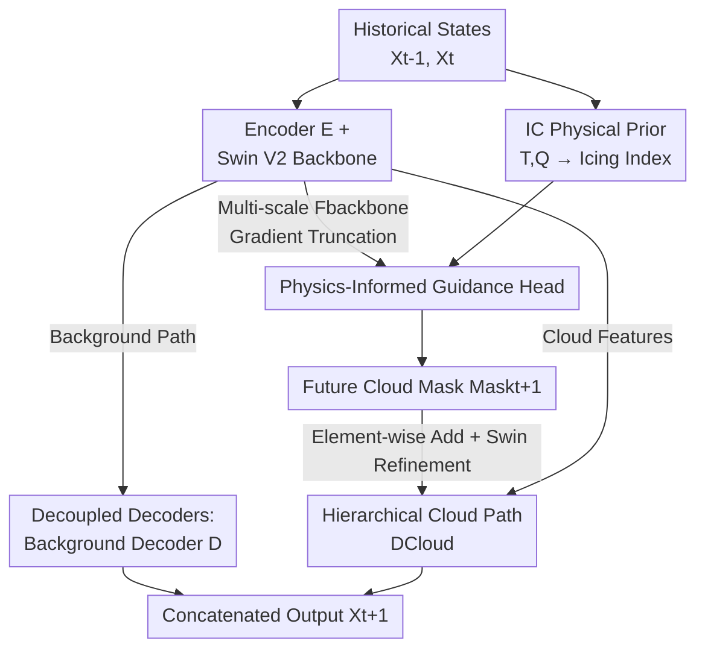

# AviaSafe: A Physics-Informed Data-Driven Model for Aviation Safety-Critical Cloud Forecasts

**Conference**: CVPR 2026  
**Paper**: [CVF Open Access](https://openaccess.thecvf.com/content/CVPR2026/html/Zhu_AviaSafe_A_Physics-Informed_Data-Driven_Model_for_Aviation_Safety-Critical_Cloud_Forecasts_CVPR_2026_paper.html)  
**Code**: None  
**Area**: Physics-Informed Neural Networks / Meteorological Forecasting / Spatiotemporal Prediction  
**Keywords**: PINN, Cloud Microphysics Forecasting, Aviation Safety, Hierarchical Architecture, Icing Condition Index

## TL;DR
AviaSafe embeds the "localization before quantification" hierarchical strategy and the long-validated "Icing Condition (IC) index" into a Swin Transformer backbone. It achieves the first global, 6-hourly, phase-separable (ice/liquid/rain/snow) cloud microphysics forecast, outperforming the FuXi baseline on 93.7% of variable-lead time combinations and matching or exceeding the operational NWP ECMWF HRES on key background variables up to a 7-day lead time.

## Background & Motivation
**Background**: AI weather forecasting models like GraphCast, Pangu-Weather, and FuXi have achieved computational speeds thousands of times faster than traditional Numerical Weather Prediction (NWP) while matching or exceeding their accuracy. However, these models target large-scale atmospheric variables such as geopotential, temperature, wind, and specific humidity, which are **spatially smooth and continuous**.

**Limitations of Prior Work**: Aviation safety is critically concerned with cloud **phase**. High Ice Water Content (HIWC) clouds cause explosive icing of supercooled water droplets on engines, leading to power loss or flameouts; approximately 11%–30% of global aviation accidents are weather-related. Existing AI models only forecast aggregate moisture metrics like "Total Cloud Water," treating all condensate as a single identity and failing to distinguish between ice and liquid phases. While traditional NWP can simulate phases using explicit microphysical equations, it is computationally expensive and tends to **convert liquid water to ice prematurely** under sub-zero conditions, systematically underestimating liquid water content and missing icing risks.

**Key Challenge**: The four cloud microphysical variables (CIWC, CLWC, CRWC, CSWC) are **sparse, intermittent, and heavy-tailed** fields; most grid points are zero, with extreme values occurring in localized areas. Using uniform regression networks designed for smooth variables results in either smoothing out sparse occurrences or generating artifacts in clear-sky regions. Furthermore, pure data-driven training lacks physical constraints, potentially producing states that violate thermodynamics.

**Goal**: To directly forecast four phase-separable cloud microphysical variables with global coverage, 6-hour intervals, and up to 7-day lead times, ensuring physical consistency and serviceability for flight route planning while maintaining AI efficiency.

**Key Insight**: The authors observe that cloud formation is a "two-step" process: specific atmospheric conditions must be met for a cloud to appear, after which its intensity is determined by local thermodynamic processes. Mapping this physical fact into the network architecture avoids burdening a single regressor with two statistically distinct tasks: "determining cloud presence" and "calculating cloud density."

**Core Idea**: A "localization before quantification" hierarchical architecture is employed. The **Icing Condition (IC) index**, empirically validated in aviation meteorology for decades, is injected as a parameter-free physical prior into the mask prediction branch, allowing the network to focus on regressing cloud intensity within physically plausible regions.

## Method
AviaSafe formalizes weather forecasting as a sequence-to-sequence problem: given two historical atmospheric states $(X_{t-1}, X_t)$, it predicts the next state $\hat{X}_{t+1}$ and applies autoregressive iteration for multi-step forecasting. The core innovation lies in decoupling the forecast into two sub-tasks: **Localization (where clouds are)** + **Quantification (how dense clouds are)**, supported by physical formulas.

### Overall Architecture
Data is sourced from ERA5 reanalysis on a 1°×1° global grid (181×360), comprising 9 variables across 13 pressure levels (117 channels). Variables are split into **Cloud Microphysical Variables** (CIWC/CLWC/CRWC/CSWC) for direct prediction and **Background Variables** (Geopotential Z, Temperature T, Specific Humidity Q, U-wind, V-wind) providing the dynamic-thermodynamic environment.

The model consists of two collaborative modules: the **Forecasting Backbone** and the **Physics-Informed Guidance Head**. Inputs are processed through an encoder $E$ and Swin Transformer V2 blocks to extract multi-scale spatially-temporal features. The backbone sends features to **decoupled decoders** for background and cloud variables while also passing multi-scale features $F_{backbone}$ (with **gradient truncation**) to the guidance head. The guidance head uses a formula-based IC Block to calculate "potential icing zone" masks, which, combined with diagnostic masks and $F_{backbone}$, are fed into a Mask Predictor to predict $Mask_{t+1}$. This mask is refined and injected into the cloud prediction path via element-wise addition to the backbone features before final output by $D_{Cloud}$.

### Key Designs

**1. Hierarchical "Localization then Quantification" + Decoupled Decoders**

This design specifically targets the issue that sparse intermittent fields cannot be effectively fitted using smooth regressors. Traditional networks regress all variables simultaneously, but since cloud variables are mostly zero, uniform regressors are dominated by zero values and smooth out active regions. AviaSafe splits cloud forecasting into two layers: the guidance head predicts **where clouds will appear** (a binary mask $Mask_{t+1}$, essentially a segmentation task), and the cloud decoder **regresses intensity** only in those regions. This mirrors physical reality: cloud occurrence depends on large-scale atmospheric conditions, while intensity depends on local thermodynamics.

The **Decoupled Decoders** complement this: smooth background variables (Z/T/Q/U/V) use a direct decoder $D$, while sparse cloud variables use the mask-guided decoder $D_{Cloud}$, each optimized for their respective statistical properties. Ablations show that this task decoupling alone (w/o (MP, IC)) outperforms FuXi on 8 out of 9 variables.

**2. IC Physical Prior: Parameter-free Icing Index**

Purely data-driven mask prediction is prone to noise injection. The authors introduce the **Icing Condition (IC) index**, a **deterministic formula without learnable parameters** that maps temperature, pressure, and humidity to indicators of whether supercooled water can exist or ice crystals can grow explosively.

Specifically, the IC value for each pressure level $k$ is the product of a humidity factor and a temperature factor $IC_k = f_Q \cdot f_T$. The humidity factor is calculated from specific humidity $Q$, temperature $T$, and pressure $p$:

$$f_Q(Q_k, T_k, p_k) = 2.0 \times \left( \frac{p_k \cdot Q_k}{\varepsilon \cdot e_s(T_{C,k})} - 0.5 \right)$$

where $\varepsilon = 0.622$ is a physical constant and $e_s$ is the saturated vapor pressure calculated via the August-Roche-Magnus formula $e_s(T_C) = 6.1094 \times \exp\!\left(\frac{17.625\,T_C}{T_C + 243.04}\right)$, with $T_C = T - 273.15$. The temperature factor is $f_T(T_{C,k}) = T_{C,k} \cdot \frac{T_{C,k} + 14.0}{-49.0}$, a parabolic weight sensitive to supercooled water temperature ranges. Injecting the IC index as a 13-channel "potential cloud growth zone" mask provides a physically credible guidance signal.

**3. Physics-Informed Mask Prediction Head**

The guidance head determines future cloud presence by concatenating two inputs: **65 channels of hybrid physical features**—consisting of (1) **Diagnostic Masks** $Mask_{cloud}$ (52-channel binary maps from thresholding input cloud variables) and (2) **Potential Masks** $Mask_{ic}$ (13-channel IC index)—and multi-scale features $F_{backbone}$ from the backbone.

A key engineering detail is that $F_{backbone}$ is **detached from the backward gradient flow** before entering the guidance head. This allows the head to leverage rich hierarchical semantics without polluting the regressor's parameters with segmentation gradients. The combined features pass through a Mask Predictor (MLP followed by a Swin block for long-range spatial dependencies) and a deconvolutional layer for full-resolution recovery of $Mask_{t+1}$.

### Loss & Training
The model is trained end-to-end with a weighted sum of the primary forecast loss and the auxiliary mask loss. The primary loss is the **latitude-weighted Charbonnier L1 loss**:

$$\mathcal{L}_{\text{forecast}} = \frac{1}{N} \sum_{i=1}^{N} \alpha_i \sqrt{(\hat{X}_i - X_i)^2 + \epsilon^2}$$

where $\alpha_i$ handles grid area differences across latitudes. For mask prediction, **Focal Loss** is used to address extreme pixel sparsity and class imbalance: $\mathcal{L}_{\text{guide}} = \frac{1}{M}\sum_j [-\alpha_t(1-p_{t,j})^\gamma \log(p_{t,j})]$, with $\gamma = 1.5$ and $\alpha_t = 0.25$. Total loss $\mathcal{L}_{\text{total}} = \mathcal{L}_{\text{forecast}} + \lambda \mathcal{L}_{\text{guide}}$, where $\lambda = 1$. Training used 2 A100 GPUs, 32k iterations, batch size 8, and AdamW optimizer with cosine annealing.

## Key Experimental Results

### Main Results
The baseline is a reproduced FuXi (20 Swin V2 blocks), compared against operational ECMWF HRES. Key conclusion: AviaSafe outperforms FuXi on **93.7%** of variable-lead time combinations in terms of Normalized RMSE (NRMSE). For background variables, >92% of forecast steps show negative NRMSE (improvement). For cloud variables, CRWC and CLWC outpace the baseline in 85.7% and 89.3% of steps, respectively. The advantage for CIWC is particularly pronounced at long lead times, where the gap increases over time, showing sustained improvement up to 15 days.

| Comparison | Variables/Lead Time | AviaSafe Performance | Description |
|------|-----------|---------------|------|
| vs FuXi Baseline | All variables x 7 days | 93.7% combinations better NRMSE | Overall superiority |
| vs FuXi Baseline | Background Z/T/U/V/Q | >92% forecast steps better | Gain in smooth fields |
| vs FuXi Baseline | CIWC 3–7 days | Significant and growing gain | No decay at long lead times |
| vs ECMWF HRES | Q500/T500 7 days | Comparable to superior | Matches operational NWP |

### Ablation Study
Table reporting 5-day average RMSE (lower is better):

| Configuration | CIWC50 (×10⁻⁸) | CLWC100 (×10⁻⁸) | CRWC250 (×10⁻⁸) | Z500 | Description |
|------|------|------|------|------|------|
| Baseline (FuXi) | 1.059 | 1.318 | 1.010 | 139.52 | Single Regressor |
| w/o (MP, IC) | 1.012 | 0.892 | 0.889 | 138.95 | Decoupled Decoders Only |
| w/o IC | 1.053 | 0.968 | 0.961 | 137.23 | Mask Pred without Prior |
| **Ours** | **0.956** | **0.875** | **0.863** | **135.81** | Full Model |

### Key Findings
- **Task Decoupling contributes most**: Simply separating the decoders (w/o (MP, IC)) outperformed the baseline on 8 of 9 variables, proving that "one regressor should not handle both smooth and sparse fields."
- **Masks without physical priors can be detrimental**: The w/o IC variant improved background variables but **increased error** in cloud variables (CIWC50 rose from 1.012 to 1.053), indicating unconstrained masks inject noise. The IC prior stabilizes the mask.
- **Physical Interpretability**: Using the Conditional Non-linear Optimal Perturbation (CNOP) framework, the model identified the high-pressure ridge over the Arabian Peninsula as a key precursor signal for a January 2024 HIWC event. Counterfactual experiments further demonstrated phase-dependent behavior consistent with thermodynamics.

## Highlights & Insights
- **Hierarchical structure over post-processing**: Instead of post-processing, AviaSafe addresses sparse field forecasting via architectural decoupling (segmentation + regression), aligning with the physical distinction between cloud occurrence and intensity.
- **Efficient Domain Knowledge Injection**: The IC index is a zero-parameter formula that transforms a noisy mask into a valid spatial prior. This paradigm of "using empirical formulas as input channels" is highly transferable.
- **Gradient Truncation for Isolation**: Detaching $F_{backbone}$ ensures that the auxiliary segmentation task does not contaminate the backbone's regression focus, a clean multi-task learning implementation.
- **Sustained Long-term Advantage**: Unlike most models where error accumulates linearly, AviaSafe's relative advantage for CIWC grows at longer lead times, suggesting physical constraints inhibit error accumulation.

## Limitations & Future Work
- **Ours** utilizes a coarse spatiotemporal resolution (1°, 6 hours). Higher resolution and longer durations are required.
- **Direct NWP Comparison Gap**: Due to the unavailability of HRES cloud products during the test period, cloud variables were only compared against the FuXi baseline, lacking direct evidence of superiority over NWP ⚠️.
- **Empirical Fitting**: The IC index relies on constants (e.g., -49.0, +14.0) derived from specific aviation observations. Sensitivity analysis across diverse climate zones is needed.

## Related Work & Insights
- **vs GraphCast/FuXi**: These models forecast aggregate variables (Total Precipitation, Specific Humidity). AviaSafe provides phase-separable forecasts by specifically addressing sparse intermittent fields.
- **vs ECMWF HRES**: NWP is computationally expensive and systematically underestimates cloud liquid water due to premature glaciation. AviaSafe maintains efficiency while recovering phase information via the IC prior.
- **vs ODE-net Hybrids**: Unlike methods embedding complex ODEs that may sacrifice general performance, AviaSafe injects a lightweight, aviation-validated empirical index (IC) to solve the specific vertical problem of cloud phase.

## Rating
- **Novelty**: ⭐⭐⭐⭐ First global, 6-hourly, phase-separable cloud microphysics forecast.
- **Experimental Thoroughness**: ⭐⭐⭐⭐ Solid main results and ablations, though the lack of direct HRES cloud comparison is a limitation.
- **Writing Quality**: ⭐⭐⭐⭐ Clear motivation, complete physical formulas, and helpful architectural diagrams.
- **Value**: ⭐⭐⭐⭐ Highly applicable to aviation risk assessment and route optimization.

<!-- RELATED:START -->

## Related Papers

- [\[NeurIPS 2025\] Physics-Informed Neural Networks with Fourier Features and Attention-Driven Decoding](../../NeurIPS2025/physics/physics-informed_neural_networks_with_fourier_features_and_attention-driven_deco.md)
- [\[ICLR 2026\] FM4NPP: A Scaling Foundation Model for Nuclear and Particle Physics](../../ICLR2026/physics/fm4npp_a_scaling_foundation_model_for_nuclear_and_particle_physics.md)
- [\[ICLR 2026\] Iterative Training of Physics-Informed Neural Networks with Fourier-enhanced Features](../../ICLR2026/physics/iterative_training_of_physics-informed_neural_networks_with_fourier-enhanced_fea.md)
- [\[AAAI 2026\] Towards a Foundation Model for Partial Differential Equations Across Physics Domains](../../AAAI2026/physics/towards_a_foundation_model_for_partial_differential_equations_across_physics_dom.md)
- [\[ICLR 2026\] Uncertainty-Aware Diagnostics for Physics-Informed Machine Learning](../../ICLR2026/physics/uncertainty-aware_diagnostics_for_physics-informed_machine_learning.md)

<!-- RELATED:END -->
