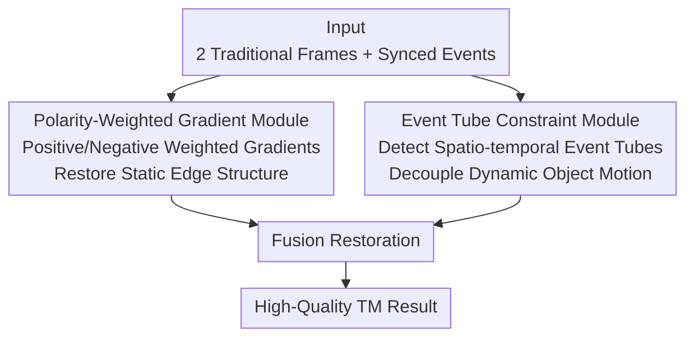

# EHETM: High-Quality and Efficient Turbulence Mitigation with Events

**Conference**: CVPR 2026  
**arXiv**: [2603.20708](https://arxiv.org/abs/2603.20708)  
**Code**: [https://github.com/Xavier667/EHETM](https://github.com/Xavier667/EHETM)  
**Area**: Scientific Computing / Event Camera  
**Keywords**: Atmospheric Turbulence Mitigation, Event Camera, Polarity-Weighted Gradient, Event Tube Constraint, Motion Decoupling

## TL;DR
EHETM is proposed as the first method to leverage the microsecond temporal resolution of event cameras to break the accuracy-efficiency bottleneck of traditional multi-frame Turbulence Mitigation (TM). By discovering two key physical phenomena—the correlation between polarity alternation of turbulence-induced events and sharp gradients, and the formation of spatio-temporally coherent "event tubes" by dynamic objects—the authors design the Polarity-Weighted Gradient and Event Tube Constraint modules. EHETM reduces data overhead by 77.3% and system latency by 89.5%, significantly surpassing SOTA methods, especially in dynamic scenes.

## Background & Motivation

**Background**: Atmospheric or thermal turbulence is a primary source of degradation in long-range imaging, introducing geometric tilt and spatially varying blur caused by random refractive index fluctuations. Existing methods (e.g., DATUM) rely on multi-frame sequences from conventional cameras to capture stable patterns.

**Limitations of Prior Work**: Multi-frame methods face a **fundamental accuracy-efficiency trade-off**—more frames result in better restoration but increase system latency and data overhead. Furthermore, when **dynamic objects** are present, multi-frame methods struggle to distinguish between turbulence jitter and actual object motion.

**Key Challenge**: Turbulence mitigation requires high temporal redundancy to average out random jitter, but the frame rate of conventional cameras limits the amount of information obtainable within a reasonable latency.

**Key Insight**: Event cameras record brightness changes asynchronously with microsecond temporal resolution. The motion information contained in the events within a single frame's duration far exceeds that of traditional frames, allowing high-quality restoration with very few frames.

**Core Idea**: Two physical phenomena are identified as restoration priors: (1) Polarity alternation of turbulence events correlates with image gradients $\rightarrow$ scene structural cues; (2) Dynamic objects form coherent "tube-like" structures in the event stream $\rightarrow$ motion priors.

## Method

### Overall Architecture
EHETM aims to eliminate random turbulence jitter in long-range imaging without the need for dozens of traditional frames. It pairs one or two conventional frames with a synchronized event stream. The microsecond-level asynchronous brightness records contain dense motion information. The pipeline uses a "branch-and-merge" structure: the input is processed by two complementary modules. The Polarity-Weighted Gradient module extracts sharp structural cues from events to restore edge textures, while the Event Tube Constraint module monitors moving objects to decouple their true motion from turbulence jitter. Finally, a fusion layer produces high-quality restoration. This is supported by a newly collected real-world event-frame turbulence dataset for training and evaluation.

### Key Designs

**1. Polarity-Weighted Gradient Module: Events as Free Structural Cues**

Traditional methods require multi-frame averaging to recover sharp edges, failing when frames are scarce. The authors observe that turbulence-induced brightness changes are concentrated at the gradients (edges, textures) of a sharp image and generate alternating positive and negative events. This effectively "traces" the scene's edge structure. Instead of blind pixel averaging, this module weights gradient estimation using event polarities—positive events indicate gradients in the positive direction and negative events in the negative direction. This prior allows EHETM to recover structural information using only 2 frames that previously required a 50-frame baseline.

**2. Event Tube Constraint Module: Decoupling Object Motion from Turbulence**

This module addresses the fatal "static scene assumption" of traditional multi-frame TM. In dynamic scenes, moving objects like cars or pedestrians have their true displacement "averaged out" as turbulence jitter, causing severe artifacts. The authors discover that continuous object motion forms a coherent "event tube" in the spatio-temporal event stream, whereas turbulence events appear as random, irregular points. The module detects these tubes to extract object trajectories and subtracts this motion from the total observed displacement, leaving pure turbulence components for restoration. Thus, moving objects are no longer distorted by the turbulence model.

**3. Real-World Event-Frame Turbulence Dataset**

Existing turbulence datasets lack synchronized event data. The authors collected two paired event-frame datasets: one for long-range outdoor atmospheric turbulence and one for thermal turbulence near heat sources, covering both static and dynamic scenes. This dataset validates the physical universality of the "polarity alternation" and "event tube" phenomena across different turbulence types.

### Loss & Training
The training objective combines pixel-level reconstruction loss, perceptual loss, and a polarity consistency constraint, ensuring that the gradient direction of the restored result aligns with the structural cues provided by event polarities.

## Key Experimental Results

### Main Results (Comparison with Multi-frame TM)

| Method | Frames | PSNR↑ | SSIM↑ | Latency | Data Volume |
|------|------|-------|-------|------|--------|
| DATUM (50 frames) | 50 | Baseline | Baseline | 100% | 100% |
| DATUM (10 frames) | 10 | Decrease | Decrease | ~20% | ~20% |
| **EHETM (2 frames + Event)** | **2** | **SOTA** | **SOTA** | **10.5%** | **22.7%** |

### Dynamic Scene Comparison

| Method | Static Scene | Dynamic Scene (w/ Moving Objects) | Description |
|------|---------|-------------------|------|
| DATUM | Good | Severe Artifacts | Cannot distinguish motion from turbulence |
| **EHETM** | **SOTA** | **Significant Gain** | Event tube constraint effectively decouples |

### Ablation Study

| Configuration | PSNR | Description |
|------|------|------|
| Traditional Frames Only (Baseline) | Baseline | Poor quality with few frames |
| + Polarity-Weighted Gradient | + Large Increase | Structural cues from events |
| + Event Tube Constraint | + Further Increase | Dynamic object decoupling |
| **Full EHETM** | **Best** | Complementary modules |

### Efficiency Comparison

| Metric | EHETM vs DATUM |
|------|:---:|
| Data Overhead Reduction | **77.3%** |
| System Latency Reduction | **89.5%** |

### Key Findings
- EHETM surpasses DATUM using 50 frames while only utilizing 2 frames and events, fully exploiting the temporal resolution of event cameras.
- EHETM shows the greatest advantage in dynamic scenes where traditional methods fail completely.
- The polarity alternation phenomenon holds for both atmospheric and thermal turbulence, indicating physical universality.
- Significant reductions in data efficiency and system latency enable real-time long-range imaging.

## Highlights & Insights
- **First Systematic Application of Event Cameras in TM**: Opens a new direction for scientific imaging in event vision. The microsecond resolution of event cameras perfectly matches the random high-frequency nature of turbulence.
- **Discovery of Two Physical Phenomena**: (1) Polarity alternation-gradient correlation and (2) Spatio-temporal coherence of event tubes. These provide essential physical priors for restoration.
- **Breakthrough in Dynamic Scenes**: The "static scene assumption" of traditional TM is overcome. The event tube constraint provides an elegant solution for the "moving objects in turbulence" problem.
- **Qualitative Efficiency Leap**: A 77% data reduction and 89% latency reduction represent an order-of-magnitude change, making real-time turbulence mitigation feasible.

## Limitations & Future Work
- High hardware cost of event cameras limits practical deployment.
- Event tube detection currently assumes rigid body motion; non-rigid motion (e.g., fluids, deforming objects) remains an area for exploration.
- Robustness under extreme turbulence conditions (e.g., strong convection) has not been fully evaluated.
- Performance characteristics of event cameras in low light or extreme HDR may affect results.
- Potential integration of event-based TM with adaptive optics.

## Related Work & Insights
- **vs. DATUM/TurbNet**: These rely on many frames, leading to high latency and failure in dynamic scenes. EHETM fundamentally changes information acquisition via event cameras.
- **vs. Adaptive Optics**: Hardware solutions are more costly and complex. EHETM serves as a lightweight computational alternative.
- **vs. Other Event Apps (Optical Flow/Deblur)**: TM is a new application area where turbulence randomness and high temporal resolution are naturally complementary.

## Rating
- Novelty: ⭐⭐⭐⭐⭐ Entirely new event-driven TM paradigm + physical discovery.
- Experimental Thoroughness: ⭐⭐⭐⭐ Real-world dataset construction + comprehensive quantitative/qualitative comparison.
- Writing Quality: ⭐⭐⭐⭐ Clear description of physical phenomena backed by physical intuition.
- Value: ⭐⭐⭐⭐⭐ Significant contributions to both long-range imaging and event vision.

<!-- RELATED:START -->

## Related Papers

- [\[CVPR 2025\] Learning Phase Distortion with Selective State Space Models for Video Turbulence Mitigation](../../CVPR2025/physics/learning_phase_distortion_with_selective_state_space_models_for_video_turbulence.md)
- [\[CVPR 2026\] Continuous Exposure-Time Modeling for Realistic Atmospheric Turbulence Synthesis](continuous_exposure-time_modeling_for_realistic_atmospheric_turbulence_synthesis.md)
- [\[ICLR 2026\] DGNet: Discrete Green Networks for Data-Efficient Learning of Spatiotemporal PDEs](../../ICLR2026/physics/dgnet_discrete_green_networks_for_data-efficient_learning_of_spatiotemporal_pdes.md)
- [\[ICML 2026\] Unbiased and Second-Order-Free Training for High-Dimensional PDEs](../../ICML2026/physics/unbiased_and_second-order-free_training_for_high-dimensional_pdes.md)
- [\[ICML 2026\] Iterative Refinement Neural Operators are Learned Fixed-Point Solvers: A Principled Approach to Spectral Bias Mitigation](../../ICML2026/physics/iterative_refinement_neural_operators_are_learned_fixed-point_solvers_a_principl.md)

<!-- RELATED:END -->
