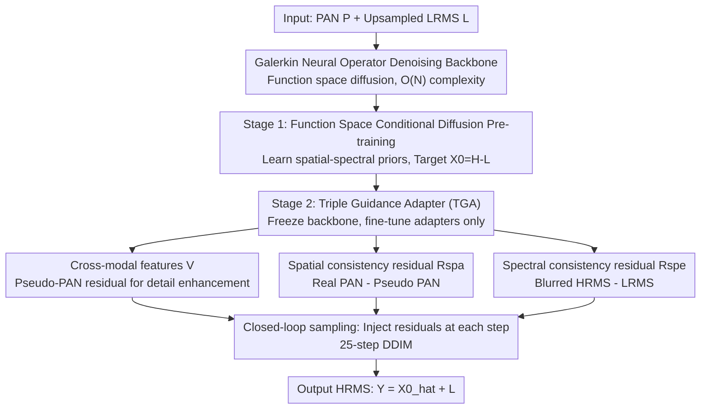

# Spatial-Spectral Residuals Informed Diffusion Neural Operator for Pan-sharpening

**Conference**: CVPR 2026  
**Paper**: [CVF Open Access](https://openaccess.thecvf.com/content/CVPR2026/html/Huang_Spatial-Spectral_Residuals_Informed_Diffusion_Neural_Operator_for_Pan-sharpening_CVPR_2026_paper.html)  
**Code**: Available (The paper states code is available, link to be confirmed)  
**Area**: Remote Sensing Image Fusion / Diffusion Models / Neural Operators  
**Keywords**: Pan-sharpening, Neural Operator, Function Space Diffusion, Spatial-Spectral Residuals, Galerkin Attention

## TL;DR
SRINO replaces the attention-based denoising backbone of diffusion models for pan-sharpening with a Galerkin-type Neural Operator (transferring the generation process to a continuous function space to significantly save FLOPs and memory). It treats pixel-level spatial/spectral consistency residuals directly as conditions fed into each step of the reverse sampling process for closed-loop guidance. On WV3/GF2/QB datasets, it outperforms current SOTA methods while being several times more computationally efficient than attention-based diffusion models.

## Background & Motivation
**Background**: Pan-sharpening aims to fuse a high-resolution panchromatic (PAN) image (rich in texture but single-band) with a low-resolution multispectral (LRMS) image (rich in spectral information) into a high-resolution multispectral (HRMS) image. It is a fundamental preprocessing step in remote sensing. Methods have evolved from traditional Component Substitution (CS), Multi-Resolution Analysis (MRA), and Variational Optimization (VO) to deep learning. Recently, generative diffusion models have pushed fusion quality to new heights.

**Limitations of Prior Work**: Although diffusion models offer high quality, they come with massive computational and memory overhead—the self-attention backbone has a complexity of $O(N^2)$ (where $N=H\times W$ is the number of pixels), leading to OOM (Out-of-Memory) on large-scale remote sensing images. Pre-training requires significant compute, and deployment on satellite hardware is constrained by storage and inference latency. Even with low-rank fine-tuning or knowledge distillation, the bottleneck remains the standard diffusion architecture itself.

**Key Challenge**: First, the backbone is too heavy (quadratic complexity of attention conflicts with high resolution). Second, the guidance mechanism is inflexible—existing diffusion pan-sharpening uses either static conditions (PAN/LRMS fed once without further adjustment) or "gradient guidance" (using unsupervised loss gradients to update noise estimates), the latter of which causes gradient conflicts between loss terms and requires tedious weight tuning.

**Goal**: Develop an efficient and high-quality generative diffusion framework that fits on satellite hardware and dynamically calibrates spatial details and spectral fidelity throughout the denoising process.

**Key Insight**: Neural Operators (NO) were designed to solve partial differential equations by learning mappings between function spaces. They possess inherent discretization invariance and resolution generalization, and Galerkin-type attention reduces complexity from $O(N^2)$ to $O(Nd_v^2)$. The authors propose moving the diffusion process into the operator learning space, using NO as the denoising backbone to unify "representation learning" and "generative refinement" in the continuous function domain.

**Core Idea**: Replace the attention backbone with a Galerkin Neural Operator for efficiency, and feed pixel-level spatial-spectral consistency residuals directly as additional inputs (rather than loss gradients) to the denoising network to form closed-loop guidance—avoiding gradient conflicts and informing the generation process of what textures or spectra are currently missing.

## Method

### Overall Architecture
SRINO (Spatial-spectral Residuals Informed Neural Operator) is a two-stage trained function-space conditional diffusion model. **Stage 1** involves pre-training an NO denoiser on high-resolution reference images to learn high-quality spatial/spectral generative priors in the continuous function space. **Stage 2** freezes this pre-trained denoiser and fine-tunes a set of "Triple Guidance Adapter (TGA)" modules. These modules inject cross-modal features, spatial consistency residuals, and spectral consistency residuals into the frozen denoiser, pulling the results toward HRMS. Inference uses 25-step DDIM iterations, where residuals are recomputed and injected at every step to form a dynamic closed loop.

A key setting is that the diffusion target is not to generate HRMS directly, but to predict the residual $X_0 = H - L$ between the HRMS and the upsampled LRMS. The final result is reconstructed via $Y = \hat{X}_0 + L$. This allows the network to focus only on learning "what needs to be added," reducing modeling difficulty.

### Key Designs

**1. Galerkin Neural Operator Backbone: Efficiency via Function Space Diffusion**

Addressing the $O(N^2)$ complexity of attention-based diffusion, the authors replace the denoising network with a Neural Operator. NO learns a mapping $G_\theta = P_{out}\circ M_L\circ\cdots\circ M_1\circ P_{in}$ between two infinite-dimensional function spaces $\mathcal{A}\to\mathcal{U}$, using stacked operator layers. The core is a kernel integral operator $K(\phi)(\xi)=\int_\Omega \kappa(\phi(\xi),\phi(\eta))\phi(\eta)d\eta$. If the kernel $\kappa$ is parameterized as a query-key-value product, it degrades to standard attention. To maintain efficiency, the authors use Galerkin attention for linear approximation:

$$\phi_{out} = Q(\tilde{K}^\top \tilde{V})/N,\quad Q=W_q\phi,\ \tilde{K}=\text{Norm}(W_k\phi),\ \tilde{V}=\text{Norm}(W_v\phi)$$

By computing $\tilde{K}^\top\tilde{V}$ first (a small $d_v\times d_v$ matrix) and then left-multiplying by $Q$, the complexity drops from $O(N^2)$ to $O(Nd_v^2)$ while retaining a global receptive field.

**2. Residuals as Diffusion Target & Function Space Pre-training**

If Stage 2 was trained directly with PAN/LRMS, the denoiser would lack a stable concept of "natural HRMS" structure. Thus, Stage 1 involves conditional diffusion pre-training on high-resolution reference $H$. The forward process adds noise to the residual $X_0=H-L$ using a cosine schedule: $X_t=\sqrt{\bar{\alpha}_t}X_0+\sqrt{1-\bar{\alpha}_t}\varepsilon$. The reverse process trains the NO denoiser to predict the residual $\hat{X}_0=G_\theta(X_t,H,t)$ using $H$ as the condition, optimized with an L1 loss: $\mathcal{L}_I=\mathbb{E}\|X_0-G_\theta(X_t,H,t)\|_1$. This "anchors" the diffusion process to a reliable spatial-spectral solution space.

**3. Triple Guidance Adapter (TGA): Residuals as Direct Inputs for Closed-loop Guidance**

This is the core innovation, differing from "gradient guidance." SRINO injects residuals as **inputs** into every layer of the frozen denoiser via three branches:

- **Cross-modal features $V$**: A pre-trained mapping network $f_{M2P}$ converts LRMS to pseudo-PAN. The difference $P-f_{M2P}(L)$ captures textures missing from LRMS. This is concatenated with PAN/LRMS and processed by $\Phi$: $V=\Phi([P,L,(P-f_{M2P}(L))])$. $V$ is fused with noise features: $\tilde{F}_t^l=\text{Conv}_{3\times3}([F_t^l,V])+F_t^l$.
- **Spatial consistency residual $R_{spa}^{(t)}$**: The current estimate $\hat{Y}^{(t+1)}=L+\hat{X}_0^{(t+1)}$ is passed through $f_{M2P}$ to get a pseudo-PAN. $R_{spa}^{(t)}=P-f_{M2P}(\hat{Y}^{(t+1)})$ measures missing spatial details and is injected into the features: $Z_t^l=\text{CB}(\text{Cat}[\tilde{F}_t^l,\text{Proj}(R_{spa}^{(t)})])+\tilde{F}_t^l$.
- **Spectral consistency residual $R_{spe}^{(t)}$**: A kernel estimation network $f_{KE}$ generates an $11\times11$ blur kernel to blur $\hat{Y}^{(t+1)}$, subtracted from LRMS: $R_{spe}^{(t)}=(f_{KE}([P,L])\circledast\hat{Y}^{(t+1)})-L$. This measures spectral fidelity. It is modulated by a channel attention gate $\omega_t^{l+1}=\sigma(\text{MLP}([\text{GAP},\text{GMP}]))$ before entering the operator layer $M_l$.

These residuals are **dynamically computed during sampling**. Each step uses the previous output to calculate "what is missing" and feeds it back as a condition, bypassing gradient conflicts and weight tuning.

### Loss & Training
Both stages use L1 loss. Optimizer: AdamW (momentum 0.9/0.999). Initial learning rate $4\times10^{-5}$, decaying by 0.5 every 10,000 iterations. Batch size 32, patch size $64\times64$. Diffusion uses a 500-step cosine schedule, with 25-step DDIM for inference. Stage 2 freezes the NO denoiser.

## Key Experimental Results

### Main Results
Evaluation conducted on WorldView-3 (WV3), GaoFen-2 (GF2), and QuickBird (QB) datasets using the Wald protocol. Metrics include PSNR, SAM, ERGAS, and Q2n for reduced-resolution, and $D_\lambda, D_s$, HQNR for full-resolution.

WV3 Reduced-resolution Results:

| Method | PSNR↑ | SAM↓ | ERGAS↓ | Q2n↑ |
|--------|------|------|--------|------|
| FusionNet | 38.042 | 3.325 | 2.467 | 0.904 |
| PanDiff (Diffusion) | 37.860 | 3.316 | 2.492 | 0.906 |
| LFormer | 39.075 | 2.899 | 2.165 | 0.919 |
| ADWM (Runner-up) | 39.170 | 2.914 | 2.145 | 0.919 |
| **SRINO (Ours)** | **39.305** | **2.869** | **2.111** | **0.922** |

Efficiency (Figure 1): Compared to attention-based diffusion, SRINO significantly reduces FLOPs and VRAM. At large scales where attention-based models OOM, SRINO remains operational with several-fold inference speedup.

### Ablation Study
Residual Ablation (WV3):

| Config | $R_{spa}$ | $R_{spe}$ | PSNR↑ | SAM↓ | ERGAS↓ | Q2n↑ |
|------|------|------|-------|------|--------|------|
| I (baseline) | ✗ | ✗ | 39.013 | 2.945 | 2.187 | 0.919 |
| II | ✓ | ✗ | 39.177 | 2.912 | 2.145 | 0.920 |
| III | ✗ | ✓ | 39.124 | 2.937 | 2.163 | 0.920 |
| Ours | ✓ | ✓ | 39.305 | 2.869 | 2.111 | 0.922 |

Backbone Ablation: CNN performed worst, FNO was intermediate, and Galerkin NO (Ours) was best. Guidance Strategy: Adjusting weights in gradient-based guidance (α=1/10/100) showed almost no improvement, while the proposed residual guidance was significantly superior.

### Key Findings
- Spatial and spectral residuals are complementary; PSNR increases when both are activated, confirming their necessity for spatial detail and spectral fidelity respectively.
- Residual guidance avoids the sensitivity and gradient conflict issues found in gradient-based diffusion methods.
- The progression from CNN to FNO and then to Galerkin NO demonstrates that the Galerkin operator is specifically well-suited for modeling spatial-spectral dependencies in diffusion frameworks.

## Highlights & Insights
- **Neural Operators as Denoising Backbones**: Instead of using NO merely for upsampling or as a condition, the entire diffusion process is ported to the function space, achieving resolution generalization and linear complexity simultaneously.
- **Residual-based Closed-loop Guidance**: Using "GT - current estimate" pixel-level residuals as direct inputs is more stable and controllable than gradient guidance, providing a "self-aware" correction mechanism for generative tasks.
- **Residual Prediction ($X_0=H-L$)**: Modeling only the increment reduces the difficulty for the diffusion model in remote sensing fusion.

## Limitations & Future Work
- **Dependency on Pre-trained Sub-networks**: The accuracy of $f_{M2P}$ and $f_{KE}$ directly affects the reliability of the residual signals, and error propagation between these networks was not fully explored.
- **Per-step Overhead**: While the backbone is efficient, re-calculating residuals at every DDIM step involves extra passes through $f_{M2P}/f_{KE}$, adding per-step computational cost.
- **Simulation Gap**: Evaluations were primarily on simulated data following the Wald protocol; real-world generalization across sensors remains to be validated.

## Related Work & Insights
- **vs. PanDiff**: Conventional diffusion models use attention backbones and static conditions, which are computationally heavy and inflexible. SRINO improves both efficiency and quality through Galerkin NO and dynamic residuals.
- **vs. Gradient Guidance**: Standard guidance uses loss gradients and requires manual weight tuning. SRINO treats residuals as inputs, bypassing these issues.
- **vs. CNN/Transformer Methods**: SRINO outperforms deterministic SOTA models (LFormer, ADWM) while providing the quality benefits of generative models with superior efficiency.

## Rating
- Novelty: ⭐⭐⭐⭐ Combining Neural Operators as diffusion backbones with closed-loop residual guidance is a highly effective and logical novelty.
- Experimental Thoroughness: ⭐⭐⭐⭐ Comprehensive testing on three datasets with detailed ablations, though cross-sensor validation is lacking.
- Writing Quality: ⭐⭐⭐⭐ Clear motivation, well-described architecture, and effective visualizations.
- Value: ⭐⭐⭐⭐ Provides a practical solution for on-orbit hardware constraints and introduces a transferable paradigm for generative inverse problems.

<!-- RELATED:START -->

## Related Papers

- [\[CVPR 2026\] Multigrain-aware Semantic Prototype Scanning and Tri-Token Prompt Learning Embraced High-Order RWKV for Pan-Sharpening](multigrain-aware_semantic_prototype_scanning_and_tri-token_prompt_learning_embra.md)
- [\[ICCV 2025\] Pan-Crafter: Learning Modality-Consistent Alignment for Pan-Sharpening](../../ICCV2025/remote_sensing/pan-crafter_learning_modality-consistent_alignment_for_pan-sharpening.md)
- [\[CVPR 2026\] Fast Kernel-Space Diffusion for Remote Sensing Pansharpening](fast_kernel-space_diffusion_for_remote_sensing_pansharpening.md)
- [\[CVPR 2026\] LNEM: Lunar Neural Elevation Model](lnem_lunar_neural_elevation_model.md)
- [\[CVPR 2026\] Semantic-Adaptive Diffusion for Dynamic Spatiotemporal Fusion](semantic-adaptive_diffusion_for_dynamic_spatiotemporal_fusion.md)

<!-- RELATED:END -->
