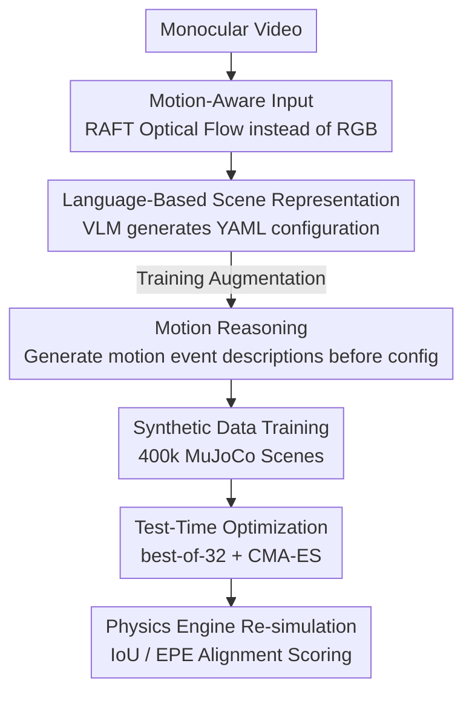

# Δynamics: Language-Based Representation for Inferring Rigid-Body Dynamics From Videos

**Conference**: CVPR 2026  
**arXiv**: [2605.20576](https://arxiv.org/abs/2605.20576)  
**Code**: None (Project page https://iandrover.github.io/2026_dynamics/)  
**Area**: Physics-Aware / Video Understanding / Multi-modal VLM  
**Keywords**: Rigid-Body Dynamics, Video-to-Simulation, Language-based Scene Representation, Optical Flow, Test-Time Optimization

## TL;DR
The task of "inferring rigid-body physical states and parameters from monocular video" is reformulated as a **text generation** problem. A VLM is trained to take optical flow as input and directly output a YAML scene configuration (geometry, initial state, materials, camera) executable by a physics engine. It achieves a segmentation IoU of 0.30 on CLEVRER, 7 times the performance of mainstream VLMs, and zero-shot transfers to 235 real-world videos.

## Background & Motivation
**Background**: Inferring physical properties (friction, elasticity, mass, initial velocity) and camera geometry from video is the foundation for "physics-aware sensing + simulation." Prior works (Vid2Param, experiments with sliders, billiards, projectiles, etc.) can estimate physical parameters in constrained scenarios.

**Limitations of Prior Work**: These methods parameterize scenes into **model-specific, fixed-length numerical vectors**, targeting only a specific class of objects (balls/boxes) or motions (sliding/projectile). Such representations are not scalable (failing when object counts or interaction types change) and typically **assume known or fixed camera poses**, preventing application to real-world scenes with varying distances or viewpoints.

**Key Challenge**: The root problem lies in "how the scene is parameterized." Fixed-length numerical vectors inherently cannot carry the combinatorial diversity of "arbitrary number of objects + multi-type interactions + unknown cameras"—the dimensions of regression heads are hard-coded and cannot accommodate additional objects.

**Goal**: A **unified and scalable** representation that covers single/multiple objects and various dynamics (sliding, rolling, bouncing, collision) while simultaneously estimating camera poses and generalizing from the synthetic domain to real videos.

**Key Insight**: The authors observe that if a scene configuration is written as **structured text** (YAML), then "object geometry, initial state, material, and camera" all become readable, editable, and variable-length symbolic sequences. This naturally fits the autoregressive generation of VLMs; as objects increase, the model simply writes more lines without needing changes to the network architecture.

**Core Idea**: Use **language** as a unified representation for rigid-body dynamics. Physical parameter estimation is rewritten from "numerical regression" to "generating a scene configuration text consumable by a physics engine," supported by **optical flow input** and **motion language reasoning** to enhance generalization.

## Method

### Overall Architecture
Δynamics addresses **video → simulation**: given a monocular video $\mathbf{X}$, the model $\mathcal{F}_\theta$ predicts a set of scene configurations $\mathbf{c}=\mathcal{F}_\theta(\mathbf{X})$, which are fed to a physics engine $\mathcal{S}$ to re-simulate $\hat{\mathbf{X}}=\mathcal{S}(\mathbf{c})$, with the goal that the dynamics of $\hat{\mathbf{X}}$ faithfully reproduce the original video. The pipeline consists of three stages: **Training**—sampling 400,000 scene configurations in MuJoCo, rendering synthetic videos, calculating optical flow with RAFT, and training the VLM for "Optical Flow → YAML Config"; **Evaluation/Inference**—calculating optical flow for real videos, feeding it to the model to generate configurations, re-simulating with the engine, and scoring based on segmentation IoU and optical flow EPE alignment with the original video.

The model backbone is Qwen2.5-VL-3B. The input consists of 10 uniformly sampled frames (or corresponding optical flow maps) from a 1s, 30FPS video. The output is a YAML configuration in `<answer> config </answer>` format. Two enhancements are added: using **optical flow instead of RGB** as a semantics-agnostic input and training the model to output a **motion event description** before generating the configuration (`<think> description </think> <answer> config </answer>`). During inference, three types of **test-time optimization** (best-of-K sampling / preference optimization / CMA-ES evolutionary search) are superimposed to further improve instance-level accuracy.

### Key Designs

**1. Language-based Unified Scene Representation: Replacing fixed vectors with variable-length YAML**

This approach directly addresses the pain point that "fixed vectors cannot accommodate arbitrary scenes." The authors no longer regress fixed-dimension parameter vectors but instead let the model output YAML encoding the entire scene's object geometry, initial states, materials, camera, and gravity. Parameters are categorized into: object attributes (radius/height/width/depth/mass, rolling+sliding friction, damping), initial state (position, linear velocity, angular velocity, quaternion orientation), and global parameters (camera height/pitch/FOV, gravity). Scenes are constructed from spheres, cylinders, and boxes, covering common objects like tennis balls, cans, mugs, books, and crates. This representation is **inherently variable-length**: a scene with four boxes involves $20\times4$ parameters + 3 camera parameters + 1 gravity term = 84 total, while adding more objects simply requires more YAML lines without changing the network. Textual representation also provides readability, editability, and counterfactual analysis (video editing), while unifying "simulation" into "text generation."

**2. Motion-Aware Input: Using optical flow to decouple non-motion semantics**

Original RGB videos contain textures, backgrounds, and colors irrelevant to motion, which act as distractors for physical parameter estimation and cause synthetic-to-real domain gaps. The authors use **optical flow fields** from RAFT as input. Optical flow is agnostic to appearance and background semantics, carrying explicit motion cues. Converted into a 2D array per color channel, it is fed directly into the VLM without structural changes. The result is immediate: on CLEVRER, this step alone improves full-sequence segmentation IoU from 0.19 to 0.24 (+26%) and significantly reduces optical flow EPE. One trade-off is that RGB occasionally performs slightly better for damping estimation (checkerboard floors provide additional visual cues).

**3. Motion Reasoning: Generating natural language descriptions before configuration**

Directly outputting configurations lacks explicit modeling of the "dynamical process." The authors train a variant where the model first describes the observed dynamics in natural language (when objects enter/leave the view, stop rolling/sliding, or collide), followed by the configuration in a `<think> description </think> <answer> config </answer>` format. These descriptions are not manually annotated; they are generated using **rule-based event mining scripts** that process simulation trajectories (state history, contact logs, segmentation maps) to extract visibility, motion changes, and collision events, which are then mapped to templates. Reasoning before configuring provides a more structured, physically meaningful intermediate representation, making it more robust for complex multi-object scenes and allowing test-time sampling to explore "physically plausible" solution spaces.

**4. Test-Time Optimization (TTO): Using re-simulation alignment signals for unsupervised selection/search**

Greedy decoding does not guarantee the best quality solution in the distribution. Three strategies are used during inference: **best-of-32 sampling** (temperature 0.1, top-p 0.9); **preference optimization** (using mask IoU between forward rendering and input video as an implicit reward for ranking, without ground truth); and **CMA-ES evolutionary search** (initialized with Best@32, optimizing object sizes, initial states, physical parameters, and camera pose, using $\text{IoU}-\text{EPE}$ as the fitness function, with a population of 128 and 100 iterations). Crucially, these signals come from "alignment after re-simulation," making them applicable to real scenes without objective ground truth.

### Loss & Training
The training target is to minimize the autoregressive negative log-likelihood of the configuration $\mathbf{c}$ as a token sequence:

$$p_\theta(\mathbf{c}\mid\mathbf{X})=\prod_{t=1}^{|\mathbf{c}|}p_\theta(c_t\mid\mathbf{X},c_{<t}),\qquad \mathcal{L}_{\text{VLM}}=-\!\!\sum_{(\mathbf{X},\mathbf{c})\in\mathcal{D}}\log p_\theta(\mathbf{c}\mid\mathbf{X}).$$

Data consists of 400,000 unique MuJoCo scenes. YAML configs are sampled $\rightarrow$ converted to XML $\rightarrow$ rendered as RGB videos with up to 4 objects (480×320, 1s 30FPS). Scenes with initial overlap, objects leaving the view, or objects too small (area < 8000 px) are filtered. Four-object combinations are **held out** for compositional generalization. Qwen2.5-VL-3B is fully fine-tuned for 10 epochs (bf16, 8×A100-40G, AdamW, LR $2\times10^{-5}$). Evaluation metrics include segmentation IoU (↑), optical flow EPE (↓), composition accuracy, and physical parameter L1 distance.

## Key Experimental Results

### Main Results
On synthetic in-distribution data (1–3 objects, 100 samples each), compared to non-VLM (ViViT regression) and VLM baselines (3-shot ICL):

| Model | Input | Comp. Acc↑ | Initial IoU↑ | Full Seq. IoU↑ | Full Seq. EPE↓ | Slide Frict. MAE↓ |
|------|------|---------|---------|-----------|-----------|------------|
| ViViT Regression | Flow | 0.00 | 0.07 | 0.06 | 8.90 | – |
| InternVL3-8B | RGB | 0.02 | 0.05 | 0.05 | 15.77 | 0.81 |
| Qwen2.5-VL-7B | RGB | 0.27 | 0.03 | 0.03 | 16.33 | 0.66 |
| Claude-4-Sonnet | RGB | 0.45 | 0.09 | 0.07 | 11.07 | 0.43 |
| **Δynamics** | RGB | 0.60 | 0.52 | 0.32 | 19.66 | 0.16 |
| **Δynamics** | Flow | 0.97 | 0.88 | 0.49 | 9.24 | 0.16 |
| **+ Motion Reasoning** | Flow | **0.99** | **0.91** | **0.54** | **8.52** | 0.15 |

The strongest baseline (Claude-4-Sonnet) can only roughly identify object compositions (IoU ≤ 0.09). Δynamics significantly outperforms them. The RGB version's EPE is higher due to occasional interpenetration in predicted initial states, leading to sudden corrective forces in MuJoCo; switching to flow improves composition accuracy to 97% and drastically reduces EPE.

Cross-engine zero-shot transfer (MuJoCo training → Blender-rendered CLEVRER, 100 videos):

| Model | Input | Initial IoU↑ | Full Seq. IoU↑ |
|------|------|---------|-----------|
| Claude-4-Sonnet | RGB | 0.03 | 0.04 |
| Δynamics | RGB | 0.43 | 0.19 |
| Δynamics | Flow | 0.63 | 0.24 |
| + Motion Reasoning | Flow | **0.67** | **0.30** |

### Ablation Study
| Configuration | Full Seq. IoU↑ | Note |
|------|-----------|------|
| RGB Input | 0.32 (Syn) / 0.19 (CLEVRER) | Baseline, high EPE, drops across domains |
| Flow Input | 0.49 / 0.24 | Semantic-agnostic input, IoU +26%, EPE drops |
| + Motion Reasoning | 0.54 / 0.30 | Reason before config, more stable for complex scenes |
| + best-of-32 | 0.38 (CLEVRER Initial) | Sampling explores long tail, +27% gain with reasoning |
| + CMA-ES | 0.66 (CLEVRER Full) | Evolutionary search from Best@32, best performance |

For real-world videos (235 clips), CMA-ES improves full-sequence IoU to 0.65, demonstrating the effectiveness of the re-simulation alignment loop without target ground truth.

### Key Findings
- **Optical flow is the main driver of generalization**: It decouples background/texture, improving synthetic IoU (+26%) and drastically closing the domain gap.
- **Motion reasoning and sampling have a synergistic effect**: Reasoning provides physically plausible intermediate states, enabling best-of-32 to explore within a valid space (+27% vs. +14% without reasoning).
- **CMA-ES provides the performance ceiling**: Evolutionary search initialized from Best@32 achieves the best alignment (0.65 IoU on real videos) at the cost of high computation.
- **Interpenetration causes high EPE in RGB models**: Initial state overlaps lead to high corrective forces in MuJoCo, highlighting that "physically plausible initialization" is critical for simulation alignment.

## Highlights & Insights
- **Paradigm Shift**: Reformulating "parameter regression" as "structured text generation" solves the scalability bottleneck of fixed vectors. Object counts, interactions, and cameras are all handled in one YAML—the most significant "Aha!" moment.
- **Optical Flow as VLM Input**: A lightweight engineering change (converting flow to 2D arrays) allows the VLM to focus on motion cues rather than appearance, ensuring cross-domain robustness.
- **Unsupervised Test-Time Alignment**: Mask IoU / EPE from re-simulation provide intrinsic supervision, making TTO strategies applicable in real-world deployments where ground truth labels are absent.
- **Rule-based Event Mining for Reasoning**: Automated extraction of visibility/collision events from simulation traces allows low-cost generation of CoT supervision without manual labeling.

## Limitations & Future Work
- **Primitive Constraints**: The scene is limited to spheres, cylinders, and boxes; complex objects (e.g., an apple) are only approximated, limiting geometric fidelity.
- **Dependence on MuJoCo Assumptions**: Training relies on MuJoCo physics; discrepancies in friction or contact models compared to reality will propagate to parameter estimates.
- **Simplified Camera Parameters**: Cameras are constrained to fixed positions $(0, -2, h)$ with limited tilt and no roll/yaw, failing to cover general 6DoF camera motion.
- **Real-Domain IoU**: Without CMA-ES, real-video IoU is only 0.29; achieving 0.65 relies on expensive evolutionary search, which lacks real-time performance.
- **EPE and Interpenetration Coupling**: Overlaps causing corrective forces pollute EPE, suggesting a need for explicit physical feasibility constraints.

## Related Work & Insights
- **vs. Constrained Physics Estimation (Vid2Param / Sliders)**: These use fixed-length vectors and specific physics models; Δynamics uses variable-length language to estimate geometry/physics/camera for multi-object scenes.
- **vs. Differentiable Simulation**: Differentiable methods require gradient-based optimization and differentiable engines; Δynamics uses single-pass inference followed by optional search without requiring a differentiable engine.
- **vs. General VLMs**: Generic VLMs fail on this task (IoU ≤ 0.09), indicating that generating executable physics configurations requires specialized training on synthetic physical data rather than generic visual reasoning.

## Rating
- Novelty: ⭐⭐⭐⭐⭐ Transforming physics estimation into executable text generation is a clean and effective paradigm shift.
- Experimental Thoroughness: ⭐⭐⭐⭐ Comprehensive coverage across synthetic, cross-engine, and real datasets; however, absolute IoU on real videos without search is still modest.
- Writing Quality: ⭐⭐⭐⭐ Clear motivation and methodology; figures successfully explain the train-inference pipe.
- Value: ⭐⭐⭐⭐⭐ Provides a unified language bridge between perception and simulation, extensible to robotics and controllable video editing.

<!-- RELATED:START -->

## Related Papers

- [\[ICML 2026\] From Generalist to Specialist Representation](../../ICML2026/physics/from_generalist_to_specialist_representation.md)
- [\[ICLR 2026\] MOSIV: Multi-Object System Identification from Videos](../../ICLR2026/physics/mosiv_multi-object_system_identification_from_videos.md)
- [\[ICML 2026\] Speculative Sampling for Faster Molecular Dynamics](../../ICML2026/physics/speculative_sampling_for_faster_molecular_dynamics.md)
- [\[ICML 2025\] L2D: Large Language Models to Diffusion Finetuning](../../ICML2025/physics/large_language_models_to_diffusion_finetuning.md)
- [\[ICML 2026\] Teaching Molecular Dynamics to a Non-Autoregressive Ionic Transport Predictor](../../ICML2026/physics/teaching_molecular_dynamics_to_a_non-autoregressive_ionic_transport_predictor.md)

<!-- RELATED:END -->
