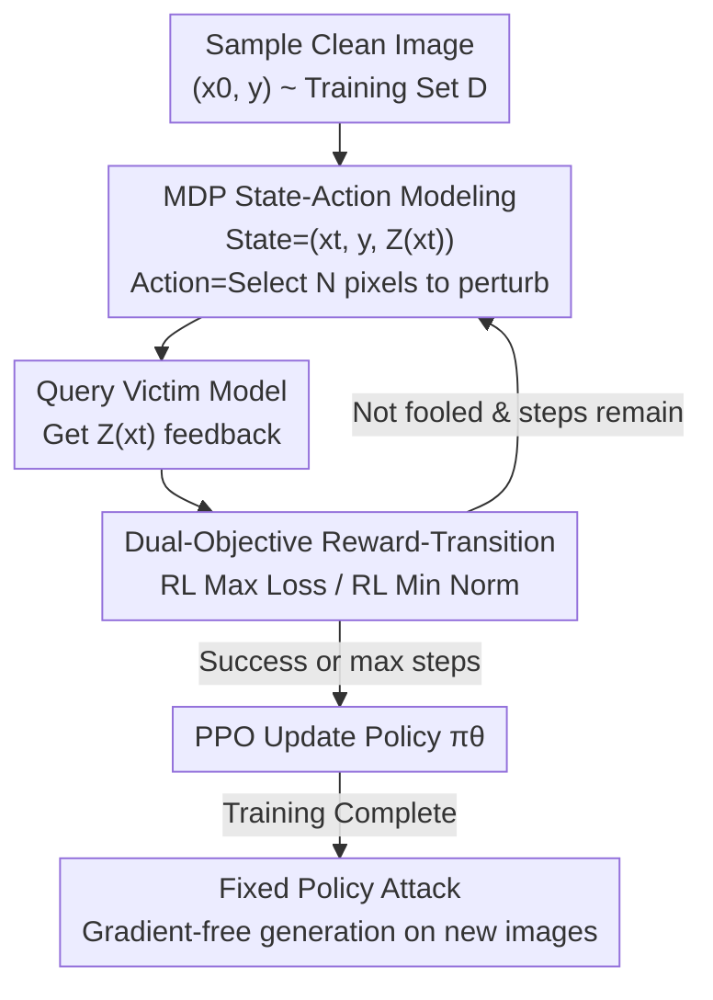

# Adversarial Agents: Black-Box Evasion Attacks with Reinforcement Learning

**Conference**: CVPR 2026  
**arXiv**: [2503.01734](https://arxiv.org/abs/2503.01734)  
**Code**: None  
**Area**: Reinforcement Learning / Adversarial Machine Learning / AI Security  
**Keywords**: Black-box adversarial attacks, evasion attacks, reinforcement learning, MDP modeling, PPO, query efficiency

## TL;DR
The generation of adversarial examples is remodeled as a Markov Decision Process (MDP), training an RL attack agent that "accumulates experience" via PPO. This allows black-box evasion attacks to become more accurate and query-efficient as training progresses—achieving up to a 17% higher success rate and 31% fewer queries on CIFAR-10 / SVHN compared to SOTA black-box attacks such as Square, HSJA, and Bandits.

## Background & Motivation

**Background**: Adversarial Machine Learning (AML) studies how to construct adversarial examples for image classifiers that are "imperceptible to the human eye but cause model misclassification." Under white-box settings, gradient optimization such as PGD (Max Loss) or C&W (Min Norm) is used. In more realistic black-box settings, attackers only have access to model outputs (hard labels or class probabilities), leading to the development of query-based optimization methods like Square Attack, HopSkipJump, and Bandits.

**Limitations of Prior Work**: These black-box methods are fundamentally **stateless**—every target image is treated as a brand-new, isolated optimization problem to be solved from scratch. Once an attacker finishes one image, no experience is accumulated for the next. Consequently, each image requires a massive number of queries, and the attack strategy remains stagnant rather than evolving.

**Key Challenge**: Real-world threats (such as Advanced Persistent Threats, APTs) attack the same system **continuously** and at **scale**. Stateless optimization contradicts the intuition that "attacks should become more proficient over time." Attackers should theoretically be able to learn a generalizable evasion strategy from past successes and failures, but existing AML frameworks lack components for "memory" and "learning."

**Goal**: Upgrade the attacker from "re-solving an optimization problem every time" to "learning a general attack strategy." Specifically, three questions are addressed: (1) Can an RL agent learn more effective and query-efficient attacks during training? (2) How do key hyperparameters ($\epsilon$, $c$) affect the trade-offs between effectiveness and efficiency? (3) Can the learned strategy generalize to unseen images and outperform traditional black-box methods?

**Key Insight**: The authors observe that black-box attacks are naturally a **closed-loop interaction** where the "attacker acts → victim model provides feedback → attacker acts again," which perfectly fits the RL "State-Action-Reward" framework. By treating the input and model output as the state, the perturbation as the action, and the progress toward the adversarial goal as the reward, the attack process becomes a sequential decision problem solvable via RL.

**Core Idea**: Replace the "start-from-zero" stateless optimizer with an RL agent that "accumulates experience." By formalizing adversarial example generation as an MDP and training the policy with PPO, the attacker solidifies past attack experience into a policy network, thereby eliminating expensive per-sample optimization on new inputs.

## Method

### Overall Architecture

The methodology focuses on rewriting black-box evasion as an MDP and training the "attacker" as a policy network $\pi_\theta$ using PPO. An episode begins by randomly sampling a clean image $(x_0, y)$ from the training set $\mathcal{D}$. An initial query to the victim model $Z(x_0)$ initializes the starting state $s_0$. In each subsequent step, the agent observes the current state, selects a small subset of pixels to perturb, and receives new confidence feedback from the victim model. The environment then determines whether to keep the perturbation and how much reward to grant. The episode ends when the model is successfully fooled (misclassification) or the maximum steps are reached. The agent stores the $(s, a, r, s')$ interactions and updates the policy via PPO. Once trained, the attacker uses the fixed policy to generate adversarial examples on new images in a "one-pass" inference mode without requiring gradients.

The authors design two reward/transition functions corresponding to two classic adversarial objectives—**RL Max Loss** (maximizing model error within a given perturbation budget) and **RL Min Norm** (finding the minimum perturbation to fool the model). Both share the same state/action representations and only diverge in rewards and transitions.

### Key Designs

**1. Formalizing Adversarial Generation as an MDP: Enabling "State" and "Memory"**  
To address the core pain point of stateless optimization, the attack on a single image is decomposed into an episodic MDP. The state is defined as $s_t = (x_t, y, Z(x_t))$, comprising the image perturbed at step $t$, its true label, and the victim model's output—the only information accessible to a black-box attacker. This allows the agent to decide the next move based "on the model's reaction." Since one state transition matches exactly one victim model query, the transition "steps" in RL naturally represent "query counts," the most scarce resource in black-box attacks. This formalization is the foundation: once the attack is an MDP, cross-sample experience can be distilled into a shared policy via PPO.

**2. Subset Pixel Actions + Amplitude Constraints: Compressing High-Dimensional Perturbation Search**  
Learning perturbations directly on 3072-dimensional pixels leads to action space explosion and poor black-box efficiency. The authors design the action as a set $a_t = \{(i_1,\delta_1),\dots,(i_N,\delta_N)\}$, where $N$ features are selected and each perturbation amplitude is limited by $|\delta_j| \le \theta$. In experiments, $N=5$ and $\theta=0.05$ were fixed. This step essentially performs dimensionality reduction for RL: using $N$ and $\theta$ to balance between "perturbing many pixels slightly" versus "perturbing a few pixels significantly," transforming unlearnable full-dimensional search into a compact action space that the agent can master within limited queries.

**3. Dual-Objective Reward-Transition: Addressing Max Loss and Min Norm Objectives**  
AML's two classic goals require different reward shaping. The authors define the model's confidence in the true label as $f(x,y)=\log([Z(x)]_y)$ (negative cross-entropy), the one-step change in confidence as $\Delta_{t+1}f = f(x_t,y)-f(x_{t+1},y)$, and the one-step change in perturbation as $\Delta_{t+1}\delta$.

- **RL Max Loss**: The transition includes a **hard projection** of candidate perturbations back to the $\epsilon$-budget ball $x_t^{a_t}=\text{Proj}_\epsilon[\phi(x_t,a_t)-x_0]+x_0$. If the step reduces confidence, it is accepted; otherwise, the state remains unchanged. The reward is $R(s_t,a_t)=\Delta_{t+1}f$. Budget constraints are hard-coded into the transition, allowing the agent to focus solely on minimizing confidence within the budget.
- **RL Min Norm**: No hard budget is set. Instead, "decreasing confidence" and "reducing perturbation" are combined into a joint reward $R(s_t,a_t)=c\cdot\Delta_{t+1}f + \Delta_{t+1}\delta$. The transition uses the same weighted formula to decide whether to accept the step. A larger $c$ prioritizes confidence reduction, while a smaller $c$ prioritizes perturbation reduction.

### Loss & Training

Training is conducted using PPO from Stable-Baselines3, with 1200 policy updates per attack across 3 random seeds. The policy network uses an EfficientNet feature extractor followed by an MLP to output action distribution parameters; the value network shares the EfficientNet features. Victim models include ResNet-50, VGG-16, and ViT-B/16 pre-trained on ImageNet-1K and fine-tuned on target datasets. Key hyperparameters: RL Max Loss uses $\epsilon=0.3$; RL Min Norm uses $c=10^{-2}$ for CIFAR-10 and $c=10^{-3}$ for SVHN. Training was performed on NVIDIA A100 (40GB) GPUs.

## Key Experimental Results

### Main Results

Head-to-head comparisons were performed on the test set $\mathcal{D}'$ against three SOTA black-box attacks (Square, HSJA, Bandits), measured by ASR (Attack Success Rate ↑), AQ (Average Queries for successful samples ↓), and $\ell_2$ (Average Perturbation). Representative numbers on CIFAR-10:

| Method (CIFAR-10, $\mathcal{D}'$) | ResNet-50 ASR / AQ | VGG-16 ASR / AQ | ViT-B/16 ASR / AQ |
|:---|:---:|:---:|:---:|
| Square | 0.53 / 335 | 0.61 / 350 | 0.31 / 344 |
| HSJA | 0.31 / 681 | 0.36 / 637 | 0.13 / 904 |
| Bandits | 0.44 / 635 | 0.47 / 662 | 0.08 / 516 |
| **RL Max Loss** | **0.59 / 315** | **0.64 / 259** | 0.28 / 332 |
| **RL Min Norm** | 0.62 / 155 | 0.55 / 103 | 0.17 / 148 |

RL Max Loss achieved higher ASR than the strongest baselines in most settings with fewer queries. RL Min Norm dominated in query efficiency (e.g., only 103 queries on VGG-16 vs. Square's 350). In the most extreme case (VGG-16 on SVHN), the RL attack achieved **17% higher ASR with 31% fewer queries** than the baselines.

### Key Findings

- **Max Loss is more stable than Min Norm**: Because the $\epsilon$ budget is hard-coded into transitions, the agent doesn't need to learn constraints. In contrast, Min Norm's perturbation constraint relies on reward signals, making the simultaneous optimization of perturbation and query count difficult, leading to larger $\ell_2$ fluctuations.
- **ViT-B/16 is the most resilient**: All attacks (baselines and RL) showed significantly lower ASR on ViT compared to CNNs (e.g., RL Max Loss only ~0.28-0.32), suggesting that Transformer architectures are more robust against pixel-level black-box attacks.
- **Hyperparameters dictate attack tradeoffs**: ASR for RL Max Loss increases monotonically with $\epsilon$. For RL Min Norm, as $c$ increases, ASR and $\ell_2$ both decrease (higher priority on reducing perturbation leads to more conservative behavior).
- **Learning strategies over overfitting**: Performance metrics on test set $\mathcal{D}'$ matched those on training set $\mathcal{D}$, proving the agent learns generalizable evasion strategies rather than memorizing training images.

## Highlights & Insights

- **Paradigm shift from "Stateless Optimization" to "Stateful Learning"**: This is the core "Aha!" moment—elevating adversarial attacks from per-sample optimization to a learned strategy that accumulates experience. Once the attack is an MDP, the attacker naturally gains cross-sample transfer and continuous evolution capabilities, which are essential for APT-style threats.
- **Alignment of "One Transition = One Query"**: The natural tendency of RL to minimize steps is directly equivalent to saving queries in black-box attacks. The reward design aligns perfectly with the threat model without requiring complex penalty terms.
- **Hard vs. Soft Constraints**: The two environments (Max Loss and Min Norm) empirically demonstrate that constraints that can be hard-coded into the state space should not be left to the reward signal alone.
- **Applicability to Security Testing**: The framework is not image-dependent; it can be applied to discrete classification tasks such as malware or network intrusion detection.

## Limitations & Future Work

- **Limitations acknowledged by authors**: Validation was limited to image classification; pixel-level subset perturbation was used rather than latent-space perturbation; training is relatively slow.
- **Hypothetical Transferability**: The paper suggests using the policy trained on one victim model as a pre-trained model for new ones, but this was **not experimentally verified**.
- **Idealized Threat Model**: The training phase requires a significant number of queries, which might be detectable in practice; the paper does not explore how to complete training discreetly.
- **Limited effectiveness on ViT**: The relatively low ASR on ViT-B/16 suggests the threat of this attack to non-CNN architectures is reduced.

## Related Work & Insights

- **vs. Square Attack / HSJA / Bandits**: These utilize stateless, per-sample optimization. This work uses RL to accumulate experience, allowing for gradient-free generalization to new images after training, outperforming baselines in most ASR/efficiency settings.
- **vs. Prior RL-based Attacks**: Prior works often used RL for stateless optimization of single inputs. This work's contribution is utilizing RL as a cross-sample learner rather than a single-sample optimizer.
- **vs. White-box PGD / C&W**: RL Max Loss and RL Min Norm provide black-box counterparts to PGD and C&W objectives, respectively, mapping gradient-dependent goals into a gradient-free RL framework.

## Rating
- **Novelty**: ⭐⭐⭐⭐⭐ Remodeling black-box evasion as a learnable MDP is a clear and impactful paradigm shift.
- **Experimental Thoroughness**: ⭐⭐⭐⭐ Solid results across two datasets, three victim models, and two MDP formulations; however, cross-model transfer remains unverified.
- **Writing Quality**: ⭐⭐⭐⭐⭐ The alignment between MDP formulation, reward design, and threat models is explained very clearly.
- **Value**: ⭐⭐⭐⭐ Reveals the "continuous learning attacker" as a new attack surface, serving as a warning for defense and security evaluation.

<!-- RELATED:START -->

<!-- Related papers would go here -->

<!-- RELATED:END -->

## Related Papers

- [\[NeurIPS 2025\] Optimizing the Unknown: Black Box Bayesian Optimization with Energy-Based Model and Reinforcement Learning](../../NeurIPS2025/reinforcement_learning/optimizing_the_unknown_black_box_bayesian_optimization_with_energy-based_model_a.md)
- [\[ICML 2025\] Meta-Black-Box-Optimization through Offline Q-function Learning (Q-Mamba)](../../ICML2025/reinforcement_learning/meta-black-box-optimization_through_offline_q-function_learning.md)
- [\[ICML 2026\] ALSO: Adversarial Online Strategy Optimization for Social Agents](../../ICML2026/reinforcement_learning/also_adversarial_online_strategy_optimization_for_social_agents.md)
- [\[NeurIPS 2025\] MetaBox-v2: A Unified Benchmark Platform for Meta-Black-Box Optimization](../../NeurIPS2025/reinforcement_learning/metabox-v2_a_unified_benchmark_platform_for_meta-black-box_optimization.md)
- [\[ICLR 2026\] Learning to Generate Unit Test via Adversarial Reinforcement Learning](../../ICLR2026/reinforcement_learning/learning_to_generate_unit_test_via_adversarial_reinforcement_learning.md)

<!-- RELATED:END -->
