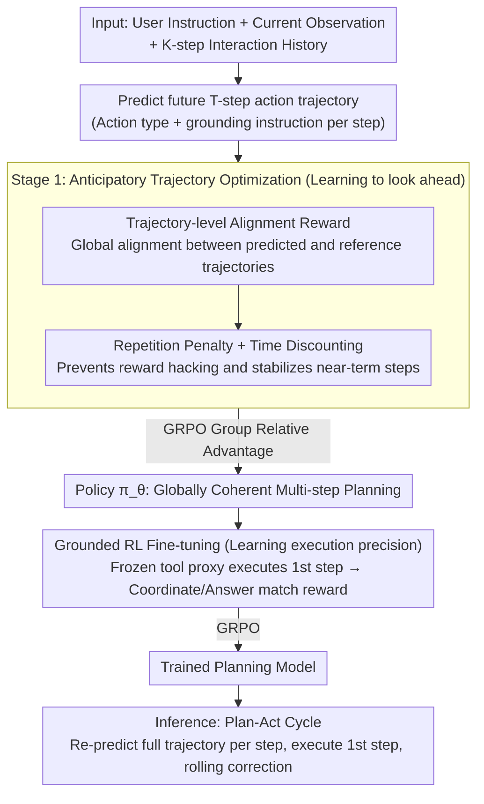

# Anticipatory Planning for Multimodal AI Agents

**Conference**: CVPR 2026 Findings  
**arXiv**: [2603.16777](https://arxiv.org/abs/2603.16777)  
**Code**: Not open-sourced  
**Area**: Reinforcement Learning  
**Keywords**: Multimodal Agents, Anticipatory Planning, Trajectory-level Reinforcement Learning, GUI Interaction, Tool Use, GRPO

## TL;DR

TraceR1 is proposed as a two-stage RL framework: Stage 1 utilizes trajectory-level reward optimization to enable agents to perform anticipatory planning by "looking several steps ahead," and Stage 2 employs grounded fine-tuning based on tool execution feedback to enhance single-step precision, achieving open-source SOTA across 7 GUI and tool-use benchmarks.

## Background & Motivation

**Background**: Current multimodal agents have achieved significant progress in GUI interaction and tool invocation, but most systems remain essentially **reactive**—making next-step decisions based solely on current observations without considering long-term consequences.

**Limitations of Prior Work**: In multi-step tasks, the impact of actions is often delayed and cumulative. Reactive agents fail to anticipate consequences, leading to gradual deviation from goals and poor planning coherence in long-horizon tasks.

**Key Challenge**: Existing technical routes face fundamental obstacles—Model-free RL relies on sparse final rewards, making it difficult to learn long-term dependencies; Model-based planning requires constructing world models, which is extremely challenging in visually rich interaction environments.

**Goal**: Efficiently train multimodal agents to possess adaptive anticipatory reasoning capabilities, maintaining planning consistency in complex long-horizon tasks.

**Key Insight**: Instead of building an explicit world model, RL is performed directly at the trajectory level, teaching the model to predict a sequence of future actions and then executing only the first step, resembling the human planning style of "thinking several steps ahead while taking one step."

**Core Idea**: Unify anticipatory planning and precise execution through two-stage training—first performing trajectory-level alignment for global consistency, then grounded RL for single-step executability.

## Method

### Overall Architecture

TraceR1 addresses a specific flaw: current multimodal agents are mostly reactive "look-and-act" players that deviate during multi-step tasks. Rather than building an explicit world model, it requires the model to "think ahead" at each step—predicting an action trajectory $\hat{\tau}_{t:T}$ for multiple future steps given current observations, but actually executing only the first step and re-predicting after receiving environment feedback. Training proceeds in two stages: Stage 1 (Anticipatory Trajectory Optimization) teaches long-term coherence through trajectory-level RL, and Stage 2 (Grounded Reinforcement Fine-tuning) utilizes feedback from a frozen tool proxy's execution to refine single-step accuracy. The backbone is Qwen3-VL-8B-Thinking, and the training framework uses EasyR1.

### Key Designs

**1. Trajectory-level Alignment Reward: Planning future steps instead of optimizing per token**

The fundamental issue with reactive agents is they only account for current observations, while SFT teacher forcing optimizes per token, naturally ignoring global consistency across steps. TraceR1 gives rewards at the trajectory level: given instruction $u$, current observation $s_t$, and interaction history, the model outputs a sequence of future $T$ actions, which is aligned with a reference trajectory $\tau^*$ using a discounted trajectory reward.

$$R(\hat{\tau}, \tau^*) = \sum_{t=1}^{T} \gamma^{t-1} r_t, \quad r_t = \lambda_{\text{align}} \cdot \text{sim}(\hat{a}_t, a_t^*) - \lambda_{\text{rep}} \cdot \text{rep}(\hat{a}_{1:t})$$

where $\text{sim}$ measures the alignment between predicted and reference actions, and $\text{rep}$ penalizes inner-trajectory repetitions. Since the reward is calculated for the entire trajectory, the model is forced to learn cross-step dependencies rather than just ensuring the immediate step looks correct—this is key to avoiding redundant and unstable rollouts.

**2. Repetition Penalty and Time Discounting: Preventing reward hacking and long-term gambling**

Once trajectory-level rewards are introduced, the model easily finds shortcuts. Without the repetition penalty $\lambda_{\text{rep}}$, the planner might repeatedly click the same element or call the same tool to inflate "alignment" rewards; without time discounting $\gamma < 1$, the model might gamble on highly uncertain distant predictions, compromising near-term accuracy. These two parameters ensure the model avoids "looping" and prioritizes stabilizing immediate steps, which are essential for effective planning. Ablations show significant performance drops when either is removed.

**3. Grounded RL Fine-tuning: Providing hard feedback for abstract planning**

Stage 1 trajectory rewards are essentially abstract—they tell the model "how much your plan looks like the reference" but cannot guarantee the predicted actions are executable or accurate on a real interface. Stage 2 fills this gap: the model outputs actions and grounding coordinates $(\hat{a}_t, \hat{g}_t)$, which are executed by a frozen tool proxy (e.g., UI-TARS-7B). Rewards are then calculated based on the execution result relative to the ground truth—coordinate matching for GUI tasks and answer matching for tool-use tasks.

$$r_t^G = \mathbb{1}[\text{coord match}] \quad \text{or} \quad \mathbb{1}[\text{answer match}]$$

With this grounded signal, the model avoids staying in an "ideal but unexecutable" state, bridging the gap between foresight and executability.

**4. Inference-time Plan-Act Cycle: Balancing foresight and robustness via MPC**

Multi-step prediction provides foresight, but interactive environments change constantly. Executing several steps at once is risky. TraceR1 adopts a Model Predictive Control (MPC) approach during inference: the model re-predicts the entire future trajectory at every step but only executes the first action. This preserves the global perspective of "thinking ahead" while allowing for "rolling corrections" based on real feedback.

### Loss & Training

Both stages utilize GRPO (Group-Relative Policy Optimization) as the optimization target, differing only in the reward signal source. The gradient in Stage 1 is based on the trajectory reward's group relative advantage:

$$\nabla_\theta J(\theta) = \mathbb{E}_{\hat{\tau}}\big[\hat{A}(\hat{\tau}, \tau^*)\, \nabla_\theta \log \pi_\theta(\hat{\tau} \mid u, s_t, \tau_{1:t-1})\big]$$

where $\hat{A}$ is the normalized group relative advantage based on trajectory rewards. Stage 2 replaces the trajectory reward with the grounded step reward $r_t^G$. Training data for GUI tasks includes AgentNet, AndroidControl, GUI-Odyssey, Multimodal-Mind2Web, and AgentTrek, while tool-use tasks use T3-Agent trajectories.

## Key Experimental Results

### Main Results: Online GUI Benchmarks (Table 1 — Success Rate %)

| Model | Parameters | AndroidWorld | OSWorld-Verified |
|------|--------|:---:|:---:|
| OpenAI CUA-o3 | - | 52.5 | 38.1 |
| UI-TARS-2 | - | 73.3 | 53.1 |
| Claude 4.5 Sonnet | - | - | 62.9 |
| Agent S2.5 w/ o3 | 7B w/ - | - | 56.0 |
| Qwen3-VL-32B-Thinking | 32B | 61.4 | 35.6 |
| **TraceR1 (Qwen3-VL-32B w/ Ours)** | **32B w/ 8B** | **64.8** | **41.2** |

**Key Finding**: TraceR1 improves Qwen3-VL-32B-Thinking's success rate from 35.6% to 41.2% in OSWorld (a 15.7% relative improvement) and from 61.4% to 64.8% in AndroidWorld, setting an open-source SOTA.

### Tool Use Benchmarks (Table 3 — GAIA & GTA)

| Model | Parameters | GAIA AnsAcc | GTA AnsAcc | GTA ToolAcc | GTA CodeExec |
|------|--------|:---:|:---:|:---:|:---:|
| GPT-4o | - | 33.4 | 57.1 | 63.4 | 95.1 |
| GPT-5 | - | 59.3 | 60.9 | 68.3 | 98.7 |
| Qwen3-VL-8B | 8B | 31.5 | 49.2 | 56.8 | 74.2 |
| T3-Agent | 7B | 16.9 | 53.8 | 64.6 | 84.3 |
| **TraceR1** | **8B** | **40.2** | **56.7** | **65.7** | **87.4** |

**Key Finding**: The 8B model surpasses GPT-4o on GAIA (40.2 vs 33.4) and achieves a +8.7 AnsAcc gain over the base Qwen3-VL-8B.

### Ablation Study

| Setting | AndroidWorld | OSWorld-Verified | GTA |
|------|:---:|:---:|:---:|
| Full TraceR1 (w/ Stage 2) | 64.8 | 41.2 | 56.7 |
| w/o Stage 2 | 57.2 | 36.3 | 50.2 |

Removing Stage 2 results in an average decline of approximately 6%, demonstrating that grounded execution feedback is critical for planning stability.

**Other findings**:
- **Prediction length $T$**: Performance peaks at $T \approx 10$; excessive lengths accumulate uncertainty.
- **$\lambda_{\text{rep}} = 0$**: Reward hacking occurs (repeated clicks) without the repetition penalty.
- **$\gamma = 1$**: The model overfits to uncertain distant predictions without time discounting.

## Highlights & Insights

1.  **"Think ahead, act once" is elegant**: It enables anticipatory reasoning via trajectory-level RL without requiring explicit world models, making it engineering-friendly.
2.  **Rational decoupled design**: Stage 1 focuses on "looking far" (global consistency), while Stage 2 focuses on "executing accurately" (feasibility).
3.  **High Versatility**: The same framework applies to GUI interaction (desktop/mobile) and general tool use, validated across 7 benchmarks.
4.  **Open-source 8B outperforms GPT-4o**: Achieves exceptional cost-performance efficiency on GAIA.
5.  **Critical Ablations**: Clearly demonstrates the reward hacking problem and the effectiveness of the proposed solutions (repetition penalty and time discounting).

## Limitations & Future Work

1.  **Limited short-term updates**: The current method provides local corrections but may not fully reshape the agent's understanding of long-term feasibility. Hierarchical planning could be explored.
2.  **Dependence on frozen tool proxies**: The quality of the tool proxy directly impacts the reliability of the grounded reward; errors in the proxy introduce noise.
3.  **Offline vs. Online**: The current grounded setup is offline, lacking true online interaction, which may limit adaptability to dynamic environments.
4.  **Horizon Sensitivity**: Performance drops when $T > 10$, indicating a bottleneck for ultra-long-horizon tasks.
5.  **Lack of Memory/State**: The framework lacks cross-episode memory integration and cannot learn from historical failures.

## Related Work & Insights

| Comparison Method | Difference |
|---------|--------|
| **GUI-R1 / InfiGUI-R1** | Also use R1-style RL but focus on step-level rewards. TraceR1's trajectory-level optimization leads to a 40%+ gain on AndroidControl-High. |
| **Agent S2 / GTA1** | Rely on closed-source models (o3/GPT-5) as planners. TraceR1 trains the intrinsic planning capability of open-source models. |
| **UI-TARS-1.5/2** | Commercial closed-source systems. TraceR1 approaches their level using an 8B open model and a 32B executor. |

## Rating

- **Novelty**: ⭐⭐⭐⭐ — The two-stage design with trajectory-level RL and grounded fine-tuning is a significant advancement for R1-style methods.
- **Experimental Thoroughness**: ⭐⭐⭐⭐⭐ — Covers 7 benchmarks across GUI and tool use with comprehensive ablations.
- **Writing Quality**: ⭐⭐⭐⭐ — Clear structure, well-articulated motivation, and standardized formalisms.
- **Value**: ⭐⭐⭐⭐ — Provides a practical paradigm for training anticipatory planning in multimodal agents.

<!-- RELATED:START -->

## Related Papers

- [\[ACL 2026\] Controlling Multimodal Conversational Agents with Coverage-Enhanced Latent Actions](../../ACL2026/reinforcement_learning/controlling_multimodal_conversational_agents_with_coverage-enhanced_latent_actio.md)
- [\[NeurIPS 2025\] Deep RL Needs Deep Behavior Analysis: Exploring Implicit Planning by Model-Free Agents](../../NeurIPS2025/reinforcement_learning/deep_rl_needs_deep_behavior_analysis_exploring_implicit_planning_by_model-free_a.md)
- [\[ACL 2026\] Visually-Guided Policy Optimization for Multimodal Reasoning](../../ACL2026/reinforcement_learning/visually-guided_policy_optimization_for_multimodal_reasoning.md)
- [\[CVPR 2026\] Adversarial Agents: Black-Box Evasion Attacks with Reinforcement Learning](adversarial_agents_black-box_evasion_attacks_with_reinforcement_learning.md)
- [\[ICML 2026\] Laplacian Representations for Decision-Time Planning](../../ICML2026/reinforcement_learning/laplacian_representations_for_decision-time_planning.md)

<!-- RELATED:END -->
