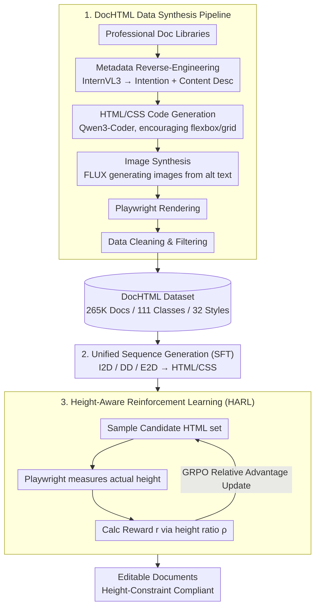

# AnyDoc: Enhancing Document Generation via Large-Scale HTML/CSS Data Synthesis and Height-Aware Reinforcement Optimization

**Conference**: CVPR 2026  
**arXiv**: [2603.25118](https://arxiv.org/abs/2603.25118)  
**Code**: None  
**Area**: Reinforcement Learning / Document Generation  
**Keywords**: Document Generation, HTML/CSS, Data Synthesis, Reinforcement Learning, Multimodal Large Language Models

## TL;DR
AnyDoc proposes a general document generation framework based on a unified HTML/CSS representation. Through an automated data synthesis pipeline, it constructs the DocHTML dataset containing 265K documents. By combining SFT and Height-Aware Reinforcement Learning (HARL) to fine-tune MLLMs, it outperforms baselines such as GPT-4o on intention-to-document, document derendering, and element-to-document tasks.

## Background & Motivation
**Background**: Various types of documents (resumes, presentations, reports, etc.) are widely used in daily work. Manually designing high-quality documents requires balancing structure, layout, visuals, and style. Automated document generation has gained significant attention recently.

**Limitations of Prior Work**:
   - **Limited Application Scope**: Most methods target a single category (ads, PPTs, infographics) and struggle with unseen categories;
   - **Sub-optimal Document Representation**:
     - Raster images: Non-editable.
     - Flat coordinate sequences (JSON): Require extensive coordinate calculations for complex documents and fail to express hierarchical structures.
   - **Data Scarcity**: Manual document creation is costly, and existing datasets are small (e.g., Crello has only 20K samples) with limited categories.

**Key Challenge**: How to simultaneously achieve category generality, structural editability, and data sufficiency?

**Key Insight**: Introduce HTML/CSS as a unified document representation—featuring inherent hierarchical structures, powerful layout mechanisms (flexbox/grid), and suitability for large-scale synthesis.

**Core Idea**: Unified HTML/CSS representation + Automated data synthesis pipeline + HARL to solve overflow issues = High-quality universal document generation.

## Method

### Overall Architecture
AnyDoc aim to create a **category-agnostic** generator: given a design intention, a reference screenshot, or a set of scattered assets, it produces editable, high-quality documents. The key decision is to represent documents uniformly using HTML/CSS, turning the pipeline into "any condition → HTML/CSS code → rendered image."

The process involves three steps. First, an automated pipeline builds the DocHTML dataset (265K documents, 111 categories, 32 styles), addressing the lack of large-scale HTML document data. Second, an MLLM is fine-tuned via SFT on this data to master three tasks: intention-to-document (I2D), document derendering (DD), and element-to-document (E2D). Finally, Height-Aware Reinforcement Learning (HARL) is used for post-training to specifically address the common SFT issue where "content overflows the specified height."

### Key Designs

**1. DocHTML Data Synthesis Pipeline: Mass-producing diverse HTML documents via code generation models.**

The primary bottleneck isn't the model but the data—manual creation is expensive and existing datasets (like Crello) are small. This pipeline breaks data generation into five stages: starting from professional document libraries, InternVL3 reverse-engineers design intentions and content descriptions as metadata; this metadata is fed to Qwen3-Coder-480B to generate HTML/CSS, with prompts encouraging flexbox/grid layouts and using placeholder URLs with alt text for `` tags; FLUX.1-dev then generates corresponding images based on alt descriptions; Playwright renders the code into screenshots; finally, data cleaning removes samples with mismatched dimensions, missing tags, zero height, or content overflow.

For example, given a resume from the library, InternVL3 extracts "Resume, emphasizing work experience" and block-level content; Qwen3-Coder generates grid-based HTML where the avatar is ``; FLUX generates the portrait; Playwright renders the final document. HTML/CSS is chosen over JSON coordinate sequences because tag nesting naturally represents document hierarchy, and flexbox/grid offloads coordinate calculations to the browser engine, allowing the model to focus on structure rather than pixel-perfect math.

**2. Unifying Three Tasks as "Condition → HTML/CSS" Sequence Generation: One framework for three input modalities.**

Document generation occurs in three scenarios: a simple design intention (I2D), a document screenshot for reconstruction (DD), or a set of text/image assets for layout (E2D). AnyDoc unifies these into a single "condition + target dimensions → HTML/CSS" sequence generation task. All tasks share the same base model and DocHTML dataset. This allows capabilities to generalize across tasks—for instance, structural reconstruction learned from DD improves the consistency of intention-based generation.

**3. Height-Aware Reinforcement Learning (HARL): Turning rendered height into rewards to enforce dimension constraints.**

SFT models often produce documents exceeding the specified height, resulting in truncated renders. HARL addresses this using a "rendering loop" within the GRPO framework: for each input, a set of candidate HTML samples is generated, actual heights $\hat{h}$ are measured using Playwright, and the ratio to the target height $h$ is calculated as $\rho = \hat{h}/h$. The reward $r$ is:

$$r = \max\left(0, \begin{cases} 1, & 1-\gamma \leq \rho \leq 1 \\ \gamma + \rho, & \rho < 1-\gamma \\ 1 - \alpha(\rho - 1), & \rho > 1 \end{cases}\right)$$

The reward function is straightforward: full marks for heights in the compliant $[1-\gamma,\,1]$ range; partial marks for underfilled documents ($\rho < 1-\gamma$); and heavy penalties for overflow ($\rho > 1$). By using GRPO to compare relative advantages within a group, the model learns to prioritize compliant samples and suppress overflow without manual preference labeling.

### Loss & Training
- **SFT Phase**: Based on Qwen2.5-VL-7B-Instruct, LoRA rank=32, batch=128, lr=1e-4.
- **HARL Phase**: Full parameter fine-tuning, lr=1e-6, batch=64, GRPO rollout=5.
- 20K samples with the worst overflow from SFT inference were selected as the HARL training set.

## Key Experimental Results

### Main Results (I2D Intention → Document)

| Method | Layout | Image | Typography | Content | Height↓ | Intention |
|------|--------|-------|------------|---------|---------|-----------|
| OpenCOLE | 7.91 | 8.03 | 7.79 | 7.52 | - | 8.13 |
| FLUX.1-dev | 7.58 | 7.78 | 6.54 | 5.16 | - | 6.91 |
| GPT-4o | 8.59 | 8.75 | 8.32 | 8.41 | 0.047 | 8.96 |
| **Ours** | **8.64** | **8.92** | **8.36** | **8.44** | **0.005** | 8.95 |

### Ablation Study (DD Task)

| Configuration | Block | Text | Position | Color | Height↓ |
|------|-------|------|----------|-------|---------|
| Coordinate Seq (JSON) | 0.871 | 0.925 | 0.780 | 0.812 | 0.188 |
| HTML/CSS (10K data) | 0.942 | 0.974 | 0.862 | 0.915 | 0.374 |
| HTML/CSS (Full data) | 0.958 | 0.984 | 0.900 | 0.948 | 0.309 |
| + HARL | **0.965** | **0.986** | **0.910** | **0.958** | 0.309→Better |

### Key Findings
- HTML/CSS representation significantly outperforms coordinate sequences (JSON) across all metrics, particularly Position and Color.
- HARL reduces the Height metric for the I2D task from 0.131 to 0.005 (virtually eliminating overflow).
- Performance consistently scales as DocHTML data increases from 10K to the full set.
- AnyDoc (7B) outperforms GPT-4o in several metrics, especially in Height control.

## Highlights & Insights
- **HTML/CSS as a document representation is a key innovation**: Bridging document generation with the mature web development tech stack.
- The fully automated data synthesis pipeline allows for sustainable scaling of categories and styles.
- HARL is an elegant solution: introducing rendering feedback into RL rewards to teach the model to respect spatial constraints.
- Three tasks share a unified framework and dataset.

## Limitations & Future Work
- The 7B model still falls behind GPT-4o in Height control for the DD task (likely due to model scale).
- HARL requires Playwright rendering to calculate rewards, leading to lower training efficiency.
- The aesthetic quality of generated documents remains dependent on the underlying code generation model.
- Currently supports static documents; interactive documents (with dynamic effects) are not yet covered.

## Related Work & Insights
- Compared to Design2Code, AnyDoc supports intention-based and element-based generation in addition to derendering.
- The HARL approach (Render → Measure → Reward) can be generalized to other code generation tasks requiring visual constraints.

## Rating
- Novelty: ⭐⭐⭐⭐ Unified HTML/CSS representation + Data Synthesis + HARL.
- Experimental Thoroughness: ⭐⭐⭐⭐ Comprehensive across three tasks, multiple baselines, and ablations.
- Writing Quality: ⭐⭐⭐⭐⭐ Thorough problem analysis and clear methodological motivation.
- Value: ⭐⭐⭐⭐ Highly practical for automated document generation.

<!-- RELATED:START -->

## Related Papers

- [\[CVPR 2026\] Reading or Reasoning? Format Decoupled Reinforcement Learning for Document OCR](reading_or_reasoning_format_decoupled_reinforcement_learning_for_document_ocr.md)
- [\[ICML 2026\] Vulnerable Agent Identification in Large-Scale Multi-Agent Reinforcement Learning](../../ICML2026/reinforcement_learning/vulnerable_agent_identification_in_large-scale_multi-agent_reinforcement_learnin.md)
- [\[AAAI 2026\] Enhancing Robustness of Offline RL Under Data Corruption via SAM](../../AAAI2026/reinforcement_learning/enhancing_robustness_of_offline_reinforcement_learning_under_data_corruption_via.md)
- [\[ICML 2026\] Plug-and-Play Benchmarking of Reinforcement Learning Algorithms for Large-Scale Flow Control](../../ICML2026/reinforcement_learning/plug-and-play_benchmarking_of_reinforcement_learning_algorithms_for_large-scale_.md)
- [\[ICML 2026\] EAPO: Enhancing Policy Optimization with On-Demand Expert Assistance](../../ICML2026/reinforcement_learning/eapo_enhancing_policy_optimization_with_on-demand_expert_assistance.md)

<!-- RELATED:END -->
