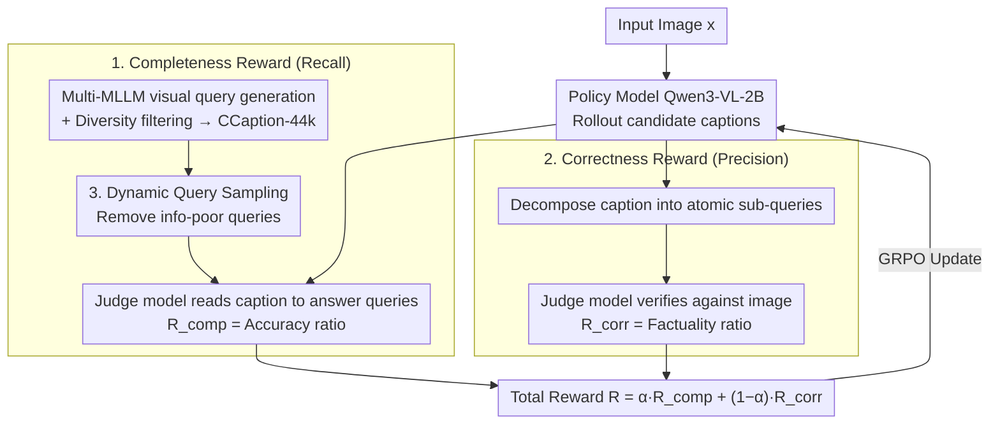

# CCCaption: Dual-Reward Reinforcement Learning for Complete and Correct Image Captioning

**Conference**: CVPR 2026  
**arXiv**: [2602.21655](https://arxiv.org/abs/2602.21655)  
**Code**: [https://github.com/ZhijiangTang/CCCaption](https://github.com/ZhijiangTang/CCCaption)  
**Area**: Reinforcement Learning  
**Keywords**: Image Captioning, Reinforcement Learning, Completeness, Correctness, Dual-Reward

## TL;DR
The authors propose the CCCaption dual-reward reinforcement learning framework. By jointly optimizing image captioning completeness (based on visual query sets generated by multiple MLLMs) and correctness (based on hallucination detection of decomposed sub-queries), the 2B model outperforms the 32B baseline.

## Background & Motivation
Image captioning is a fundamental task in vision-language understanding, but existing model training relies heavily on human-annotated reference descriptions. Human annotations inevitably carry subjective preferences and expertise variations, leading to ground-truth captions that are themselves incomplete or even incorrect. The authors argue that high-quality captions should satisfy two objective attributes: **completeness** (whether all salient visual facts in the image are covered) and **correctness** (whether the description is consistent with the visual facts).

Existing RL methods like CapRL use only a single MLLM to generate queries to measure completeness, which suffers from single-model bias and insufficient coverage. More critically, unconstrained rewards that only optimize for completeness encourage models to describe more details to maximize rewards, often introducing more hallucinations—experiments show that in later stages of training, rewards continue to rise while correctness significantly drops. Therefore, a robust captioning objective must simultaneously enforce both completeness and correctness.

**Core Idea**: Design a symmetric dual-reward mechanism where completeness is measured by the coverage of multi-MLLM queries (similar to recall), and correctness is measured by the grounding degree of decomposed atomic sub-queries in the image (similar to precision), optimized jointly.

## Method

### Overall Architecture
The goal of CCCaption is to enable the model to learn to write descriptions that are both "complete" and "correct" without reliable human references. It decomposes caption quality into two computable objective attributes—completeness and correctness—designing a reward for each and performing reinforcement learning on Qwen3-VL-2B using GRPO. The overall workflow is: for an input image, multiple MLLMs are used offline to generate a set of visual queries covering image facts as proxies for what "should be described." During training, the model rollouts several captions. The completeness reward assesses how many image queries the caption can answer (coverage, similar to recall), while the correctness reward decomposes the caption into atomic queries and cross-checks them against the original image (similar to precision). These are combined via convex combination into a total reward for GRPO. To improve efficiency, dynamic query sampling is employed to remove "easy" queries that produce almost no gradient. This query generation process ultimately results in the CCaption-44k training set.

### Key Designs

**1. Completeness Reward: Approximating "Fullness" via Multi-MLLM Query Coverage**

The difficulty of completeness lies in the inability to directly measure if "all salient facts in the image are written." The authors approximate the basic information set $\mathcal{B}_\mathbf{x}$ of image $\mathbf{x}$ using a set of visual queries $\mathcal{Q}_\mathbf{x}$. The reward is defined as the proportion of queries the caption can answer:

$$\mathcal{R}_\text{comp}(\mathbf{x}, \hat{\mathbf{y}}) = \frac{1}{|\mathcal{Q}_\mathbf{x}|}\sum_{\mathbf{q} \in \mathcal{Q}_\mathbf{x}} \mathbb{I}(M_J(\hat{\mathbf{y}}, \mathbf{q}))$$

Where $M_J$ is a frozen third-party judge model that reads only the caption text to judge if it can answer a query, essentially calculating the recall of image facts. This differs from CapRL, which uses only a single MLLM for query generation; single-model queries have preference blind spots and lack coverage. CCCaption uses multiple MLLMs to collaboratively generate queries and explicitly constrains the diversity of the query set $\mathcal{V}(\mathcal{Q}_\mathbf{x})$, defined as the variance of cosine similarities between query embeddings. By iteratively generating and filtering out low-contribution (too similar) queries, the final set is non-redundant and comprehensive. This process yields CCaption-44k (44k samples, avg. 10 queries per image).

**2. Correctness Reward: Decomposing Captions to Atomic Queries for Vision Verification**

Only rewarding completeness leads to a risk: the model discovers that writing more details to answer more queries yields higher rewards, resulting in hallucinations—a reward hacking phenomenon where correctness drops despite rising rewards. The correctness reward addresses this by decomposing the generated caption into sub-queries $\mathcal{Q}_{\hat{\mathbf{y}}}$ (each corresponding to an atomic fact), which the judge model then verifies against the image:

$$\mathcal{R}_\text{corr}(\mathbf{x}, \hat{\mathbf{y}}) = \frac{1}{|\mathcal{Q}_{\hat{\mathbf{y}}}|}\sum_{\mathbf{q} \in \mathcal{Q}_{\hat{\mathbf{y}}}} M_J(\mathbf{x}, \mathbf{q})$$

The input to $M_J$ is inverted compared to completeness: completeness matches "image queries against the caption" (recall), while correctness matches "caption queries against the image" (precision). This symmetric structure makes the rewards naturally complementary, preventing score-pumping in either direction.

**3. Dynamic Query Sampling: Efficiency via Info-poor Query Removal**

In GRPO, the advantage comes from relative differences between rollout captions. If a query is answered correctly (or incorrectly) by almost all rollouts, it lacks discriminative power, and its contribution to the gradient is negligible despite consuming judge model calls. Dynamic query sampling performs Bernoulli sampling on queries based on their contribution $c(\mathbf{q})$:

$$\tilde{\mathcal{Q}} = \{\mathbf{q} \in \mathcal{Q}_c \mid u_\mathbf{q} \sim \text{Bernoulli}(c(\mathbf{q}))\}$$

The contribution $c(\mathbf{q})$ starts at $1 - \frac{1}{m}\sum \mathbb{I}(M_J(\mathbf{x}, \mathbf{q}))$ and is updated per epoch based on the variance of query accuracy across rollouts. High variance indicates the query is still "differentiating" model behavior and should be sampled more; low variance indicates it has been learned or is unlearnable, reducing its sampling probability.

### Loss & Training
The total reward is a convex combination: $\mathcal{R}(\mathbf{x}, \hat{\mathbf{y}}) = \alpha \mathcal{R}_\text{comp} + (1-\alpha) \mathcal{R}_\text{corr}$. The hyperparameter $\alpha$ balances completeness and correctness. The standard GRPO objective is used for optimization. The base model is Qwen3-VL-2B, trained on CCaption-44k.

## Key Experimental Results

### Main Results

| Evaluation Framework | Metric | CCCaption-2B | Qwen3-VL-2B | Qwen3-VL-32B | CapRL-3B | Gain |
| :--- | :--- | :--- | :--- | :--- | :--- | :--- |
| CapArena | Avg. ELO | **46.39** | 41.39 | - | 17.56 | +5.0 vs 2B baseline |
| Prism | Avg. | **52.80** | 50.05 | 52.26 | 51.07 | +0.54 vs 32B |
| Hallucinations | Avg. | **70.57** | 70.19 | 69.87 | 66.91 | +0.70 vs 32B |

### Ablation Study

| Configuration | Effect | Description |
| :--- | :--- | :--- |
| Completeness only | reward ↑ but correctness ↓ | Hallucinations surge in late stages |
| + Correctness reward | Significant improvement | Effectively controls hallucinations |
| + Dynamic Query Sampling | Best Performance | Further improves training efficiency |
| Single vs Multi-MLLM | Multi-MLLM Superior | Query diversity improves coverage |

### Key Findings
- The 2B model CCCaption-2B outperforms Qwen3-VL-32B across all three frameworks, proving the effectiveness of dual-reward RL.
- Optimizing only completeness leads to hallucination surges; the correctness reward effectively curbs this trend.
- Dynamic query sampling significantly improves training efficiency by prioritizing high-variance queries.

## Highlights & Insights
- The symmetric definition of completeness and correctness is elegant—representing recall and precision respectively.
- Multi-MLLM query generation combined with diversity filtering is an effective solution for single-model bias.
- The work reveals the reward hacking phenomenon in RL captioning and provides a practical counter-measure.

## Limitations & Future Work
- Query generation and correctness evaluation rely on a frozen judge MLLM, whose biases may propagate to reward signals.
- The CCaption-44k scale is relatively small; larger diverse query datasets might yield further improvements.
- The method is currently verified on image captioning; generalization to video captioning or multi-turn dialogue remains to be explored.

## Related Work & Insights
- CapRL proposed using VQA as a caption quality metric; this work adds correctness constraints.
- GRPO provides an efficient internal relative optimization framework for RL captioning.
- The dual-reward (completeness + correctness) paradigm is generalizable to other generative tasks.
- Unlike coarse-grained methods like SC-Captioner that only check keywords, query-based evaluation is more comprehensive.

## Rating
- Novelty: ⭐⭐⭐⭐ The symmetric design of the dual-reward framework and dynamic sampling are innovative improvements over CapRL.
- Experimental Thoroughness: ⭐⭐⭐⭐⭐ Comprehensive across three frameworks, multiple model comparisons, and ablation studies.
- Writing Quality: ⭐⭐⭐⭐ Clear motivation, complete methodology, and rich visualizations.
- Value: ⭐⭐⭐⭐ The 2B vs 32B results are compelling and the dual-reward paradigm is insightful for the community.

## Key Terminology
- **Query Coverage**: Measuring caption completeness via the coverage ratio of a query set.
- **Sub-caption Query**: Decomposing a long caption into atomic semantic fact queries.
- **Reward Hacking**: A phenomenon where RL rewards increase while actual quality decreases.
- **GRPO**: Group Relative Policy Optimization, an efficient group relative advantage estimation.

<!-- RELATED:START -->

## Related Papers

- [\[ICLR 2026\] Reasoning as Representation: Rethinking Visual Reinforcement Learning in Image Quality Assessment](../../ICLR2026/reinforcement_learning/reasoning_as_representation_rethinking_visual_reinforcement_learning_in_image_qu.md)
- [\[CVPR 2026\] MSRL: Scaling Generative Multimodal Reward Modeling via Multi-Stage Reinforcement Learning](msrl_scaling_generative_multimodal_reward_modeling.md)
- [\[CVPR 2026\] Incentivizing Generative Zero-Shot Learning via Outcome-Reward Reinforcement Learning with Visual Cues](incentivizing_generative_zero-shot_learning_via_outcome-reward_reinforcement_lea.md)
- [\[CVPR 2026\] Reinforce to Learn, Elect to Reason: A Dual Paradigm for Video Reasoning](reinforce_to_learn_elect_to_reason_a_dual_paradigm_for_video_reasoning.md)
- [\[ICLR 2026\] Dual Goal Representations](../../ICLR2026/reinforcement_learning/dual_goal_representations.md)

<!-- RELATED:END -->
