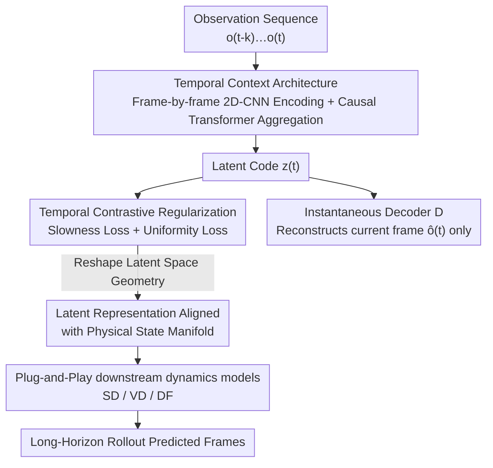

# Cloning Deterministic Worlds: The Critical Role of Latent Geometry in Long-Horizon World Models

**Conference**: CVPR 2026  
**Paper**: [CVF Open Access](https://openaccess.thecvf.com/content/CVPR2026/html/Xia_Cloning_Deterministic_Worlds_The_Critical_Role_of_Latent_Geometry_in_CVPR_2026_paper.html)  
**Code**: [Project Page](https://xiafire.github.io/grwm-project-page)  
**Area**: Reinforcement Learning / World Models  
**Keywords**: World Models, Long-horizon Prediction, Contrastive Learning, Latent Space Geometry, Deterministic Environments

## TL;DR
Through an "oracle" diagnostic experiment, the authors demonstrate that the bottleneck of long-horizon collapse in world models within deterministic environments is not the dynamics model, but rather the geometric structure of the latent representation. Consequently, they propose GRWM, which utilizes temporal contrastive learning as a geometric regularization term to reshape the latent space of the autoencoder to align with the true environmental state manifold. As a plug-and-play module, GRWM significantly extends the faithful prediction horizon of various world models.

## Background & Motivation

**Background**: A world model is an agent's internal model designed to "simulate how the world evolves in its mind." Given past observations and actions, it predicts future physical states, serving as the foundation for planning, reasoning, and reinforcement learning. Current mainstream world models primarily focus on the **open-world** setting—generating a different random environment during each simulation to enhance generalization with diversity. A typical approach is a two-stage "latent generation" process: first compressing images into latent vectors using an autoencoder, and then modeling transitions to predict future frames in the latent space.

**Limitations of Prior Work**: The "stochasticity" of open worlds introduces unstable dynamics, making them unsuitable for stationary tasks requiring **reliable prediction and precise planning** (e.g., fixed-map mazes, static space robot navigation, static-map game AI). These scenarios demand a "faithful" unique true trajectory rather than merely a "plausible" future. The authors find that even in the simplest deterministic environments, all SOTA baselines fail to maintain long-horizon fidelity; small errors accumulate rapidly, and the predicted trajectory diverges from the ground truth after only a few steps.

**Key Challenge**: Accurate world simulation requires simultaneously addressing two **entangled** challenges: representation learning (nonlinear mapping from high-dimensional pixels to low-dimensional physical states, where simple spatial translations are highly nonlinear trajectories in pixel space) and dynamics modeling (which must holistically capture 3D transformations, logical rules, causal dependencies, and temporal memory). Poor representations force the dynamics model to operate in a noisy, entangled latent space, while good representations are wasted by weak dynamics models. But which one is the **primary bottleneck** for long-horizon collapse? Prior works overwhelmingly focus on strengthening the dynamics model, treating the autoencoder merely as an "engineering component"—trained with a small KL weight + perceptual/adversarial loss to focus on reconstruction quality, while neglecting the geometry of the latent space.

**Key Insight**: The authors construct an "oracle" model that bypasses the perception problem by having the dynamics model **directly take the ground-truth state variables** of the environment (e.g., agent pose $(x,y,\theta)$). The oracle shares the exact same architecture as the standard VAE world model, with the only difference being the source of the latent states. The oracle achieves near-zero error over long horizons, while the VAE world model's error accumulates rapidly. Since the only difference is the "source of states," this clearly pinpoints the responsibility on the representation: **high-fidelity long-horizon cloning is feasible, and what limits it is not the dynamics model but the geometry of the representation.**

**Core Idea**: Since the bottleneck lies in the representation geometry, the authors leverage **temporal contrastive learning principles as a geometric regularization term** to reshape the latent space of the autoencoder to align with the true physical state manifold. They term this approach GRWM (Geometrically-Regularized World Models). This lightweight, seamlessly integrable geometric regularization module systematically unlocks long-horizon fidelity for various SOTA world models.

## Method

### Overall Architecture

The workflow of GRWM consists of two steps. **First (Diagnostic)**, the oracle experiment quantitatively establishes that the "bottleneck lies in the representation rather than the dynamics." This serves as the foundation of the paper and justifies modifying only the representation without altering the dynamics. **Second (Method)**, only the autoencoder is modified: two modifications are applied to the standard VAE: (a) a temporal context architecture that uses a causal encoder to aggregate multiple frames within a sliding window to counter "perceptual aliasing" (where different states look almost identical); (b) temporal contrastive regularization, which employs "slowness loss + uniformity loss" to constrain latent embeddings to align with the physical state manifold. The reshaped latent space is then directly fed to **any** downstream dynamics model (the paper deploys three diffusion-based world models: SD, VD, and DF) without modifying the dynamics component. Therefore, GRWM is a **plug-and-play representation module** that takes observation sequences as input and outputs geometrically well-structured latent codes for any downstream model to benefit from.

### Key Designs

**1. Oracle Diagnostic Experiment: Turning "Bottleneck in Representation" from Conjecture to Evidence**

When world models fail over long horizons, should we blame the dynamics model or the underlying representation? Prior work has not cleanly separated the two. The authors construct an oracle world model featuring a three-component system: an encoder that maps historical observations to the **ground-truth state** of the previous step $\hat{s}_{t-1}=f_{enc}(o_{t-k:t-1})$, a dynamics model that predicts the current state from the previous state and action $\hat{s}_t=f_{dyn}(\hat{s}_{t-1},a_t)$, and a decoder that reconstructs the current observation from the predicted state $\hat{o}_t=f_{dec}(\hat{s}_t)$. Crucially, the oracle's latent state is the ground-truth pose $(x,y,\theta)$, whereas the baseline VAE world model shares the exact same architecture but learns its latent states directly from images. Comparing their step-by-step MSE shows that the oracle maintains near-zero error over long horizons, while the VAE diverges rapidly. Since the **only difference is the source of the latent states**, this rules out the dynamics model as the culprit: high-fidelity long-horizon cloning is inherently feasible, and the collapse originates from the representation. The authors further explain the mechanism: training purely for reconstruction does not guarantee preserving the neighborhood structure and global layout of the true state space. Points that are adjacent in the true dynamics may be mapped far apart in the latent space (**geometric mismatch**), making even simple dynamics difficult to extrapolate stably. This diagnostic is not merely a side note; it directly lays the foundation for the methodology of "modifying only the representation geometry."

**2. Temporal Context Architecture: Using Historical Context Instead of a Single Frame to Resolve Perceptual Aliasing**

In deterministic environments, there is a hidden pitfall called **perceptual aliasing**—where different true states produce nearly identical observations (e.g., two identical-looking spots in a maze). The oracle performs well partly because it leverages absolute coordinates (directly encoding the global state), whereas a single image only provides local information, failing to uniquely determine the global position. To recover the true state from images, the model must aggregate information across time; an observation sequence is required to form a unique "signature" of the underlying global state. Thus, the authors design a **causal encoder $E$ + instantaneous decoder $D$**: the encoder maps a recent window of observations $(o_{t-k},\dots,o_t)$ to a latent code $z_t=E(o_{t-k},\dots,o_t)$, while the decoder reconstructs only the **current** frame $\hat{o}_t=D(z_t)$. Specifically, this is implemented by adding temporal aggregation to the VAE: each frame is first independently encoded via a 2D CNN, and then a **sliding-window causal Transformer** aggregates frame-level features, ensuring that $z_t$ only attends to a finite history up to the current step. Consequently, $z_t$ serves as a compact representation of the current state enriched by past context, resolving aliasing while maintaining causality.

**3. Temporal Contrastive Regularization: Slowness Loss + Uniformity Loss to Align Latent Space with the Physical Manifold**

Temporal context alone is insufficient: relying solely on reconstructing the final frame might lead the model to adopt a "lazy" solution—completely ignoring the context and relying only on the final frame. To enforce a geometry aligned with the physical state manifold, the latent space must be explicitly constrained. The authors pass the encoder output $z\in\mathbb{R}^{B\times L\times\cdots}$ through a linear projection head to obtain embeddings $p\in\mathbb{R}^{B\times L\times D}$, normalize them using L2 norm onto a unit hypersphere $p'=p/\lVert p\rVert_2$, and apply two complementary constraints.

**Temporal Slowness** originates from the intuition that "true environmental states evolve slowly over time": all frames within the same trajectory's context window should be close to each other on the hypersphere, mapping the entire trajectory to a compact, continuous path in the latent space. Formally, it minimizes the average L2 distance of all embedding pairs within the same trajectory:

$$\mathcal{L}_{slow}=\mathbb{E}_{b\sim D}\Big[\mathbb{E}_{(p_i',p_j')\sim P_b'\times P_b'}\big[\lVert p_i'-p_j'\rVert_2\big]\Big]$$

where $P_b'=\{p_{b,t}'\}_{t=0}^{L-1}$ is the set of normalized embeddings for trajectory $b$.

However, applying only the slowness constraint leads to **representation collapse**, where all inputs are mapped to a tiny region in the latent space. Thus, a **Latent Uniformity** loss is added to push embeddings from different trajectories apart, distributing them uniformly across the hypersphere:

$$\mathcal{L}_{uniform}=\log\mathbb{E}_{(p_i',p_j')\sim P_{neg}}\big[e^{-2\lVert p_i'-p_j'\rVert_2^2}\big]$$

where $P_{neg}$ is the distribution of embedding pairs from **different trajectories** within the batch. Under this push-and-pull dynamic, the latent space is shaped such that states that are physically close remain close in the latent space, while distant states are pushed apart—precisely the structure that the oracle naturally possesses via coordinates but is missing in purely reconstruction-based VAEs. Compared to prior temporal contrastive works (such as CLTT), which rely on contrastive objectives for direct **representation learning**, this work treats contrastive learning as a **geometric regularization term** on the world model's autoencoder, revealing that contrastive constraints can serve as a powerful inductive bias for stable world modeling.

### Loss & Training

The entire autoencoder is trained end-to-end, with the total loss combining the VAE reconstruction term, the KL term, and the two regularization terms:

$$\mathcal{L}_{total}=\mathcal{L}_{recon}+\beta\mathcal{L}_{KL}+\lambda_{slow}\mathcal{L}_{slow}+\lambda_{uniform}\mathcal{L}_{uniform}$$

where $\beta$, $\lambda_{slow}$, and $\lambda_{uniform}$ are hyperparameters balancing the terms. Training occurs exclusively during the representation learning phase; the downstream dynamics models retain their original configurations from their respective SOTA baselines without modification.

## Key Experimental Results

### Main Results

**Datasets & Protocols**: The authors construct three deterministic environment datasets: $\text{M3}\times\text{3-DET}$ (3×3 maze), $\text{M9}\times\text{9-DET}$ (9×9 maze), and MC-DET (Minecraft, visually richer). The trajectories are first-person (action, observation) sequences with fixed map layouts, making the trajectories fully deterministic. **Top-down maps are hidden from the agent**, with only first-person observations provided. **Metrics** utilize step-by-step MSE: $\text{MSE}(t)=\lVert o_t-\hat{o}_t\rVert_2^2$ (with images normalized to $[0,1]$, which can be converted to PSNR) to show how errors accumulate over time. **Baselines** include three SOTA latent generative world models: Standard Diffusion (SD), Video Diffusion (VD), and Diffusion Forcing (DF). GRWM simply replaces their representation modules while keeping their respective dynamics models, denoted as GR-SD, GR-VD, and GR-DF.

**Latent Probing (Quantitative Primary Results)**: The trained autoencoder is frozen, its encoder is used to extract latent vectors for all observations, and a small MLP probe is trained to regress the ground-truth state $(x,y,\theta)$ from these latents. The table reports the out-of-distribution regression MSE (lower is better, indicating the latent space is better aligned with the true state manifold).

| Model | M3×3-DET | M9×9-DET | MC-DET |
|------|----------|----------|--------|
| VAE-WM | 0.082 | 0.106 | 0.137 |
| **GRWM** | **0.031** | **0.058** | **0.081** |

GRWM consistently achieves lower probing MSE across all three datasets (e.g., from 0.082 to 0.031 on M3×3) regardless of environmental complexity, indicating that geometric regularization indeed makes latent representations more linearly predictive of the true states.

**Rollout Long-horizon Fidelity (Figure 3, Curves)**: Across all three datasets and three dynamics models, GRWM (solid lines) consistently maintains lower step-by-step MSE than the corresponding VAE baselines (dashed lines), with the **gap widening as the horizon increases**. While baseline errors accumulate rapidly and lead to trajectory divergence, GRWM's error curves are much flatter, significantly approaching the oracle lower bound (black dotted line) within 63 steps. ⚠️ Note that the paper only provides curves without a step-by-step numerical table; the following table presents **approximated** values read from the y-axis of Figure 3 for reference only:

| Dataset | VAE Baseline MSE at ~63 steps | GRWM MSE at ~63 steps | Oracle Lower Bound |
|--------|--------------------|-----------------|-------------|
| M3×3-DET | High (rapidly rising curve) | Significantly lower and flatter | ≈0 |
| M9×9-DET | High | Significantly lower | ≈0 |
| MC-DET | Highest (around ~0.25) | Substantially reduced | ≈0 |

> ⚠️ The values in the table above are approximated from the curves; refer to Figure 3 in the original paper for precise values.

**Ultra-Long-Horizon Qualitative Results**: Selecting the strongest dynamics model, DF, for extreme long-range generation, the authors continuously generate **10,000 frames** from a single starting point. The baseline VAE-WM exhibits a critical failure mode: **mode collapse**, getting trapped in repetitive loops, rendering the same monochromatic wall (e.g., pink wall, green wall, blue wall) for thousands of frames, and "teleporting" between visually similar but causally disconnected regions. The authors explain: pixel reconstruction loss forces the model to map visually identical observations (e.g., same colored walls at different locations) to nearby latent points, ignoring their physical distance and causal connectivity. This creates "attractor states" and entangled manifolds; the dynamics model then learns that "jumping between nearby latent points incurs the lowest cost," thus bypassing the true topological structure of the environment to teleport within these "safe harbors" of low reconstruction error. Because GRWM regularizes the representation to align with the true state manifold, it maintains high fidelity even at 100 or 400 frames, clearly demonstrating continuous movement and exploration in long rollouts; the yellow wall rendered later is not a randomly plausible image, but proof of a continuous traversal of a physically viable path in the latent space.

**Latent Clustering (Figure 7)**: K-means ($k=20$) clustering is applied to the latent vectors, and points are plotted according to the true $(x,y)$ position of the frames, colored by latent cluster ID. The baseline VAE produces noisy, fragmented clusters—where the same color is scattered across distant areas of the map, indicating highly entangled representations that map causally distinct states together. In contrast, GRWM yields spatially continuous clusters aligned with the actual topology of the environment, where each color roughly corresponds to a specific hallway or room.

### Ablation Study

The authors investigate four aspects (conclusions are provided in the main text; detailed values are in the supplementary material):

| Configuration | Investigated Aspect | Conclusion |
|------|---------|------|
| Full GRWM | — | Achieves both excellent long-horizon fidelity and latent probing/clustering metrics |
| Removing a core loss term | Necessity of slowness loss / uniformity loss | Both are indispensable: applying only slowness leads to **representation collapse**, while applying only uniformity loses temporal continuity |
| Removing the projection head | Role of the projection head | Affects the quality of the latent geometry |
| Changing latent dimension | Impact of latent dimension | Dimension affects representation capacity and alignment performance |
| Other key design choices | Design choices | Affects performance |

> ⚠️ Detailed ablation values are presented in the supplementary material; only qualitative conclusions from the main text are summarized here. Please refer to the supplementary material for precise numbers.

### Key Findings
- **Bottleneck identification is the primary contribution**: The comparison between the oracle and the identical-architecture VAE-WM directly proves that "long-horizon collapse stems from representation geometry rather than dynamics," shifting the research focus from "building stronger dynamics" to "rectifying representation geometry."
- **Slowness and uniformity must be paired**: The slowness loss ensures that trajectories form continuous and compact paths in the latent space but leads to collapse when used alone; the uniformity loss prevents collapse. The two together shape the geometry to align with the physical manifold.
- **"Teleportation/Attractor" failure mode**: Pixel reconstruction losses map visually identical walls to nearby latent points, creating attractors. The dynamics model learns to perform low-cost jumps instead of traversing the true topology—providing a diagnostic for the root cause of VAE world model collapse over long horizons.
- GRWM consistently improves performance across three dynamics models, proving it is a **dynamics-agnostic**, plug-and-play representation enhancement rather than a model-specific trick.

## Highlights & Insights
- **Leveraging the oracle for "controlled variable" diagnostics**: Comparing two models with identical architectures but different latent sources cleanly disentangles the responsibility of "representation vs. dynamics." This experimental protocol is highly inspiring and serves as a reusable paradigm for determining whether component A or B is the bottleneck.
- **Reframing contrastive learning from a "representation learning objective" to a "geometric regularization term"**: While prior temporal contrastive methods directly use contrastive objectives to learn representations, this work treats them as a regularization term on top of the world model's autoencoder (where the primary loss remains reconstruction). This shift in perspective reveals a new role for contrastive constraints as an inductive bias for stabilizing world models, which can be transferred to any generative prediction task requiring latent space alignment.
- **Deterministic cloning as a "rigorously evaluable testbed"**: Due to the absence of stochasticity and the existence of a unique true future, step-by-step MSE can cleanly measure fidelity. The authors employ "cloning deterministic worlds" as both a task and a methodological microscope to understand the fundamental limiters of long-horizon fidelity.
- **Lightweight and plug-and-play**: The geometric regularization module can be seamlessly integrated into standard autoencoders without modifying downstream dynamics, minimizing engineering deployment costs.

## Limitations & Future Work
- **Environments are relatively simple** (acknowledged by the authors): Evaluations are limited to simple, controlled environments; scaling to partially observable, stochastic, or photorealistic environments remains unresolved.
- **Visual artifacts** (acknowledged by the authors): GRWM still exhibits minor artifacts and fails to restore fine-grained scene details (especially in Minecraft-DET), indicating that the latent representation has not fully captured high-frequency or semantic details.
- **Computational overhead** (acknowledged by the authors): Temporal aggregation relies on a Transformer, which incurs higher overhead as sequence length increases compared to standard VAE world models.
- **Significant gap remains compared to the oracle** (acknowledged by the authors): Even in deterministic environments, the learned representations are still far from recovering full state information. Closing this gap requires stronger representation learning methods.
- **Our observations**: The coordinates used for probing and clustering are low-dimensional poses like $(x,y,\theta)$. Whether these findings scale to environments with high-dimensional or semantic states (e.g., interactive objects, dynamic lighting) has not been verified. Furthermore, key quantitative ablation values are relegated to the supplementary material while the main text only reports qualitative conclusions; care should be taken to verify sensitivity to hyperparameters $\beta, \lambda_{slow}, \lambda_{uniform}$ during replication.

## Related Work & Insights
- **vs. Video World Models (SD / VD / DF, etc.)**: These models primarily focus on dynamics modeling (stronger latent transitions, causal/relational inductive biases), treating autoencoders merely as compression engineering parts trained for reconstruction quality. This paper demonstrates the converse: **representation geometry is the long-horizon bottleneck**, and these models are directly reused as downstream dynamics, yielding performance gains by simply swapping the representation.
- **vs. Temporal Contrastive Learning (CLTT, etc.)**: These methods directly employ contrastive objectives for representation learning. In contrast, this paper treats the temporal contrastive principle as a **geometric regularization term** on the world model's autoencoder (leaving reconstruction as the primary loss), thereby framing contrastive constraints as an inductive bias to stabilize world modeling.
- **vs. Open-World / Stochastic World Models**: Mainstream approaches pursue diversity and "plausible" futures. This work focuses on deterministic environments, aiming for **reproducible, faithful cloning**. It shifts the research paradigm from "plausible generation" to "reproducible fidelity" and establishes three deterministic datasets as evaluation benchmarks.

## Rating
- Novelty: ⭐⭐⭐⭐ The oracle diagnosis and reframing of contrastive learning as geometric regularization offer fresh perspectives, though the individual components (VAE + temporal contrastive + uniformity) are mostly assembled from existing parts.
- Experimental Thoroughness: ⭐⭐⭐⭐ Consistent improvements across three datasets and three dynamics models alongside multiple evaluation angles (probing, clustering, ultra-long horizons); but quantitative ablation details are hidden in the supplementary material, and the environments are relatively simple.
- Writing Quality: ⭐⭐⭐⭐⭐ The logical flow from diagnosis to mechanism explanation to method is exceptionally clear, with a particularly compelling failure analysis of "teleportation/attractors."
- Value: ⭐⭐⭐⭐ The thesis that "representation geometry is the bottleneck of long-horizon predictions" provides directional inspiration to the world model community, and the plug-and-play module is easy to adopt.

<!-- RELATED:START -->

## Related Papers

- [\[ICLR 2026\] Learning to Be Uncertainty: Pre-training World Models with Horizon-Calibrated Uncertainty](../../ICLR2026/reinforcement_learning/learning_to_be_uncertain_pre-training_world_models_with_horizon-calibrated_uncer.md)
- [\[CVPR 2026\] DreamSAC: Learning Hamiltonian World Models via Symmetry Exploration](dreamsac_learning_hamiltonian_world_models_via_symmetry_exploration.md)
- [\[CVPR 2026\] GeoWorld: Geometric World Models](geoworld_geometric_world_models.md)
- [\[ICLR 2026\] Mixture-of-World Models: Scaling Multi-Task Reinforcement Learning with Modular Latent Dynamics](../../ICLR2026/reinforcement_learning/mixture-of-world_models_scaling_multi-task_reinforcement_learning_with_modular_l.md)
- [\[ACL 2026\] Understanding Generalization in Role-Playing Models via Information Theory](../../ACL2026/reinforcement_learning/understanding_generalization_in_role-playing_models_via_information_theory.md)

<!-- RELATED:END -->
